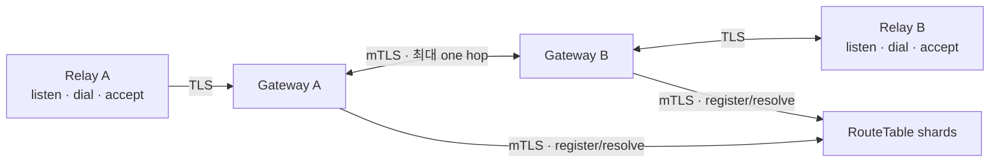

# RelayGate

NAT 뒤 애플리케이션이 outbound session 하나로 논리 주소를 수신하고 다른 주소로 양방향 byte stream을
여는 Rust relay입니다.



```text
DestinationId -> live Binding 0..N
dial 1회      -> Binding 1개 -> opaque bidirectional Pipe 1개
```

## 책임

| RelayGate | Application |
| --- | --- |
| TLS와 ClusterToken session admission | DestinationId 생성·보관 |
| live Binding 조회와 local/one-hop Pipe | Pipe 상대 인증·인가 |
| bounded queue, timeout, heartbeat, cleanup | payload framing·의미·acknowledgement·retry |
| SDK reconnect와 Listener republish | 필요한 E2E payload 보호 |

RouteTable은 memory-only current state를 유지합니다. 새 연결은 새 `dial`로 시작하며 기존 Pipe와 payload의
수명은 해당 Pipe와 application이 소유합니다.

## Rust SDK

```rust,no_run
use relaygate_sdk::{ClientTlsConfig, Config, DestinationId, GatewayTransportConfig, Relay};

# async fn example() -> Result<(), Box<dyn std::error::Error>> {
let tls = ClientTlsConfig::with_webpki_roots("relaygate.project-jelly.io")?;
let transport = GatewayTransportConfig::tls_tcp("relaygate.project-jelly.io:443", tls);
let relay = Relay::connect(Config::new(
    std::env::var("RELAYGATE_CLUSTER_TOKEN")?,
    transport,
)).await?;

let destination = DestinationId::new();
let listener = relay.listen(destination).await?;

// 다른 Relay: let mut pipe = relay.dial(destination).await?;
let mut incoming = listener.accept().await?;
# let _ = &mut incoming;
# Ok(())
# }
```

private CA 환경은 `ClientTlsConfig::server_authenticated(server_name, ca)`를 사용합니다. session loss 뒤
SDK는 jitter가 포함된 bounded backoff로 재연결하고 live Listener를 새 Binding으로 등록합니다.

## 검증

| 범위 | 명령 |
| --- | --- |
| Rust compile/test | `cargo fmt --all --check && cargo check --workspace && cargo test --workspace` |
| Rust lint | `cargo clippy --workspace --all-targets --all-features -- -D warnings` |
| RT2/GW3 Compose | `docker compose up --build --abort-on-container-exit --exit-code-from topology-probe` |
| observability | `docker compose --profile observability up --build --abort-on-container-exit --exit-code-from observability-probe observability-probe` |
| isolated Kubernetes | `tests/kind/run.sh` |

Compose 종료:

```bash
docker compose --profile observability down --volumes --remove-orphans
```

## Helm

차트는 RouteTable과 Gateway를 배포하며 credential과 certificate는 release namespace의 Secret을
사용합니다. 기본 topology는 RT shard 2개와 Gateway 3개입니다.

```bash
helm lint deploy/helm/relaygate
helm template relaygate deploy/helm/relaygate --kube-version 1.32.0
```

설치와 rotation 절차는 [Helm chart README](deploy/helm/relaygate/README.md)를 따릅니다.

## 구조

```text
crates/
├── relaygate-protocol/              SDK-GW wire
├── relaygate-transport/             TLS/mTLS adapter
├── relaygate-sdk/                   public Relay, Listener, Pipe API
├── relaygate-gateway/               Binding, dial, relay, cleanup
├── relaygate-route-table/           memory-only current-state shard
├── relaygate-route-table-transport/ GW-RT bounded transport/auth
└── relaygate-server/                config, wiring, metrics, shutdown
```

[문서 지도](docs/)에서 ADR, SPEC, TEST와 RFC 근거를 확인할 수 있습니다.
