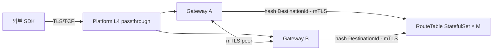

# RelayGate Helm chart

RouteTable shard와 Gateway runtime을 StatefulSet으로 배포합니다.



## 사전 준비

Kubernetes 1.32 이상과 release namespace의 다음 Secret이 필요합니다.

| Secret | key | 용도 |
| --- | --- | --- |
| credential | `internal-gateway-keys` | `GatewayName=InternalGatewayKey,...` |
| credential | `cluster-token`, 선택적 `next-cluster-token` | SDK trust-domain admission과 rotation |
| edge TLS | `tls.crt`, `tls.key` | SDK-facing Gateway identity |
| edge TLS | `ca.crt` | custom CA mode의 trust anchor |
| internal mTLS | `ca.crt` | Gateway와 RT trust anchor |
| internal mTLS | `gateway.crt`, `gateway.key` | peer/RT Gateway identity |
| internal mTLS | `route-table.crt`, `route-table.key` | RT server identity |

```bash
kubectl create namespace relaygate
kubectl -n relaygate create secret generic relaygate-credentials \
  --from-literal=internal-gateway-keys='relaygate-gateway-0=replace-a,relaygate-gateway-1=replace-b,relaygate-gateway-2=replace-c' \
  --from-literal=cluster-token='replace-cluster-token'
```

## TLS source

| 구간 | mode | 공급 방식 |
| --- | --- | --- |
| SDK edge | `customCa` | edge Secret의 CA/certificate/key |
| SDK edge | `webPkiRoots` | bundled public roots + edge certificate/key |
| internal | `existingSecret` | operator-managed 단일 internal Secret |
| internal | `certManager` | platform Issuer가 Gateway/RT leaf를 각각 발급 |

cert-manager mode는 platform-owned Issuer와 CA trust Secret을 사용합니다.

```yaml
tls:
  internal:
    source: certManager
    gatewayServerName: relaygate-gateway.internal
    routeTableServerName: relaygate-route-table.internal
    certManager:
      issuerRef:
        name: relaygate-internal
        kind: ClusterIssuer
        group: cert-manager.io
      trustSecret:
        name: relaygate-internal-ca
        key: ca.crt
```

cert-manager는 leaf를 갱신하고 `tls.internal.reloadToken` 또는 platform reloader가 renewed Secret을
Gateway/RT rollout으로 적용합니다. CA rotation은 old/new trust overlap과 leaf 재발급 순서로 진행합니다.

## 설치

```bash
helm upgrade --install relaygate deploy/helm/relaygate \
  --namespace relaygate \
  --wait
```

| 진입 방식 | values·platform 설정 |
| --- | --- |
| cluster 내부 | 기본 `gateway.service.type=ClusterIP` |
| 전용 외부 주소 | `gateway.service.type=LoadBalancer` |
| 공유 L4 | ClusterIP + platform `TCPRoute`/`TLSRoute` passthrough |

SDK endpoint 기본값은 `relaygate.relaygate.svc.cluster.local:27420`입니다. Gateway process가 SDK TLS를
종단하고 peer/RT Service는 cluster 내부에서 사용합니다.

## 배포 계약

| 대상 | 계약 |
| --- | --- |
| Gateway ordinal | stable GatewayName과 peer locator |
| RT ordinal | `rt-0..rt-(M-1)` hash partition |
| ShardDirectory | 모든 process가 동일한 read-only ConfigMap 사용 |
| RT restart | 빈 상태에서 Gateway current Binding snapshot으로 재구축 |
| Gateway shutdown | 신규 admission 중단 → active Pipe drain → deadline cleanup |
| readiness | TLS + ClusterToken `HELLO/WELCOME` 확인 |
| filesystem | memory-only RT, persistent volume 0개 |

## 변경 절차

| 변경 | 절차 |
| --- | --- |
| Gateway image | Gateway StatefulSet rolling replacement |
| RT image | RT StatefulSet rolling replacement |
| chart package version | runtime Pod template 유지 |
| ClusterToken | current+next → SDK 이동 → next를 current로 승격 |
| edge certificate | Secret 갱신 → `tls.edge.reloadToken` 변경 |
| internal certificate | Secret/leaf 갱신 → `tls.internal.reloadToken` 또는 reloader |
| Gateway 증가 | GatewayName/key 허용 → rollout → replica 증가 |
| RT shard directory | maintenance window의 coordinated restart |

## 주요 values

```yaml
credentials:
  existingSecret: relaygate-credentials
  reloadToken: ""

tls:
  edge:
    existingSecret: relaygate-edge-tls
    trustMode: customCa
    serverName: relaygate-gateway.internal
  internal:
    source: existingSecret
    existingSecret: relaygate-internal-tls
    gatewayServerName: relaygate-gateway.internal
    routeTableServerName: relaygate-route-table.internal

gateway:
  replicaCount: 3
  service:
    type: ClusterIP
  drainTimeoutMs: 120000
  terminationGracePeriodSeconds: 135

routeTable:
  shardCount: 2

metrics:
  enabled: true
```

`gateway.terminationGracePeriodSeconds`는 `gateway.drainTimeoutMs`보다 길게 설정합니다. resource request와
limit은 측정값으로 정하고 `extraEnv`는 chart-managed identity, address, credential과 TLS 값 바깥에서
사용합니다.

## 릴리스

기능 PR은 현재 chart version으로 검증합니다. 별도 release PR이 version을 증가시키고 main CI가 새
immutable chart package를 발행합니다.
