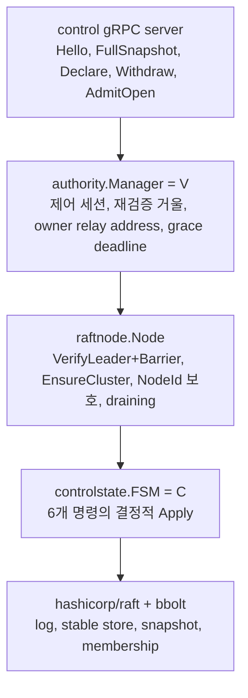
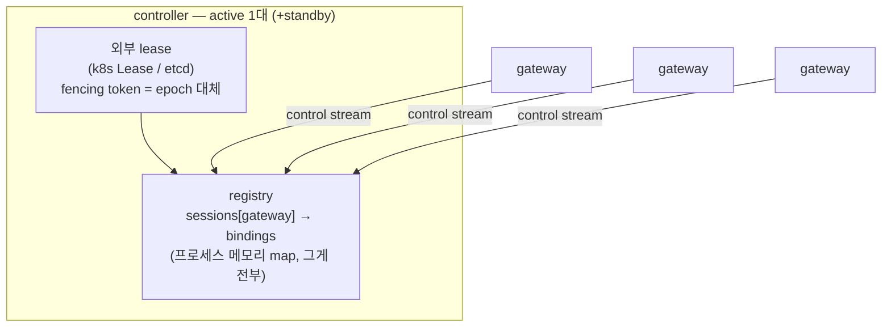

# 제어 평면 저장소 단순화 분석 (오캄의 면도날)

| 항목 | 값 |
| --- | --- |
| 상태 | 분석·제안, **미결정** |
| 범위 | `controller` 역할의 저장소 계층 (Raft, `C` FSM, `V` authority) |
| 범위 밖 | 데이터 평면(`relay.proto`, Pipe, payload receipt, peer 연결 공유), SDK |
| 규칙 | 이 문서는 Accepted ADR을 수정하지 않는다. 채택 시 색인 규칙에 따라 새 ADR 번호로 기록하고, 이 문서는 근거로 참조된다. |

## 1. 목적

현재 컨트롤러는 영속 Raft 집합 위에 현재 상태 FSM(`C`)을 놓고, 리더 로컬 권한 상태(`V`)를 그 위에 둔다([ADR 003](adr/003-current-state-cluster-and-recovery.md), [ADR 004](adr/004-control-state-authority-split.md), [ADR 005](adr/005-leader-driven-expiry.md)). 이 문서는 그 저장소 요구사항 자체를 재검토한다. 개별 코드의 품질이 아니라 **"directory를 합의로 영속화해야 하는가"**를 묻는다.

## 2. 현재 구조와 비용 정량

이 저장소 계층이 차지하는 코드 (2026년 worktree 측정):

| 패키지 | production | test |
| --- | --- | --- |
| `internal/raft/state` | 791 | 270 |
| `internal/raft/node` | 877 | 503 |
| `internal/raft/membership` | 579 | 614 |
| `internal/gateway/control/authority` | 833 | 572 |
| `cmd/relaygate/membership.go` | 125 | — |
| 합계 | **약 3,200** | **약 1,950** |

코드 외 비용:

- `docs/spec/003-failure-and-recovery-model.md`의 Raft 축 전체 (bootstrap, same-store restart, lost-store replacement, quorum 절차)
- [TEST 001](test/001-core-correctness-test-plan.md)의 `R01`–`R08`, `D01`–`D06`, `G01`–`G02` 계열
- Compose의 command-scoped bootstrap 곡예(`RELAYGATE_BOOTSTRAP_ONCE`), Controller named volume/PVC 요구, Bolt high-water mark 설명 의무
- 운영 근거 부채 ([TEST 002](test/002-failure-evidence-matrix.md)의 `external-blocked` 상당수): PVC runbook, replacement runbook, disaster reset fence

이 비용이 사는 것은 정확히 두 가지다.

1. **외부 인프라 없는 Controller HA** (합의를 자기 안에 포함)
2. **failover 간 route 소유권 연속성** (`C`가 살아있어 15초 grace 동안 소유권 유지)

## 3. 핵심 관찰

세 가지는 현재 코드가 스스로 증명하는 사실이다.

**관찰 1: route의 사용 가능성은 항상 `V`에 게이트된다.**
`resolveOpen`(admission)은 exact `C` route와 exact `V` 세션을 모두 요구한다. `C`에 route가 있어도 `V`가 없으면 Open은 거부된다. 즉 directory의 **사용 가치는 liveness에 종속**이며, 영속성은 사용 가치를 만들지 않는다.

**관찰 2: 재연결 재구축 경로가 `C`의 내용도 재구성할 수 있다.**
Gateway는 제어 스트림을 열 때마다 FullSnapshot으로 현재 바인딩 전량을 보낸다. 이 경로는 `V`를 재구축하기 위해 존재하지만, 동일한 데이터로 빈 directory도 재구성된다. Gateway가 죽은 route는 어차피 쓸 수 없고(관찰 1), 살아있는 Gateway는 스스로 다시 선언한다.

**관찰 3: Controller 장애는 established Pipe를 종료하지 않는다.**
Pipe는 Gateway 간 데이터 평면 구간이다 ([ADR 009](adr/009-cross-gateway-pipe.md), [TEST 001](test/001-core-correctness-test-plan.md) `O04`, `TestAcceptedPipeContinuesWhenFutureAdmissionIsUnavailable`). Controller 완전 상실의 유일한 영향은 **새 Open 불가**다.

세 관찰의 결론:

> 이 시스템의 directory는 **liveness-gated soft state**인데, **hard replicated state**로 저장하고 있다. 영속화가 추가로 사는 것은 failover 창구의 소유권 연속성 하나뿐이다.

## 4. 제안: 메모리-only directory + 외부 lease

원칙 한 줄: **"부재가 삭제"를 문자 그대로 — 연결이 없으면 route가 없다.**

- directory = 현재 연결된 제어 스트림들의 합집합. 별도 저장 계층이 없다.
- 제어 프로토콜의 **형태는 유지**한다: Hello → FullSnapshot → Declare/Withdraw. "커밋"이 Raft Apply에서 로컬 map insert로 바뀔 뿐이다. conflict/capacity 결과 코드는 그대로 필요하다.
- fencing: `AuthorityId` 자리에 lease fencing token(또는 process boot ID)이 들어간다. `SessionRef`/`OpenContext`에 실려 owner 측 재검증은 현재와 동일하게 동작한다. lease 상실 = 현재의 fence와 동일하게 전체 세션을 닫고 serving을 멈춘다.
- 장애 감지: keepalive(10s/5s)는 더 중요해진다 — 스트림 사망이 곧 삭제 트리거이므로.
- grace와 sweep은 **완전히 사라진다**. 스트림 사망 = 세션과 소유 route 즉시 삭제. 15초 유예는 `C`를 비우지 않기 위한 장치였으므로, `C`가 없으면 존재 이유가 없다.

### 상태 기계 (전부)

| 이전 상태 | 이벤트 | 다음 상태 | 효과 |
| --- | --- | --- | --- |
| 없음 | Hello + 검증 | session | map insert, boot epoch 부여 |
| session | FullSnapshot | session | 바인딩 원자 교체 (현재의 all-or-nothing 규칙 유지) |
| session | Declare / Withdraw | session | exact insert / delete, conflict·capacity 결과 동일 |
| session | 스트림 사망 | 없음 | 세션 + 소유 route 즉시 삭제 (cascade) |
| any | lease 상실 | — | 전체 fence, serving 중지 |

## 5. 장애 의미론 비교

| 상황 | 현재 (Raft `C`+`V`) | 제안 (memory-only) |
| --- | --- | --- |
| Gateway 연결 끊김 | `V=false` 즉시, `C`는 15s grace 후 삭제 | 즉시 삭제. **Open 불가 창구 동일** |
| Controller 단일 장애 | 새 리더 선출, `V` 초기화, 재연결 대기 | standby 승격(lease), 빈 directory에서 재연결 대기 |
| Open 재개 시점 | Gateway 재연결 + FullSnapshot 후 | Gateway 재연결 + 재선언 후 — **동일** |
| 열린 Pipe | 생존 (`O04`) | 생존 — **동일** |
| Controller 완전 상실 | quorum 상실 = fail closed | active 없음 = fail closed — **동일** |
| quorum 미달 판정 | Raft가 정확히 판정 | lease 구현의 시계 가정에 의존 (§7) |
| route 소유권 유지 | failover 중 최대 15s stickiness | 없음, 선재선언 취득 (§6) |
| 재연결 폭풍 부하 | 리더 교체마다 동일 부하를 이미 감수 | 동일 |

재연결 폭풍은 새 비용이 아니다: 현재 설계도 리더 교체마다 전 Gateway의 reconnect + FullSnapshot을 감수한다. 제안은 그 경로를 **유일한 경로**로 격상시킬 뿐이다.

## 6. 실질 손실 분석 — 소유권 stickiness

현재 설계에서 failover 후 Gateway A(소유자)가 재연결하기 전에 같은 `ClientId`의 Gateway B가 같은 key를 declare하면 `C`에 A의 route가 살아있어 **conflict**가 된다. A의 grace(15s)가 만료되거나 A가 withdraw해야 B가 선언할 수 있다.

이 stickiness의 실제 가치를 검증하면:

- 보호되는 경우는 "failover 창구 + 동일 ClientId의 listener가 다른 Gateway에서 동시 이주"라는 귀퉁이 하나다.
- 그런데 그 이주는 **정상 시나리오**다 (listener 앱의 재스케줄링). 현재 설계는 이를 최대 15초 지연시키고, SDK 입장에서는 bind conflict로 표면화된다(자동 해소가 아니다).
- 양쪽 Gateway가 동시에 연결된 상태의 이중 소유는 두 설계 모두 declare conflict로 원천 거부한다.

즉 stickiness는 failover 창구에서만 작동하는 15초 지연 장치이며, 흔한 경우에는 제안 모델(즉시 취득)이 오히려 낫다. 잃는 것은 "재연결 없는 이주를 15초 막는다"는 엄밀성뿐이다.

## 7. 실질 손실 분석 — 합의 vs lease

정직하게 기록한다: lease 기반 HA는 Raft보다 **약한** fencing이다.

- k8s Lease 계열은 시계 가정 위의 best-effort다. clock skew나 lease 갱신 지연이 겹치면 두 active controller가 공존할 수 있다.
- 공존 시 결과: directory가 둘로 갈라져, 같은 route key가 controller-1에서는 G1 소유, controller-2에서는 G2 소유가 될 수 있다. 서로 다른 controller에 붙은 ingress는 다르게 라우팅한다.
- 폭발 반경: lease split-brain 기간에 한정되고, 파티션 해소 시 soft state이므로 자가 치유된다. established Pipe는 영향받지 않는다.
- 현재 설계는 `VerifyLeader`(quorum 확인)로 이 경우를 거의 불가능하게 만든다. 이 차이가 §8의 조건을 결정한다.

## 8. 현재 설계가 정당한 조건

다음 세 조건이 **동시에** 성립하면 embedded Raft 유지가 맞고, 이 문서의 제안은 기각되어야 한다.

1. 배포 대상에 빌릴 수 있는 외부 합의 인프라(k8s, etcd 등)가 없다
2. 그래도 Controller 이중화가 필요하다
3. failover 간 route 소유권 연속성과 quorum-정확한 fencing이 요구된다

반대로, 배포 타겟이 컨테이너 오케스트레이션이라면 **거기엔 이미 합의가 있다.** lease로 리더 선출을 사면서 리더 선출을 위해 Raft를 내장하는 것은 중복 인프라다.

참고: Raft를 수용하는 순간 `C`/`V` 분리, 명령-복제 만료, fence 규율은 전부 강제되는 최소 형태이며, 현재 구현은 그 형태를 충실히 따른다. 이 문서는 그 구현을 비판하지 않는다. 요구사항의 가격을 묻는 것이다.

## 9. 이행 경로 (채택 시)

지금 당장의 리라이트는 권하지 않는다. v0.1 계약 검증과 증거 행렬은 현재 구현 위에 세워져 있다. 채택하더라도 저장소 교체로 접근한다.

1. **결정 기록**: 이 문서의 결론을 채택/기각하는 새 ADR을 색인의 다음 번호로 기록한다. 채택이면 [ADR 003](adr/003-current-state-cluster-and-recovery.md), [004](adr/004-control-state-authority-split.md), [005](adr/005-leader-driven-expiry.md)의 대체 관계를 배경 절에 적는다.
2. **프로토콜 불변**: `control.proto`의 Hello/FullSnapshot/mutation 흐름과 `relay.proto` 계약을 유지한다. SDK와 Gateway 데이터 평면 변경 0이 목표다.
3. **서버 백엔드 교체**: authority의 mutation을 Raft Apply에서 로컬 map apply로 바꾼다. `mutationMu` 직렬화와 all-or-nothing 검증 규칙은 재사용한다.
4. **fencing 교체**: `ClusterEpoch`/`AuthorityId`를 lease fencing token으로 대체하고, lease 상실 시 fence한다.
5. **삭제**: §2 표의 패키지들, bootstrap 설정(`RELAYGATE_RAFT_BOOTSTRAP*`, Compose 곡예), membership Unix socket/CLI, Controller 영속 볼륨 요구, grace/sweep.
6. **문서**: SPEC 001/003/004 갱신, TEST 001의 Raft 축(`R`, `D`, `G` 계열) 제거와 registry 축 추가. State/event 의미 변경이므로 규칙상 SPEC 004 표와 TEST 001 대응 test를 함께 갱신한다.

## 10. 열린 질문 (결정 전에 답이 필요한 것)

1. 실제 배포 환경은 무엇이며, 빌릴 수 있는 lease가 있는가?
2. Controller 재시작 동안의 **새 Open 중단 예산**은 얼마인가? (열린 Pipe는 중단되지 않는다)
3. 소유권 stickiness 포기를 받아들이는가, 아니면 failover 창구의 15초 보호가 진짜 요구사항인가?
4. Raft를 유지한다면: 외부 인프라 없는 HA가 실제 배포 시나리오라는 근거는 무엇인가?
5. lease split-brain의 최악 결과(일시적 directory 이중화)를 받아들일 수 있는가?

## 참조

- [ADR 001](adr/001-relaygate-role-and-responsibility-boundary.md) — 제품 경계: replay/resume/저장을 하지 않는다
- [ADR 002](adr/002-runtime-and-release-boundary.md) — 실행 역할과 배포 경계
- [ADR 003](adr/003-current-state-cluster-and-recovery.md), [004](adr/004-control-state-authority-split.md), [005](adr/005-leader-driven-expiry.md) — 이 문서가 재검토하는 저장소 결정들
- [ADR 009](adr/009-cross-gateway-pipe.md), [010](adr/010-payload-delivery-receipts.md) — 데이터 평면, 변경 없음
- [SPEC 001](spec/001-system-model.md), [SPEC 003](spec/003-failure-and-recovery-model.md), [SPEC 004](spec/004-state-transition-model.md) — 현재 상태 계약
- [TEST 001](test/001-core-correctness-test-plan.md), [TEST 002](test/002-failure-evidence-matrix.md) — 현재 검증 근거
