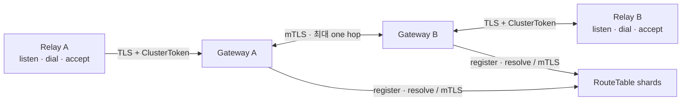

# RelayGate 문서

```text
ADR   설계 결정과 근거
SPEC  현재 상태·동작 계약
TEST  requirement별 실행 증거
RFC   외부 표준의 개념 색인
```

## 구조



```text
Destination  * ◄── Binding ──► * RelaySession
dial 1회 ──► eligible Binding 1개 ──► Pipe 1개
```

## 책임

| 구성요소 | 소유 상태·동작 |
| --- | --- |
| SDK | Gateway TLS 검증, ClusterToken, session 재연결, Listener 재등록, Pipe API |
| Gateway | session admission, local Binding, dial 선택, RT 등록·조회, one-hop relay, bounded cleanup |
| RouteTable | shard별 lease 기반 `Destination -> BindingSet` current state |
| Transport | SDK TLS와 내부 mTLS handshake |
| Server | process config, dependency wiring, readiness, metric, shutdown |
| Application | Destination 보관, Pipe 상대 인증·인가, payload 의미·재시도, 필요한 E2E 보호 |
| Helm | RT/GW resource, 외부 Secret 배선, 선택적 내부 leaf Certificate |

## 문서 지도

| 영역 | 문서 |
| --- | --- |
| 책임 경계 | [ADR 001](adr/001-relaygate-responsibility-boundary.md) |
| SDK·주소·접근 | [ADR 002](adr/002-symmetric-relay-session.md), [ADR 003](adr/003-application-owned-destination.md), [ADR 004](adr/004-cluster-token-session-admission.md) |
| control·data plane | [ADR 005](adr/005-current-state-routing-topology.md), [ADR 006](adr/006-soft-state-registration-lifecycle.md), [ADR 007](adr/007-one-hop-peer-multiplexing.md) |
| 생존·운영 | [ADR 008](adr/008-transport-liveness-and-idle-retirement.md), [ADR 009](adr/009-operational-health-boundaries.md), [ADR 010](adr/010-bounded-gateway-drain-and-reconnect-jitter.md) |
| transport·certificate | [ADR 011](adr/011-sdk-transport-and-l4-boundary.md), [ADR 012](adr/012-public-edge-webpki-trust.md), [ADR 013](adr/013-cert-manager-internal-leaf-certificates.md) |
| current contract | [SPEC](spec/) |
| executable evidence | [TEST 001](test/001-requirement-test-matrix.md) |
| standards background | [RFC](rfc/) |

`DestinationId`는 application-owned UUIDv4이고 RT mapping은 live Binding에서 파생됩니다. session
종료는 소유 Binding과 Pipe를 정리하며 SDK는 Listener를 새 session에 등록합니다. 새 연결은 새
`dial`로 시작하고 application payload lifecycle은 application이 소유합니다.
