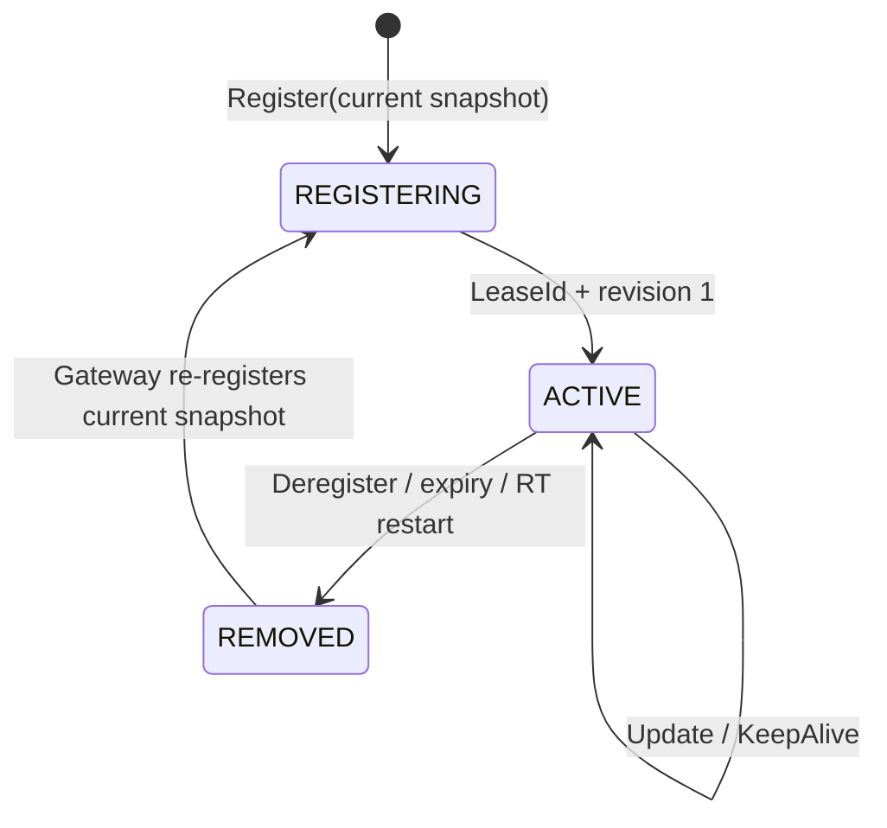

# ADR 002: Route mapping은 active lease에 연결된 soft state다

| 항목 | 결정 |
| --- | --- |
| 상태 | Accepted |
| truth | Gateway의 live RelaySession과 Binding |
| RT state | active lease에 연결된 memory-only projection |

## 결정



| operation | state transition |
| --- | --- |
| `Register` | 새 LeaseId와 revision 1의 full snapshot 생성 |
| `Update` | active lease의 더 높은 revision snapshot으로 원자 교체 |
| `KeepAlive` | mapping을 유지하며 deadline 갱신 |
| `Deregister`·expiry | lease와 mapping 제거 |
| RT restart | 빈 상태로 시작한 뒤 Gateway snapshot으로 복구 |

LeaseId와 revision은 늦은 operation이 새 registration을 변경하는 일을 막습니다. Owner Gateway는 Pipe를
열기 전에 selected Binding identity를 현재 local state와 다시 대조합니다.

## 효과

```text
RT memory = O(live registration + live Binding)
history   = Git/application domain
recovery  = Gateway current snapshot
```

RT `KeepAlive`는 registration lease를, transport `PING/PONG`은 연결 생존성을 관리합니다. established
Pipe는 route mapping과 독립된 lifecycle을 가집니다.

## 참고

- [RFC 2205](../rfc/rfc-2205-rsvp-soft-state.md)
- [RFC 8656](../rfc/rfc-8656-turn-lifetime.md)
- [RFC 9301](../rfc/rfc-9301-lisp-control-plane.md)
