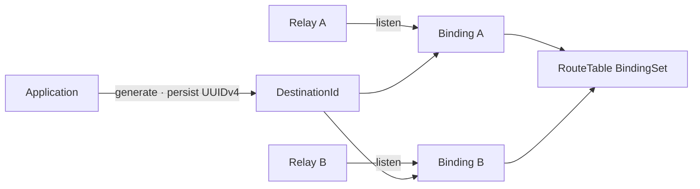

# ADR 003: DestinationId는 application-owned UUIDv4다

| 항목 | 결정 |
| --- | --- |
| 상태 | Superseded by [ADR 015](015-hierarchical-destination.md) |
| 생성·보관 | application |
| 형식 검증 | SDK와 Gateway |
| live location | Gateway Binding과 RT mapping |

## 이전 결정

| lifecycle | 소유 상태 |
| --- | --- |
| stable address | application config 또는 저장소 |
| live publication | Relay Listener와 Gateway Binding |
| distributed lookup | memory-only RT mapping |
| 마지막 Binding 종료 | Destination의 live mapping 제거 |
| 같은 UUID의 여러 Listener | 하나의 Destination에 대한 N:M BindingSet |

UUID는 routing address의 충돌 가능성을 낮춥니다. peer identity와 authorization은 application protocol이
담당하고, 강한 주소 소유권과 중앙 발급은 별도 control plane의 결정입니다.

## 참고

- [ADR 005](005-current-state-routing-topology.md)
- [ADR 006](006-soft-state-registration-lifecycle.md)
- [SPEC 003](../spec/003-destination-binding-contract.md)
