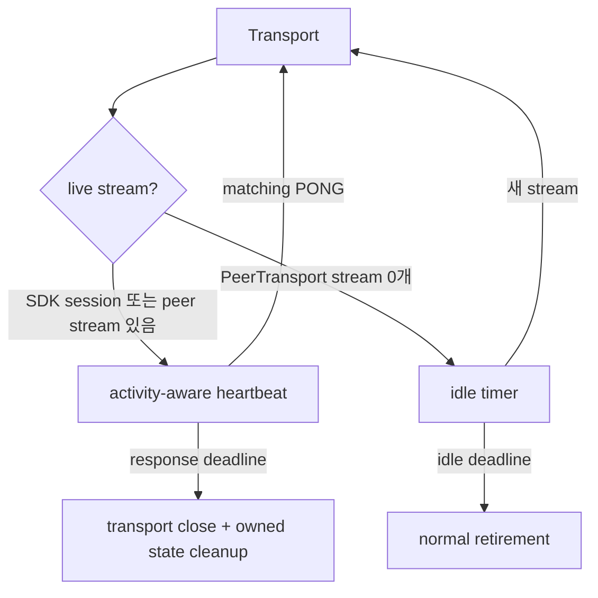

# ADR 004: Transport liveness와 idle retirement를 분리한다

| 항목 | 결정 |
| --- | --- |
| 상태 | Accepted |
| active transport | activity-aware `PING/PONG` |
| empty PeerTransport | idle-retirement timer |

## 결정

| 신호 | 의미 |
| --- | --- |
| valid inbound activity | 다음 PING 이전의 idle deadline 갱신 |
| committed PING + matching PONG | transport path 생존 확인 |
| Pipe read idle | 정상 application 상태 |
| RT KeepAlive | RouteTable lease 갱신 |

Heartbeat timeout은 해당 session 또는 PeerTransport를 닫고 소유 state를 정리합니다. 새 Pipe는 이후
`dial`에서 새 transport를 사용할 수 있으며 application payload lifecycle은 application이 관리합니다.

## 참고

- [RFC 5880](../rfc/rfc-5880-bfd-liveness.md)
- [RFC 9113](../rfc/rfc-9113-http2-connection-lifecycle.md)
- [RFC 9000](../rfc/rfc-9000-quic-streams.md)
