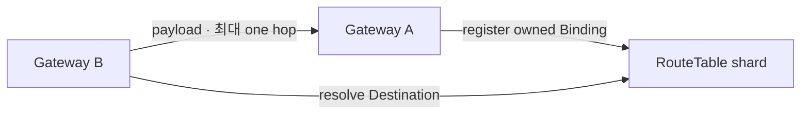

# ADR 005: RouteTable은 hash-sharded mapping authority다

| 항목 | 결정 |
| --- | --- |
| 상태 | Accepted |
| 목적 | `Destination`의 live Binding 위치 조회 |
| 확장 축 | route key를 여러 shard로 분할 |

## 결정

```text
ShardDirectoryGeneration             = SHA-256(exact directory bytes)
Authority(generation, canonical Destination) = logical shard 1개
BindingSet(Destination)                      = live Binding 0..N
```



| 축 | 현재 모델 |
| --- | --- |
| mapping system | identifier-to-locator control plane |
| authority | canonical Destination hash가 Destination별 shard 하나를 선택 |
| directory | 모든 process가 동일한 불변 artifact와 generation 사용 |
| shard endpoint | logical shard마다 stable endpoint 하나 |
| Gateway state | owned Binding 등록, remote dial마다 resolve |
| data plane | established Pipe가 RT를 우회 |
| directory 변경 | coordinated restart 후 current Binding 재등록 |
| replica/failover | 별도 결정 전까지 shard endpoint 하나가 authority |

## 효과

| 속성 | 결과 |
| --- | --- |
| scale | route key와 mapping 용량을 shard로 분산 |
| consistency | mixed generation을 명시적 실패로 처리 |
| Gateway memory | 작은 directory와 local Binding만 필수 |
| recovery | current Gateway state로 RT BindingProjection 재구축 |

## 참고

- [RFC 9299](../rfc/rfc-9299-lisp-architecture.md)
- [RFC 9301](../rfc/rfc-9301-lisp-control-plane.md)
- [RFC 7426](../rfc/rfc-7426-sdn-architecture.md)
