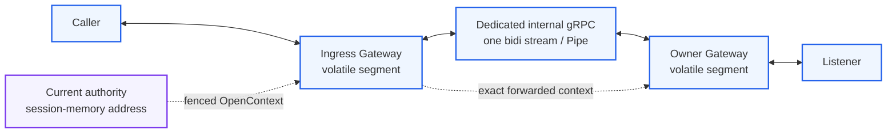

# ADR 008: Cross-Gateway hop과 bounded replay fence

> **Status:** Accepted — trusted-dev slice evidenced; production blocked on peer auth/mTLS

## Context

Ingress Gateway와 Listener를 소유한 Gateway가 다르면 route authority, owner 주소, one-attempt admission과
end-to-end `PipeId`를 process 경계 너머로 전달해야 한다. 이 경계를 directory나 durable retry로 만들면
[ADR 001](001-relaygate-role-and-responsibility-boundary.md)의 일시적 Pipe 범위를 넘고, public Relay 또는
Raft transport와 합치면 trust와 lifecycle이 섞인다.

## Decision



### Address와 transport

- Gateway는 `Hello`에서 자기 internal owner-relay advertise address를 보낸다. Current authority는 이를 exact
  `ControlSessionRef`에만 묶어 memory에 둔다. Authority/control session 종료 때 폐기하며 Raft, database,
  snapshot, REST directory나 별도 discovery state에 저장하지 않는다.
- Cross-Gateway hop은 public Relay, internal control과 Raft transport와 분리된 internal protobuf gRPC
  listener를 쓴다. Bind address와 advertise address는 분리한다.
- Remote Open attempt마다 dedicated bidirectional stream 하나를 연다. Accepted되면 같은 stream이 그 logical
  Pipe의 유일한 Gateway-to-Gateway hop이며 두 Pipe를 multiplex하지 않는다.
- Owner는 `AcceptedO` 선형화점에서 `PipeId`를 새로 만들어 Ingress와 Listener에 전달한다. Ingress와 Owner는
  같은 logical `PipeId` 아래 서로 다른 volatile relay segment만 소유한다.

### Forwarded OpenContext

Forwarded context는 다음 값을 모두 exact하게 묶는다.

```text
ForwardedOpenContext = (
  ClusterEpoch, AuthorityId, AttemptId,
  IngressGatewayId, IngressGatewayInstanceId, IngressControlSessionId,
  AuthContext,
  BindingKey, BindingGeneration, ListenerBindingRef,
  OwnerRelayAddress,
  ExpiresAt
)

ExpiresAt = AuthorityWallClockAtIssue + relay.open_timeout
```

`AuthorityId`는 same-epoch 발급 provenance다. Ingress는 authority response의 ingress tuple이 자기 exact live
`ControlSessionRef`와 일치하는지 forwarding 전에 확인하고 context의 owner address만 dial target으로 쓴다.
Owner는 전체 tuple의 structural validity, current epoch, exact local binding/auth, expiry와 replay fence를 검사한다.
같은 epoch의 authority 교체만으로 issued context를 소급 취소하지 않지만 old epoch, malformed provenance,
retired local credential/session/binding과 만료 context는 fail closed한다.

Absolute expiry는 authority와 Gateway clock 사이에 알려진 유한 bound가 있다는 배포 가정을 요구한다.
`ClockSkewBound < relay.open_timeout`이어야 하며 owner는 자기 wall clock에서 `now < ExpiresAt`일 때만
진행한다. 이 가정을 입증하지 못한 배포는 cross-Gateway correctness를 주장할 수 없다.

### Replay와 outcome

- Owner는 exact `O` guard를 확인하고 local attempt reservation과 successful `AttemptId` replay entry insert를
  하나의 atomic effect로 만든 뒤에만 Listener에게 offer한다. Entry는 Listener reject나 pre-LP terminal 뒤에도
  **같은 Owner process가 살아 있는 동안** `ExpiresAt`까지 유지하며 unexpired entry를 eviction하지 않는다.
  Owner crash는 cache를 잃고 old instance/context를 fence하며 exact outcome은 R3다.
- 이미 reserved된 `AttemptId` duplicate와 full cache는 stable fail-closed다. Duplicate에 이전 response나
  `PipeId`를 replay하지 않는다. Exact O guard 실패는 context를 consume하지 않으므로 아직 unexpired라면 다시
  평가할 수 있다. Expiry 뒤 entry는 제거할 수 있지만 같은 context도 이미 만료돼 다시 사용할 수 없다.
  Fence key는 Owner process scope의 `AttemptId`이며 `ExpiresAt`은 entry data다. 같은 `AttemptId`의 expiry 변경은
  새 key가 아니라 duplicate다.
- `AcceptedO` Open LP 전 exact rejection을 관찰하면 stable failure가 가능하다. LP 통과 가능성을 배제할 수 없거나 LP 뒤
  response/hop을 잃으면 caller outcome은 `Unknown`이다.
- O reservation 뒤 같은 attempt의 retry, hop reconnect, Pipe resume/attach와 payload replay는 없다. O guard가
  실패해 consume되지 않은 unexpired context의 재평가는 허용하지만 이전 response나 stream을 resume하지 않는다.
  Hop loss는 각 segment의 local terminal trigger이며 새 application 시도는 새 `AttemptId`와 새 Pipe다.
- 방향별 FIFO, bounded activation, backpressure와 terminal priority는 public segment와 internal hop 모두에
  적용한다. Ingress의 public `PipeOpened` write가 성공하기 전에는 Owner가 Listener→Caller payload를 release하지
  않는다.

### Trust boundary

초기 internal listener는 peer authentication/mTLS가 없는 **trusted local/dev network 전용**이다. Context
field는 provenance를 구조적으로 묶지만 actual stream peer identity/current ingress session을 증명하거나 Owner가
자기 advertised address를 authority directory와 대조하게 하지 않는다. Honest peer와 untampered internal network가
가정이다. Listener는 제한된 network에 bind하고, peer auth/mTLS와 peer-to-context binding이 구현·검증되기
전에는 production/shared/untrusted network에서 활성화하지 않는다.

## Consequences

- Owner address churn은 control revalidation으로만 반영되고 durable routing state를 늘리지 않는다.
- Replay safety는 expiry와 bounded memory를 얻는 대신 wall-clock skew라는 명시적 correctness assumption을
  추가한다.
- Hop failure 뒤 service/route는 새 Open으로 R1 복구할 수 있지만 기존 Pipe, payload 위치와 outcome은 R3다.
- [ADR 003](003-machine-to-machine-grpc-interface.md)의 Gateway-to-Gateway gRPC 결정은 public SDK service를
  재사용한다는 뜻이 아니라, 별도 internal data-plane service/listener를 쓴다는 의미로 이 ADR이 구체화한다.

## 관련 문서

- [SPEC 001: RelayGate System Model](../spec/001-system-model.md)
- [SPEC 003: Failure and Recovery Model](../spec/003-failure-and-recovery-model.md)
- [SPEC 004: State Transition Model](../spec/004-state-transition-model.md)
- [TEST 001: Core Correctness Test Plan](../test/001-core-correctness-test-plan.md)
