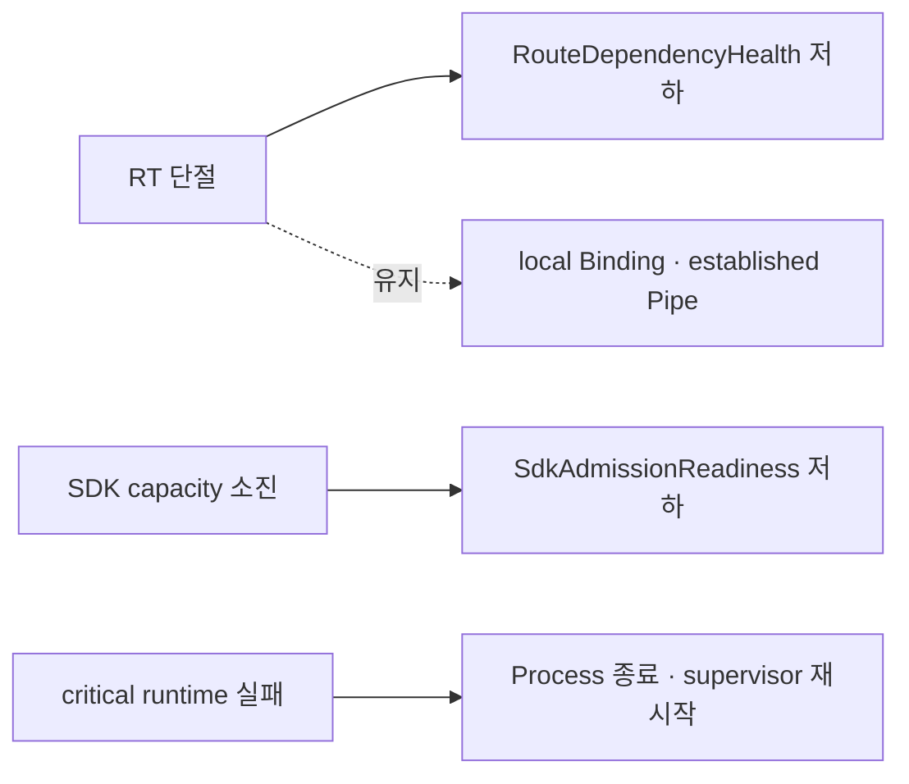

# ADR 008: 운영 health 신호를 실패 영역별로 분리한다

| 항목 | 결정 |
| --- | --- |
| 상태 | Accepted |
| health model | process, SDK admission, RT dependency를 독립 관측 |

## 결정

| 신호 | 답하는 질문 | 소유자 |
| --- | --- | --- |
| `ProcessLiveness` | process와 critical runtime이 진행 가능한가 | process supervisor |
| `SdkAdmissionReadiness` | 새 SDK가 TLS·HELLO·WELCOME을 완료할 수 있는가 | Gateway |
| `RouteDependencyHealth` | remote registration·Resolve가 가능한가 | Gateway RT workers |

`relaygate-server check`는 `SdkAdmissionReadiness`를 검증합니다. `RouteDependencyHealth`는 Gateway가
마지막으로 관찰한 dependency 상태이며 routing truth와 payload delivery는 각각 RT current state와
application protocol에서 판정합니다.

## 효과

- RT 장애는 remote control-plane 영향으로 격리됩니다.
- admission capacity와 process failure를 별도로 경보할 수 있습니다.
- local-only Gateway는 RT dependency를 `DISABLED`로 표현합니다.

## 참고

- [RFC 5880](../rfc/rfc-5880-bfd-liveness.md)
- [RFC 7426](../rfc/rfc-7426-sdn-architecture.md)
