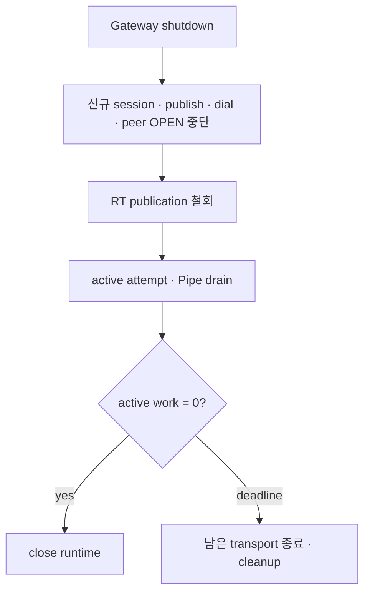

# ADR 010: Gateway는 bounded drain하고 재연결은 jitter로 분산한다

| 항목 | 결정 |
| --- | --- |
| 상태 | Accepted |
| shutdown | 신규 작업 중단 후 active work drain |
| reconnect | bounded exponential backoff + runtime별 jitter |

## 결정

| reconnect 주체 | backoff state | reset 조건 |
| --- | --- | --- |
| SDK Relay | runtime별 jitter, 현재 단계의 `2/3..1` | 안정 session 또는 Listener republish 성공 |
| Gateway RT worker | Gateway·shard별 jitter | 해당 shard 연결 성공 |

Drain 중 새 작업은 `UNAVAILABLE/NOT_OBSERVED`로 끝납니다. 이미 시작된 Pipe는 drain deadline까지 진행하고,
deadline 뒤에는 transport-loss cleanup으로 수렴합니다. RT는 connection과 queued request를 닫고 Gateway가
current snapshot을 다시 등록합니다.

## 효과

- 정상 rollout은 active Pipe에 완료 시간을 제공합니다.
- drain timeout이 종료 상한을 만듭니다.
- SDK와 RT worker의 동시 재연결을 시간 범위에 분산합니다.
- 기존 Pipe 연속성 대신 새 session·Listener·dial로 복구합니다.
