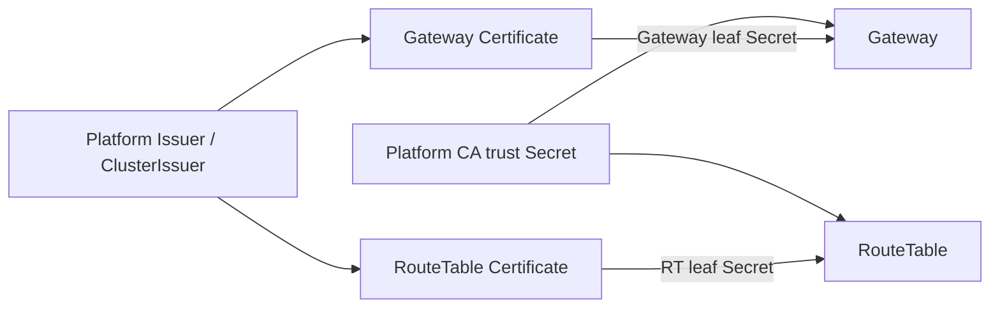

# ADR 013: cert-manager는 내부 leaf certificate를 자동화한다

| 항목 | 결정 |
| --- | --- |
| 상태 | Accepted, implemented |
| 기본 source | operator-managed `existingSecret` |
| 선택 source | cert-manager role별 leaf Certificate |

## 결정

| 소유자 | 자산·동작 |
| --- | --- |
| platform | Issuer, CA private key, public trust bundle, CA rotation |
| cert-manager | role별 leaf 발급과 만료 전 갱신 |
| Helm | Certificate resource와 trust/leaf Secret mount |
| Gateway | Gateway leaf로 peer server 및 peer/RT client auth |
| RouteTable | RT leaf로 server auth |
| runtime | startup 시 certificate file load |
| platform rollout 정책 | renewed Secret을 읽는 workload 교체 |

chart는 범용 StatefulSet annotation을 전달한다. GitOps가 role별 leaf·공개 trust Secret의
Reloader watch와 ArgoCD 보존 규칙을 설정한다. cert-manager와 rollout controller는 platform이 설치한다.
Vault에는 admission credential과 CA 서명 자산을 보관하고, leaf는 cert-manager가 Kubernetes Secret으로 관리한다.

CA rotation은 old/new trust overlap 후 leaf 재발급 순서로 수행합니다. logical Gateway/shard handshake는
mTLS identity 위에서 기존 protocol 검증을 계속 담당합니다.

## 참고

- [cert-manager Certificate](https://cert-manager.io/docs/usage/certificate/)
- [cert-manager trust](https://cert-manager.io/docs/trust/)
- [cert-manager CA Issuer](https://cert-manager.io/docs/configuration/ca/)

Gateway leaf는 Gateway 역할 DNS SAN과 clientAuth/serverAuth를, RT leaf는 RT DNS SAN과 serverAuth를 가진다.
Vault 최소 구성은 SDK `cluster_token`과 내부 CA의 `ca_crt`·`ca_key`이며 leaf private key는 cert-manager가 관리한다.
