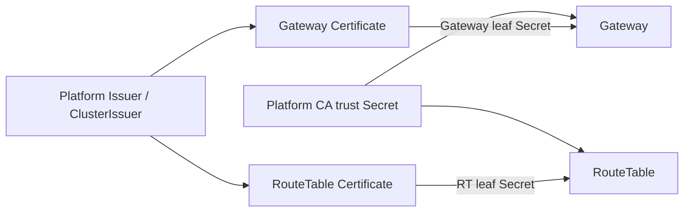

# ADR 016: cert-manager는 내부 leaf certificate를 자동화한다

| 항목 | 결정 |
| --- | --- |
| 상태 | Accepted, implemented |
| 기본 source | operator-managed `existingSecret` |
| 선택 source | cert-manager role별 leaf Certificate |

## 결정

| 소유자 | 자산·동작 |
| --- | --- |
| platform | Issuer, CA private key, public trust bundle, CA rotation |
| cert-manager | role별 leaf 발급과 만료 전 갱신 |
| Helm | Certificate resource와 trust/leaf Secret mount |
| Gateway | Gateway leaf로 peer server 및 peer/RT client auth |
| RouteTable | RT leaf로 server auth |
| runtime | startup 시 certificate file load |
| rollout controller | reload token 또는 reloader로 renewed Secret 적용 |

CA rotation은 old/new trust overlap 후 leaf 재발급 순서로 수행합니다. logical Gateway/shard handshake는
mTLS identity 위에서 기존 protocol 검증을 계속 담당합니다.

## 참고

- [cert-manager Certificate](https://cert-manager.io/docs/usage/certificate/)
- [cert-manager trust](https://cert-manager.io/docs/trust/)
- [cert-manager CA Issuer](https://cert-manager.io/docs/configuration/ca/)
