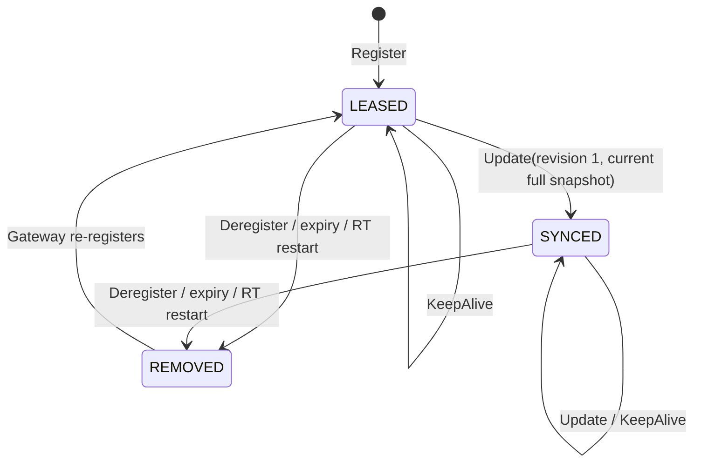

# ADR 019: Registration lease와 BindingSnapshot 설치를 분리한다

| 항목 | 결정 |
| --- | --- |
| 상태 | Accepted; supersedes [ADR 006](006-soft-state-registration-lifecycle.md) |
| truth | Gateway의 live RelaySession과 Destination Binding |
| RT state | active lease와 optional current BindingSnapshot |

## 결정



| operation | state transition |
| --- | --- |
| `Register` | active registration이 없으면 새 LeaseId를 만들고 revision과 BindingSnapshot은 두지 않음 |
| 동일 `Register` 재시도 | current ack를 반환하고 deadline·revision·BindingSnapshot을 유지 |
| 첫 `Update` | revision 1의 non-empty current full snapshot 설치 |
| 이후 `Update` | 더 높은 revision의 non-empty full snapshot으로 원자 교체 |
| `KeepAlive` | 현재 BindingProjection을 유지하며 lease deadline 갱신 |
| `Deregister`·expiry | lease와 소유 BindingProjection 제거 |
| RT restart | 빈 상태로 시작하고 Gateway current BindingSnapshot으로 재구축 |

LeaseId와 revision은 늦은 operation이 새 registration을 변경하는 일을 막습니다. Established Pipe는
RouteTable 상태와 독립된 lifecycle을 가지며, Owner Gateway는 selected Binding identity를 current local
state와 다시 대조합니다.

```text
RT memory = O(live registration + live Binding)
history   = Git/application domain
recovery  = Gateway current snapshot
```

## 참고

- [RFC 2205](../rfc/rfc-2205-rsvp-soft-state.md)
- [RFC 8656](../rfc/rfc-8656-turn-lifetime.md)
- [SPEC 004](../spec/004-route-table-contract.md)
