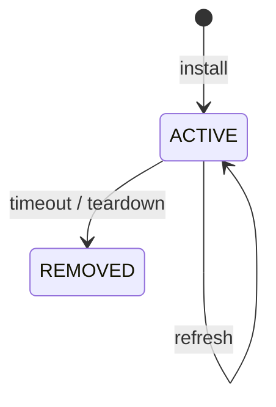

# RFC 2205: Resource ReSerVation Protocol

| 항목 | 값 |
| --- | --- |
| 원문 | [RFC Editor](https://www.rfc-editor.org/rfc/rfc2205.html) |
| 성격 | Standards Track, 1997-09 |
| 목적 | 경로상의 resource reservation state 관리 |

| 개념 | 의미 |
| --- | --- |
| soft state | periodic refresh가 존재를 유지 |
| expiry | refresh deadline 뒤 자동 제거 |
| teardown | 빠른 명시적 제거 |
| plane separation | control state와 data forwarding path 분리 |

reservation, QoS와 multicast는 RSVP 고유 영역이고 refresh-or-expire는 재사용 가능한 상태 원리입니다.

원문 절: [§2.3](https://www.rfc-editor.org/rfc/rfc2205.html#section-2.3), [§2.4](https://www.rfc-editor.org/rfc/rfc2205.html#section-2.4), [§3.7](https://www.rfc-editor.org/rfc/rfc2205.html#section-3.7)
