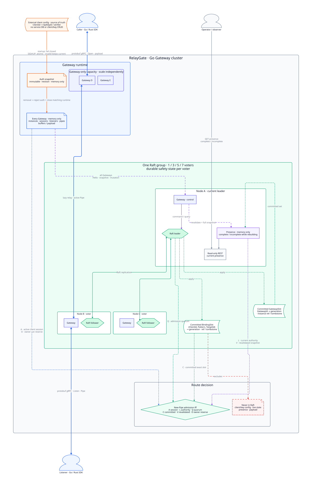
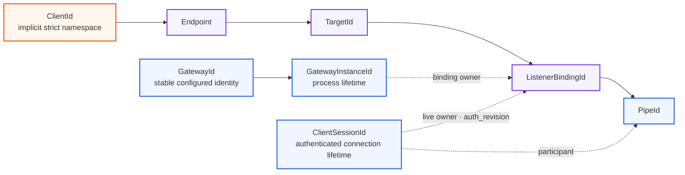
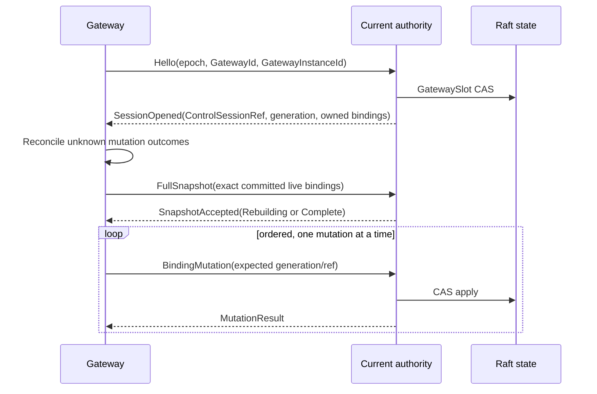
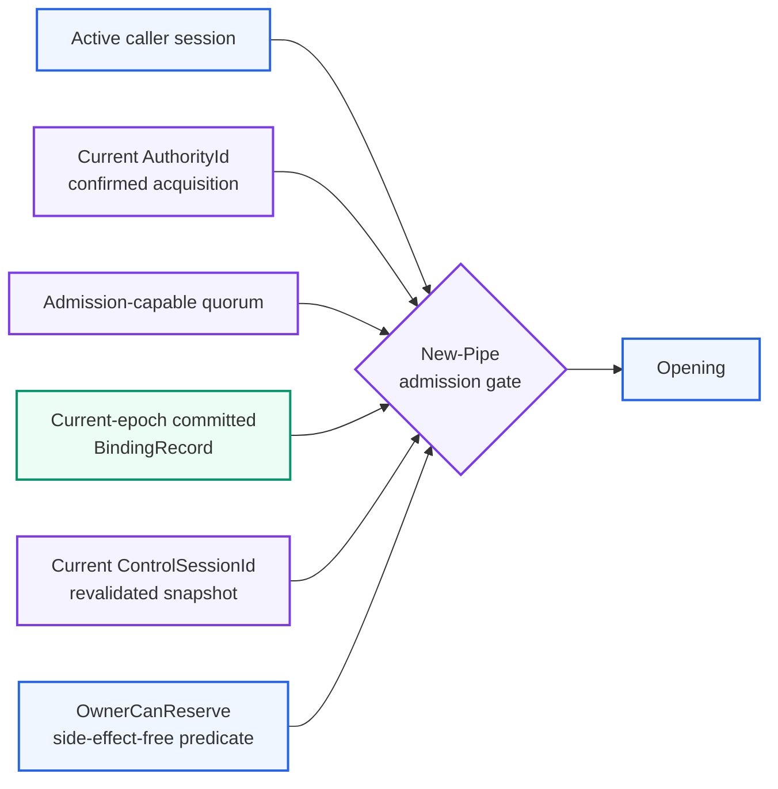
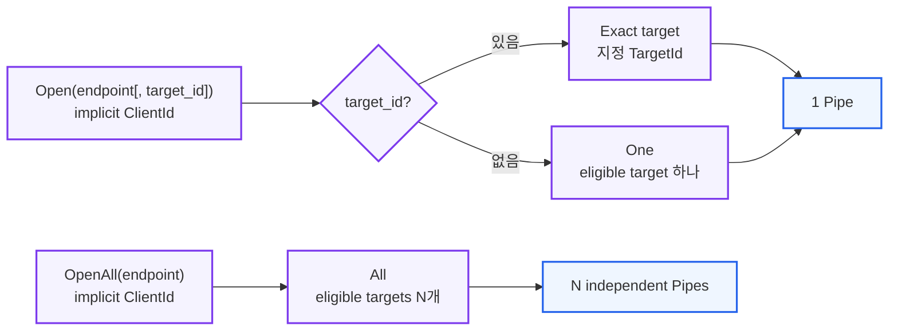
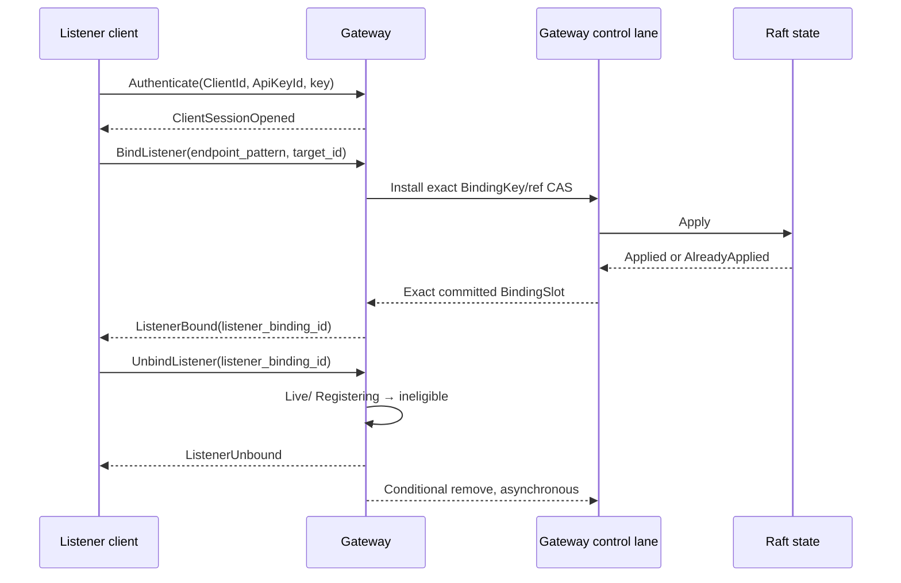
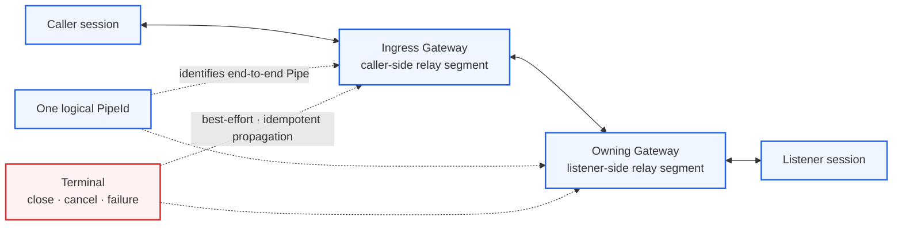

# SPEC 001: RelayGate System Model

> **Status:** Draft
>
> RelayGate의 namespace, identity, 상태 경계와 생명주기를 정의한다.

## 전체 구조



[D2 source](../diagrams/cluster-topology.d2)

- 파랑/남색: Go/Rust SDK, Gateway runtime과 gRPC data path
- 보라 점선: Gateway와 현재 Raft leader 사이의 control path
- 초록: Raft safety state와 합의된 최소 route/control record
- 주황: service 밖의 공통 client/key config와 process별 atomic snapshot
- 회색: gRPC relay와 분리된 read-only REST presence

## Namespace와 identity



```text
ResolveScope       = (ClientId, Endpoint)
BindingKey         = (ClientId, EndpointPattern, TargetId)
BindingSlot        = (BindingKey, BindingGeneration, RefOrTombstone)
BindingRecord      = live BindingSlot with ListenerBindingRef
ListenerBindingRef = (GatewayId, GatewayInstanceId, ListenerBindingId)
GatewaySlot        = (GatewayId, GatewayGeneration, RefOrTombstone)
GatewayRef         = live GatewaySlot with GatewayInstanceId
CurrentAuthority   = (ClusterEpoch, AuthorityId)
ControlSessionRef  = (ClusterEpoch, AuthorityId, ControlSessionId,
                      GatewayId, GatewayInstanceId)
AuthContext        = (ClientId, ApiKeyId, auth_revision, ClientSessionId)
OpenContext        = (ClusterEpoch, AuthorityId, AttemptId, AuthContext,
                      BindingKey, BindingGeneration, ListenerBindingRef)
```

`ClientId`는 인증 성공으로 만들어진 context에서 암묵적으로 적용된다. 같은 `Endpoint` 문자열을
여러 client가 사용해도 route, target, binding, pipe lookup은 항상 해당 `ClientId` 안에서만 수행한다.
요청 값으로 다른 `ClientId`를 선택하거나 다른 client로 fallback하는 경로는 없다.

| Identity | 생성부터 소멸까지 |
| --- | --- |
| `GatewayId` | 배포 config가 정하는 stable identity다. Process restart 뒤에도 같은 logical Gateway라면 유지한다. |
| `GatewayInstanceId` | Gateway process 시작 때 새로 생성되고 process 종료 때 끝난다. 재시작은 새 identity다. |
| `AuthorityId` | 현재 `ClusterEpoch`에서 authority 획득을 확인할 때마다 생성하는 opaque identity다. Raft role만으로는 authority가 아니며 step-down, quorum 상실 또는 epoch 종료 때 current가 아니게 된다. |
| `ControlSessionId` | Current authority가 Gateway control connection을 확인할 때 생성되고 connection, authority 또는 Gateway instance 종료 때 끝난다. |
| `ClientSessionId` | SDK connection 인증 성공 때 생성되고 연결 종료, 인증 철회 또는 Gateway 종료 때 끝난다. 인증에 사용한 `ClientId`, `ApiKeyId`, `auth_revision`을 관찰할 수 있다. |
| `ListenerBindingId` | 인증된 session이 listener binding을 만들 때 생성되고 unbind, session 종료 또는 Gateway 종료 때 끝난다. |
| `PipeId` | 한 binding으로의 연결 시도마다 생성되는 일시적 1:1 pipe다. close, cancel, session 또는 Gateway 종료 때 끝난다. |

Control message는 `ClusterEpoch`, `AuthorityId`와 `ControlSessionId`를 함께 식별한다. Current tuple과 맞지
않는 state-advancing message는 거부하고, 늦은 conditional cleanup이나 이미 적용된 terminal message는
no-op이다. Stale하거나 끝난 context는 다시 사용할 수 없고 어떤 stale message도 current control state를
변경하지 않는다.

Per-attempt quorum confirmation 뒤 이미 발급한 exact single-use `OpenContext`는 state-advancing control
message가 아니다. 같은 `ClusterEpoch` 안의 authority 변경은 이를 소급 취소하지 않으며 owner는 같은
`AttemptId`를 한 번만 reserve할 수 있다. Quorum 상실 뒤 새 context를 발급하지 않는다. Local
cancel·credential/session/binding retirement·hop 종료 또는 epoch end 뒤에는 consume하지 않는다. Lease
최적화를 쓰려면 별도의 clock-bound 가정이 필요하다.

Context의 `AuthorityId`는 authenticated 발급 provenance이며 owner가 current `AuthorityId` equality를 다시
요구하지 않는다. Owner는 current `ClusterEpoch`, single-use와 exact binding, bound `ClientId/ApiKeyId`가
현재 local snapshot에서 여전히 허용되고 retired되지 않았는지를 검사한다. 유지된 immutable key라면
`auth_revision` equality만 달라졌다는 이유로 context를 취소하지 않는다.

## Gateway 등록과 control stream



`GatewaySlot`은 stable `GatewayId`마다 최신 `GatewayGeneration`과 live `GatewayInstanceId` 또는 tombstone을
Raft에 둔다. 새 instance 등록과 제거는 binding과 같은 expected generation/value CAS를 쓰며 generation을
증가시킨다. 동일 instance의 같은 target generation replay만 idempotent하다. 새 instance가 current가 되면
이전 instance의 control session과 snapshot은 즉시 ineligible이다.

`SessionOpened`가 반환한 generation은 server-side control session에 고정된다. 이후 snapshot과 mutation은
같은 `(GatewayId, GatewayGeneration, GatewayInstanceId)`가 current live `GatewaySlot`일 때만 진행한다.
Current authority는 Gateway 등록/session fencing, snapshot validation과 binding mutation을 하나의 ordered
control lane으로 처리하므로 instance 교체와 binding CAS 사이에 stale operation이 끼어들지 않는다.

Wire `ListenerBindingRef`는 현재 control session에 이미 고정된 `GatewayId`를 반복하지 않는다. Server는
이를 결합해 durable ref를 만들며, stable `GatewayId`가 다른 ref의 replace/remove CAS는 mismatch다. 같은
stable Gateway의 새 instance는 이전 instance ref를 expected value로 사용해 rebind할 수 있다.

한 번도 등록하지 않은 `GatewayId`는 generation `0`의 implicit tombstone이다. v0은 current-epoch slot을
GC하지 않고 `MaxDistinctGatewayIDsPerEpoch`로 수를 제한한다. 한계에 도달하면 기존 ID의 reconnect·replace는
허용하지만 새 ID 등록은 fail closed한다. 공간 회수는 safe offline epoch reset에서만 한다.

`SessionOpened.owned_bindings`는 현재 `GatewayInstanceId`가 소유한 committed live slot의 authoritative reconcile
view다. 이전 instance, tombstone과 다른 Gateway 소유 slot은 포함하지 않는다. 이 목록 자체는 local listener가
살아 있다는 증거나 route eligibility가 아니다. Gateway는 commit 전후에 응답을 잃은 mutation을 이 view와 동일
CAS replay로 수렴시킨다. 이전 instance의 same-`GatewayId` ref는 rejected mutation의
`same_gateway_owner=true`로만 구분해 한 번 재시도하고, 다른 Gateway ref는 덮지 않는다. 따라서 commit·owner를
문자열 오류나 timeout으로 추측하지 않는다.

단일 handshake message를 유지하기 위해 한 Gateway instance의 listener 정의는 최대 512개다. `ClientId`,
`TargetId`와 binding/ref identity는 각 128 bytes, `EndpointPattern`은 1024 bytes 이하이며, 이 최대값의
`SessionOpened`와 `FullSnapshot`도 internal gRPC 1 MiB envelope 안에 들어가야 한다.

한 control stream의 순서는 `Hello → SessionOpened → FullSnapshot → BindingMutation*`뿐이다. `FullSnapshot`은
해당 current Gateway instance가 소유한 committed live binding의 정확한 전체 집합이어야 한다. Snapshot 전
mutation, 두 번째 Hello/Snapshot과 exact `ControlSessionRef`가 아닌 message는 거부한다. Per-message heartbeat,
sequence와 request ID는 두지 않는다. Ordered gRPC stream, HTTP/2 keepalive, transport 종료와 Raft CAS replay가
각각 순서·failure detection·중복 수렴을 담당한다. Transport나 authority가 끝나면 새 stream은 새
`ControlSessionId`와 full snapshot부터 다시 시작한다.

Gateway와 control server는 서로 호환되는 HTTP/2 keepalive 정책을 사용한다. 한쪽 transport가 응답하지 않으면
Gateway는 bounded time 안에 `Revalidated`를 벗어나며, 같은 stream이나 snapshot을 live로 계속 간주하지 않는다.
Keepalive 간격과 timeout 값은 protocol identity가 아니라 구현·운영 정책이다.

CAS mismatch의 `MutationResult(REJECTED)`는 그 판단에 사용한 current committed slot을 함께 반환한다. Gateway는
그 slot을 새 expected value로 명시해 재시도하거나 local binding을 포기한다. Authority가 expected value를
추측해 자동 overwrite하지 않는다.

Gateway는 배포 config의 control endpoint 목록을 순회한다. Quorum-confirmed current authority만 `Hello`를
수락하고 follower/no-quorum endpoint는 `UNAVAILABLE`을 반환한다. Gateway는 bounded backoff 뒤 다른 endpoint나
같은 endpoint에 새 stream을 연다. Redirect나 별도 leader-discovery protocol은 stale될 또 하나의 상태로 두지
않는다.

## Route가 유효한 조건



Canonical admission gate는 `A ∧ L ∧ Q ∧ C ∧ V ∧ O`다. Caller session, confirmed current authority,
quorum, current-epoch의 exact committed record, current control session으로 재검증한 snapshot과 owning Gateway의
side-effect-free `OwnerCanReserve` predicate가 모두 필요하다. `OwnerCanReserve`는 exact live ref와 single-use
attempt뿐 아니라 context의 epoch, bound credential/session이 local하게 retired되지 않았음과 local capacity도
확인한다. 모두
참일 때만 owner가 exact live ref에 attempt를 원자적으로 reserve한다. 어느 하나라도 거짓이면 Listener에게 offer하지 않으며 이미 열린 Pipe에는
영향을 주지 않는다. 이 gate는 current authority의 새 attempt admission이며 Listener accept나 하나의
global compare-and-set이 아니다. Authority가 바뀌면 재검증된 범위만 후보가 되고 presence는 재구축이
끝날 때까지 `incomplete`다. 자세한 completeness 계약은
[SPEC 002](002-client-configuration-and-presence.md)에 있다.

## One, exact target, All



- `Open(endpoint, target_id)`: 정확한 target으로 1개 Pipe를 연다.
- `Open(endpoint)`: eligible target 하나를 선택한다.
- `OpenAll(endpoint)`: 각 eligible target에 독립적인 1:1 Pipe를 연다.

`OpenAll`은 transaction이나 하나의 broadcast Pipe가 아니다. 각 target 결과는 caller 관점에서
`Opened`, `Failed`, `Cancelled`, `Unknown` 중 하나이며 일부 성공을 이유로 다른 성공을 rollback하지
않는다.

SDK의 `OpenAll` accumulator에서 target별 outcome은 monotonic하다. Aggregate cancel은 pending, admitted와
아직 caller가 관찰하지 않은 child의 caller-local outcome을 `Cancelled`/terminal로 만들고 best-effort·idempotent
cancel을 전파하지만, 이미 반환한 `Opened` handle은 caller가 개별 소유한다. Caller session 종료도 모든 child를
caller-local terminal로 만들고 cancel을 전파한다. Remote segment는 cancel signal이나 hop/session failure를
자기가 관찰한 뒤에만 terminal이며 permanent partition 아래의 즉시 종료나 no-orphan을 보장하지 않는다.
Response 유실로 child 결과를 관찰하지 못하면 caller outcome은 `Unknown`이며 같은 Pipe를 추측 복구하지 않는다.
`Cancelled`는 caller-local cancel 완료이지 remote가 never-accepted였다는 증명이 아니다.
SDK와 Gateway는 target fan-out과 동시에 진행하는 attempt 수를 bounded하게 유지한다. Capacity가 없으면 해당
target만 안정적으로 실패시키며 기존 child나 Pipe를 묵시적으로 evict하지 않는다.

Pattern match 결과는 일시적 candidate다. Wildcard 문법과 우선순위는 이 spec에서 정하지 않는다.

## Listener Bind와 Unbind

한 public Relay stream은 첫 `Authenticate` 성공 뒤 그 `ClientSession`에 속한 listener를 직렬로 등록·해제한다.



- `BindListener`에는 `ClientId`가 없다. `BindingKey.ClientId`는 인증된 stream의 session에서만 파생한다.
- `endpoint_pattern`은 1–1024 bytes, `target_id`는 1–128 bytes만 허용한다. Pattern 문법·우선순위와 route
  matching은 Open 구현 범위다.
- `ListenerBound`는 install CAS가 `Applied` 또는 exact replay `AlreadyApplied`가 된 뒤에만 반환한다. Local
  `RegisteringB`만으로 성공하지 않는다.
- 같은 process의 local `BindingKey` 중복과 listener capacity 초과는 새 Bind만 거부하며 기존 binding을 바꾸지 않는다.
- Control이 `Disconnected/Syncing`이면 새 Bind는 `UNAVAILABLE`로 fail closed한다. 이미 제출해 결과가 불명확한
  mutation은 같은 process 안에서 새 control session과 exact CAS replay로 끝까지 판정한다.
- `UnbindListener`, session/credential/Gateway 종료는 Raft 응답보다 먼저 local binding을 ineligible로 만든다.
  Conditional cleanup은 지연될 수 있고 duplicate Unbind는 idempotent다.

## Binding install과 retirement

각 `BindingKey`는 Raft snapshot에 최신 `BindingGeneration`과 live ref 또는 tombstone을 남긴다. Install과
remove는 `(expected generation, expected value)`를 비교하고 성공할 때 generation을 증가시키는
compare-and-set이다. 이미 같은 target generation/value가 적용된 command replay만 idempotent하며 다른
mismatch는 current slot을 바꾸지 않는다. 따라서 `live → tombstone → live`가 반복돼도 지연된 old install이나
remove가 현재 binding을 덮거나 지우지 않는다.

한 번도 쓰지 않은 key는 generation `0`의 implicit tombstone으로 취급한다. Current epoch 안에서는 최신
generation/tombstone을 잃지 않으며 epoch reset만 이 namespace를 새로 시작한다.

v0은 current-epoch tombstone GC를 하지 않는다. 대신 Raft state machine은 모든 voter가 동일하게 적용하는
유한한 `MaxDistinctBindingKeysPerEpoch`를 가져야 하며, 한계에 닿으면 기존 key의 rebind/remove는 계속 허용하되
처음 보는 `BindingKey` install은 안정적으로 거부한다. 공간 회수는 모든 old authority path를 fence한 offline
epoch reset에서만 일어난다. 동등한 ABA 방지 proof가 없는 routine GC는 허용하지 않는다.

| Trigger | 즉시 적용하는 live truth | Raft record 정리 |
| --- | --- | --- |
| Explicit unbind | Owning Gateway가 먼저 binding을 ineligible로 만들고 새 Open을 거부한다. | `(BindingKey, expected generation, expected ListenerBindingRef)`가 모두 일치할 때 다음-generation tombstone으로 바꾼다. |
| 관찰 가능한 session 종료 | 그 session이 소유한 binding 전체를 ineligible로 만든다. | 각 slot에 같은 conditional remove를 제출한다. |
| Gateway crash 또는 control timeout | Owning Gateway 확인 실패 또는 leader timeout 뒤 route가 ineligible이 된다. | Stale record는 나중에 조건부로 정리할 수 있으며, 남아 있어도 route가 되지 않는다. |
| Quorum unavailable | Local live truth는 즉시 적용한다. | Remove commit은 quorum이 돌아올 때까지 지연될 수 있다. |

Conditional remove는 generation이나 `ListenerBindingRef`가 다르면 no-op이다. Historical log는 compact할
수 있지만 current epoch의 최신 generation/tombstone은 snapshot에 보존해야 한다.

## Open 선형화

| Logical phase | 관찰 위치와 의미 |
| --- | --- |
| `Opening` | Caller SDK와 Gateway가 route, relay 또는 Listener 응답을 기다린다. |
| `Accepted` | Owning Gateway가 exact attempt를 reserve한 뒤 Listener accept를 local하게 확정했다. |
| `AcceptedUnconfirmed` | 살아 있는 Owner는 `Accepted`지만 caller SDK는 아직 ACK를 관찰하지 않은 파생 상태다. |
| `Open` | Caller SDK가 ACK를 관찰한 caller-local 상태다. Owner가 이를 전역적으로 관찰한다고 가정하지 않는다. |
| `Terminal` | 각 participant가 처음 관찰한 close, cancel 또는 failure를 local하게 확정한 상태다. |

이 표는 여러 local state에서 계산한 end-to-end 진행 단계를 표현한다. 각 participant는 자신이 관찰한
state만 소유하며 모든 Gateway가 하나의 전역 state, caller observation 또는 terminal cause에 합의하지
않는다.

Admission의 `O`에서 owning Gateway는 exact live ref에 해당 attempt를 원자적으로 reserve하고 binding
retirement와 순서화한다. Reserve가 먼저면 Listener에게 offer하며 이후 explicit unbind는 이 admitted
attempt나 그 Pipe를 닫지 않는다. Unbind가 먼저면 reserve가 실패해 offer하지 않는다. Reserve 뒤에는
Listener accept와 attempt cancel 중 먼저 관찰한 event가 이긴다. Accept가 먼저면 owner-local `Accepted`,
cancel이 먼저면 late accept는 no-op이다. `AcceptedUnconfirmed`에서 ACK나 transport를 잃으면 local Pipe를
terminal로 만들고 peer에 전파하며 resume하거나 attach하지 않는다. Retry는 새 Pipe다.
Caller-facing stream/session lifetime이 accepted Pipe의 ownership을 묶는다. Owner는 caller application의
ACK 관찰 여부를 추측하지 않으며 stream/session 종료나 hop failure를 local terminal trigger로 사용한다.
Listener의 accept 응답은 provisional이다. Owner가 `Accepted`를 기록한 뒤 established confirmation을 보내기
전에는 Listener SDK가 Pipe handle을 application에 노출하지 않는다. Confirmation 전 owner crash/hop failure는
provisional attempt를 terminal로 만든다.

## Pipe ownership과 종료



- 하나의 `PipeId`가 end-to-end Pipe를 식별하고 각 Gateway는 자기 segment만 memory에서 소유한다.
- 각 Gateway segment는 secret 없이 bound `ClientId/ApiKeyId`, session/binding ref와 epoch를 lifetime 동안
  유지해 local credential retirement와 stale-context fencing에 사용한다.
- 어느 participant/hop이든 자신이 처음 관찰한 terminal transition을 local하게 확정하고 best-effort로
  전파한다. Peer는 signal을 받거나 hop/session failure를 독립적으로 감지하면 terminal이 된다. 영구 partition
  아래의 전역 수렴은 보장하지 않으며 이후의 local close, cancel과 failure는 no-op이다. Durable retry나
  resume은 없다.
- Unbind는 새 Open만 막는다. 이미 열린 Pipe는 별도 terminal event까지 유지된다.
- v0은 half-close를 지원하지 않는다. 어느 방향의 EOF든 전체 Pipe를 terminal로 만든다.
- Pipe와 hop buffer는 bounded다. Flow control로 upstream을 먼저 멈추고 한계 안에서 계속할 수 없으면
  payload를 조용히 버리지 않고 Pipe를 terminal로 만든다. Terminal/control signal은 막힌 payload queue를
  우회하며 폐기된 volatile payload를 재전송하지 않는다.
- Session, listener, unconsumed attempt와 Pipe table도 configured bound를 가진다. 한계에서는 새 항목을
  fail closed하고 기존 live state를 묵시적으로 제거하지 않는다.

## 상태 소유권

| 위치 | 보유 상태 | 복구 의미 |
| --- | --- | --- |
| External client config | `ClientId → {ApiKeyId → verifier}` | Process별 immutable snapshot으로 읽는다. |
| Raft store | vote, log, membership, snapshot, 최소 control record | Safety와 합의만 복구한다. |
| Current authority memory | `AuthorityId`, control session, revalidated binding snapshot, presence | Failover 때 비우고 재구축한다. |
| Gateway memory | session, listener/binding, pipe, inflight, buffer, payload | Process/session 종료 때 소멸한다. |
| Application | retry, resume, deduplication, workflow, offline storage | RelayGate 밖의 책임이다. |

| Event | 새 작업 | 기존 Pipe |
| --- | --- | --- |
| Same-epoch leader step-down | 새 context 발급과 새 control operation 중단; 이미 발급된 single-use attempt는 local ordering을 따름 | Relay와 local teardown 계속 |
| Same-epoch quorum 상실 | Binding commit, resolve와 새 context 발급 중단; 이미 발급된 attempt는 local ordering을 따름 | Relay와 local teardown 계속 |
| Gateway 재시작 | 새 `GatewayInstanceId`로 재등록 | 복구하지 않음 |
| Offline `ClusterEpoch` reset | 모든 참여자가 재인증·재등록·rebind | 모두 종료 |

Hot epoch 전환은 지원하지 않는다.

## 불변 조건

| 항상 | 하지 않음 |
| --- | --- |
| 모든 lookup에 인증된 `ClientId`를 적용한다. | 다른 client로 조회하거나 fallback하지 않는다. |
| New-Pipe admission은 `A ∧ L ∧ Q ∧ C ∧ V ∧ O`를 모두 요구한다. | Stale authority, control session 또는 복구된 record만으로 admission하지 않는다. |
| Binding install과 제거는 expected generation/value가 일치할 때만 적용하고 최신 tombstone을 보존한다. | `Absent`로 돌아온 것처럼 보여도 늦은 install이나 cleanup으로 새 binding을 덮거나 지우지 않는다. |
| Raft에는 safety와 최소 control state만 둔다. | Live state, credential과 payload를 Raft에 넣지 않는다. |
| Pipe는 일시적인 1:1 양방향 연결이다. | `All`을 하나의 broadcast pipe로 만들지 않는다. |
| 각 participant의 local terminal은 absorbing이며 peer에 best-effort·idempotent하게 전파한다. | Global cause/order/convergence를 가정하거나 Pipe를 retry/resume하지 않는다. |

Client/key config, reload와 presence 관찰 계약은
[SPEC 002](002-client-configuration-and-presence.md)에서 정의한다.
Authority fencing, transition matrix와 복구 의미는
[SPEC 003](003-failure-and-recovery-model.md)에서 정의한다.
정확한 state/event 전이표는 [SPEC 004](004-state-transition-model.md), 필수 검증 목록과 합격 증거는
[TEST 001](../test/001-core-correctness-test-plan.md)에서 정의한다.

## 관련 결정

- [ADR 001: RelayGate의 역할과 책임 경계](../adr/001-relaygate-role-and-responsibility-boundary.md)
- [ADR 002: Raft control state와 Gateway의 상태 경계](../adr/002-control-plane-and-gateway-topology.md)
- [ADR 003: Machine-to-machine gRPC 인터페이스](../adr/003-machine-to-machine-grpc-interface.md)
- [ADR 004: Raft safety state 최소 영속화](../adr/004-raft-safety-state-durability.md)
- [ADR 005: Go runtime과 public SDK 경계](../adr/005-go-runtime-and-sdk-boundary.md)
- [ADR 006: Client 격리와 외부 credential source of truth](../adr/006-client-isolation-and-external-credentials.md)
