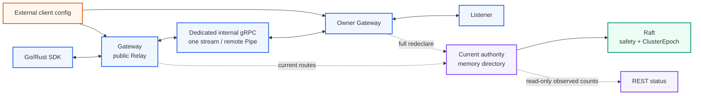
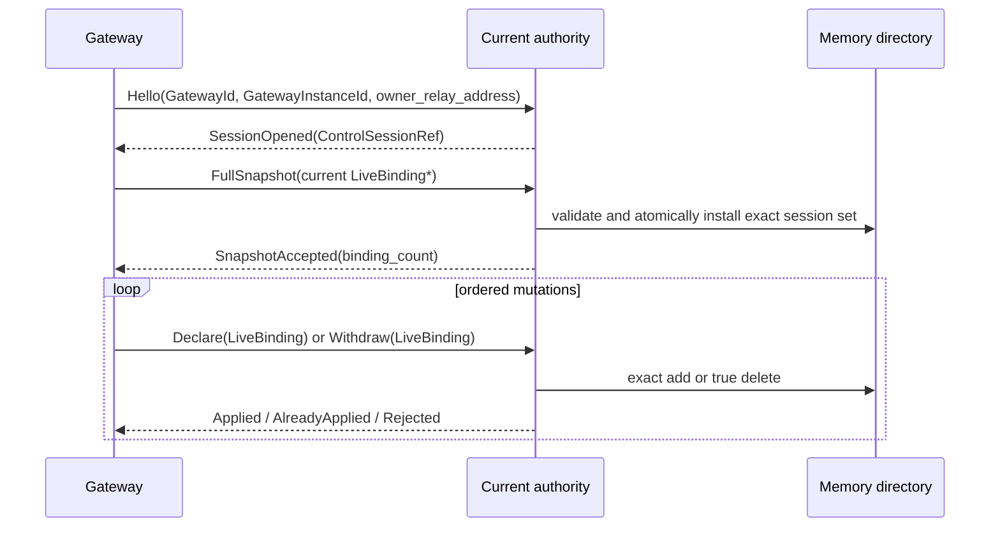
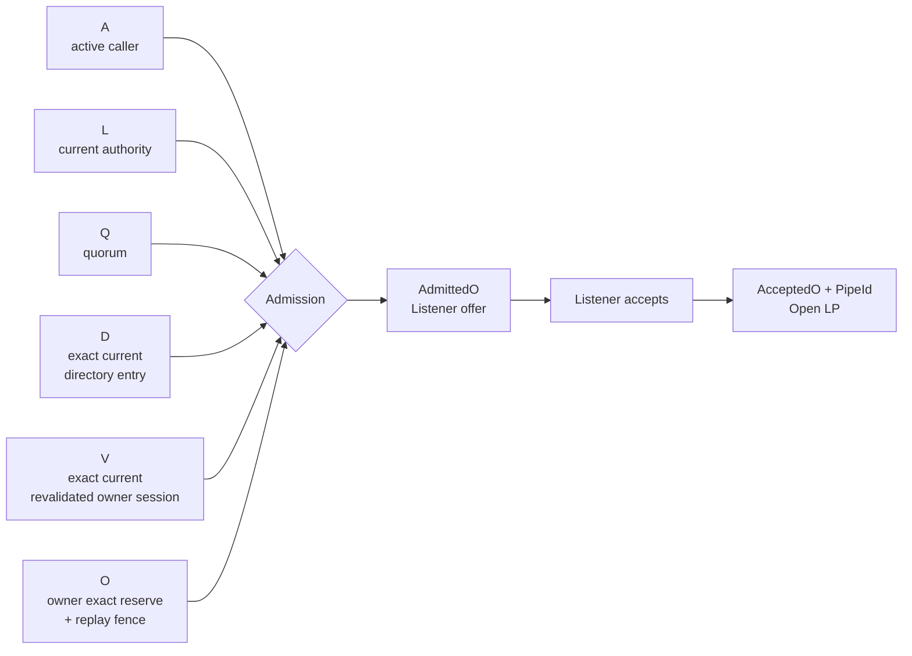
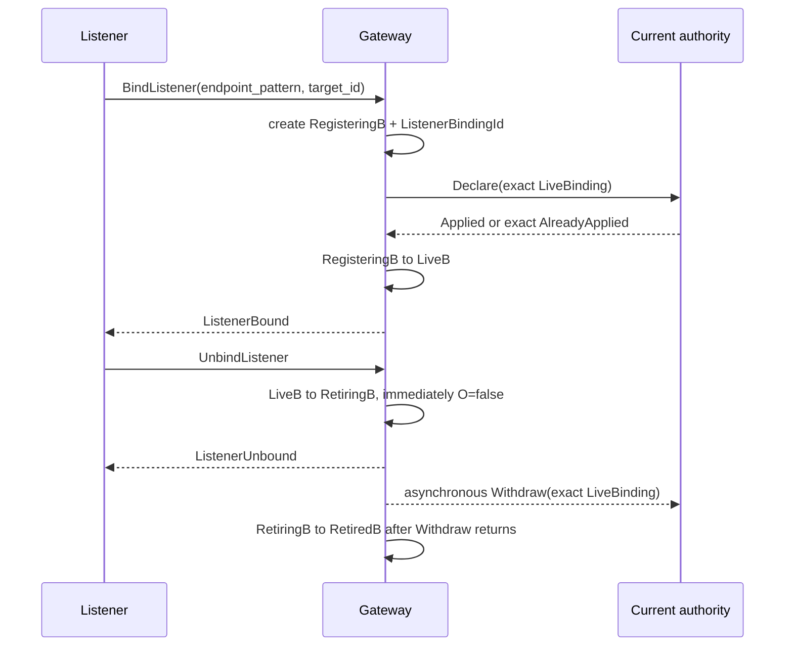
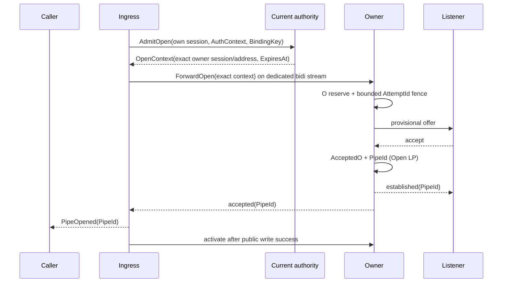

# SPEC 001: RelayGate System Model

> **Status:** Draft
>
> RelayGate의 namespace, identity, 현재 상태 경계와 Pipe 생명주기를 정의한다.

## 전체 구조


[D2 source](../diagrams/cluster-topology.d2)



RelayGate는 현재 연결 가능한 Listener를 찾아 일시적인 양방향 Pipe를 만든다. Route history, offline payload,
durable queue, retry, response replay, Pipe resume/attach와 application workflow는 소유하지 않는다.

## Namespace와 identity

```text
BindingKey         = (ClientId, EndpointPattern, TargetId)
ListenerBindingRef = (GatewayId, GatewayInstanceId, ListenerBindingId)
LiveBinding        = (BindingKey, ListenerBindingRef)

CurrentAuthority  = (ClusterEpoch, AuthorityId)
ControlSessionRef = (ClusterEpoch, AuthorityId, ControlSessionId,
                     GatewayId, GatewayInstanceId)

DirectoryEntry = (LiveBinding, ControlSessionRef, OwnerRelayAddress)
AuthContext     = (ClientId, ApiKeyId, auth_revision, ClientSessionId)
IngressRef      = (GatewayId, GatewayInstanceId, ControlSessionId)

OpenContext = (ClusterEpoch, AuthorityId, AttemptId,
               IngressRef, AuthContext,
               LiveBinding, OwnerControlSessionId,
               OwnerRelayAddress, ExpiresAt)
```

`ClientId`는 인증 성공으로 정해지는 strict namespace다. Request나 route가 다른 `ClientId`를 선택하거나
fallback할 수 없다. 같은 endpoint/target 문자열을 여러 client가 사용해도 lookup은 항상 인증된 namespace
안에서만 수행한다.

| Identity | 수명 |
| --- | --- |
| `GatewayId` | 배포 config의 stable logical identity다. |
| `GatewayInstanceId` | Process 시작 때 새로 만들고 process 종료 때 끝난다. |
| `AuthorityId` | Same `ClusterEpoch`에서 quorum-confirmed authority를 획득할 때마다 새로 만든다. |
| `ControlSessionId` | Current authority가 exact Gateway instance의 control stream을 열 때 만들고 stream/authority/instance 종료 때 끝낸다. |
| `ClientSessionId` | Public Relay 인증 성공 때 만들고 stream, credential 또는 Gateway 종료 때 끝낸다. |
| `ListenerBindingId` | 인증된 listener가 bind할 때 만들고 unbind/session/Gateway 종료 때 끝낸다. |
| `AttemptId` | Authority가 한 Open 평가에 발급하는 single-use identity다. Retry key가 아니다. |
| `PipeId` | Owner가 Listener accept를 `AcceptedO`로 기록하는 Open LP에서 만든다. |

끝난 identity는 부활하지 않는다. Reconnect, re-auth, rebind와 retry는 새 identity를 만든다. Stale control
operation은 exact `ClusterEpoch/AuthorityId/ControlSessionId/GatewayInstanceId/ListenerBindingId` 비교로 막는다.
Generation과 tombstone은 사용하지 않는다.

## Raft와 현재 authority의 경계

| 위치 | 보유 상태 | 재시작/failover 의미 |
| --- | --- | --- |
| Raft store | term/vote, log, membership, snapshot, 고정 크기 `ClusterEpoch` marker | 합의 안전과 epoch fence만 복구한다. Gateway/route record는 없다. |
| Current authority memory | `AuthorityId`, current control sessions, exact directory entry, session-scoped owner address, observed counts | Authority 종료 때 모두 폐기하고 빈 상태에서 재구축한다. |
| Gateway memory | auth/client session, Listener/binding, attempt fence, Pipe segment, inflight/buffer/payload | Process/session/hop 종료 때 소멸한다. |
| External config | `ClientId → ApiKeyId/verifier` | Process별 immutable snapshot으로 읽는다. |
| Application | retry, resume, deduplication, workflow, offline storage | RelayGate 밖의 책임이다. |

RelayGate application command와 FSM snapshot에는 `GatewayId`, `GatewayInstanceId`, `ControlSessionId`,
`BindingKey`, `ListenerBindingRef`, route, tombstone, presence 또는 payload를 넣지 않는다. Raft core
membership의 node identity/address는 별도 safety state다. Historical Raft log는 compact할 수 있고
domain-state cardinality는 route churn과 함께 증가하지 않는다.

## Control session과 현재 route 선언



1. Quorum-confirmed current authority만 `Hello`를 받는다. Follower/no-quorum endpoint는 unavailable이다.
2. `SessionOpened` 직후 session은 `Syncing`이며 route를 제공하지 않는다.
3. `FullSnapshot`은 그 Gateway process에서 지금 `LiveB`인 binding의 정확한 전체 집합이다. Authority는 전체를
   먼저 검증하고 conflict가 없을 때 session revalidation과 entry install을 하나의 effect로 적용한다.
4. Snapshot 뒤 bind/unbind는 같은 stream의 serial `Declare/Withdraw`로 반영한다.
5. 같은 current session의 exact declaration은 idempotent다. 같은 `BindingKey`의 다른 ref/session은 conflict로
   fail closed하며 기존 entry를 덮지 않는다.
6. Withdraw는 exact current entry만 삭제한다. Session 종료는 그 session의 모든 entry를 bulk delete한다.
7. Authority 변경은 모든 session/directory를 즉시 비운다. Gateway는 새 stream에서 full snapshot을 다시
   보낸다. 먼저 revalidated된 session의 exact entry는 다른 replica를 기다리지 않고 즉시 route 후보가 된다.

Control stream 순서는 `Hello → SessionOpened → FullSnapshot → BindingMutation*`다. Snapshot 전 mutation,
두 번째 Hello/Snapshot, stale session message는 stable rejection이다. ACK를 잃고 stream이 끝나면 그 session의
entry도 삭제된다. 새 session에서 과거 mutation을 replay하지 않고 현재 `LiveB` 전체만 다시 선언한다.

한 Gateway process의 Listener 정의는 최대 512개다. Identity/target은 128 bytes, endpoint pattern은 1024
bytes 이하이며 최대 snapshot도 internal gRPC envelope 안에 들어가야 한다. Capacity 부족은 새 declaration만
거부하고 기존 current entry를 evict하지 않는다.

Owner relay address는 exact current `ControlSessionRef`의 memory에만 둔다. Raft, database, snapshot, REST
directory나 user request에 넣지 않는다.

## New-Pipe admission



```text
AdmitOpen = A ∧ L ∧ Q ∧ D ∧ V ∧ O
```

| Symbol | 조건 | 평가 위치 |
| --- | --- | --- |
| `A` | 인증된 caller session과 implicit `ClientId`가 active다. | Ingress/authority |
| `L` | `(ClusterEpoch, AuthorityId)`가 confirmed current다. | Authority |
| `Q` | 새 admission을 결정할 quorum을 확인했다. | Authority |
| `D` | 같은 `ClientId`의 exact `BindingKey → ListenerBindingRef`가 current memory directory에 있다. | Authority |
| `V` | Entry의 exact owner `ControlSessionRef`가 current/revalidated이고 session address가 살아 있다. | Authority |
| `O` | Owner가 exact current AuthorityId/OwnerControlSessionId, local auth/binding, expiry와 capacity를 검사해 reservation과 `AttemptId` fence insert를 원자적으로 적용할 수 있다. | Owner Gateway |

`111111`만 `AdmittedO`와 Listener offer를 만든다. Listener accept를 Owner가 `AcceptedO`로 기록하는 순간이
Open LP이며 그때 `PipeId`를 만든다. Directory entry나 context 발급은 Pipe success가 아니다.

OpenContext는 exact `AuthorityId`와 owner `ControlSessionId`에 묶인다. Same epoch라도 둘 중 하나가 바뀌면 O
이전 context는 즉시 무효이며 새 authority의 redeclared `D/V`로 새 context를 받아야 한다. O reservation과
fence insert가 먼저 원자적으로 끝났다면 그 admitted attempt만 Listener decision과 이후 volatile Pipe
lifecycle을 계속한다. Control change만으로 O 이후 state를 소급 취소하지 않지만 participant/hop 종료는
terminal이다. Quorum 상실 뒤 새 context는 발급하지 않는다.

## Listener bind와 unbind



- `BindingKey.ClientId`는 authenticated listener session에서만 파생한다.
- Control이 disconnected면 새 Bind는 unavailable이다. `Syncing`에서 시작한 bounded current-session mutation은
  snapshot acceptance 바로 뒤에 같은 stream에서 직렬화한다. Stream이 끝나면 실패시키고 다음 session으로
  replay하지 않는다.
- `ListenerBound`는 current authority가 exact declaration을 적용한 뒤에만 반환한다.
- Unbind/session/credential/Gateway 종료는 local binding을 먼저 ineligible로 만든다.
- Withdraw ACK가 유실돼도 local state를 부활시키지 않는다. Stream 종료의 bulk delete가 authority entry를
  제거한다. Tombstone, mutation history와 cross-session mutation replay는 없다.
- `RetiringB/RetiredB`와 bounded retired-order는 local cleanup/duplicate terminal을 위한 transient state다.
  Route directory entry나 durable tombstone이 아니며 current snapshot에는 `LiveB`만 들어간다.
- Authority failover 자체는 Gateway의 살아 있는 local `LiveB`를 없애지 않는다. 새 session의 full snapshot이
  그것만 다시 선언한다.

## Open과 Cross-Gateway hop

현재 구현의 public Open은 literal endpoint와 exact target 하나를 연다. Target 생략 선택, wildcard와
`OpenAll`은 장기 모델일 수 있지만 구현 evidence 없이는 지원한다고 주장하지 않는다.



Remote attempt는 public Relay, control과 Raft transport에서 분리된 internal gRPC bidi stream 하나를 쓴다.
Accepted 뒤 같은 stream이 그 logical Pipe의 유일한 inter-Gateway hop이다. Multiplex, redial, reconnect,
same-Pipe resume/attach와 payload replay는 없다.

`ExpiresAt = authority wall clock at issue + relay.open_timeout`이며 Owner는 `now < ExpiresAt`에서만 O를
평가한다. 배포는 `ClockSkewBound < relay.open_timeout`을 입증해야 한다. Successful O의 `AttemptId` entry는
Listener reject/terminal 뒤에도 같은 Owner process에서 expiry까지 유지한다. Duplicate와 full cache는 prior
response/PipeId를 replay하지 않고 fail closed한다. O guard failure는 consume하지 않아 unexpired context의 새
evaluation은 가능하지만 끝난 stream을 resume하지 않는다.

Internal listener는 peer auth/mTLS 전까지 trusted local/dev network 전용이다. Structural context는 actual stream
peer identity proof가 아니다. 자세한 trust/replay 계약은 [ADR 008](../adr/008-cross-gateway-hop-and-replay.md)을
따르되 `BindingGeneration`은 [ADR 009](../adr/009-ephemeral-current-state-authority-directory.md)에 따라 사용하지
않는다.

## Pipe와 payload

| Phase | 의미 |
| --- | --- |
| `Opening` | Route, owner 또는 Listener 결정을 기다린다. |
| `Admitted` | O reservation/fence 뒤 Listener에게 offer했다. Pipe success가 아니다. |
| `Accepted` | Owner가 Listener accept를 기록하고 `PipeId`를 만든 Open LP다. |
| `Open` | Caller/Listener SDK가 자기 confirmation barrier를 관찰했다. |
| `Terminal` | Participant가 처음 관찰한 close/cancel/failure를 local하게 확정했다. |

- 하나의 `PipeId`는 end-to-end logical Pipe를 식별하고 각 Gateway는 자기 volatile segment만 소유한다.
- Participant마다 first local terminal이 absorbing이다. Peer 전파는 best-effort/idempotent이며 permanent partition
  아래의 global cause/order/convergence를 보장하지 않는다.
- Unbind는 새 Open만 막는다. 이미 admitted된 attempt와 열린 Pipe는 자기 terminal ordering을 따른다.
- v0은 half-close를 지원하지 않는다. EOF는 전체 local Pipe terminal이다.
- Payload는 1..60 KiB opaque frame이며 방향별 FIFO만 보존한다. Delivery success는 bounded local stream write
  완료이지 peer application ACK가 아니다.
- Queue/process capacity는 bounded다. 한계 안에서 진행할 수 없으면 silent drop 대신 Pipe terminal을 요청한다.
  Terminal/control은 막힌 payload lane을 우회한다.
- Exact participant의 duplicate `ClosePipe`는 process-local bounded terminal history에 남아 있는 동안
  idempotent하게 확인할 수 있다. Eviction 뒤 old participant와 unknown/foreign identity는 동일하게 처리한다.
  이 transient history는 route tombstone, payload replay log 또는 Pipe 복구 state가 아니다.
- `request_id`는 한 public stream의 in-flight correlation일 뿐 retry/idempotency key가 아니다.
- Open LP 통과를 배제할 수 없거나 그 뒤 response/hop을 잃으면 caller outcome은 `Unknown`이다. Application이
  새 attempt의 retry/deduplication을 소유한다.

## Presence

Cluster-wide total replica set을 RelayGate state로 두지 않는다.

| 상태 | 의미 |
| --- | --- |
| `NoAuthority` | Current authority/quorum을 확인할 수 없어 current observation을 publish할 수 없다. |
| `Current` | Confirmed authority memory에 지금 연결·재검증된 session/route 수를 반환한다. 전체 cluster completeness는 뜻하지 않는다. |

Failover 직후 `Current`가 0일 수 있다. 이는 authoritative empty deployment가 아니라 아직 아무 Gateway도
redeclare하지 않았다는 현재 관찰이다. `complete`, expected replica count와 durable presence history는 제공하지
않으며 admission에도 사용하지 않는다.

## 불변 조건

| 항상 | 하지 않음 |
| --- | --- |
| 인증된 `ClientId` namespace 안에서만 lookup한다. | Cross-client lookup/fallback을 하지 않는다. |
| New-Pipe admission은 `A ∧ L ∧ Q ∧ D ∧ V ∧ O`를 모두 요구한다. | Stale session, recovered route record 또는 replica count로 admission하지 않는다. |
| Directory는 current session의 exact live entry만 보유하고 true delete한다. | Generation, tombstone, route history를 저장하지 않는다. |
| Raft에는 safety와 `ClusterEpoch` marker만 둔다. | Gateway/binding/route/presence/payload를 Raft에 넣지 않는다. |
| Successful O의 `AttemptId` fence를 bounded하게 expiry까지 유지한다. | Duplicate response/PipeId를 replay하거나 unexpired entry를 evict하지 않는다. |
| Pipe와 payload는 volatile하고 local terminal은 absorbing이다. | Queue, retry, resume, payload replay와 global terminal consensus를 만들지 않는다. |

## 관련 결정과 계약

- [ADR 001: RelayGate의 역할과 책임 경계](../adr/001-relaygate-role-and-responsibility-boundary.md)
- [ADR 003: Machine-to-machine gRPC 인터페이스](../adr/003-machine-to-machine-grpc-interface.md)
- [ADR 006: Client 격리와 external credential](../adr/006-client-isolation-and-external-credentials.md)
- [ADR 008: Cross-Gateway hop과 bounded replay fence](../adr/008-cross-gateway-hop-and-replay.md)
- [ADR 009: 현재 상태 전용 authority directory](../adr/009-ephemeral-current-state-authority-directory.md)
- [SPEC 002: Client Configuration and Presence](002-client-configuration-and-presence.md)
- [SPEC 003: Failure and Recovery Model](003-failure-and-recovery-model.md)
- [SPEC 004: State Transition Model](004-state-transition-model.md)
- [TEST 001: Core Correctness Test Plan](../test/001-core-correctness-test-plan.md)
