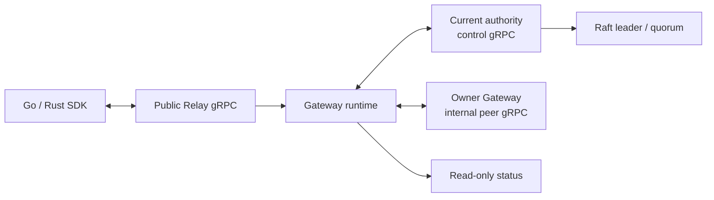
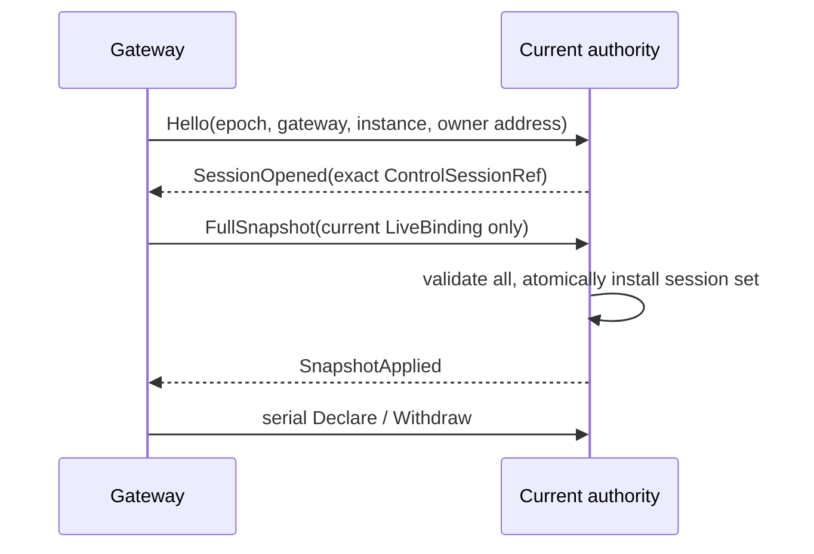

# SPEC 001: System Model

## 범위

RelayGate는 인증된 caller와 Listener 사이에 주소 가능한 일시적 양방향 Pipe를 만든다. Offline storage,
durable queue, pub/sub, retry, resume, deduplication과 workflow는 application 책임이다.



Public Relay, control, peer relay, Raft TCP와 REST는 서로 다른 protocol/trust boundary다.

## Identity와 ownership

```text
BindingKey       = (ClientId, EndpointPattern, TargetId)
ControlSession   = (ClusterEpoch, AuthorityId, ControlSessionId,
                    GatewayId, GatewayInstanceId)
ListenerBinding = (GatewayId, GatewayInstanceId, ListenerBindingId)
Pipe participant = exact ClientSessionRef
```

`ClientId`는 인증으로 정해지는 strict namespace다. v0의 Open은 literal endpoint와 required exact target만
지원한다. Wildcard, priority, target 생략 선택과 `OpenAll`은 범위 밖이다.

| Owner | 소유 상태 | 종료 시 효과 |
| --- | --- | --- |
| Raft | term/vote/log/membership/snapshot, `ClusterEpoch` | Safety/epoch만 복구 |
| Current authority | `AuthorityId`, control sessions, live directory, owner address | 전체 clear |
| Gateway | auth/session, local binding, attempt fence, Pipe segment, buffers | exact local state terminal/delete |
| External config | Client/API-key verifier | validated snapshot으로만 교체 |

Route, session, Listener, Pipe, payload와 tombstone은 Raft에 저장하지 않는다.

## Control session과 directory



- `Syncing` session은 route owner가 될 수 없다.
- Snapshot은 전체가 valid/non-conflicting/capacity 안일 때만 설치한다. Partial install은 없다.
- Same current session의 same declaration은 idempotent다. Same key의 다른 owner/ref는 conflict다.
- Withdraw는 exact current entry를 true delete한다. Session end는 그 session의 모든 entry/address를 삭제한다.
- Authority change/loss는 all sessions/directory를 삭제한다. 새 authority는 empty view에서 시작한다.
- ACK loss를 history로 복구하지 않는다. 새 session은 local current `LiveB`만 다시 선언한다.

Directory cardinality는 current live declarations에만 비례한다. 한 Gateway의 snapshot은 최대 512개이며 최대
field 크기에서도 internal gRPC 1 MiB envelope 안에 들어가야 한다.

## New-Pipe admission

```text
Admit = A ∧ L ∧ Q ∧ D ∧ V ∧ O
```

| Gate | 조건 |
| --- | --- |
| `A` | caller auth/session이 current |
| `L` | current authority가 같은 epoch의 confirmed leader |
| `Q` | quorum verification 성공 |
| `D` | exact `(ClientId, endpoint, target)` directory entry 존재 |
| `V` | entry owner의 exact control session이 current + revalidated |
| `O` | owner가 authority/session/auth/binding/expiry/capacity를 재확인하고 attempt를 원자 예약 |

`111111`만 Listener offer를 만든다. Context 발급은 reservation이나 Pipe가 아니다. O 이전에 authority 또는
owner control session이 바뀌면 context는 stale이다. O와 successful `AttemptId` fence insert는 하나의 atomic
effect다.

## Bind, Open과 Pipe

- Bind는 local `RegisteringB`를 만든 뒤 directory ACK를 받아야 `LiveB`다.
- Unbind/credential/session 종료는 먼저 local binding을 ineligible로 만들고 exact withdraw를 시도한다.
- O가 unbind보다 먼저면 그 attempt만 계속할 수 있다. Unbind가 먼저면 no offer다.
- Listener accept를 owner가 기록하고 `PipeId`를 만드는 순간이 Open 선형화점이다.
- Listener handle은 exact confirmation이 server에 적용되고 ACK된 뒤에만 노출한다.
- Caller `PipeOpened` write 뒤에만 Listener→Caller payload를 release한다.
- Open LP 전 실패가 증명되면 stable failure다. LP 통과 가능 또는 이후 response/hop loss는 `Unknown`이다.
- Remote owner는 dedicated internal bidi stream 하나를 Pipe 하나에 사용한다. Retry/redial/multiplex는 없다.

Pipe는 caller와 Listener 두 exact participant가 닫을 수 있다. 첫 local terminal이 absorbing이고 peer에는
best-effort/idempotent하게 전파한다. Permanent partition에서 global cause/order/convergence는 보장하지 않는다.

Payload는 1..60 KiB opaque frame이며 방향별 FIFO만 보장한다. `Send` 성공은 bounded queue/stream write
성공이지 peer application ACK가 아니다. Queue/backpressure 한계는 silent drop 대신 Pipe terminal을 만든다.
Control/terminal lane은 payload lane보다 우선한다. Payload replay와 delivery-position 복구는 없다.

## Presence

`/status`의 presence는 confirmed current authority가 그 순간 memory에서 관찰한
`sessions/revalidated/bindings` 수치다. Replica 전체, completeness, config convergence, history 또는 admission
성공을 뜻하지 않는다. No authority/follower/quorum uncertainty는 `503 + NoAuthority`다.

## Invariants

1. 모든 state advancement는 exact epoch/authority/session/instance/binding/participant identity를 요구한다.
2. Stale identity는 current state를 만들거나 지우지 못한다.
3. Directory에는 current entry만 있고 delete는 tombstone을 남기지 않는다.
4. New Open은 여섯 gate를 모두 요구하지만 이미 accepted된 Pipe는 향후 authority/quorum 상실만으로 닫지 않는다.
5. Runtime capacity 초과는 새 작업만 fail closed하고 existing live state를 evict하지 않는다.
6. Retry, response replay, Pipe resume/attach와 payload replay는 없다.

관련 상태와 장애 계약은 [SPEC 003](003-failure-and-recovery-model.md),
[SPEC 004](004-state-transition-model.md)를 따른다.
