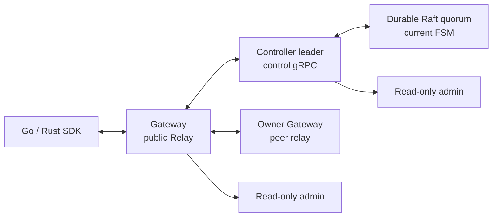
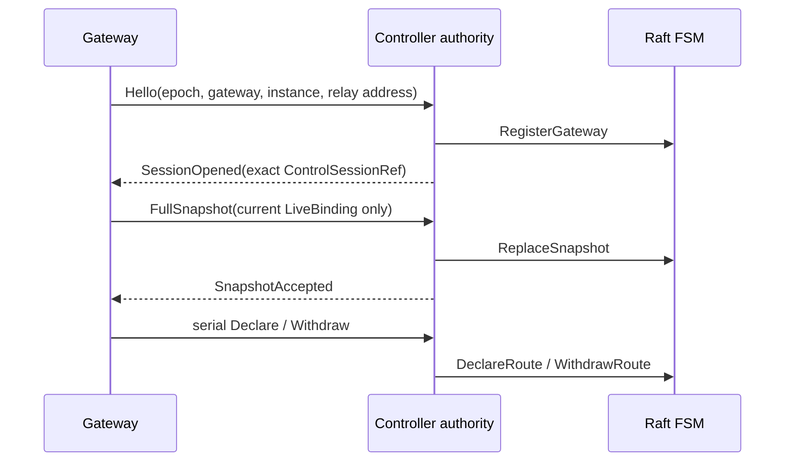

# SPEC 001: System Model

## Scope

RelayGate creates temporary bidirectional Pipes between authenticated callers and currently reachable Listeners. Offline storage, durable queueing, pub/sub, retry, resume, deduplication, and workflow are application responsibilities.



Public Relay, control, peer relay, Raft TCP, and REST are separate protocol/trust boundaries.

## Identity And Ownership

```text
BindingKey       = (ClientId, EndpointPattern, TargetId)
GatewaySession   = (GatewayId, GatewayInstanceId)
ControlSession   = (ClusterEpoch, AuthorityId, ControlSessionId,
                    GatewayId, GatewayInstanceId)
ListenerBinding = (GatewayId, GatewayInstanceId, ListenerBindingId)
Pipe participant = exact ClientSessionRef
```

`ClientId` is determined by authentication and is a strict namespace. v0 Open uses literal endpoint plus required exact target. Wildcard, priority, target omission, and `OpenAll` are outside scope.

| Owner | State | Persistence |
| --- | --- | --- |
| Controller Raft | term, vote, log, membership, stable state, snapshots, `NodeId` | durable `raft.data_dir` |
| Controller FSM | `ClusterEpoch`, current `GatewaySession`, exact current routes | durable Raft log/snapshot |
| Current authority | `AuthorityId`, control sessions, revalidated mirror, owner relay addresses | leader-local memory |
| Gateway | auth/session, local bindings, attempt fence, Pipe segments, buffers, payload | process memory |
| External config | Client/API-key verifier | external YAML |

The FSM stores only current Gateway sessions and exact routes. Absence means deletion. It stores no control session ID, owner relay address, route tombstone, history, credential, Pipe, payload, replay, or resume state.

## Runtime Roles

| Role | Local owner | Not present |
| --- | --- | --- |
| `controller` | Raft voter/store, current FSM, authority/control server, admin | Public Relay, peer Relay, SDK sessions |
| `gateway` | control client, public/peer Relay, auth/session/binding/Pipe runtime, admin | Raft node/store, authority, control listener |

Role is fixed at process start. Gateway readiness requires a current control connection. Controller `/healthz/ready` is member readiness: the local FSM has an initialized `ClusterEpoch` and the member can see a Raft leader, so healthy followers are ready. Authority-only observation remains `/status`; followers and quorum loss return `503/NoAuthority` there.

## Controller Cohort Lifecycle

Initial bootstrap is external and one-shot for empty controller stores. After bootstrap, Raft's committed membership is authoritative.

Normal lifecycle:

1. Controllers persist Raft identity, log, stable state, membership, and snapshots in durable volumes.
2. Same-store restart reopens the existing `NodeId` and state without bootstrap.
3. Same-epoch leader failover creates a new authority and clears leader-local `V` state.
4. Gateways reconnect and send full current binding snapshots to rebuild `V`.
5. Lost controller storage is replaced with a new `NodeId` through leader-only add/catch-up/remove while surviving quorum is available. The mutation surface is a permission-restricted local Unix socket keyed by the live controller data directory; Admin REST remains read-only.
6. Quorum loss fails closed for new authority/control/admission.

Disaster reset is not recovery of the old Raft machine. Operators must fence old controller/control/gateway paths, choose a new epoch/cohort, and bootstrap from empty current application state. `bootstrap=true` must not be used as member replacement.

Production controllers use durable PVCs or equivalent persistent volumes. Compose uses named controller volumes. `emptyDir` is disposable dev storage only.

## Control Session And Directory



- `C` is committed current FSM state: current Gateway sessions and exact routes.
- `V` is leader-local verified state: current control session, full snapshot accepted, and owner relay address.
- A route is eligible only when exact `C` and exact `V` both exist.
- `Syncing` sessions are not eligible.
- Full snapshot install is atomic. Invalid, conflicting, or over-capacity snapshots install nothing.
- Same session and same declaration are idempotent.
- Different owner/ref for the same route key is a conflict.
- Withdraw deletes the exact current route.
- Gateway replacement deletes the previous instance's owned routes before the new full snapshot is installed.
- Gateway removal cascades deletion of all exact owned routes.
- Authority change resets `V`, not durable `C`; reconnect/full-snapshot rebuilds eligibility.

## New-Pipe Admission

```text
Admit = A ∧ L ∧ Q ∧ D ∧ V ∧ O
```

| Gate | Condition |
| --- | --- |
| `A` | caller auth/session is current |
| `L` | current authority is confirmed leader for the epoch |
| `Q` | quorum verification and read barrier succeed |
| `D` | exact `(ClientId, endpoint, target)` route exists in committed current FSM |
| `V` | exact owner control session is current, revalidated, and has a relay address |
| `O` | owner rechecks authority/session/auth/binding/expiry/capacity and reserves the attempt |

Only `111111` creates a Listener offer. Context issuance is not a reservation or Pipe. O and successful `AttemptId` fence insertion are one atomic owner effect.

## Bind, Open, Pipe, SDK

- Bind creates a local pending binding and becomes live only after controller ACK.
- Unbind/revocation/session end first makes the local binding ineligible, then attempts exact withdraw.
- Listener accept is the Open linearization point and mints `PipeId`.
- Post-linearization response or hop loss can produce caller `Unknown`.
- Remote owner uses one dedicated internal bidirectional stream per Pipe; no redial, retry, multiplexed resume, or payload replay.
- Payload is opaque, bounded, per-direction FIFO. `Send` success is not peer application ACK.
- A multiplexed public Relay stream has separate bounded control/terminal and payload lanes; ready control/terminal work bypasses queued payload pressure.
- A one-stream-per-Pipe peer hop serializes sends through one bounded lane. Send timeout or cancellation terminalizes the Pipe and cancels the stream; no priority bypass inside a blocked gRPC write, silent drop, retry, or replay is provided.
- `ManagedClient` reconnects only sessions and current Listener declarations. It rejects Open while not ready and never replays Open/Pipe/payload state.

## Presence

`/status` is observation only. Controller status reports `committed_gateways` and `committed_routes` from committed `C`, plus `revalidated_gateways` from `V` and `eligible_routes` where exact `C` and `V` agree. Gateway status may expose control-client readiness. These are current observed counters, not completeness, revocation proof, or admission success. A follower or quorum uncertainty is fail-closed for authority observation and admission, while a healthy follower may still be member-ready at `/healthz/ready`.

## Invariants

1. Every state advance requires exact epoch/session/instance/binding/participant identity.
2. Stale identity cannot create or delete current state.
3. Durable FSM state is current-only; delete leaves no tombstone/history.
4. New Open requires all six gates; accepted Pipes are not terminated solely because future authority/quorum admission fails.
5. Capacity excess rejects new work and does not evict existing live state.
6. Session reconnect can fresh-bind current Listeners only. Open retry, response replay, Pipe resume/attach, and payload replay do not exist.
