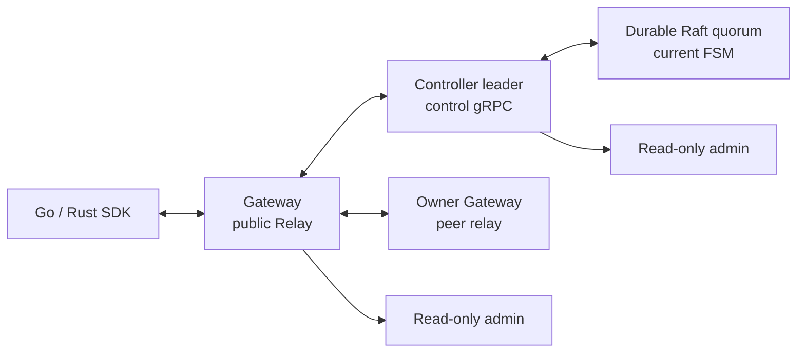
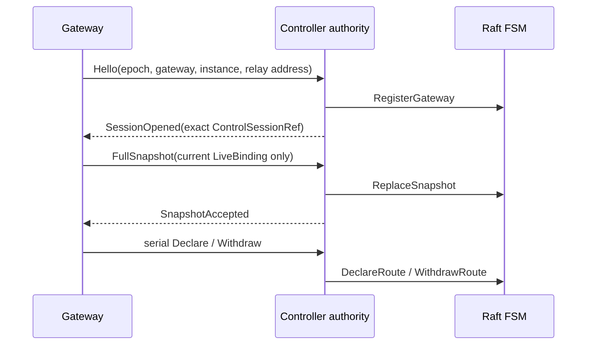

# SPEC 001: System model

## 범위

RelayGate는 인증된 caller와 현재 연결 가능한 Listener 사이에 temporary bidirectional Pipe를 만든다. Offline storage, durable queueing, pub/sub, retry, resume, deduplication, workflow는 application 책임이다.



Public Relay, control, peer relay, Raft TCP, REST는 서로 분리된 protocol/trust boundary다.

## Identity와 ownership

```text
BindingKey       = (ClientId, EndpointPattern, TargetId)
GatewaySession   = (GatewayId, GatewayInstanceId)
ControlSession   = (ClusterEpoch, AuthorityId, ControlSessionId,
                    GatewayId, GatewayInstanceId)
ListenerBinding = (GatewayId, GatewayInstanceId, ListenerBindingId)
Pipe participant = exact ClientSessionRef
```

`ClientId`는 인증으로 결정되는 strict namespace다. v0 Open은 literal endpoint와 필수 exact target을 사용한다. Wildcard, priority, target 생략, `OpenAll`은 범위 밖이다.

| 소유자 | 상태 | 영속성 |
| --- | --- | --- |
| Controller Raft | term, vote, log, membership, stable state, snapshot, `NodeId` | durable `raft.data_dir` |
| Controller FSM | `ClusterEpoch`, current `GatewaySession`, exact current route | durable Raft log/snapshot |
| Current authority | `AuthorityId`, control session, revalidated mirror, owner relay address | leader-local memory |
| Gateway | auth/session, local binding, attempt fence, Pipe segment, buffer, payload | process memory |
| External config | Client/API-key verifier | external YAML |

FSM은 current Gateway session과 exact route만 저장한다. 부재가 삭제를 뜻하며 control session ID, owner relay address, route tombstone/history, credential, Pipe, payload, replay, resume state는 저장하지 않는다.

## Runtime role

| Role | Local owner | 존재하지 않는 것 |
| --- | --- | --- |
| `controller` | Raft voter/store, current FSM, authority/control server, admin | Public Relay, peer Relay, SDK session |
| `gateway` | control client, public/peer Relay, auth/session/binding/Pipe runtime, admin | Raft node/store, authority, control listener |

Role은 process startup 때 고정된다. Gateway readiness는 current control connection을 요구한다. Controller `/healthz/ready`는 member readiness다. Local FSM에 `ClusterEpoch`가 초기화되고 Raft leader가 보이면 healthy follower도 ready다. Authority 전용 관찰은 `/status`이며 follower나 quorum loss에서는 `503/NoAuthority`를 반환한다.

## Controller cohort lifecycle

Initial bootstrap은 empty Controller store를 위한 외부 one-shot이다. 이후에는 committed Raft membership이 authoritative하다.

1. Controller는 Raft identity, log, stable state, membership, snapshot을 durable volume에 저장한다.
2. Same-store restart는 bootstrap 없이 기존 `NodeId`와 state를 다시 연다.
3. Same-epoch leader failover는 새 authority를 만들고 leader-local `V`를 초기화한다.
4. Gateway가 reconnect하고 full current binding snapshot으로 `V`를 재구축한다.
5. Controller storage 유실은 surviving quorum에서 새 `NodeId`를 leader-only add/catch-up/remove하여 교체한다. Mutation surface는 live Controller data directory의 permission-restricted Unix socket이며 Admin REST는 read-only다.
6. Quorum loss에서는 새 authority/control/admission을 fail closed한다.

Disaster reset은 기존 Raft machine의 recovery가 아니다. Operator는 과거 controller/control/gateway path를 fence하고 새 epoch/cohort를 빈 current application state에서 bootstrap해야 한다. `bootstrap=true`를 member replacement로 사용하면 안 된다.

Production Controller는 durable PVC 또는 동등한 persistent volume을 사용한다. Compose는 named Controller volume을 사용하고 `emptyDir`은 disposable dev storage만 허용한다.

## Control session과 directory



- `C`는 current Gateway session과 exact route로 구성된 committed current FSM state다.
- `V`는 current control session, accepted full snapshot, owner relay address로 구성된 leader-local verified state다.
- Exact `C`와 exact `V`가 모두 존재해야 route가 eligible하다.
- `Syncing` session은 eligible하지 않다.
- Full snapshot install은 atomic하다. Invalid/conflicting/over-capacity snapshot은 아무것도 설치하지 않는다.
- 동일 session의 동일 declaration은 idempotent하다.
- 동일 route key의 다른 owner/ref는 conflict다.
- Withdraw는 exact current route를 삭제한다.
- Gateway replacement는 새 full snapshot 전에 이전 instance 소유 route를 삭제한다.
- Gateway removal은 exact owned route를 cascade delete한다.
- Authority change는 durable `C`가 아니라 `V`를 초기화한다. Reconnect/full snapshot이 eligibility를 복구한다.

## New-Pipe admission

```text
Admit = A ∧ L ∧ Q ∧ C ∧ V ∧ O
```

| Gate | 조건 |
| --- | --- |
| `A` | caller auth/session이 current |
| `L` | current authority가 epoch의 confirmed leader |
| `Q` | quorum verification과 read barrier 성공 |
| `C` | committed current FSM에 exact `(ClientId, endpoint, target)` route 존재 |
| `V` | exact owner control session이 current/revalidated이고 relay address 보유 |
| `O` | owner가 authority/session/auth/binding/expiry/capacity를 재검사하고 attempt reserve |

`111111`만 Listener offer를 만든다. Context issuance는 reservation이나 Pipe가 아니다. O와 성공한 `AttemptId` fence insertion은 하나의 atomic owner effect다.

## Bind, Open, Pipe, SDK

- Bind는 local pending binding을 만들고 Controller ACK 뒤에만 live가 된다.
- Unbind/revocation/session end는 먼저 local binding을 ineligible하게 만들고 exact withdraw를 시도한다.
- Bind/Unbind의 validation, capacity, conflict, control-unavailable은 operation-local response다. Valid Relay session을 종료하지 않는다.
- Authentication/session end, malformed protocol state, stream transport failure는 session-fatal gRPC error다.
- Listener accept가 Open linearization point이며 `PipeId`를 만든다.
- Linearization 뒤 response/hop loss는 caller `Unknown`이 될 수 있다.
- Ingress는 exact owner Gateway identity/address마다 shared gRPC/HTTP2 connection 하나를 유지한다. Remote Pipe마다 이 connection 위에 독립 bidirectional stream 하나를 연다.
- Owner identity/address 변경은 새 connection으로 교체한다. 이전 connection은 기존 Pipe stream이 모두 끝난 뒤 닫는다.
- Idle shared connection은 최대 64개 또는 `max_pipes` 중 작은 값으로 제한하며 LRU eviction한다. 따라서 과거 Gateway ID churn으로 socket이 무한히 쌓이지 않는다.
- Peer stream 하나의 timeout/cancel은 그 Pipe만 terminalize하고 shared connection과 sibling stream은 유지한다. Connection-level failure는 해당 connection의 stream 모두를 끝낸다.
- Payload는 opaque, bounded, per-direction FIFO이며 exact `PayloadId`를 가진다. `Send`는 peer SDK bounded receive queue admission과 exact receipt 반환 뒤에만 성공한다. Peer application processing이나 durable commit은 아니다. Pre-handoff failure=`NotSent`, exact refusal=`Rejected`, post-handoff receipt loss=`Unknown`이다.
- Multiplexed public Relay stream은 control/terminal과 payload에 별도 bounded lane을 사용한다.
- Pipe별 peer stream은 bounded lane 하나에서 send를 직렬화한다. Send timeout/cancel은 Pipe와 stream을 종료하며 blocked gRPC write를 priority bypass하거나 silent drop/retry/replay하지 않는다.
- `ManagedClient`는 session과 current Listener declaration만 reconnect한다. Not-ready 상태의 Open을 거부하고 Open/Pipe/payload state를 replay하지 않는다.

## Presence

`/status`는 observation only다. Controller는 committed `C`의 `committed_gateways`, `committed_routes`, `V`의 `revalidated_gateways`, exact `C/V`가 일치하는 `eligible_routes`를 분리해 보고한다. Gateway status는 control-client readiness를 노출할 수 있다. 이 값은 current observed counter일 뿐 completeness, revocation proof, admission success가 아니다. Follower/quorum uncertainty는 authority observation/admission에 fail closed하지만 healthy follower는 `/healthz/ready`에서 member-ready일 수 있다.

## 불변식

1. 모든 state advance는 exact epoch/session/instance/binding/participant identity를 요구한다.
2. Stale identity는 current state를 생성하거나 삭제할 수 없다.
3. Durable FSM은 current-only이며 delete는 tombstone/history를 남기지 않는다.
4. New Open은 여섯 gate를 모두 요구한다. 이후 authority/quorum admission 실패만으로 accepted Pipe를 종료하지 않는다.
5. Capacity 초과는 새 work를 거부하며 existing live state를 축출하지 않는다.
6. Session reconnect는 current Listener만 fresh Bind한다. Open retry, response replay, Pipe resume/attach, payload replay는 없다.
7. Payload receipt state는 Pipe-local bounded memory이며 Controller Raft에 들어가지 않고 unobserved receipt를 stable success/failure로 바꾸지 않는다.
