# SPEC 001: 시스템 모델

## 범위

RelayGate는 인증된 호출자와 현재 연결 가능한 Listener 사이에 임시 양방향 Pipe를 만든다. 오프라인 저장소, 영속 대기열, 발행·구독, 재시도, 재개, 중복 제거, 작업 흐름은 애플리케이션 책임이다.

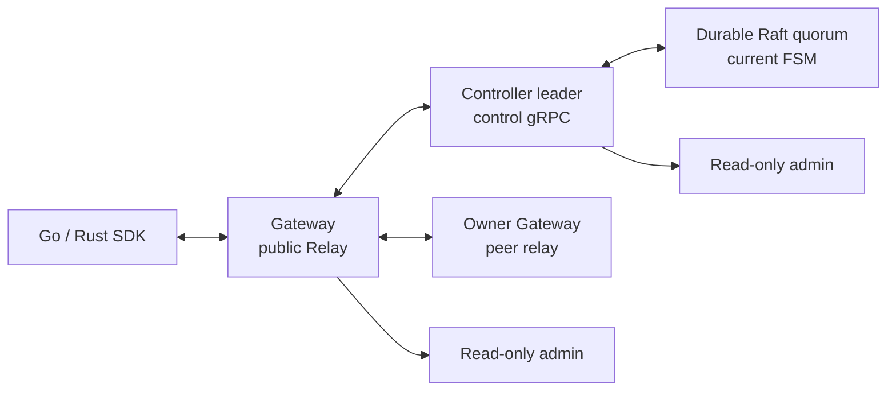

공개 Relay, 제어, Peer Relay, Raft TCP, REST는 서로 분리된 프로토콜·신뢰 경계다.

## 계층 구조

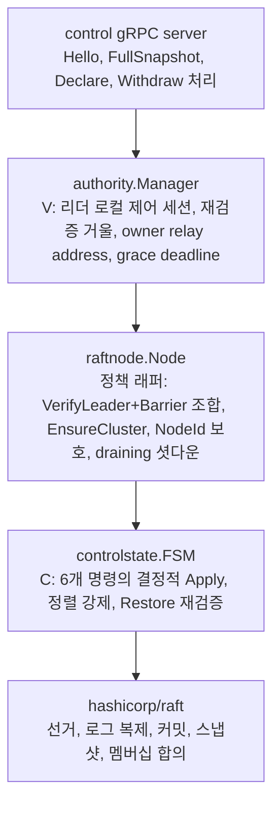

각 계층은 정확히 한 가지를 책임진다.

- control gRPC server: Gateway와의 제어 세션 프로토콜을 받고 authority.Manager에 위임한다.
- authority.Manager (`V`): 리더 로컬 제어 세션, 재검증 거울, owner relay address, grace deadline을 보유하고 fencing을 실행한다.
- raftnode.Node: `VerifyLeader + Barrier` 조합, 부트스트랩, 노드 신원 보호, draining 셧다운 정책을 제공하는 hashicorp/raft 위의 정책 래퍼다.
- controlstate.FSM (`C`): 6개 명령의 의미를 정의하고 결정적으로 적용하며, snapshot Restore 시 전량 재검증한다.
- hashicorp/raft: 합의 프로토콜 원본 구현이다.

라이브러리가 보장하는 것과 우리가 구현한 것은 명확히 나뉜다.

| 항목 | hashicorp/raft가 보장 | RelayGate가 구현 |
| --- | --- | --- |
| 합의 안전성 | term당 리더 최대 1, 로그 매칭, 리더 완결성, 적용 순서, 커밋 = 과반 영속 | — |
| 멤버십 | 한 번에 하나씩 변경 합의 | 마지막 voter 제거 거부, voter 상한 7, Unix socket 접근 제한 |
| 스냅샷 | 트리거·전송·로그 compaction | `state.bin` 형식, Restore 시 정렬·중복·capacity·owner 존재 전량 재검증 |
| FSM 의미 | — | `Apply`/`Snapshot`/`Restore`의 명령 검증, capacity, cascade delete |
| 결정성 | — | `stateLocked()`의 정렬 강제, map 순회 순서 비의존 |
| 읽기 일관성 | — | `VerifyLeader + Barrier` 조합, `AdmitOpen`에서만 사용 |
| 노드 신원 | — | `ensureNodeIdentity`, stable store의 `relaygate/node-id/v1`, 불일치 시 기동 거부 |
| 부트스트랩 | 초기 멤버십 커밋 | `EnsureCluster`, `config.Bootstrap && !existing` 한정, 기존 값 4개 전부 일치 검사 |

## 식별자와 소유권

```text
BindingKey       = (ClientId, EndpointPattern, TargetId)
GatewaySession   = (GatewayId, GatewayInstanceId)
ControlSession   = (ClusterEpoch, AuthorityId, ControlSessionId,
                    GatewayId, GatewayInstanceId)
ListenerBinding = (GatewayId, GatewayInstanceId, ListenerBindingId)
Pipe participant = exact ClientSessionRef
```

`ClientId`는 인증으로 결정되는 엄격한 이름 공간이다. v0 Open은 문자 그대로 일치하는 endpoint와 필수 exact target을 사용한다. 와일드카드, 우선순위, target 생략, `OpenAll`은 범위 밖이다.

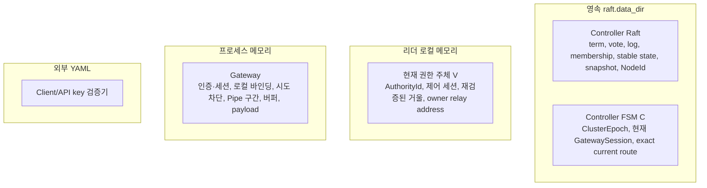

| 소유자 | 상태 | 영속성 |
| --- | --- | --- |
| Controller Raft | term, vote, log, membership, stable state, snapshot, `NodeId` | 영속 `raft.data_dir` |
| Controller FSM | `ClusterEpoch`, 현재 `GatewaySession`, exact current route | 영속 Raft log/snapshot |
| 현재 권한 주체 | `AuthorityId`, 제어 세션, 재검증된 거울, owner relay address | 리더 로컬 메모리 |
| Gateway | 인증·세션, 로컬 바인딩, 시도 차단, Pipe 구간, 버퍼, payload | 프로세스 메모리 |
| 외부 설정 | Client/API key 검증기 | 외부 YAML |

FSM은 현재 Gateway 세션과 exact route만 저장한다. 부재가 삭제를 뜻하며 제어 세션 ID, owner relay address, route tombstone·이력, 인증 정보, Pipe, payload, 재생, 재개 상태는 저장하지 않는다.

## C와 V를 나누는 이유

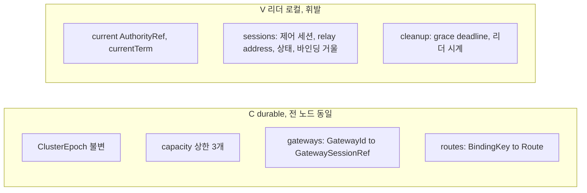

`C`는 durable하고 모든 노드가 동일하게 갖는다. `V`는 현재 리더의 로컬 메모리이며 리더가 바뀌면 초기화된다.

두 상태 기계가 갈라져 있는 이유는 비용이다. "이 Gateway가 지금 살아있는가"를 `C`에 넣으면 하트비트마다 Raft 합의가 필요해 비용이 폭발한다. durable한 사실(`C`)과 현재 순간의 생존(`V`)은 성질이 다른 정보이므로 다른 상태 기계에 둔다.

- `C`에는 시각이 없다. Gateway 등록·route 선언·해제는 모두 명령이며 타임스탬프를 갖지 않는다.
- `V`의 grace deadline은 리더 시계 기준이다. 리더가 바뀌면 새 리더가 자신의 시계로 deadline을 다시 부여한다.
- `V.sessions[...].bindings`는 리더 로컬 바인딩 거울이며 현재 구현에 존재한다.

## 실행 역할

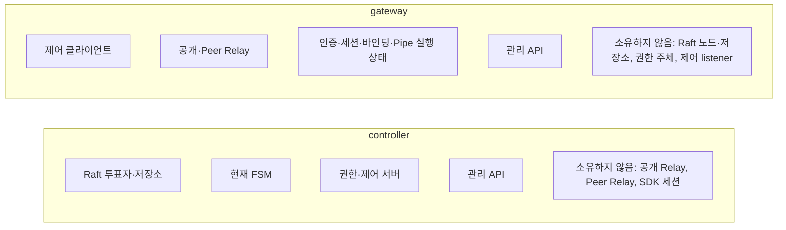

| 역할 | 로컬 소유 항목 | 소유하지 않는 항목 |
| --- | --- | --- |
| `controller` | Raft 투표자·저장소, 현재 FSM, 권한·제어 서버, 관리 API | 공개 Relay, Peer Relay, SDK 세션 |
| `gateway` | 제어 클라이언트, 공개·Peer Relay, 인증·세션·바인딩·Pipe 실행 상태, 관리 API | Raft 노드·저장소, 권한 주체, 제어 listener |

역할은 프로세스 시작 때 고정된다. Gateway 준비 상태는 현재 제어 연결을 요구한다. Controller `/healthz/ready`는 구성원 준비 상태다. 로컬 FSM에 `ClusterEpoch`가 초기화되고 Raft leader가 보이면 정상 follower도 준비 상태다. 권한 주체 전용 관찰은 `/status`이며 follower나 quorum 상실에서는 `503/NoAuthority`를 반환한다.

## Controller 집합 수명주기

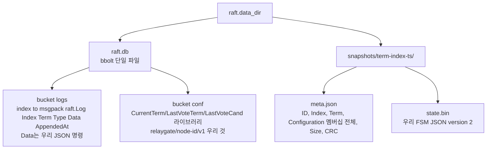

최초 bootstrap은 비어 있는 Controller 저장소를 위한 외부 일회성 작업이다. 이후에는 합의된 Raft 구성원이 기준 상태다.

1. Controller는 Raft 식별자, log, stable state, 구성원, snapshot을 `raft.data_dir` 아래 `raft.db`(bbolt, `logs`/`conf` 버킷)와 `snapshots/<term>-<index>-<ts>/`(`meta.json` + `state.bin`)에 영속한다.
2. 같은 저장소를 사용한 재시작은 bootstrap 없이 기존 `NodeId`와 상태를 다시 연다.
3. 같은 epoch의 leader 장애 전환은 새 권한 주체를 만들고 리더 로컬 `V`를 초기화한다.
4. Gateway가 다시 연결하고 현재 바인딩 전체 snapshot으로 `V`를 재구축한다.
5. Controller 저장소 유실은 살아 있는 quorum에서 새 `NodeId`를 leader 전용 add/catch-up/remove 절차로 교체한다. 변경 인터페이스는 실행 중인 Controller data directory의 권한 제한 Unix socket이며 관리 REST는 읽기 전용이다.
6. Quorum 상실에서는 새 권한·제어·허용 판정을 닫힌 실패로 처리한다.

재해 초기화는 기존 Raft 상태 기계의 복구가 아니다. 운영자는 이전 Controller·제어·Gateway 경로를 차단하고 새 epoch와 집합을 빈 현재 애플리케이션 상태에서 bootstrap해야 한다. `bootstrap=true`를 구성원 교체에 사용하면 안 된다.

운영 Controller는 영속 PVC 또는 동등한 영속 볼륨을 사용한다. Compose는 이름 있는 Controller 볼륨을 사용하고 `emptyDir`은 폐기 가능한 개발용 저장소로만 허용한다.

Raft snapshot이 로그를 compaction해도 `raft.db` 파일 크기는 즉시 줄지 않는다. bbolt는 해제된 페이지를 free list에 넣고 재사용하므로 파일 크기는 high-water mark로 남는다. 볼륨 사용량은 현재 FSM 카디널리티와 별개로 관측해야 한다.

## 제어 세션과 경로 목록

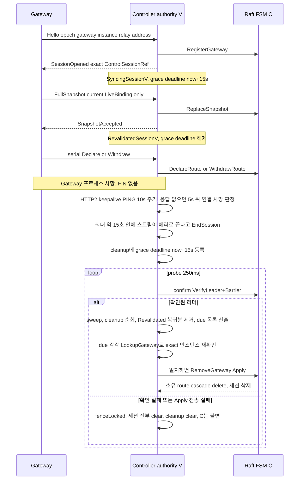

- `C`는 현재 Gateway 세션과 exact route로 구성된 합의 완료 FSM 상태다.
- `V`는 현재 제어 세션, 수락된 전체 snapshot, owner relay address로 구성된 리더 로컬 검증 상태다.
- Exact `C`와 exact `V`가 모두 존재해야 route를 사용할 수 있다.
- `SyncingSessionV` 세션은 사용할 수 없다.
- 전체 snapshot 설치는 원자적이다. 유효하지 않거나 충돌하거나 용량을 넘는 snapshot은 아무것도 설치하지 않는다.
- 동일 세션의 동일 선언은 멱등이다.
- 동일 route key의 다른 owner/ref는 충돌이다.
- Withdraw는 exact current route를 삭제한다.
- Gateway 교체는 새 전체 snapshot 전에 이전 instance 소유 route를 삭제한다.
- Gateway 제거는 해당 Gateway가 소유한 exact route를 연쇄 삭제한다.
- 권한 주체 변경은 영속 `C`가 아니라 `V`를 초기화한다. 재연결과 전체 snapshot이 사용 가능 상태를 복구한다.

### Grace deadline

`GatewayRevalidationTimeout` 기본값은 15초, `AuthorityProbeInterval` 기본값은 250ms다. deadline은 세 지점에서 등록된다.

1. 새 authority 확립 시 committed `C`의 모든 Gateway에 `now + 15s`를 일괄 부여한다.
2. `OpenSession` 성공 시 `SyncingSessionV` 상태에서도 deadline이 걸린다. 등록은 `C`만 확립할 뿐이므로 전체 snapshot이 커밋되기 전까지는 부재 Gateway처럼 만료될 수 있어야 한다.
3. `EndSession` 시 `now + 15s`가 걸린다.

deadline은 `Revalidate` 성공 시, sweep에서 해당 Gateway가 `RevalidatedSessionV`로 복귀해 있음을 확인했을 때, `fenceLocked()`의 전체 clear에서 해제된다.

### Fencing

`fenceLocked()`는 세션 전부를 close+clear하고 cleanup을 clear하며 `current`를 nil로 만든다. `C`는 절대 건드리지 않는다.

| 트리거 | 비고 |
| --- | --- |
| `Status.Role != Leader` | confirm 진입 시 |
| `ClusterEpoch` 불일치 | confirm 진입 시 |
| `VerifyLeader` 실패 | 호출자 취소면 해당 call만 실패 |
| `VerifyLeader` 후 재확인 실패 | 확인 사이 강등 방어 |
| `term != currentTerm` | 같은 노드가 재선출된 경우 |
| Apply 전송 실패, 모든 쓰기 | 커밋 여부를 알 수 없으므로 낙관하지 않는다 |
| probe 컨텍스트 에러 | 배경 루프의 타임아웃은 진짜 문제로 취급한다 |

Apply 실패는 커밋 여부를 알 수 없다. 호출자는 timeout이 election과 겹쳤는지 구분할 수 없으므로 매 proposal 전송 실패마다 `V`를 fence하고 Gateway가 새로 barrier-confirm된 authority에 재연결하게 한다. `C`는 Raft 안에서 그대로 유지된다. sweep의 `RemoveGateway` Apply도 동일한 규칙을 따른다.

## 새 Pipe 허용 판정

```text
Admit = A ∧ L ∧ Q ∧ C ∧ V ∧ O
```

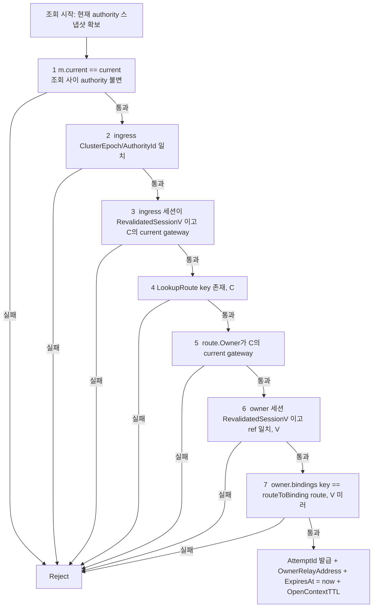

| 판정 조건 | 충족 조건 |
| --- | --- |
| `A` | caller auth/session이 current |
| `L` | current authority가 epoch의 confirmed leader |
| `Q` | quorum verification과 read barrier 성공 |
| `C` | committed current FSM에 exact `(ClientId, endpoint, target)` route 존재 |
| `V` | exact owner control session이 current/revalidated이고 relay address 보유 |
| `O` | owner가 authority/session/auth/binding/expiry/capacity를 재검사하고 attempt reserve |

위 7단계 중 1·2가 `L`/`Q`, 3이 `A`, 4·5가 `C`, 6·7이 `V`에 대응한다. 여섯 조건이 모두 참인 `111111`만 Listener offer를 만든다. Context issuance는 reservation이나 Pipe가 아니다. `O`와 성공한 `AttemptId` fence insertion은 하나의 atomic owner effect다.

## Bind, Open, Pipe, SDK

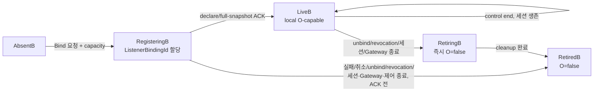

- Bind는 local pending binding을 만들고 Controller ACK 뒤에만 live가 된다.
- Unbind/revocation/session end는 먼저 local binding을 ineligible하게 만들고 exact withdraw를 시도한다.
- Bind/Unbind의 validation, capacity, conflict, control-unavailable은 operation-local response다. Valid Relay session을 종료하지 않는다.
- 인증·세션 종료, 잘못된 프로토콜 상태, stream 전송 실패는 세션을 종료하는 gRPC 오류다.
- Listener 수락이 Open 선형화 지점이며 `PipeId`를 만든다.
- 선형화 뒤 응답·구간 손실은 호출자에게 `Unknown`이 될 수 있다.
- 진입 Gateway는 exact 소유 Gateway 식별자·주소마다 공유 gRPC/HTTP2 연결 하나를 유지한다. 원격 Pipe마다 이 연결 위에 독립 양방향 stream 하나를 연다.
- 소유자 식별자·주소 변경은 새 연결로 교체한다. 이전 연결은 기존 Pipe stream이 모두 끝난 뒤 닫는다.
- 유휴 공유 연결은 최대 64개 또는 `max_pipes` 중 작은 값으로 제한하며 LRU로 제거한다. 따라서 과거 Gateway ID 변동으로 socket이 무한히 쌓이지 않는다.
- Peer stream 하나의 제한 시간 초과·취소는 그 Pipe만 종료하고 공유 연결과 다른 stream은 유지한다. 연결 수준 실패는 해당 연결의 stream 모두를 끝낸다.
- Payload는 opaque, bounded, per-direction FIFO이며 exact `PayloadId`를 가진다. `Send`는 peer SDK bounded receive queue admission과 exact receipt 반환 뒤에만 성공한다. Peer application processing이나 durable commit은 아니다. Pre-handoff failure=`NotSent`, exact refusal=`Rejected`, post-handoff receipt loss=`Unknown`이다.
- 다중화된 공개 Relay stream은 제어·종료와 payload에 별도 상한 대기열을 사용한다.
- Pipe별 Peer stream은 상한 대기열 하나에서 전송을 직렬화한다. 전송 제한 시간 초과·취소는 Pipe와 stream을 종료하며 막힌 gRPC 쓰기를 우선순위로 우회하거나 조용히 버리거나 재시도·재생하지 않는다.
- `ManagedClient`는 세션과 현재 Listener 선언만 재연결한다. 준비되지 않은 상태의 Open을 거부하고 Open·Pipe·payload 상태를 재생하지 않는다.

## 상태 관찰

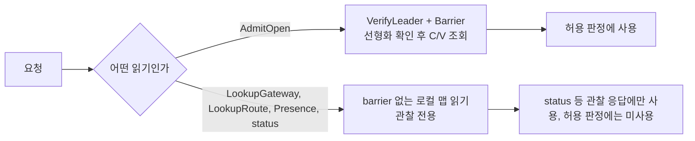

`/status`는 관찰 전용이다. Controller는 합의된 `C`의 `committed_gateways`, `committed_routes`, `V`의 `revalidated_gateways`, exact `C/V`가 일치하는 `eligible_routes`를 분리해 보고한다. Gateway 상태는 제어 클라이언트 준비 상태를 노출할 수 있다. 이 값은 현재 관찰 개수일 뿐 완전성, 폐기 증명, 허용 성공을 뜻하지 않는다. Follower나 quorum 불확실성은 권한 관찰·허용 판정을 닫힌 실패로 처리하지만 정상 follower는 `/healthz/ready`에서 구성원 준비 상태일 수 있다.

`AdmitOpen`만 `VerifyLeader + Barrier`를 요구한다. `LookupGateway`, `LookupRoute`, `Presence`를 포함한 그 밖의 읽기는 barrier 없는 로컬 맵 읽기이며 관찰 전용이다. 이 읽기들은 허용 판정에 쓰이지 않는다.

## 불변식

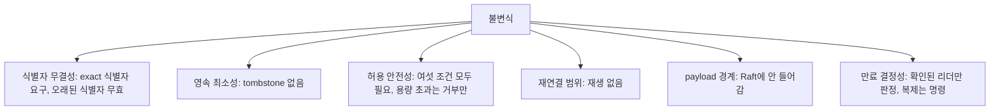

1. 모든 상태 전진은 exact epoch·세션·instance·바인딩·참여자 식별자를 요구한다.
2. 오래된 식별자는 현재 상태를 생성하거나 삭제할 수 없다.
3. 영속 FSM은 현재 상태만 가지며 삭제는 tombstone·이력을 남기지 않는다.
4. 새 Open은 여섯 조건을 모두 요구한다. 이후 권한·quorum 허용 실패만으로 수락된 Pipe를 종료하지 않는다.
5. 용량 초과는 새 작업을 거부하며 기존 실행 상태를 축출하지 않는다.
6. 세션 재연결은 현재 Listener만 새로 Bind한다. Open 재시도, 응답 재생, Pipe 재개·연결, payload 재생은 없다.
7. Payload 확인 상태는 Pipe 로컬 상한 메모리이며 Controller Raft에 들어가지 않고 관찰하지 못한 확인을 확정 성공·실패로 바꾸지 않는다.
8. Grace 만료 판정은 확인된 리더만 내리며, Raft에 복제되는 것은 만료 시각이 아니라 `RemoveGateway` 명령이다. 각 노드가 자기 시계로 만료를 판정하면 복제 상태 기계가 갈라지므로, 복제되는 것은 언제나 명령이지 시각이 아니다.
