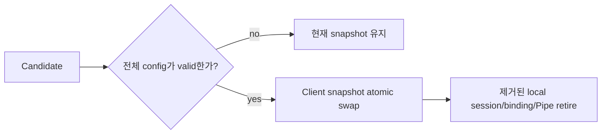

# SPEC 002: Client 설정과 presence

## Credential source

Canonical external YAML이 Client/API key의 source of truth다.

```text
ClientId -> ApiKeyId -> sha256:<64 lowercase hex>
```

- Raw key는 config, log, Raft, REST, runtime observation에 저장하지 않는다.
- Presented key는 exact `(ClientId, ApiKeyId)` verifier와 constant time으로 비교한다.
- 하나의 Client는 rotation을 위해 여러 key를 가질 수 있다.
- 같은 `ApiKeyId` verifier 변경이나 한 process lifetime 안의 verifier 공유는 invalid다.
- Public stream의 첫 message만 raw key를 포함할 수 있으며 authentication deadline이 지나면 stream을 종료한다.
- 성공한 stream은 session의 `ClientId`를 고정하며 request field가 이를 바꿀 수 없다.

Bearer credential을 TLS로 보호하기 전에는 public Relay를 loopback에만 bind할 수 있다. Internal control, peer, Raft는 현재 trusted local/development network를 가정하며 production trust는 별도 deployment contract다.

## Startup과 reload



- Invalid startup은 service를 열지 않는다.
- `SIGHUP`은 전체 file을 읽고 검증하지만 process-local `clients`만 교체한다. Listener, port, Raft 설정은 restart-only다.
- Invalid reload는 현재 snapshot/runtime을 유지한다.
- Valid removal은 먼저 swap해 제거된 credential의 새 인증을 막고, local session/binding/Pipe retirement 완료 뒤 종료한다.
- Reload가 모든 Gateway에 동시에 적용된다고 가정하지 않는다. Presence는 partition된 Gateway의 과거 valid snapshot revocation을 증명하지 않는다.

## Presence와 surface

| Surface | 허용 | 금지 |
| --- | --- | --- |
| Public gRPC | Auth, bind/unbind, exact Open/cancel, Pipe payload/close | Client/key CRUD, durable delivery, cross-client lookup |
| Read-only REST | Local health/readiness, quorum-confirmed current observed count, metric | Mutation, secret, payload, buffer, history/completeness |
| External config | Client/key add/remove/rotation | RelayGate database/Raft credential lifecycle |

Presence state는 `NoAuthority` 또는 `Current`다. `Current`는 committed `C`의 `committed_gateways`/`committed_routes`, leader-local `V`의 `revalidated_gateways`, exact `C/V`가 일치하는 `eligible_routes`를 분리한다. Expected replica roster가 없으므로 zero/partial count도 valid observation이다. Complete/converged flag를 노출하지 않으며 Presence는 authorization decision이나 New-Pipe gate가 아니다.

Gateway control session만 끊기면 local `LiveBinding` declaration은 process memory에 남고 `V`만 사라진다. 새 control session은 fresh FullSnapshot으로 current declaration을 다시 publish한다. ACK 전 `RegisteringB`였던 Bind는 실패하고 mutation을 다음 session에 replay하지 않는다.

`ClusterEpoch`를 바꾸는 disaster reset은 모든 과거 controller/control/Gateway path가 외부에서 먼저 fence되어야 한다. SDK/Gateway는 새 epoch의 fresh session에서 current Listener만 bind/declare한다. Presence는 이전 epoch의 session, binding, Pipe, history를 보고하거나 복구하지 않는다.

## 불변식

1. `ClientId` namespace는 인증만 결정한다.
2. Reload는 whole-candidate validation과 process-local atomic swap을 수행한다.
3. Credential removal은 current local runtime을 retire하며 reconnect로 old identity를 되살릴 수 없다.
4. Observation은 secret/mutation surface를 노출하지 않고 cluster completeness를 주장하지 않는다.
