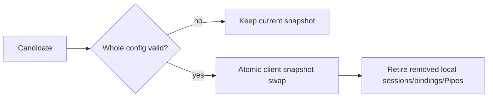

# SPEC 002: Client Configuration and Presence

## Credential source

Client와 API key의 source of truth는 canonical external YAML이다.

```text
ClientId -> ApiKeyId -> sha256:<64 lowercase hex>
```

- Raw key를 config, log, Raft, REST와 runtime observation에 저장하지 않는다.
- Presented key는 exact `(ClientId, ApiKeyId)` verifier와 constant-time 비교한다.
- 하나의 Client는 rotation을 위해 여러 key를 가질 수 있다.
- 한 process lifetime에서 같은 `ApiKeyId` verifier 변경과 verifier 공유는 invalid다.
- Public stream의 첫 message만 raw key를 가질 수 있고 authentication deadline을 넘으면 종료한다.
- 성공한 stream의 `ClientId`는 session에 고정되며 request field로 우회할 수 없다.

Bearer TLS가 application에 구현되기 전 public Relay는 loopback bind만 허용한다. Internal control/peer/Raft는
현재 trusted local/dev network 전제이며 production trust는 별도 배포 계약이다.

## Startup과 reload



- Invalid startup은 service를 열지 않는다.
- `SIGHUP`은 전체 file을 읽고 검증하지만 process-local `clients`만 교체한다. Listener/port/Raft 설정은
  restart-only다.
- Invalid reload는 current snapshot과 runtime을 바꾸지 않는다.
- Valid removal은 swap 뒤 새 auth를 막고, 제거 credential의 local session/binding/Pipe retirement가 완료된
  뒤 reload를 완료한다.
- 여러 Gateway의 reload는 동시에 적용된다고 가정하지 않는다. Partition된 Gateway의 old valid snapshot을
  presence로 revoked라고 추론하지 않는다.

## Presence and surfaces

| Surface | 허용 | 금지 |
| --- | --- | --- |
| Public gRPC | Auth, bind/unbind, exact Open/cancel, Pipe payload/close | Client/key CRUD, durable delivery, cross-client lookup |
| Read-only REST | Local health/readiness, quorum-confirmed current observed counts, metrics | Mutation, secret, payload, buffer, history/completeness |
| External config | Client/key add/remove/rotation | RelayGate database/Raft credential lifecycle |

Presence state는 `NoAuthority` 또는 `Current`다. `Current`의 counters는 current authority memory만 센다.
Expected replica roster가 없으므로 zero/partial counts도 정상 observation이며 complete/converged flag를 제공하지
않는다. Presence는 authorization이나 New-Pipe gate가 아니다.

Disaster reset으로 `ClusterEpoch`가 바뀌면 old controller/control/gateway path는 이미 외부에서 fenced된
상태여야 한다. SDK와 Gateway는 새 epoch의 fresh session에서 현재 Listener만 다시 Bind/declare한다.
Presence는 old epoch의 session, binding, Pipe 또는 history를 표시하거나 복구하지 않는다.

## Invariants

1. Authentication 결과만 `ClientId` namespace를 정한다.
2. Reload는 whole-candidate validation과 process-local atomic swap이다.
3. Credential removal은 current local runtime을 retire하며 old identity를 reconnect로 부활시키지 않는다.
4. Observation은 secret과 mutation surface를 포함하지 않고 cluster completeness를 주장하지 않는다.
