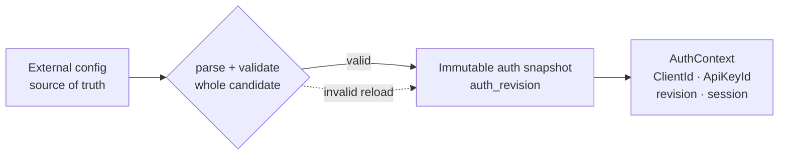
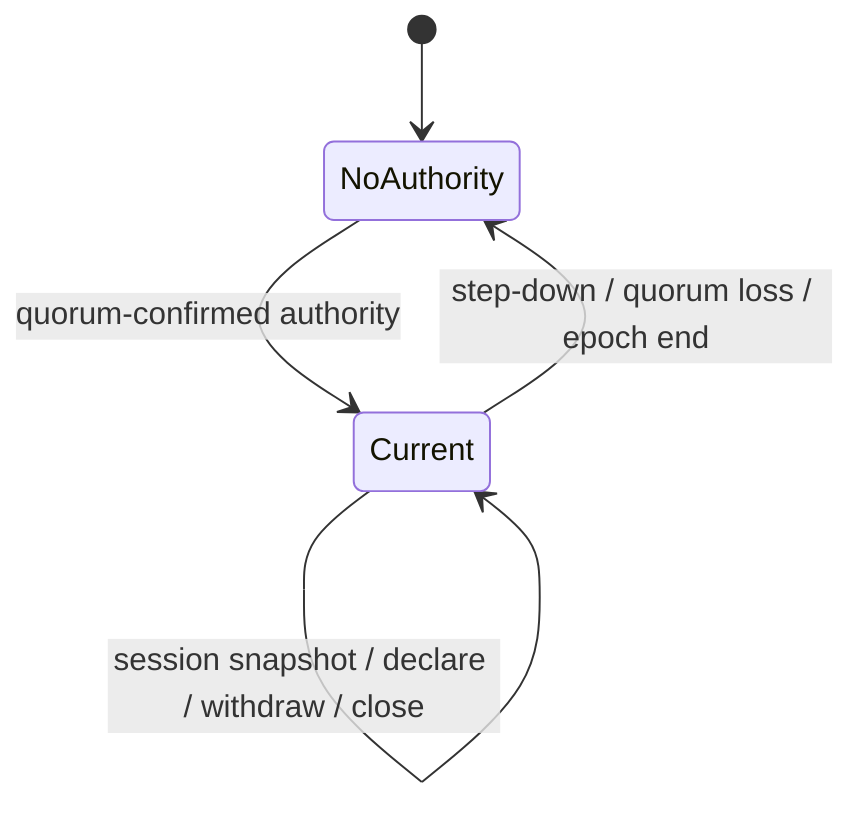

# SPEC 002: Client Configuration and Presence

> **Status:** Draft
>
> External credential config, strict client namespace, atomic reload와 current-only observation을 정의한다.

## External client config



```yaml
clients:
  <ClientId>:
    api_keys:
      <ApiKeyId>: sha256:<64-lowercase-hex>
```

- API key는 operator가 생성한 high-entropy bearer secret이다. Config에는 raw key가 아니라 SHA-256 verifier만
  저장한다.
- 같은 verifier를 여러 credential에 공유할 수 없다. 같은 `ApiKeyId`의 verifier 변경은 reload 전체를
  거부한다. Rotation은 새 ID 추가 뒤 old ID 제거다.
- RelayGate 내부 database/Raft와 client/key CRUD API는 없다.
- 각 Gateway는 전체 config를 검증해 process-local immutable snapshot으로 사용한다. Invalid startup은 service를
  열지 않는다.
- Public `Relay.Connect`의 첫 메시지는 exact `(ClientId, ApiKeyId, presented key)`를 짧은 deadline 안에
  인증한다. 성공하면 stream lifetime의 `ClientSessionId`와 implicit `ClientId`를 만든다.
- Raw key는 log, status, memory table, Raft 또는 response에 기록하지 않는다.
- Active session과 pre-auth stream은 bounded다. Public bearer listener는 TLS 계약 전까지 loopback만 허용한다.

`auth_revision`은 정렬한 credential tuple의 canonical digest다. Snapshot equality 확인용 opaque token이며
시간 순서, cluster generation, consensus 또는 rollout completion을 뜻하지 않는다.

## SIGHUP atomic reload

```mermaid
sequenceDiagram
    participant O as Operator
    participant G as Gateway
    participant C as Config
    participant R as Local runtime

    O->>G: SIGHUP
    G->>C: read full candidate
    G->>G: parse + validate
    alt invalid
        G-->>O: reject; keep current snapshot
    else valid
        G->>G: atomic snapshot swap
        G->>R: retire removed credential's local attempts/sessions/bindings/Pipes
    end
```

Reload의 선형화점은 process-local immutable snapshot swap이다. 각 Gateway가 독립적으로 reload하므로 rollout
중 revision skew는 허용된다. RelayGate는 replica roster를 저장하지 않으므로 모든 replica가 같은 config를
적용했다는 cluster-wide proof를 제공하지 않는다.

| Candidate/change | 새 인증 | 기존 local runtime |
| --- | --- | --- |
| Invalid | 기존 snapshot 사용 | Session/binding/Pipe 유지 |
| Key 추가 | Swap 뒤 새 key 허용 | 기존 session 유지 |
| `ApiKeyId` 제거 | Swap 직후 거부 | 해당 credential의 unconsumed attempt, session, binding, Pipe segment retire |
| `ClientId` 제거 | Swap 직후 전체 거부 | 해당 client의 local runtime retire |
| 같은 ID의 verifier 변경 | Reload 전체 거부 | 기존 snapshot/runtime 유지 |

인증과 removal swap이 경쟁하면 final current-snapshot revalidation으로 순서화한다.

- Auth가 먼저면 session이 잠시 만들어질 수 있지만 같은 reload의 local retirement가 제거한다.
- Swap이 먼저면 auth는 실패하고 session을 만들지 않는다.
- `LocalRetirementDone` 뒤 해당 process에는 제거 credential의 session/binding/Pipe segment가 없다.

Removal은 exact local listener를 먼저 ineligible로 만든다. Current control session이 살아 있으면 withdraw를
보내고, stream/session이 끝나면 authority가 그 session의 route를 bulk delete한다. 늦은 old-session event는
current directory에 entry를 다시 만들 수 없다.

현재 Go runtime은 canonical config 전체를 재검증하되 SIGHUP에서는 clients 변경만 적용한다. Listener, Raft,
port와 timeout 변경은 restart가 필요하다.

## Current-only presence

Presence는 replica inventory, convergence protocol 또는 route authority가 아니다.



| State/field | 정확한 의미 |
| --- | --- |
| `NoAuthority` | Current authority/quorum을 확인할 수 없다. 이전 observation을 current로 재사용하지 않는다. |
| `Current` | Confirmed authority가 자기 memory의 현재 값을 보고한다. Complete를 뜻하지 않는다. |
| `sessions` | 현재 authority가 열어 둔 control session 수 |
| `revalidated` | 그중 exact full snapshot을 적용한 current session 수 |
| `bindings` | current directory의 exact route entry 수 |

Authority 변경 시 sessions/revalidated/bindings는 0에서 다시 시작한다. Gateway 하나의 full snapshot이
적용되면 그 session과 binding count가 즉시 보이고 exact routes도 즉시 사용할 수 있다. 다른 replica를
기다리거나 expected replica count와 비교하지 않는다.

`Current(sessions=0, bindings=0)`은 **지금 관찰된 값이 0**이라는 뜻일 뿐 deployment에 Gateway/Listener가
없다는 complete proof가 아니다. 다음 값을 제공하거나 추론하지 않는다.

- `complete=true/false`
- committed/classified replica set
- expected replica count를 이용한 admission
- durable Gateway/presence history
- cluster-wide config convergence 또는 credential revocation proof

Operator가 전체 rollout/revocation을 증명해야 한다면 deployment inventory, config rollout status와 external
traffic fence를 RelayGate 밖에서 결합한다. RelayGate status의 observed counts만으로 누락된/partitioned process의
부재나 credential retirement를 증명할 수 없다.

## Surface와 권한

| Surface | 허용 | 금지 |
| --- | --- | --- |
| Public protobuf gRPC | 인증, listen, exact Open, bidirectional Pipe와 close/cancel | Client/key CRUD, durable payload, cross-client lookup |
| Read-only REST | Local runtime status와 current authority의 observed session/binding counts | Relay/mutation, secret/payload/buffer, history/completeness claim |
| External config | `ClientId → ApiKeyId/verifier` 변경 | RelayGate API를 통한 credential 생성/저장 |

`GET /status`는 current observation을 publish하기 전에 quorum-confirmed authority를 확인한다. 확인 실패는
`503 + NoAuthority`이며 old `Current` response를 재사용하지 않는다. 성공 응답의 Raft/Gateway diagnostic은
같은 순간의 cluster-wide atomic snapshot이 아니라 best-effort local data다.

HTTP/RPC caller cancellation이나 caller-owned deadline은 그 호출만 실패시킨다. Definitive role/epoch loss 또는
manager-owned authority probe failure만 global authority/session fence를 만든다.

## 불변 조건

| 항상 | 하지 않음 |
| --- | --- |
| Credential source of truth는 validated external config다. | Client/key를 Raft/DB/REST CRUD로 관리하지 않는다. |
| 인증 결과의 implicit `ClientId`로 모든 operation을 격리한다. | Request의 ClientId 선택이나 fallback을 허용하지 않는다. |
| Reload는 whole-candidate validation 뒤 process-local atomic swap이다. | Partial config를 노출하지 않는다. |
| Credential removal은 local live state를 즉시 retire한다. | 과거 session/binding을 reconnect로 부활시키지 않는다. |
| Presence는 current authority memory의 observed counts다. | Replica completeness, convergence, history 또는 admission을 주장하지 않는다. |

## 관련 문서

- [SPEC 001: RelayGate System Model](001-system-model.md)
- [SPEC 003: Failure and Recovery Model](003-failure-and-recovery-model.md)
- [SPEC 004: State Transition Model](004-state-transition-model.md)
- [TEST 001: Core Correctness Test Plan](../test/001-core-correctness-test-plan.md)
- [ADR 006: Client 격리와 external credential](../adr/006-client-isolation-and-external-credentials.md)
- [ADR 007: High-entropy API key 검증](../adr/007-high-entropy-api-key-verification.md)
- [ADR 009: 현재 상태 전용 authority directory](../adr/009-ephemeral-current-state-authority-directory.md)
