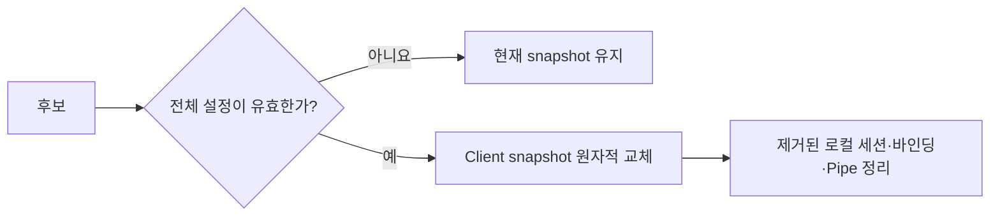

# SPEC 002: 클라이언트 설정과 상태 관찰

## 인증 정보 원본

정규 외부 YAML이 Client/API key의 유일한 기준 정보다.

```text
ClientId -> ApiKeyId -> sha256:<64 lowercase hex>
```

- 원본 key는 설정, log, Raft, REST, 실행 상태 관찰에 저장하지 않는다.
- 제시된 key는 exact `(ClientId, ApiKeyId)` 검증 값과 일정한 시간으로 비교한다.
- 하나의 Client는 교체를 위해 여러 key를 가질 수 있다.
- 같은 `ApiKeyId`의 검증 값 변경이나 한 프로세스 수명 안의 검증 값 공유는 유효하지 않다.
- 공개 stream의 첫 message만 원본 key를 포함할 수 있으며 인증 제한 시간이 지나면 stream을 종료한다.
- 성공한 stream은 세션의 `ClientId`를 고정하며 요청 필드가 이를 바꿀 수 없다.

Bearer 인증 정보를 TLS로 보호하기 전에는 공개 Relay를 loopback에만 bind할 수 있다. 내부 제어, Peer, Raft는 현재 신뢰할 수 있는 로컬·개발 네트워크를 가정하며 운영 환경의 신뢰 조건은 별도 배포 계약이다.

## 시작과 다시 불러오기



- 유효하지 않은 시작 설정은 서비스를 열지 않는다.
- `SIGHUP`은 전체 파일을 읽고 검증하지만 프로세스 로컬 `clients`만 교체한다. Listener, port, Raft 설정은 재시작으로만 바꾼다.
- 유효하지 않은 다시 불러오기는 현재 snapshot과 실행 상태를 유지한다.
- 유효한 제거는 먼저 교체해 제거된 인증 정보의 새 인증을 막고, 로컬 세션·바인딩·Pipe 정리를 마친 뒤 종료한다.
- 다시 불러오기가 모든 Gateway에 동시에 적용된다고 가정하지 않는다. 상태 관찰은 분할된 Gateway의 과거 유효 snapshot이 폐기됐음을 증명하지 않는다.

## 상태 관찰과 외부 인터페이스

| 외부 인터페이스 | 허용 | 금지 |
| --- | --- | --- |
| 공개 gRPC | 인증, bind/unbind, exact Open/cancel, Pipe payload/close | Client/key CRUD, 영속 전달, Client 간 조회 |
| 읽기 전용 REST | 로컬 health/readiness, quorum으로 확인한 현재 관찰 수, metric | 변경, 비밀 정보, payload, buffer, 이력·완전성 |
| 외부 설정 | Client/key 추가·제거·교체 | RelayGate database/Raft 인증 정보 수명주기 |

상태 관찰 값은 `NoAuthority` 또는 `Current`다. `Current`는 합의된 `C`의 `committed_gateways`·`committed_routes`, 리더 로컬 `V`의 `revalidated_gateways`, exact `C/V`가 일치하는 `eligible_routes`를 분리한다. 예상 replica 목록이 없으므로 0이나 일부 개수도 유효한 관찰이다. 완전·수렴 여부 표시는 노출하지 않으며 상태 관찰은 권한 결정이나 새 Pipe 허용 조건이 아니다.

Gateway 제어 세션만 끊기면 로컬 `LiveBinding` 선언은 프로세스 메모리에 남고 `V`만 사라진다. 새 제어 세션은 새로운 FullSnapshot으로 현재 선언을 다시 게시한다. ACK 전 `RegisteringB`였던 Bind는 실패하고 변경을 다음 세션에 재생하지 않는다.

`ClusterEpoch`를 바꾸는 재해 초기화는 모든 이전 Controller·제어·Gateway 경로가 외부에서 먼저 차단되어야 한다. SDK와 Gateway는 새 epoch의 새 세션에서 현재 Listener만 bind·declare한다. 상태 관찰은 이전 epoch의 세션, 바인딩, Pipe, 이력을 보고하거나 복구하지 않는다.

## 불변식

1. `ClientId` 이름 공간은 인증만 결정한다.
2. 다시 불러오기는 전체 후보 검증과 프로세스 로컬 원자적 교체를 수행한다.
3. 인증 정보 제거는 현재 로컬 실행 상태를 정리하며 재연결로 이전 식별자를 되살릴 수 없다.
4. 관찰 인터페이스는 비밀 정보나 변경 기능을 노출하지 않고 전체 집합의 완전성을 주장하지 않는다.
