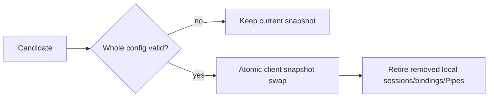

# SPEC 002: Client Configuration and Presence

## Credential source

Canonical external YAML is the source of truth for Clients and API keys.

```text
ClientId -> ApiKeyId -> sha256:<64 lowercase hex>
```

- Raw keys are never stored in config, logs, Raft, REST, or runtime observations.
- A presented key is compared in constant time with the exact `(ClientId, ApiKeyId)` verifier.
- One Client may have multiple keys for rotation.
- Changing a verifier for the same `ApiKeyId` or sharing a verifier within one process lifetime is invalid.
- Only the first message on a public stream may contain the raw key; the stream ends if the authentication deadline expires.
- A successful stream fixes `ClientId` to the session; request fields cannot override it.

Until the application provides TLS protection for bearer credentials, the public Relay may bind only to loopback. Internal
control, peer, and Raft currently assume a trusted local/development network; production trust is a separate deployment
contract.

## Startup and reload



- Invalid startup does not open the service.
- `SIGHUP` reads and validates the whole file but replaces only process-local `clients`. Listener, port, and Raft settings
  are restart-only.
- An invalid reload leaves the current snapshot and runtime unchanged.
- A valid removal swaps first to reject new authentication with the removed credential, then completes only after its local
  sessions, bindings, and Pipes have retired.
- Reloads are not assumed to apply simultaneously across Gateways. Presence cannot prove that an old valid snapshot on a
  partitioned Gateway has been revoked.

## Presence and surfaces

| Surface | Allowed | Forbidden |
| --- | --- | --- |
| Public gRPC | Auth, bind/unbind, exact Open/cancel, Pipe payload/close | Client/key CRUD, durable delivery, cross-client lookup |
| Read-only REST | Local health/readiness, quorum-confirmed current observed counts, metrics | Mutation, secret, payload, buffer, history/completeness |
| External config | Client/key add/remove/rotation | RelayGate database/Raft credential lifecycle |

Presence state is either `NoAuthority` or `Current`. `Current` reports separate counts for committed `C`
(`committed_gateways` and `committed_routes`), leader-local `V` (`revalidated_gateways`), and routes whose exact `C` and
`V` agree (`eligible_routes`). Because there is no expected replica roster, zero or partial counts are valid observations;
no complete or converged flag is exposed. Presence is neither an authorization decision nor a New-Pipe gate.

If only a Gateway control session disconnects, that Gateway's local `LiveBinding` declarations remain in process memory
and only `V` disappears. A new control session republishes those current declarations in a fresh FullSnapshot. A Bind that
was `RegisteringB` before its ACK fails and does not replay its mutation into the next session.

A disaster reset that changes `ClusterEpoch` requires all old controller, control, and Gateway paths to have already been
externally fenced. SDKs and Gateways bind or declare only their current Listeners in fresh sessions for the new epoch.
Presence neither reports nor recovers sessions, bindings, Pipes, or history from the old epoch.

## Invariants

1. Only authentication determines the `ClientId` namespace.
2. Reload performs whole-candidate validation and a process-local atomic swap.
3. Credential removal retires the current local runtime and cannot revive the old identity through reconnect.
4. Observation exposes neither secrets nor mutation surfaces and makes no cluster-completeness claim.
