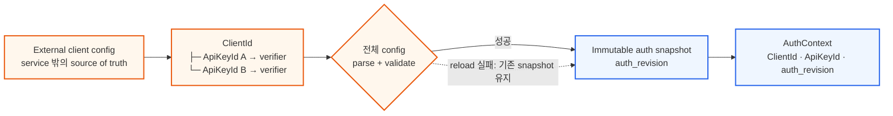
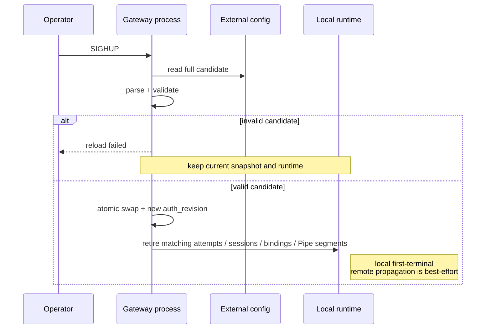
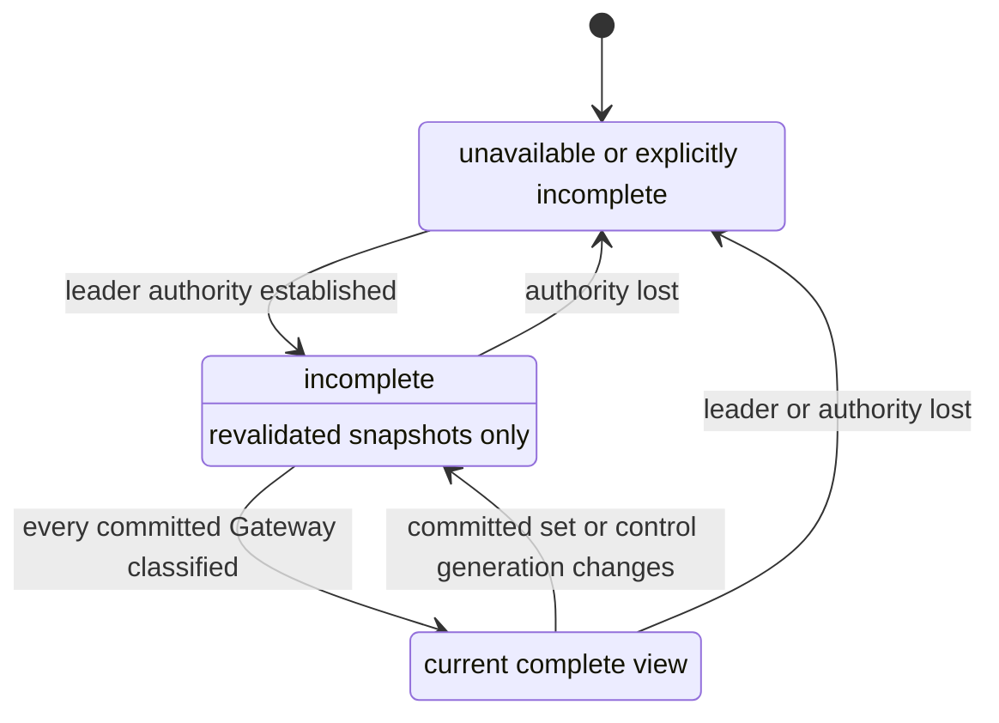

# SPEC 002: Client Configuration and Presence

> **Status:** Draft
>
> 외부 credential config, strict client namespace, reload와 current presence의 관찰 계약을 정의한다.

## External client config



```text
clients:
  <ClientId>:
    api_keys:
      <ApiKeyId>: <verifier>
      <ApiKeyId>: <verifier>
```

- API key는 operator가 생성한 high-entropy bearer secret이다. Verifier는
  `sha256:<64 lowercase hex>` 형식이며 같은 verifier를 여러 credential에 공유할 수 없다.
  RelayGate 내부 DB나 client/key CRUD API는 없다.
- 각 Gateway는 전체 config를 검증해 immutable snapshot으로 사용한다.
- Startup config가 유효하지 않으면 service를 열지 않는다.
- 인증은 `(ClientId, ApiKeyId, auth_revision)`에 묶인 `ClientSessionId`를 만든다. Request는 다른
  `ClientId`를 선택할 수 없다.
- Public `Relay.Connect` stream은 첫 메시지로 exact `(ClientId, ApiKeyId, presented key)`를 인증한다.
  성공한 session은 stream lifetime에 묶이며 raw key를 config, log, status 또는 Raft에 저장하지 않는다.
  첫 메시지가 `relay.authentication_timeout` 안에 도착하지 않으면 session 없이 종료한다. Active session은
  `relay.max_client_sessions`로 제한한다. Relay TLS 전까지 production network bind는 허용하지 않는다.

## SIGHUP atomic reload



적용 단위는 Gateway process 하나다. 각 process가 독립적으로 `SIGHUP`을 처리하므로 rollout 중에는
서로 다른 snapshot이 동시에 활성일 수 있다. 아직 reload하지 않은 Gateway는 제거된 credential을
계속 받아들일 수 있으므로 cluster-wide 즉시 revocation은 보장하지 않는다.

같은 validated snapshot은 모든 Gateway에서 같은 non-secret `auth_revision`을 노출해야 한다. Go runtime은
정렬한 `(ClientId, ApiKeyId, verifier)` tuple의 canonical digest로 이를 계산한다. 이 값은 equality 확인을
위한 opaque token일 뿐 순서, cluster-wide transaction 또는 authority를 의미하지 않는다.

| 상황 | 새 인증 | 기존 runtime |
| --- | --- | --- |
| candidate가 유효하지 않음 | 기존 snapshot으로 계속 판단 | 기존 session, listener와 pipe를 그대로 유지한다. |
| 유효한 snapshot에 key가 추가됨 | swap 뒤 새 key를 사용할 수 있다. | 기존 session에는 영향이 없다. |
| 유효한 snapshot에서 `ApiKeyId`가 제거됨 | swap 직후 해당 key를 거부한다. | 해당 `(ClientId, ApiKeyId)`에 묶인 local unconsumed attempt, session, binding과 Pipe segment를 retire한다. |
| 유효한 snapshot에서 `ClientId`가 제거됨 | swap 직후 그 client의 모든 key를 거부한다. | 해당 `ClientId`에 묶인 local unconsumed attempt, session, binding과 Pipe segment를 retire한다. |
| key가 그대로 유지됨 | 새 connection은 새 `auth_revision`을 관찰한다. | 기존 session은 인증 당시 관찰한 revision을 유지한다. |

인증과 removal swap이 겹치면 final current-snapshot revalidation이 먼저 선형화된 인증은 기존 session으로
취급하고 같은 reload의 local retirement가 회수한다. Swap이 먼저 선형화되면 revalidation은 실패하며 session을
만들지 않는다. 어느 경우든 `LocalRetirementDone` 뒤 제거 credential의 session은 남지 않는다.

`ApiKeyId`는 immutable하다. 같은 ID의 verifier 변경은 reload 전체를 거부한다. Rotation은 새 ID를
추가한 뒤 이전 ID를 제거하며 successful swap 전에는 어떤 변경도 노출하지 않는다.

현재 Go runtime은 canonical `relaygate.yaml` 전체를 다시 검증하되 `SIGHUP`에서 clients 이외의 변경은
거부한다. Static listener, Raft와 timeout 변경은 process restart가 필요하다.

`LocalRetirementDone(g, revision)`은 해당 Gateway가 제거 대상에 묶인 local unconsumed attempt, session,
binding과 Pipe segment를 모두 terminal/retired로 만들고 새 admission을 막았다는 뜻이다. Remote participant는
cancel이나 hop/session failure를 직접 관찰한 뒤에만 terminal이므로 이 보고 하나가 remote 종료를 증명하지
않는다.

지연 도착한 이전 auth 또는 control generation의 snapshot과 event는 이미 제거한 session, listener,
binding을 다시 활성화할 수 없다. 재등록은 현재 auth snapshot으로 새로 인증하고 현재 control
generation에서 수행해야 하며, 이 fencing은 `auth_revision`의 순서에 의존하지 않는다.

## Config convergence와 revocation proof

| Observation | 의미 |
| --- | --- |
| Gateway별 `auth_revision` | 그 process에서 현재 활성인 validated snapshot의 equality token |
| `config_converged=false` | 하나 이상의 committed Gateway가 timeout/unreported 상태이거나 live/revalidated되지 않았거나, revision이 다르거나, local retirement가 진행 중임 |
| `config_converged=true` | 모든 committed Gateway가 live/revalidated됐고, 모두 같은 revision과 그 revision의 local retirement 종료를 보고함 |

`config_converged`는 current committed Gateway의 관찰값에서 계산한 in-band signal이다. 수렴만으로 공통
revision이 operator가 원한 revision이거나 과거 Gateway까지 철회됐음을 증명하지 않는다. Credential 제거의
cluster-wide proof는 공통 revision이 operator-known removal revision과 같고, removal operation부터 proof
observation까지 제거 대상 credential을 포함한 snapshot으로 client/relay traffic을 처리할 수 있었던 모든
`GatewayInstanceId`가 다음 중 하나를 만족할 때만 성립한다: local retirement 보고, clean termination 증명,
외부 client/relay traffic fencing. Current control set에서 record를 제거한 것만으로 termination이나 fence를
증명하지 않는다.

RelayGate REST는 current revision과 convergence evidence를 제공하지만 historical Gateway 전체를 보존하는
revocation ledger가 아니다. External fence를 포함한 최종 proof는
[SPEC 003](003-failure-and-recovery-model.md)의 `RevocationSafe`를 따른다. 이 signal과 REST 응답은 인증,
route admission 또는 control-plane authority를 만들지 않는다. 현재 authority가 확인되지 않으면 이전의
`true`를 재사용하지 않고 unavailable 또는 incomplete로 관찰한다.

Proof interval의 historical candidate 목록, clean termination과 external traffic fence 증거는 RelayGate가
아니라 배포 환경의 operator/audit system이 소유한다. RelayGate는 current in-band observation만 제공하고
이 외부 증거를 영속화하거나 생성하지 않는다. 외부 candidate history가 없거나 완전성을 증명할 수 없으면
`RevocationSafe=false`다. Test에서는 fault harness가 같은 외부 증거를 입력한다.

Cluster-wide 응답은 `(ClusterEpoch, AuthorityId)`를 함께 반환한다. Authority는 quorum-confirmed read
barrier 뒤에만 `complete=true`나 `config_converged=true`를 새로 publish한다. Quorum을 확인할 수 없으면
이전 publication을 current로 재전송하지 않고 unavailable/incomplete로 낮춘다. Lease로 최적화한다면 필요한
clock bound를 별도로 명시해야 한다.

Revocation proof는 해당 observation 시점의 predicate이며 영구 증명이나 ledger가 아니다. 새 Gateway identity,
config/control generation 또는 external config rollback은 이전 proof를 즉시 무효화한다. 제거한 credential을
다시 source에 넣지 않는 책임은 external config management가 소유한다.

## Relay와 presence surface

| Surface | 허용 범위 | 금지 범위 |
| --- | --- | --- |
| protobuf gRPC | Go/Rust SDK의 인증, listen, resolve/open, 양방향 pipe relay와 close/cancel | client/key CRUD, durable payload, 다른 `ClientId` namespace 접근 |
| read-only REST | 현재 관찰된 session/listener/pipe presence, Gateway별 `auth_revision`, `config_converged`, presence completeness | relay, mutation, client/key 관리, history 또는 복구 보장 |
| external client config | `ClientId → ApiKeyId/verifier` 운영 변경 | RelayGate service API를 통한 수정 |

REST는 route authority나 sync log가 아니며 secret, payload와 buffer를 반환하지 않는다. Client
credential은 자신의 `ClientId`만 볼 수 있다. Cluster-wide observation은 별도 administrator auth를
쓰지만 relay나 mutation 권한은 갖지 않는다.

## Presence completeness

여기서 committed Gateway는 current epoch의 live `GatewaySlot = (GatewayId, generation, GatewayInstanceId)`이다.
같은 `GatewayId`의 새 instance가 commit되면 이전 instance classification은 current set에 속하지 않는다.



- Current leader 또는 authority를 확인할 수 없으면 cluster-wide observation은 unavailable이거나 명시적으로
  incomplete여야 한다. 빈 결과를 authoritative한 complete view로 반환하지 않는다.
- Go runtime의 `GET /status`는 요청마다 quorum-confirmed barrier를 수행한다. 성공 응답은
  `(ClusterEpoch, AuthorityId)`를 포함하며, barrier 실패는 `503`과 `NoAuthority`로 반환하고 이전
  `Complete`를 재사용하지 않는다.
- 이 barrier가 확정하는 observation은 `(ClusterEpoch, AuthorityId, presence)`다. 같은 응답의 Raft와
  Gateway diagnostic field는 응답 시점의 best-effort local status이며 cluster-wide atomic snapshot이 아니다.
- Caller-owned HTTP/control RPC의 cancel 또는 deadline은 해당 호출만 실패시킨다. 이는 `QuorumLost`나
  `AuthorityEnded`가 아니며 current authority와 다른 control session을 fence하지 않는다. Manager-owned
  authority probe가 관찰한 실패는 별도 global fence 경로다.
- 새 leader는 presence를 빈 상태에서 재구축한다.
- 모든 committed Gateway가 snapshot 재검증 또는 timeout으로 분류된 뒤에만 `complete=true`다.
- Committed Gateway set이나 current control generation이 바뀌면 이전 `complete`와 `config_converged`를
  즉시 무효화하고 `Rebuilding`에서 다시 계산한다.
- Rebuilding 중에는 부분 결과와 `incomplete`를 함께 반환한다. 빈 결과를 complete로 표시하지 않는다.
- Timeout 값은 이 spec에서 정하지 않는다. Route eligibility는 [SPEC 001](001-system-model.md)을 따른다.
- Go runtime의 timeout 값은 `control.gateway_revalidation_timeout`으로 설정하며 timeout classification은
  unavailable 추정일 뿐 route나 revocation gate를 true로 만들지 않는다. `Syncing` session이 이 timeout을
  넘으면 ended로 fence하며 늦은 snapshot은 같은 session을 되살리지 않고 새 control session을 요구한다.

## 관련 문서

- [SPEC 001: RelayGate System Model](001-system-model.md)
- [SPEC 003: Failure and Recovery Model](003-failure-and-recovery-model.md)
- [SPEC 004: State Transition Model](004-state-transition-model.md)
- [TEST 001: Core Correctness Test Plan](../test/001-core-correctness-test-plan.md)
- [ADR 006: Client 격리와 외부 credential source of truth](../adr/006-client-isolation-and-external-credentials.md)
- [ADR 007: High-entropy API key 검증](../adr/007-high-entropy-api-key-verification.md)
