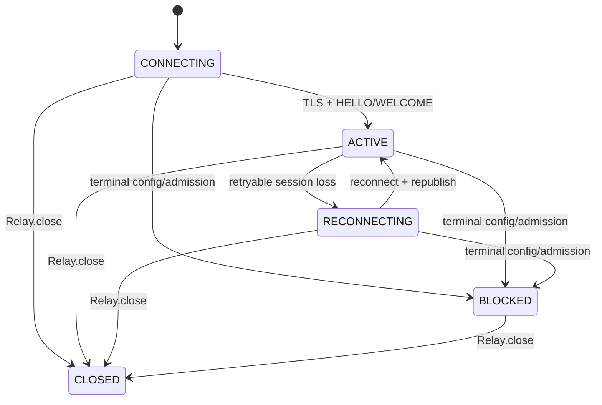
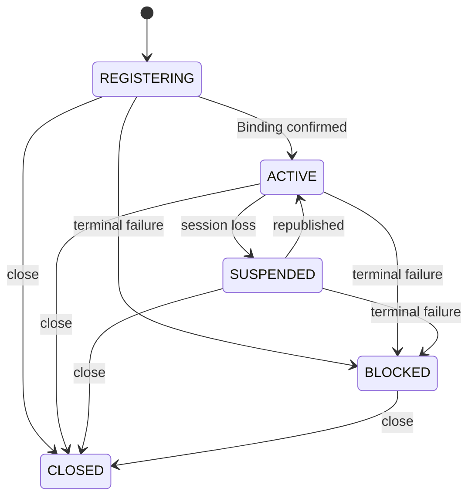
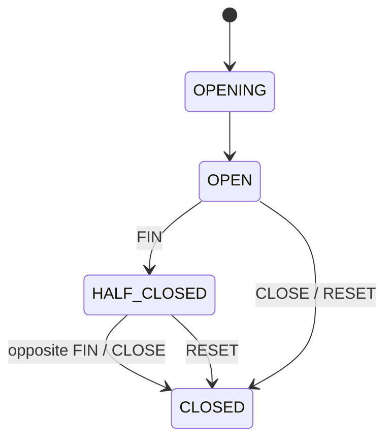

# SPEC 002: SDK와 Pipe 계약

## API

| 호출 | 결과 |
| --- | --- |
| `Relay::connect(Config)` | active Relay |
| `Relay::listen(DestinationId)` | active Listener |
| `Relay::dial(DestinationId)` | established Pipe |
| `Listener::accept()` | distinct incoming Pipe |
| `Listener::close()` | 해당 Listener 종료 |
| `Relay::close()` | 전체 SDK runtime 종료 |

`Config`는 Gateway transport, ClusterToken, timeout, heartbeat, reconnect와 bounded queue 값을 가집니다.
Application이 config source를 읽고 SDK에 전달합니다.

`Config::new(endpoint)?.cluster_token(token)`으로 구성합니다. `host:port`와
`tls://host:port`는 기본 공인 CA, endpoint 이름 검증, SNI와 ALPN을 자동 적용합니다.
`tcp://host:port`는 제공자가 명시한 평문 연결입니다. IPv6는 `[::1]:port` 형식을 사용합니다.
사설 CA는 `with_ca_certificate`로 지정하며 평문 endpoint에는 CA 설정을 허용하지 않습니다.
TLS 검증 실패 후 평문 재접속은 없습니다. Agent 풀과 작업 분배 정책은 application이 소유합니다.

## RelaySession

| ID | 계약 |
| --- | --- |
| `SDK-001` | `Relay::connect`는 지정 transport(TLS 기본)와 `HELLO/WELCOME` 완료 뒤 반환한다. |
| `SDK-002` | network loss, heartbeat timeout과 bounded writer failure는 current session을 끝낸다. |
| `SDK-003` | retryable session loss는 bounded exponential backoff와 runtime별 jitter로 재연결한다. |
| `SDK-004` | 새 session은 이미 반환된 live Listener를 자동 publish한다. |
| `SDK-005` | recovery는 새 session·Binding·dial을 만들며 existing Pipe, committed dial, pending initial listen과 payload는 terminal이다. |
| `SDK-006` | terminal admission/config 오류는 `BLOCKED`로 수렴하며 config를 바꾼 새 runtime으로 회복한다. |
| `SDK-007` | explicit close는 같은 runtime의 terminal `CLOSED`로 수렴한다. |

## Listener

| ID | 계약 |
| --- | --- |
| `SDK-008` | `listen`은 Gateway가 Binding을 확인한 뒤 Listener를 반환한다. |
| `SDK-009` | incoming OFFER는 Listener별 bounded queue admission 뒤 성공한다. |
| `SDK-010` | `accept`는 distinct Pipe를 정확히 한 번 반환한다. |
| `SDK-011` | session 종료는 old unaccepted Pipe를 제거한다. |
| `SDK-012` | Listener close는 신규 수신과 unaccepted Pipe를 끝내고 returned Pipe는 독립 유지한다. |
| `SDK-013` | 같은 Relay의 동일 Destination 중복 listen은 `ALREADY_EXISTS`다. |

## Pipe

| ID | 계약 |
| --- | --- |
| `PIPE-001` | Pipe는 full-duplex opaque byte stream이다. |
| `PIPE-002` | `FIN`은 한 방향 write half-close이고 반대 방향은 계속 사용한다. |
| `PIPE-003` | `CLOSE`는 정상 종료, `RESET`은 오류 종료다. |
| `PIPE-004` | frame, queue와 buffer는 모두 bounded다. |
| `PIPE-005` | Pipe terminal cleanup은 해당 Pipe에 한정되고 sibling Pipe, Listener와 Binding은 유지된다. |
| `PIPE-006` | Pipe I/O success는 RelayGate byte path의 성공이며 application acknowledgement는 application protocol이 정의한다. |
