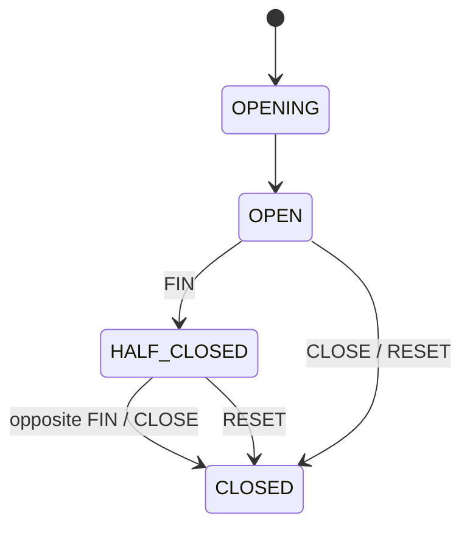

# SPEC 002: SDK와 Pipe 계약

## API

| 호출 | 결과 |
| --- | --- |
| `Relay::connect(Config)` | active Relay |
| `Relay::listen(Destination, AccessTokenSource)` | active Listener |
| `Relay::dial(Destination, AccessTokenSource)` | established Pipe |
| `Relay::status()` / `Relay::subscribe_status()` | latest Relay status snapshot/subscription |
| `Relay::wait_ready()` | current Relay session active 또는 closed error |
| `Listener::accept()` | distinct incoming Pipe |
| `Listener::status()` / `Listener::subscribe_status()` | latest Listener status snapshot/subscription |
| `Listener::close()` | 해당 Listener 종료 |
| `Relay::close()` | 전체 SDK runtime 종료 |

`Config`는 Gateway transport, timeout, heartbeat, reconnect와 `ResourceLimits`를 가집니다. Application이
config source를 읽어 SDK에 전달합니다. `HELLO/WELCOME`에는 credential이 없습니다.

`host:port`와 `tls://host:port`는 기본 공인 CA, endpoint 이름 검증, SNI와 `relaygate/3` ALPN을 자동
적용합니다. `tcp://host:port`는 제공자가 명시한 평문 연결입니다. IPv6는 `[::1]:port` 형식을 사용합니다.
사설 CA는 `with_ca_certificate`로 지정하며 평문 endpoint에는 CA 설정을 허용하지 않습니다. TLS 검증 실패 후
평문 재접속은 없습니다. Agent 풀과 작업 분배 정책은 application이 소유합니다.

### SDK resource hierarchy

```text
Relay
├── live Pipe 20,000
├── buffered inbound bytes 64 MiB
└── Listener 0..N
    ├── pending Pipe 64
    └── live Pipe 10,000
        └── Pipe
            ├── buffered inbound frame 64
            └── buffered inbound bytes 1 MiB
```

위 값은 `ResourceLimits::default()`의 process-local 안전 상한이며 지속 가능한 처리량 보장이 아닙니다.
Application은 `Config::with_resource_limits`로 하나의 묶음으로 조정합니다. Listener live 상한은 Relay live
상한 이하, Pipe byte 상한은 Relay byte 상한 이하이고 모든 값은 양수입니다. Pending Pipe도 live Pipe 점유를
공유하므로 두 상한 중 작은 값이 실제 queue 한도가 됩니다. Gateway admission은 비신뢰 client에 대한
cluster-side 권위 상한을 계속 소유합니다.

## AccessTokenSource

```text
static token -----------------------> PUBLISH 또는 DIAL
async callback(action, Destination) -> PUBLISH 또는 DIAL
```

| ID | 계약 |
| --- | --- |
| `SDK-001` | `Relay::connect`는 지정 transport와 credential-free `HELLO/WELCOME` 완료 뒤 반환한다. |
| `SDK-002` | network loss, heartbeat timeout과 bounded writer failure는 current session을 끝낸다. |
| `SDK-003` | 실행 중 session loss는 bounded exponential backoff와 runtime별 jitter로 재연결한다. |
| `SDK-004` | 새 session은 이미 반환된 live Listener를 새 AccessToken으로 자동 republish한다. |
| `SDK-005` | recovery는 새 session·Binding을 만든다. existing Pipe, committed dial, payload와 PUBLISH가 commit된 initial listen은 terminal이다. PUBLISH pre-commit initial listen은 원래 deadline 안에서 재시도한다. |
| `SDK-006` | 초기 config·transport·handshake 실패는 `Relay::connect`의 `Err`다. 실행 중 session·protocol·transport failure는 current session을 끝내고 bounded backoff 재연결로 수렴한다. |
| `SDK-007` | explicit close는 같은 runtime의 terminal `CLOSED`로 수렴한다. |
| `SDK-014` | AccessToken은 비어 있지 않은 최대 4,096 bytes이고 Debug 출력은 값을 redaction한다. |
| `SDK-015` | dynamic AccessTokenSource는 `AccessAction`과 exact Destination을 받아 application-owned future를 실행한다. |
| `SDK-016` | Listener는 AccessTokenSource를 보관하고 initial publish와 republish마다 다시 호출한다. |
| `SDK-017` | dial은 API 호출당 AccessTokenSource를 정확히 한 번 resolve하며 committed operation을 SDK가 replay하지 않는다. |
| `SDK-018` | SDK runtime은 token cache, singleflight, refresh token, private key와 token issuer를 소유하지 않는다. Backend가 필요하면 `relaygate-token-issuer`로 AccessToken을 생성해 `AccessTokenSource`에 공급한다. |
| `SDK-019` | returned Listener의 republish token source 실패는 Relay당 하나의 bounded exponential backoff+jitter timer로 병합한다. timer가 준비되기 전 다른 reconcile trigger는 suspended Listener를 재시도하지 않는다. 전체 Listener가 다시 active이면 backoff를 초기화하고 대기 중 timer를 무효화한다. |
| `SDK-020` | Relay live Pipe 상한은 outgoing DIAL의 pending 단계부터 returned Pipe 수명까지와 incoming Pipe를 함께 계산하고 모든 실패·cancel·drop·terminal 경로에서 점유를 반환한다. |
| `SDK-022` | Relay와 Listener status subscription은 SDK 소유 wrapper이며 raw watch channel을 노출하지 않는다. `current()`는 latest snapshot을 반환하고 subscription cursor를 소비하며, `changed()`는 그 이후 coalescing된 latest state를 반환한다. Relay `ACTIVE`는 current `HELLO/WELCOME` transport session 설치를 뜻하며 Listener republish/`BLOCKED`와 분리된다. Relay `CLOSED`는 terminal이고 `ACTIVE`로 역행하지 않는다. |

Token source 실패와 deadline은 해당 operation의 `UNAVAILABLE` 또는 `DEADLINE_EXCEEDED/NOT_OBSERVED`입니다.
Initial listen의 PUBLISH가 commit되기 전 session이 끝나면 원래 deadline 안에서 재시도합니다. commit 뒤
session이 끝나면 `MAYBE_OBSERVED` 오류로 반환합니다. Gateway의 initial PUBLISH 실패 응답은
`Relay::listen`의 `Err`입니다. 이미 반환된 Listener의 republish token source 실패는 `SUSPENDED`로 두고
bounded delay 뒤 다시 공급을 요청합니다. 이미 반환된 Listener의 영구적인 PUBLISH 실패(`INVALID_ARGUMENT`,
`UNAUTHENTICATED`, `PERMISSION_DENIED`, `FAILED_PRECONDITION`, `ALREADY_EXISTS`)는 Listener를
`BLOCKED`로 만듭니다. Application은 새로운 token source 또는 새 Relay/Listener를 구성해 회복합니다.
모든 returned Listener가 `ACTIVE` 또는 `BLOCKED`로 settled되면 reconnect episode는 종료됩니다. 하나 이상
`BLOCKED`가 있으면 Relay session은 `ACTIVE`여도 episode outcome은 degraded입니다. reconnect 중 permanent
republish failure로 `BLOCKED`가 publish된 Listener가 즉시 drop되어 desired set에서 제거되어도 해당 episode는
recovered가 아니라 degraded로 종료됩니다.

## Relay runtime

```mermaid
stateDiagram-v2
    [*] --> CONNECTING
    CONNECTING --> ACTIVE: TLS + HELLO/WELCOME
    CONNECTING --> [*]: Relay::connect Err
    ACTIVE --> RECONNECTING: session/protocol/transport loss
    RECONNECTING --> ACTIVE: reconnect + republish
    RECONNECTING --> RECONNECTING: bounded backoff retry
    ACTIVE --> CLOSED: Relay.close
    RECONNECTING --> CLOSED: Relay.close
```

## Listener

```mermaid
stateDiagram-v2
    [*] --> REGISTERING
    REGISTERING --> ACTIVE: Binding confirmed
    REGISTERING --> CLOSED: Relay::listen Err / close
    ACTIVE --> SUSPENDED: session/token-source loss
    SUSPENDED --> ACTIVE: republished
    SUSPENDED --> BLOCKED: permanent PUBLISH failure
    ACTIVE --> CLOSED: close
    SUSPENDED --> CLOSED: close
    BLOCKED --> CLOSED: close
```

| ID | 계약 |
| --- | --- |
| `SDK-008` | `listen`은 Gateway가 Binding을 확인한 뒤 Listener를 반환한다. |
| `SDK-009` | incoming OFFER는 terminal queue compaction 뒤 Listener별 bounded queue에 즉시 admission할 수 있을 때만 성공한다. queue 포화는 session frame loop를 기다리게 하지 않는다. |
| `SDK-010` | `accept`는 distinct Pipe를 정확히 한 번 반환한다. |
| `SDK-011` | session 종료는 old unaccepted Pipe를 제거한다. |
| `SDK-012` | Listener close는 신규 수신과 unaccepted Pipe를 끝내고 returned Pipe는 독립 유지한다. |
| `SDK-013` | 같은 Relay의 동일 Destination 중복 listen은 `ALREADY_EXISTS`다. |
| `SDK-021` | Listener pending/live Pipe 상한 초과는 해당 OFFER/DIAL만 즉시 `RESOURCE_EXHAUSTED`로 끝내고 Relay, Listener, 기존 Pipe와 sibling Listener를 유지한다. |

## Pipe



`HALF_CLOSED`는 별도 wire/state enum이 아니라 `OPEN` Pipe의 방향별 finished flag 중 하나만 설정된 논리 상태입니다.

| ID | 계약 |
| --- | --- |
| `PIPE-001` | Pipe는 full-duplex opaque byte stream이다. |
| `PIPE-002` | `FIN`은 한 방향 write half-close이고 반대 방향은 계속 사용한다. |
| `PIPE-003` | `CLOSE`는 정상 종료, `RESET`은 오류 종료다. |
| `PIPE-004` | frame, queue와 buffer는 모두 bounded다. |
| `PIPE-005` | Pipe terminal cleanup은 해당 Pipe에 한정되고 sibling Pipe, Listener와 Binding은 유지된다. |
| `PIPE-006` | Pipe I/O success는 RelayGate byte path의 성공이며 application acknowledgement는 application protocol이 정의한다. |
| `PIPE-007` | inbound DATA는 Pipe별 frame·byte 상한과 Relay 전체 byte 상한을 함께 예약한다. 부분 읽기 중인 frame도 전부 소비될 때까지 점유한다. 초과는 해당 Pipe만 `RESET(RESOURCE_EXHAUSTED)`하고 읽기·drop·terminal cleanup은 점유를 반환한다. |
