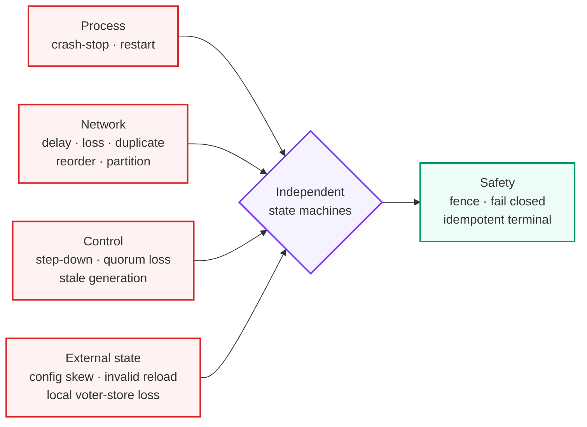
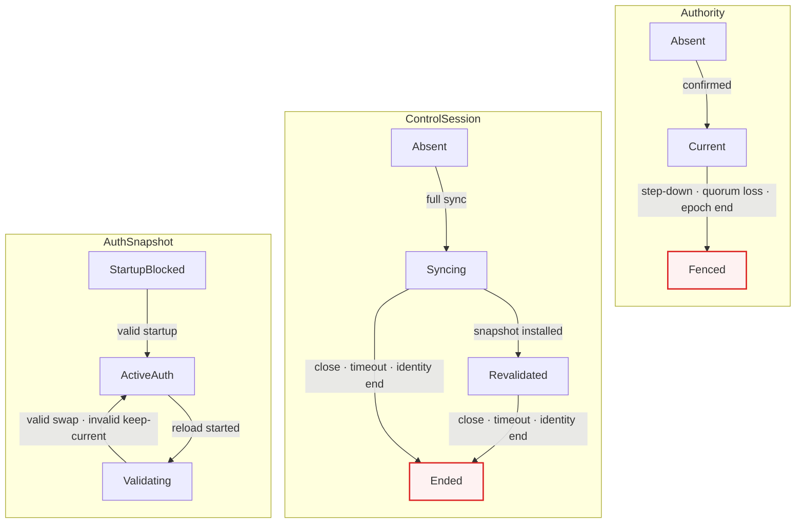
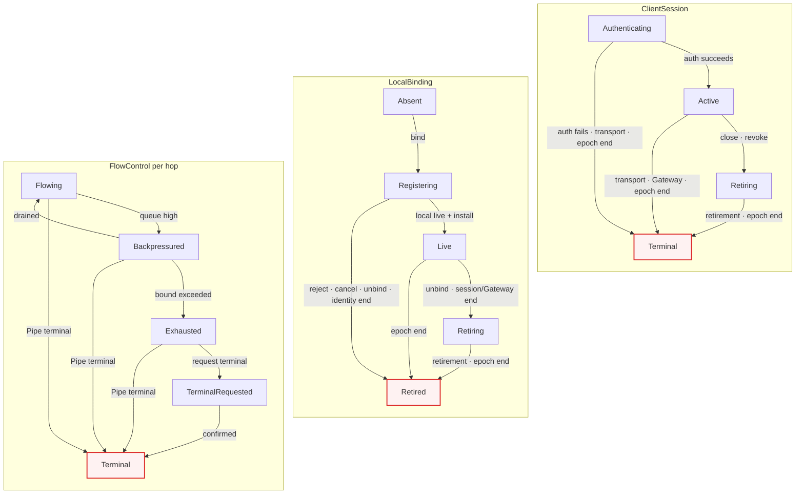
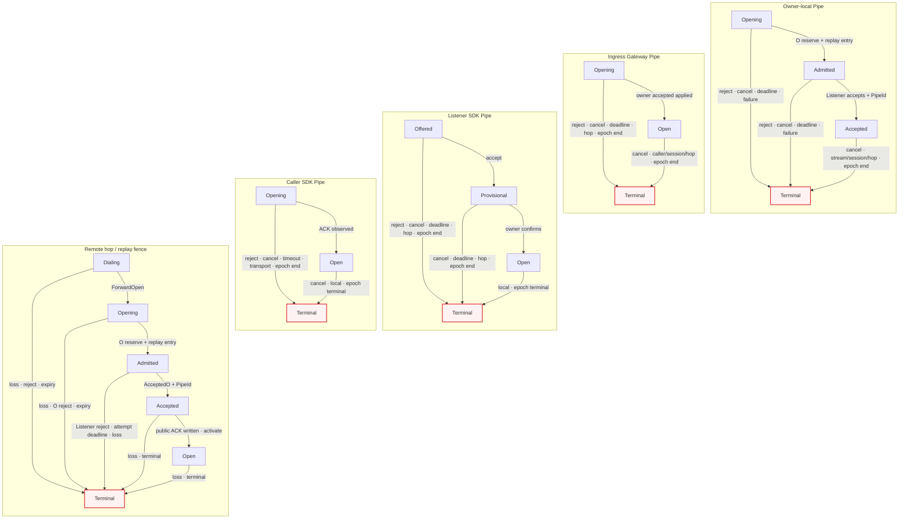
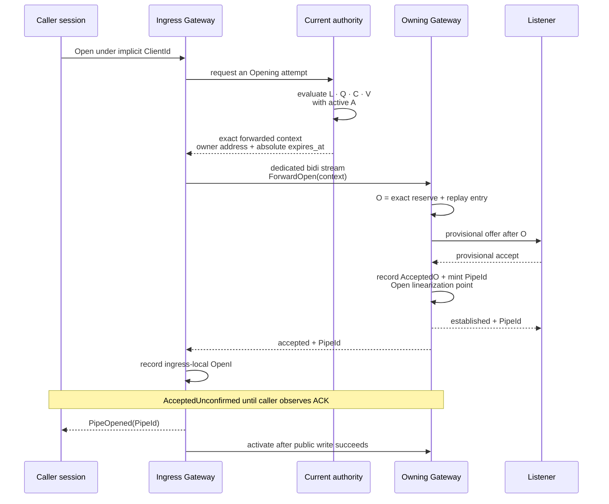
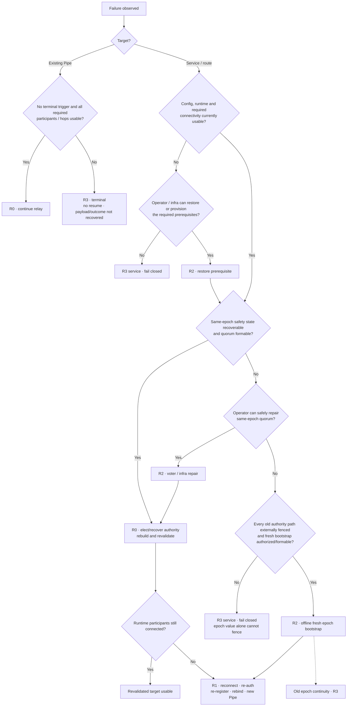

# SPEC 003: Failure and Recovery Model

> **Status:** Draft
>
> RelayGate가 허용하는 failure, 전이의 선형화, 복구 가능 범위와 fault-test oracle을 정의한다.

이 문서는 [SPEC 001](001-system-model.md)의 identity·admission·Pipe 계약과
[SPEC 002](002-client-configuration-and-presence.md)의 config·관찰 계약을 실패 상황에서도 유지하도록
구체화한다. 아래에서 **불변식**은 구현이 반드시 만족해야 하는 동작이다. Failure-detector/control-retry
timeout 값, wire code와 fencing을 구현하는 grant·lease·round-trip 방식은 **구현 선택**이다. 반면 remote
Open의 absolute expiry, `relay.open_timeout` validity와 아래 clock-skew bound는 correctness 조건이다.

## Failure model과 범위 밖



| Failure domain | 이 spec이 모델링하는 것 | 즉시 보장하는 것 |
| --- | --- | --- |
| Process | Gateway, SDK participant, leader 또는 voter의 crash-stop과 restart | Runtime identity와 memory state를 재사용하지 않는다. |
| Network | 유한·무한 지연, loss, duplicate, reorder, partition | 늦은 state-advancing message를 identity와 generation/value CAS로 fence한다. |
| Control | authority 변경/상실, quorum 상실, control session 종료·timeout | 새 bind, resolve와 one-attempt context 발급은 fail closed한다. 같은 epoch에서 이미 발급된 attempt와 기존 Pipe는 local ordering을 따르며 epoch end에는 terminal이다. |
| Storage | Durable Raft state를 보존한 restart와 탐지 가능한 voter-store unavailable·loss·corruption | 검증 가능한 state로만 safety를 복구한다. 잃은 voter identity는 재사용하지 않고, quorum state를 증명하지 못하면 same epoch를 강제 복구하지 않는다. |
| Config | Process별 reload 성공·실패·지연과 revision skew | 각 process는 validated snapshot만 atomic하게 사용한다. Cluster-wide 동시 적용을 가정하지 않는다. |
| Operator | 명시적인 offline reset/bootstrap | 모든 old authority/admission path를 외부적으로 fence한 뒤에만 새 `ClusterEpoch`를 활성화한다. Hot epoch 전환은 없다. |
| Clock | Authority와 Gateway wall clock의 유한 skew | `ClockSkewBound < relay.open_timeout`을 증명할 수 있을 때만 remote Open을 활성화한다. Owner는 `now < expires_at`만 accept한다. |

HTTP/RPC caller cancellation과 caller-owned deadline은 authority 또는 quorum 상실의 증거가 아니다. 해당
호출만 unavailable로 끝내며 current authority와 다른 control session은 유지한다. Global fence는 definitive
role/epoch 상실 또는 manager-owned authority probe의 failure observation이 소유한다.

Crash와 partition은 관찰만으로 구분할 수 없다. Timeout은 death proof가 아니라 suspicion이다. Suspect
판정은 route를 ineligible로 만들어 false positive 때 availability를 줄일 수 있지만, 어떤 admission gate도
참으로 만들거나 stale state를 current로 승격할 수 없다. Failure-detector timeout 값은 correctness 조건이
아니다. 공통
가정은 crash-recovery가 아니라 **crash-stop 뒤 새 runtime identity로 재참여**한다는 것이다. Voter만
[ADR 004](../adr/004-raft-safety-state-durability.md)의 durable safety state를 복구할 수 있다.

새 epoch 값 자체는 network partition 뒤의 unreachable old authority를 fence하지 못한다. Offline
bootstrap은 모든 old authority/control/admission path가 외부 traffic·network·process control로 차단됐다는
증명을 요구한다. 영구적으로 증명하거나 fence할 수 없으면 새 epoch를 열지 않고 fail closed한다.

다음은 범위 밖이다.

- Byzantine process, 위조된 identity, 침해된 credential과 탐지되지 않은 memory/disk corruption
- Pipe, payload, inflight byte, buffer, application 결과의 durable delivery·replay·exactly-once·resume
- RelayGate가 수행하는 application retry, deduplication, workflow와 offline storage
- 자동 `ClusterEpoch` 변경, 두 epoch의 hot merge, region backup/restore 정책
- REST presence를 history, synchronization log, route authority 또는 복구 증명으로 사용하는 것
- Peer authentication/mTLS가 없는 internal owner listener를 production/shared/untrusted network에 배포하는 것

## State machine overview

Global `Healthy`/`Degraded` state를 만들지 않는다. System state는 다음 machine의 곱이며, route와 복구
상태는 이들에서 계산한 파생값이다. 정확한 state/event 집합, guard, 전이와 default 처리는
[SPEC 004](004-state-transition-model.md)가 소유한다. 아래 diagram은 failure를 이해하기 위한
non-normative overview이며 충돌할 때는 SPEC 004가 우선한다.

```text
SystemState = Authority × Quorum × ControlSession × Presence × AuthSnapshot
            × ClientSession × LocalBinding × FlowControl
            × OwnerPipe × IngressPipe × ListenerPipe × CallerPipe
            × ForwardedAttemptFence × RemoteHop
            × OpenAllAccumulator
```







`Quorum ∈ {Unavailable, Available}`이다. `Presence ∈ {NoAuthority, Rebuilding, Complete}`이며 authority
상실을 local하게 관찰하면 `NoAuthority`, 새 authority는 `Rebuilding`에서 시작한다. `Syncing`, `Validating`,
`RetiringS/B`에서는 각각 `V`, 새 snapshot, `A/O`가 아직 참이 아니다. Context는 expiry 뒤 새 O에 쓸 수 없고
replay entry는 expiry에 GC할 수 있다. `Fenced`, `EndedC`, `TerminalS`,
`RetiredB`, `TerminalF/O/I/L/C`는 해당 identity에서 absorbing state다. 재연결·재등록·rebind·retry는 이전
machine을 되살리지 않고 새 identity의 machine을 만든다. 하나의 event가 여러 machine을 전이시킬 수
있지만 각 state의 owner와 수명은 섞지 않는다.

`Validating`은 reload candidate의 작업 상태다. 성공적인 atomic swap 전까지 기존 `ActiveAuth` snapshot이
계속 인증 source이며 invalid candidate는 이를 대체하지 않는다.

`AcceptedUnconfirmed`는 별도 전역 state가 아니라 **살아 있는** `OwnerPipe=AcceptedO`이지만 caller SDK가
아직 `OpenC`를 관찰하지 않은 파생 상태다. Owner는 caller application의 ACK 관찰 여부를 알거나 추측하지
않는다. Owner crash 뒤에는 이 volatile state도 사라지며 Open LP가 지났을 가능성과 exact outcome만
복구 불가능하게 남는다.

### Canonical transition contract

모든 machine은 [SPEC 004](004-state-transition-model.md)의 total transition function을 따른다. 명시된
전이 외의 조합도 stale rejection, idempotent no-op 또는 stable rejection 중 하나로 결정되며 암묵적인
state advancement는 없다. `OpenAll` 역시 SDK-local accumulator일 뿐 cluster-wide aggregate state가 아니다.

## Canonical New-Pipe admission



이 sequence는 same-Gateway와 remote owner에 같은 admission/LP 의미를 준다. Current evidence에는 dedicated
hop/context/replay unit·integration test와 isolated 3-node Compose H12 pass가 있다. Arbitrary fault matrix,
peer auth/mTLS와 production trust는 아직 증명하지 않는다. 범위는 [TEST 001](../test/001-core-correctness-test-plan.md)의
inventory로 판정한다.

`ForwardedOpenContext`는 `ClusterEpoch/AuthorityId/AttemptId`, exact ingress
`GatewayId/GatewayInstanceId/ControlSessionId`, caller `AuthContext`, exact
`BindingKey/BindingGeneration/ListenerBindingRef`, exact owner advertise address와 absolute `expires_at`을 묶는다.
Authority는 quorum confirmation 뒤 `expires_at = issue_wall_clock + relay.open_timeout`으로 발급한다. Ingress는
response의 ingress tuple이 자기 exact live control session과 일치함을 forwarding 전에 검사한다. Owner는 tuple의
structural validity, current epoch, exact local binding/auth retirement와 `now < expires_at`을 검사한다.
`ClockSkewBound < relay.open_timeout`을 증명하지 못하면 remote correctness를
주장할 수 없다. Same-epoch authority 변경만으로 issued attempt를 소급 취소하지 않으며 `AuthorityId`는
발급 provenance다. Equality-only `auth_revision` 차이만으로 유지된 immutable key를 취소하지 않는다.

Owner는 exact O guard를 확인하고 local attempt reservation과 successful `AttemptId` replay entry insert를
원자화한 뒤에만 Listener에게 offer한다. Entry는 Listener reject나 pre-LP terminal 뒤에도 같은 Owner process가
살아 있는 동안 `expires_at`까지 남는다. Owner crash는 cache를 잃고 old instance/context를 fence한다. Reserved
duplicate와 full cache는 fail closed하고 이전 response/PipeId를 replay하지 않는다. O guard
실패는 consume하지 않아 unexpired 동안 재평가할 수 있다. O reservation 뒤 hop retry/redial/reconnect,
same-Pipe resume/attach와 payload replay는 없다.

Peer auth/mTLS 전에는 이 binding이 cryptographic peer proof가 아니다. Owner는 actual stream peer/current ingress
session이나 자기 advertise address의 authority-currentness를 검증하지 않으며 trusted honest peer를 가정한다.
Wire tamper·peer impersonation test는 production blocker이지 이 plaintext slice의 통과 주장이 아니다.

```text
AdmitOpen = A ∧ L ∧ Q ∧ C ∧ V ∧ O
```

| Symbol | 반드시 참인 조건 | 평가 위치 |
| --- | --- | --- |
| `A` | 인증된 `ClientId` 안의 caller `ClientSessionId`가 active하며 해당 attempt를 시작할 수 있음 | Ingress와 authority admission |
| `L` | `(ClusterEpoch, AuthorityId)`가 confirmed current authority임 | Authority admission decision |
| `Q` | 그 authority가 새 admission을 결정할 quorum을 확인함 | Authority admission decision |
| `C` | 같은 `ClientId`와 current epoch에 exact generation/ref의 live committed `BindingSlot`이 있음 | Authority admission decision |
| `V` | current `ControlSessionRef`로 재검증한 full snapshot에 exact ref가 있음 | Authority admission decision |
| `O` | Structurally bound provenance, current epoch, expiry, exact local binding/auth와 capacity가 유효해 local reservation+replay entry를 원자적으로 만들 수 있음 | Owning Gateway의 pre-offer compare-and-reserve |

`ClientId` namespace는 `A`와 `C`에 포함되며 별도 선택/fallback gate가 아니다. `OpenAll`은 target마다 이
식을 독립적으로 평가하며 묶음 전체의 atomic success를 만들지 않는다.

| Boolean vector `(A L Q C V O)` | System verdict |
| --- | --- |
| `1 1 1 1 1 1` | Owner가 exact attempt를 reserve하고 replay entry를 insert한 뒤 Listener에게 offer한다. 아직 Pipe success가 아니다. |
| 나머지 63개 조합 | `Not admitted`; Listener offer와 새 Pipe/PipeId가 없다. Protocol invariant상 불가능한 vector는 proof를 남긴다. |

이 식은 여섯 값을 한 process에서 동시에 CAS하라는 뜻이 아니다. `L·Q·C·V`는 single-use authority
admission에서 평가하고 O는 owning Gateway가 pre-offer reservation/replay insertion으로 순서화한다. O가
성공한 attempt만 provisional offer로 간다. Listener accept를 Owner가 `AcceptedO`로 기록하고 `PipeId`를 만드는
순간 Open이 선형화된다. Boolean vector 중 protocol invariant상 도달 불가능한 조합은 test가 아니라 proof를
남긴다. Accept 뒤 ACK가
유실되고 owner가 살아 있으면 internal truth는 `AcceptedUnconfirmed`, caller가 관찰하는 결과는 `Unknown`
또는 transport failure다.

## Linearization point

| Operation/observation | Linearization point | 실패 뒤 의미 |
| --- | --- | --- |
| Valid config reload | Process-local immutable snapshot의 atomic swap | 새 auth는 즉시 새 snapshot을 사용한다. 제거 대상의 local retirement가 끝날 때까지 `config_converged=false`다. |
| Invalid config reload | 없음 | 기존 snapshot과 runtime을 그대로 유지한다. |
| Binding install/replace | Raft에서 expected generation/value CAS가 다음-generation live slot으로 apply되는 순간 | 같은 target generation/value replay만 idempotent하며 delayed old CAS는 tombstone 뒤에도 mismatch다. |
| Explicit unbind/session retirement | Owner가 exact local binding을 `LiveB → RetiringB`로 만드는 순간 | 즉시 ineligible이며 conditional next-generation tombstone apply와 cleanup은 나중이어도 안전하다. |
| Authority admission | Current authority가 `A·L·Q·C·V`를 만족한 single-use context를 확정하는 순간 | 아직 Pipe success가 아니다. Same-epoch quorum loss 뒤 새 context는 발급하지 않으며 consumed·cancelled context와 old-epoch context는 재사용할 수 없다. |
| Owner attempt admission (`O`) | Owner가 exact binding에 local attempt reservation과 successful `AttemptId` replay entry insert를 원자적으로 적용하는 순간 | 이때부터 unbind는 attempt를 소급 취소하지 않는다. Entry는 Listener 결과와 무관하게 expiry까지 남지만 아직 Pipe/PipeId는 없다. |
| Open | Reserved attempt의 provisional Listener accept를 Owner가 `AcceptedO`로 기록하며 `PipeId`를 만드는 순간 | ACK 전에도 owner-local accepted다. Listener SDK는 owner confirmation 뒤에만 Pipe handle을 노출한다. Crash/response loss는 caller `Unknown`일 수 있다. |
| Pipe terminal | 각 participant/hop이 자기 첫 local terminal 전이를 확정하는 순간 | 이후 local terminal event는 no-op이고 전파는 best-effort·idempotent다. Peer는 signal 수신 또는 독립적인 hop/session failure 감지 뒤에만 terminal이다. |
| Presence/config observation | Current authority가 해당 completeness snapshot을 publication하는 순간 | Authority 상실 뒤 이전 `complete/true`는 재사용하지 않는다. |

Ingress의 `OpenI` apply와 Caller의 ACK observation은 Open의 linearization point가 아니다. Binding record
commit도 Open의 linearization point가 아니며 `V`와 `O` 없이 route가 되지 않는다.

## Transition과 race matrix

| Race | 먼저 선형화된 것 | 반드시 관찰할 결과 |
| --- | --- | --- |
| Authority loss ↔ O reservation | Quorum-confirmed context가 먼저 발급됨 | Same epoch provenance는 유지되지만 structural context, local binding/auth, expiry/replay guard를 O에서 검사한다. Authority loss만으로 issued attempt를 소급 취소하지 않는다. |
| Authority loss ↔ O reservation | 새 context 발급 차단 또는 local cancel/retirement | 새 attempt를 reserve할 수 없다. Consumed·cancelled context와 state-advancing old control message는 no-op이다. |
| Quorum loss ↔ new control op | Bind commit 또는 per-attempt context 발급 | 이미 확정된 결과와 시작한 attempt만 유지한다. 그 뒤 새 bind/resolve/context 발급은 멈춘다. |
| Unbind ↔ O reservation | O reservation + replay insert | Admitted attempt는 Listener accept/reject까지 진행한다. Unbind는 뒤 attempt만 막는다. |
| Unbind ↔ O reservation | Local binding retirement | `O=false`; Listener offer가 없고 context는 consume되지 않는다. |
| Cancel ↔ Listener accept | Listener accept/AcceptedO | Accepted 뒤 cancel이 owner-local terminal을 만든다. Caller outcome은 ACK 순서에 따라 `Open` 또는 `Unknown`이다. |
| Cancel ↔ Listener accept | Attempt cancel | Late Listener accept는 no-op이다. O에서 만든 replay entry는 expiry까지 남는다. |
| Credential removal ↔ ClientSession auth | Final current-snapshot revalidation | 겹친 인증은 pre-swap session으로 선형화될 수 있지만 같은 reload가 `LocalRetirementDone` 전에 retire한다. |
| Credential removal ↔ ClientSession auth | Auth snapshot swap | Final revalidation은 제거된 credential을 거부하고 session을 만들지 않는다. |
| Credential removal/session close ↔ Open | Session이 authority admission 전에 terminal | `A=false`; 새 Pipe는 생기지 않는다. |
| Credential removal/session close ↔ Open | Listener accept/AcceptedO | Accepted 뒤 session terminal이 local Pipe를 닫는다. 중간 race는 O reservation과 cancel 순서로 귀결된다. |
| Context expiry ↔ O reservation | O reservation + replay insert | Attempt는 Listener accept/deadline ordering을 따르고 entry는 expiry까지 남는다. 열린 Pipe는 cache expiry로 닫히지 않는다. |
| Context expiry ↔ O reservation | `now >= expires_at` | `O=false`; offer/Pipe/PipeId가 없고 expired context는 재평가할 수 없다. |
| Original ↔ duplicate ForwardOpen | Original O reservation/replay entry | Listener reject 뒤에도 duplicate/full-cache request는 fail closed하고 response/PipeId를 replay하지 않는다. |
| Owner/ingress identity change ↔ ForwardOpen | Ingress control session이 response와 불일치 또는 owner address dial이 실패 | Ingress는 mismatch를 send 전에 거부한다. Address는 dial selection일 뿐이다. Plaintext Owner는 actual peer/current-session 또는 자기 advertised-address currentness를 증명하지 않는다. |
| Owner LP ↔ internal response/hop loss | Loss가 LP 미통과를 증명 | Stable failure가 가능하다. |
| Owner LP ↔ internal response/hop loss | LP 통과 가능 또는 LP 뒤 loss | Ingress/caller outcome은 `Unknown`; redial, resume와 payload replay가 없다. |
| Public ACK ↔ remote activation | Public `PipeOpened` write success 뒤 activation | Listener→caller payload release 가능하다. 이전 payload는 bounded hold이며 early terminal이 우선한다. |
| ACK loss ↔ live owner | Owner-local accept | Owner가 살아 있는 동안만 `AcceptedUnconfirmed`이며 caller 결과는 `Unknown`일 수 있다. 같은 Pipe에 resume하지 않는다. |
| Owner crash ↔ accepted delivery | Owner-local accept 전/후 crash | Accept 전이면 accepted Pipe가 없다. Accept 뒤 crash면 Open LP가 지났을 수 있지만 volatile owner state와 exact outcome은 복구 불가이고 caller는 `Unknown`이다. Peer는 failure를 local하게 감지한 뒤 terminal이다. |
| Ingress crash ↔ owner accepted | Ingress apply 전/후 crash | Ingress state와 caller ACK는 소실된다. 살아 있는 owner는 `AcceptedUnconfirmed`일 수 있고 caller는 `Unknown`; same-Pipe attach/resume은 없다. |
| Delayed install/remove ↔ rebind | New generation/value CAS | Tombstone 뒤 key가 다시 live여도 old generation CAS는 mismatch이며 새 ref를 덮거나 지우지 않는다. |
| Failover ↔ completeness | Authority loss | 이전 presence/config publication은 무효다. 새 authority는 `Rebuilding`에서 다시 계산한다. |
| Gateway timeout ↔ config rollout | Presence timeout classification | `presence.complete`일 수 있어도 unreported Gateway 때문에 `config_converged`와 `RevocationSafe`는 참이 아니다. |
| Backpressure exhaustion ↔ close/cancel | 각 participant의 first local terminal | Payload를 silent drop하지 않고 terminal/control signal은 막힌 payload queue를 우회한다. 각 local terminal만 absorbing이며 peer의 즉시·전역 수렴은 요구하지 않는다. |

## Crash-cut coverage

Fault test는 성공 응답만 끊지 말고 아래 모든 correctness boundary의 **직전/직후**에 crash, connection loss와
message replay를 주입한다.

| Flow | 필수 cut | Oracle |
| --- | --- | --- |
| Binding install | Generation/value CAS apply 전 / apply 뒤 ACK 전 / ACK 뒤 / remove+tombstone+rebind 뒤 old replay | 최신 slot 하나뿐이다. Same target-generation replay만 idempotent하며 old generation은 tombstone 뒤에도 no-op다. |
| Open / remote hop | Context 발급과 ForwardOpen 전후 / O reservation+replay insert 전후 / Listener provisional accept와 AcceptedO+PipeId 전후 / accepted response와 ingress apply 전후 / public `PipeOpened` write와 activation 전후 | O 전에는 offer/entry가 없다. O 뒤 entry는 reject에도 expiry까지 남고, Open LP 전에는 PipeId가 없다. LP 통과 가능/이후 response loss는 `Unknown`; redial/resume/replay하지 않는다. |
| Forwarded replay / expiry | Original/duplicate 순서 / cache full 전후 / Listener reject 전후 / `now <`, `==`, `>` expires_at / entry GC 전후 | 한 `AttemptId`에 최대 하나의 O reservation/offer와 AcceptedO/PipeId다. Duplicate/full/expired는 fail closed하고 prior result를 replay하지 않는다. Failed O guard는 consume하지 않으며 GC 뒤 context expiry가 ABA를 막는다. |
| Remote payload | Public `PipeOpened` write 전후 / activation 전후 / 각 방향 enqueue·write 전후 / backpressure terminal 전후 / internal hop loss 전후 | Activation 전 listener payload는 release하지 않는다. 방향별 FIFO, silent-drop 금지, terminal priority와 no payload replay를 지킨다. Hop loss는 양 segment의 local terminal trigger다. |
| Unbind/session end | Local retirement 전 / retirement 뒤 Raft remove 전 / remove 뒤 | Retirement 뒤에는 stale record가 남아도 ineligible이고 late cleanup은 새 ref를 손상하지 않는다. |
| Config removal | Candidate validation 전 / snapshot swap 전 / swap 뒤 local attempt·session·binding·segment retirement 전 / retirement 뒤 report 전 | Swap 전에는 old snapshot, swap 뒤에는 제거 credential의 새 local admission 불가, retirement/report 전에는 convergence 불가다. |
| Authority failover | Old authority fence 전 / fence 뒤 election 전 / new authority의 partial revalidation / completeness publication 뒤 | Fence 뒤 새 context 발급과 old state advancement는 없고, 이미 발급된 same-epoch single-use attempt는 race matrix를 따른다. Partial view는 incomplete다. |
| Pipe terminal | Local terminal 전 / terminal 뒤 peer propagation 전 / duplicate terminal 뒤 | Participant마다 local absorbing terminal과 duplicate no-op만 보장한다. Peer는 signal 수신 또는 독립 failure 감지 전까지 open일 수 있다. |
| Voter restart | Durable safety write 경계와 log/snapshot recovery 경계 | Raft safety를 위반하거나 recovered record만으로 route를 활성화하지 않는다. Local state를 잃은 voter identity는 재사용하지 않는다. |
| Offline epoch reset | 모든 old authority path의 external fence 전 / fence proof 뒤 bootstrap 전 / new epoch activation 뒤 | Epoch 값만으로 fence하지 않는다. Fence proof 전에는 fail closed하고 두 epoch를 동시에 current로 쓰지 않는다. |

Cut 뒤 관찰 응답이 유실될 수 있으므로 test oracle은 client 응답만이 아니라 durable Raft state, current
generation, owner local state와 terminal propagation을 함께 본다.

## Control failure axes와 조합 기준

| Axis | Equivalence classes |
| --- | --- |
| `F1 Authority` | current / changing·absent / stale message |
| `F2 Quorum` | available / unavailable·recovering |
| `F3 Control session` | current·revalidated / partitioned·timeout / superseded reconnect |
| `F4 Gateway runtime` | live / crashed / restarted with new `GatewayInstanceId` |
| `F5 Auth config` | converged / revision skew·unreported / invalid candidate |
| `F6 Runtime/data capacity` | flowing·capacity available / interrupted / session·attempt·Pipe table 또는 bounded-buffer exhaustion |
| `F7 Voter storage` | intact / one local store lost / same-epoch quorum state unavailable |
| `F8 Remote owner hop` | exact·unexpired / stale·duplicate·full / interrupted before-or-after LP |

최소 조합 기준은 모든 axis pair의 모든 equivalence-class pair를 한 번 이상 관찰하는 것이다. State
invariant상 불가능한 pair는 생략하지 말고 도달 불가능성의 근거를 남긴다.

```text
PairwiseCoverage = ∀i < j, ∀x ∈ Fi, ∀y ∈ Fj:
    observed(Fi=x ∧ Fj=y) ∨ proved_unreachable(Fi=x ∧ Fj=y)
```

Pair가 linearization point와 경쟁하면 두 event order를 모두 시험한다. Pairwise만으로 놓치기 쉬운 다음
3-way scenario는 별도 필수다.

1. **Authority change × quorum loss × stale control reconnect:** 새 admission은 없고 old
   `AuthorityId/ControlSessionId` snapshot은 current state를 바꾸지 않는다.
2. **Credential removal × Gateway timeout/unreported × presence classification:** timeout 분류로
   `presence.complete=true`가 될 수 있어도 revocation convergence를 주장하지 않는다. 해당 Gateway가
   removal revision과 retirement 완료를 보고하거나 client auth/relay traffic에서 외부적으로 fence되어야
   전역 안전 주장을 할 수 있다.
3. **Listener accept × ACK loss × owner crash:** owner가 살아 있는 동안만 `AcceptedUnconfirmed`다. Crash 뒤
   Open LP 통과 여부를 복원하지 못하며 service/route는 새 instance와 rebind로 R1일 수 있어도 그
   Pipe·inflight payload·application outcome은 R3다.
4. **Old-epoch partition × same-epoch state unavailable × reset request:** 새 epoch 값이나 새 quorum만으로
   unreachable old authority를 fence했다고 보지 않는다. 모든 old admission path의 external fence를
   증명할 수 없으면 service는 R3/fail closed다.
5. **Backpressure exhaustion × cancel × participant crash:** 각 participant가 서로 다른 원인으로 local
   terminal을 확정할 수 있다. 원인이나 state에 global order/convergence를 만들지 않고 local absorbing
   terminal, silent-drop 금지와 payload non-replay만 보장한다.
6. **`OpenAll` partial accept × authority failover × response loss:** 내부 target은 독립적으로
   not-admitted, admitted, accepted 또는 terminal일 수 있다. SDK accumulator는 이를 caller-visible
   `Opened`, `Failed`, `Cancelled`, `Unknown`으로만 노출하며 묶음 rollback, same-Pipe resume 또는 결과 추측은
   없다.
7. **Forwarded duplicate × expiry boundary × owner response loss:** O reservation/offer가 한 번만 성공하고
   Listener reject 뒤에도 cache entry는 `expires_at`까지 남는다. Duplicate/full/expired request에 response나
   `PipeId`를 replay하지 않으며 LP 통과를
   배제할 수 없는 ingress/caller outcome은 `Unknown`이다.

In-band evidence는 [SPEC 002](002-client-configuration-and-presence.md)의 `config_converged=true`와
operator-known removal `auth_revision` 일치를 요구한다. 하지만 current control set에서 빠진 old Gateway가
traffic-capable할 수 있으므로 이것만으로 cluster-wide revocation을 증명하지 않는다.
`RevocationCandidates(removal, observation)`는 하나의 proof evaluation에서 고정하는 집합이다. Removal
operation부터 그 observation까지 어느 때든 제거 대상 credential을 포함한 snapshot으로 client/relay traffic을
처리할 수 있었던 모든 `GatewayInstanceId`를 포함한다. Equality-only `auth_revision`의 전후 순서를 추론하지
않으며 timeout이나 control-record 제거만으로 candidate를 빼지 않는다.

```text
RevocationSafe(removal_revision, observation) =
  ConfigConverged(observation)
  ∧ CommonReportedRevision(observation)=removal_revision
  ∧ ∀ g ∈ RevocationCandidates(removal, observation):
      ((ReportedRevision(g)=removal_revision
        ∧ LocalRetirementDone(g,removal_revision))
       ∨ CleanTerminationProved(g)
       ∨ ExternallyFencedFromClientAndRelayTraffic(g))
```

이 predicate는 point-in-time observation이다. 이후 새 Gateway/config/control generation이 나타나거나 external
config가 rollback되면 이전 proof는 무효이며 새 candidate set으로 다시 평가한다. RelayGate는 이를 durable
revocation ledger로 바꾸지 않는다. Candidate set의 완전성을 증명할 수 없으면 `RevocationSafe=false`다.

## Recovery level은 target별이다

| Level | 해당 target에 대한 의미 | 대표 target |
| --- | --- | --- |
| `R0 Automatic` | Participant나 operator action 없이 runtime이 계속하거나 자동 재구축한다. | 살아 있는 기존 Pipe, Raft election/recovery, authority revalidation·presence rebuild |
| `R1 Participant` | SDK/Gateway participant가 reconnect·re-auth·re-register·rebind하거나 새 Pipe를 연다. Operator control-plane 변경은 없다. | Gateway/client/listener 재연결, 새 runtime identity와 새 Pipe |
| `R2 Operator/infra` | Operator 또는 infrastructure repair가 prerequisite나 control plane을 복구한다. | External config restore, voter replacement, network/process fencing, binding-key capacity 회수를 위한 offline epoch reset/bootstrap |
| `R3 Irrecoverable` | 그 exact target의 state 또는 outcome을 RelayGate가 복원할 수 없다. | Old authority/control/session/binding identity, Pipe, inflight/buffer/payload, lost-ACK outcome |

Level은 incident의 단일 심각도가 아니다. Surviving quorum과 자동 process restart가 있는 Gateway-only
owner crash는 해당 route에 R1, 영향받은 Pipe/outcome에 R3일 수 있다. Quorum이 선출로 유지되면 service는
R0이고 voter/storage repair가 필요하면 service는 R2다. R1/R2 뒤의 새 Pipe는 R3 Pipe의 복구가 아니라
별도 operation이다.

등급은 누적 action class다. R2 prerequisite 복구 뒤 R1 reconnect가 이어지면 전체 recovery plan은 R2다.
여러 plan이 가능하면 필요한 최상위 action class가 가장 낮은 안전한 plan을 택하며, 어떤 R0–R2 plan도
predicate를 만족하지 못할 때만 그 target은 R3다.

### Exact service recoverability

Target deployment `T`에 대해 다음 predicate를 쓴다.

```text
SameEpochControlRecoverable(T) = SafetyStateRecoverable(T) ∧ QuorumFormable(T)

FreshEpochRecoverable(T) = AuthorizedOfflineReset(T)
                         ∧ EveryOldAuthorityPathExternallyFenced(T)
                         ∧ NewQuorumFormable(T)

ExternalAuthConfigEstablishable(T) = ValidExternalConfigAvailableOrRestorable(T)
                                   ∨ OperatorCanProvisionNewAuthoritativeConfig(T)

ServiceRecoverable(T) = ExternalAuthConfigEstablishable(T)
                      ∧ RequiredRuntimeAndConnectivityRestorable(T)
                      ∧ (SameEpochControlRecoverable(T) ∨ FreshEpochRecoverable(T))

RouteRecoverable(T, BindingKey) = ServiceRecoverable(T)
                                ∧ CredentialForClientIdRecoverable(BindingKey.ClientId)
                                ∧ CallerCanReconnectAndReauthenticate(BindingKey.ClientId)
                                ∧ ListenerCanReconnectAndRebind(BindingKey)
```

`SafetyStateRecoverable`은 하나의 non-fenced current epoch에서 quorum-compatible한 Raft safety state를
복구할 수 있다는 뜻이다. `EveryOldAuthorityPathExternallyFenced`는 unreachable partition을 포함한 모든
old process/network/traffic admission path가 외부적으로 차단됐다는 증명이다. 새 `ClusterEpoch` 값은 이
항을 대신하지 않는다. Fresh-epoch service는 R2지만 이전 epoch continuity는 R3다. 같은 epoch가
unrecoverable이고 이 fence를 영구적으로 증명할 수 없으면 `ServiceRecoverable=false`, R3/fail closed다.
Recovered `BindingRecord`만으로 `RouteRecoverable` 또는 admission이 참이 되지 않는다. 새 identity로
re-enrollment하면 service는 복구할 수 있어도 이전 `ClientId` namespace의 route continuity를 복구한 것은
아니다. Re-enrollment는 operator가 먼저 새 authoritative external config를 만들고 participant에 credential을
배포하는 R2 절차다. RelayGate는 config나 credential을 생성하지 않는다.

### Irrecoverable cases

| Target | R3 condition | 그래도 가능한 것 |
| --- | --- | --- |
| Runtime identity | `GatewayInstanceId`, authority/control/session/binding/Pipe identity가 terminal·fenced됨 | R1/R2로 새 identity를 만들 수 있지만 old identity는 부활하지 않는다. |
| Pipe data position | Participant/hop 종료로 memory, inflight, buffer 또는 exact delivery 위치를 잃음 | Application이 R1 새 Pipe를 열 수 있으나 payload replay는 없다. |
| Open/application outcome | Listener accept 뒤 ACK가 유실되어 caller가 `Unknown`을 관찰하고 exact outcome을 확인할 수 없음 | 새 attempt와 application idempotency/deduplication만 가능하다. |
| Same-epoch continuity | Authoritative safety state나 quorum을 복구할 수 없음 | 모든 old path를 external fence할 수 있을 때만 R2 fresh epoch가 가능하다. |
| Service | Same epoch가 불가능하고 하나라도 old authority path를 영구적으로 fence/증명할 수 없음 | Fail closed만 가능하며 새 epoch service도 열지 않는다. |
| Credential/namespace continuity | External config와 backup을 잃어 기존 `ClientId`/verifier를 복구할 수 없음 | Authoritative config 복원은 R2다. 모든 participant를 새 identity로 re-enroll할 수 있으면 service는 R2로 재생성하지만 기존 namespace continuity는 R3다. |

Application은 R3 operation을 새 Pipe로 retry할 수 있지만 중복 업무 효과를 막는 idempotency와 deduplication을
직접 소유한다.

## Recovery decision flow



## Verification contract

필수 state-product, sequence, race, crash-cut, fault-combination과 recovery 검증은
[TEST 001](../test/001-core-correctness-test-plan.md)이 소유한다. 이 문서의 linearization point, crash-cut,
`F1`–`F8` failure axis와 R0–R3 판정은 normative oracle로 남는다. 테스트 목록이 있다는 사실이나 문서
검증 통과는 runtime correctness 통과를 의미하지 않는다.

## 관련 문서와 결정

- [SPEC 001: RelayGate System Model](001-system-model.md)
- [SPEC 002: Client Configuration and Presence](002-client-configuration-and-presence.md)
- [SPEC 004: State Transition Model](004-state-transition-model.md)
- [TEST 001: Core Correctness Test Plan](../test/001-core-correctness-test-plan.md)
- [ADR 001: RelayGate의 역할과 책임 경계](../adr/001-relaygate-role-and-responsibility-boundary.md)
- [ADR 002: Raft control state와 Gateway의 상태 경계](../adr/002-control-plane-and-gateway-topology.md)
- [ADR 004: Raft safety state 최소 영속화](../adr/004-raft-safety-state-durability.md)
- [ADR 006: Client 격리와 외부 credential source of truth](../adr/006-client-isolation-and-external-credentials.md)
- [ADR 008: Cross-Gateway hop과 bounded replay fence](../adr/008-cross-gateway-hop-and-replay.md)
