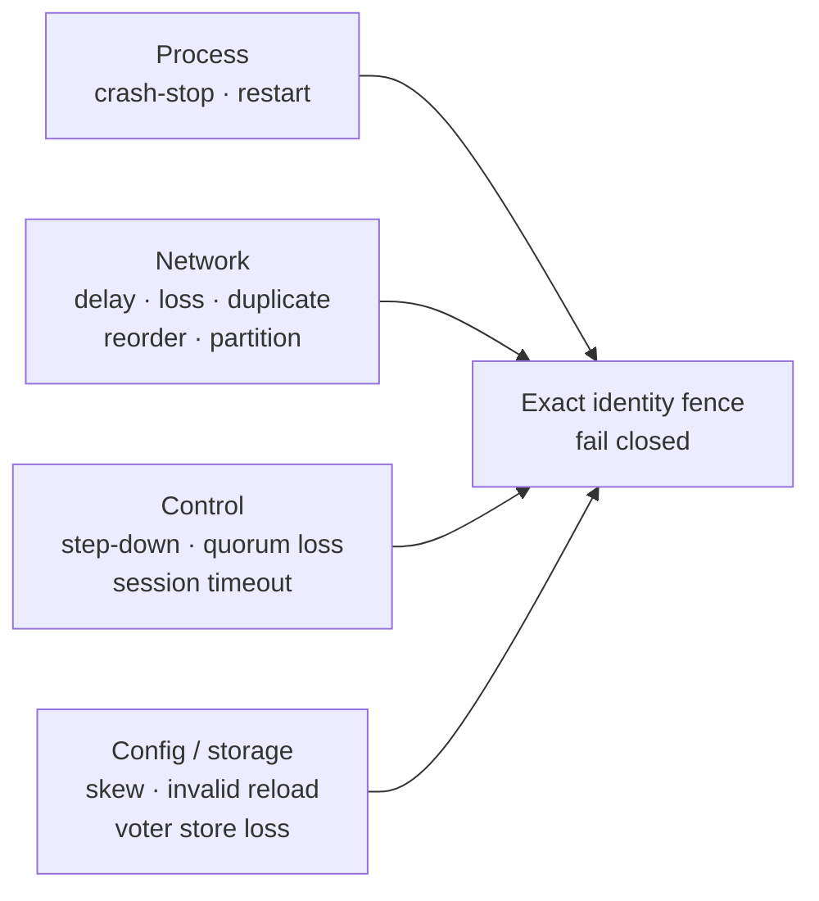
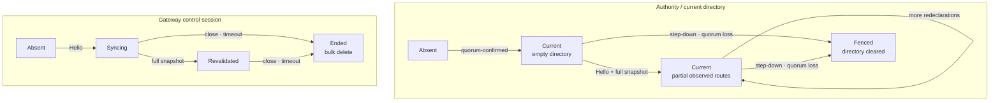
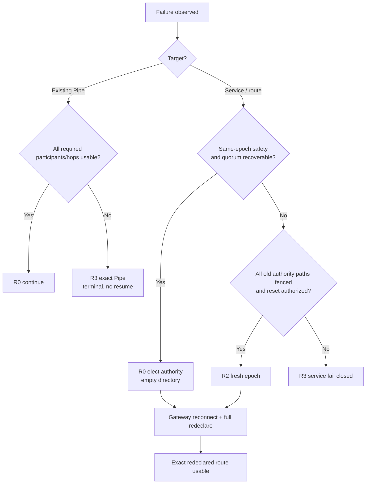

# SPEC 003: Failure and Recovery Model

> **Status:** Draft
>
> Current-state-only control, Pipe failure와 복구할 수 없는 경계를 정의한다.

## Failure model



| Domain | 모델 | 안전한 결과 |
| --- | --- | --- |
| Process | Gateway, SDK, authority 또는 voter crash/restart | Runtime memory와 identity를 복구하지 않고 새 instance/session을 만든다. |
| Network | 유한/무한 delay, loss, duplicate, reorder, partition | Exact authority/session/instance/binding identity가 아닌 state advancement를 거부한다. |
| Control | authority change/loss, quorum loss, control timeout | 새 bind/resolve/context를 fail closed하고 current directory를 삭제한다. |
| Raft storage | Intact safety-state restart, local voter store loss/corruption | Safety와 `ClusterEpoch`만 복구한다. Domain route data는 복구 대상이 아니다. |
| Config | Process별 valid/invalid/delayed reload | 각 process는 validated snapshot만 atomic하게 사용한다. Cluster 동시 적용은 가정하지 않는다. |
| Clock | Authority/Owner wall-clock skew | `ClockSkewBound < relay.open_timeout`일 때만 remote context expiry를 신뢰한다. |
| Operator | Offline reset/bootstrap | 모든 old authority path를 외부 fence한 뒤에만 fresh epoch를 연다. |

Crash와 partition은 timeout만으로 구분할 수 없다. Timeout은 current session/route를 제거해 availability를 줄일 수
있지만 어떤 admission gate도 true로 만들지 않는다. HTTP/RPC caller cancellation은 해당 호출만 실패시키며
manager-owned authority probe의 definitive failure와 구분한다.

범위 밖은 다음과 같다.

- Byzantine process, identity forgery, compromised credential와 탐지되지 않은 memory/disk corruption
- Pipe/payload/inflight/buffer/application outcome의 durable delivery, replay, exactly-once와 resume
- RelayGate가 수행하는 application retry, deduplication, workflow와 offline storage
- Automatic epoch change, two-epoch hot merge와 region backup/restore
- REST presence를 replica inventory, history, route authority 또는 recovery proof로 쓰는 것
- Peer auth/mTLS 없는 internal relay를 shared/untrusted production network에 배포하는 것

## Independent state machines

Global `Healthy/Degraded` state를 만들지 않는다.

```text
SystemState = Authority × Quorum × ControlSession × RouteDirectory × Presence
            × AuthSnapshot × ClientSession × LocalBinding × FlowControl
            × OwnerPipe × IngressPipe × ListenerPipe × CallerPipe
            × ForwardedAttemptFence × RemoteHop
```



Failover의 정상 복구는 **빈 directory → Gateway별 reconnect/full redeclare → exact route별 재개**다. 전체
replica가 돌아올 때까지 기다리는 state는 없다. 먼저 revalidated된 session의 route는 즉시 사용할 수 있고,
아직 redeclare하지 않은 route만 unavailable이다.

`AcceptedUnconfirmed`는 global/durable state가 아니다. Live Owner가 `AcceptedO`를 기록했지만 caller가 ACK를
관찰하지 못한 파생 상태다. Owner crash 뒤 exact outcome은 복구할 수 없다.

## Canonical admission failure

```text
AdmitOpen = A ∧ L ∧ Q ∧ D ∧ V ∧ O
```

| Symbol | 실패하면 |
| --- | --- |
| `A` active caller/auth | Context/offer/Pipe 없음 |
| `L` confirmed current authority | Old publication과 directory를 재사용하지 않음 |
| `Q` admission-capable quorum | 새 context/bind/resolve 중단 |
| `D` exact current directory entry | 다른 target/client/old route로 fallback하지 않음 |
| `V` exact current revalidated owner session | Stale session/address로 dial하지 않음 |
| `O` exact owner local reservation + replay insert | Listener offer/PipeId 없음 |

Authority는 `A·L·Q·D·V`를 만족한 exact `OpenContext`를 발급한다. Owner는 structural provenance, current
epoch, exact local auth/binding, `now < ExpiresAt`, replay/capacity를 검사해 O reservation과 successful
`AttemptId` entry insert를 원자화한 뒤에만 offer한다.

OpenContext는 exact current `AuthorityId`와 `OwnerControlSessionId`에 묶인다. Same epoch라도 authority/session
change가 O보다 먼저면 issued context는 무효다. O reservation+fence가 먼저면 admitted attempt가 Listener
decision과 volatile Pipe lifecycle을 계속한다. Old identity/epoch, consumed/cancelled context, retired local
auth/binding, expired/duplicate/full-cache attempt는 fail closed한다.

## Linearization points

| Operation | LP | ACK/loss 뒤 의미 |
| --- | --- | --- |
| Valid config reload | Process-local snapshot atomic swap | 제거 credential의 local retirement가 이어진다. |
| Full redeclare | Exact session snapshot 전체 검증 뒤 session revalidation + directory set의 atomic install | ACK loss로 stream이 끝나면 session bulk delete; 새 session이 current LiveB 전체를 다시 선언한다. |
| Binding declare | Current revalidated session에 exact non-conflicting entry insert | Same-session exact replay만 idempotent; session end가 true delete한다. |
| Explicit unbind | Owner가 local `LiveB`를 ineligible로 만드는 순간 | Withdraw는 exact entry를 true delete한다. ACK loss/stream end 뒤에도 route가 남지 않는다. |
| Authority change/loss | Old authority를 fence하고 all session/directory를 clear하는 순간 | 새 authority는 empty current view에서 시작한다. |
| Authority admission | `A·L·Q·D·V` exact context 확정 | Pipe success/lease가 아니다. O 전 authority/session change가 context를 무효화한다. |
| Owner admission O | Local attempt reservation + replay entry의 atomic insert | Unbind가 이후면 admitted attempt만 계속한다. 아직 PipeId는 없다. |
| Open | Owner가 Listener accept를 `AcceptedO`로 기록하고 `PipeId`를 만드는 순간 | Response loss 시 caller `Unknown` 가능; same-Pipe resume 없음 |
| Pipe terminal | Participant가 first local terminal을 확정하는 순간 | Local absorbing; peer propagation best-effort/idempotent |
| Presence | Confirmed authority가 current memory counts를 읽는 순간 | Completeness/history를 뜻하지 않음 |

## Race matrix

| Race | 먼저 선형화된 것 | 결과 |
| --- | --- | --- |
| Authority loss ↔ session snapshot | Snapshot install | Loss가 즉시 session/directory를 clear한다. Gateway가 새 authority에 redeclare해야 한다. |
| Authority loss ↔ session snapshot | Authority fence | Old snapshot은 rejected/no-op이고 current directory를 바꾸지 않는다. |
| Authority/session change ↔ issued context O | O reservation + fence insert | Admitted attempt만 Listener decision/volatile lifecycle을 계속한다. |
| Authority/session change ↔ issued context O | Fence/session end | Issued context는 same epoch라도 stale; no O/offer/PipeId |
| Session end ↔ declare | Declare | Session end bulk delete가 entry를 제거한다. |
| Session end ↔ declare | End | Late declare는 stale rejection이고 entry를 만들지 않는다. |
| Withdraw ↔ new session declaration | Old withdraw | Old session entry만 true delete한다. New exact session declaration은 별도 current entry다. |
| Withdraw ↔ new session declaration | New session current | Old session message는 identity mismatch로 new entry를 지우지 않는다. |
| Unbind ↔ O | O reserve + replay insert | 그 attempt만 Listener accept/reject까지 진행한다. 후속 attempt는 막힌다. |
| Unbind ↔ O | Local retirement | O=false, no offer; context는 consume되지 않는다. |
| Listener accept ↔ cancel | AcceptedO | Accepted 뒤 local terminal; caller는 ACK 순서에 따라 Open/Unknown |
| Listener accept ↔ cancel | Cancel | Late accept no-op; existing replay entry는 expiry까지 유지 |
| Context expiry ↔ O | O atomic effect | Attempt ordering을 계속하며 opened Pipe를 expiry로 닫지 않는다. |
| Context expiry ↔ O | `now >= ExpiresAt` | O=false, no offer/Pipe/PipeId |
| Original ↔ duplicate ForwardOpen | Original O | 최대 한 reservation/offer/PipeId; duplicate는 prior result를 replay하지 않음 |
| Credential removal ↔ auth/Open | Auth/O | Same reload의 local retirement/cancel ordering을 따른다. |
| Credential removal ↔ auth/Open | Snapshot swap/retirement | 새 auth/O 실패, no offer |
| Open LP ↔ response/hop loss | LP 미통과 증명 | Stable failure 가능 |
| Open LP ↔ response/hop loss | LP 통과 가능/이후 | Caller `Unknown`; redial/resume/replay 없음 |
| Public ACK ↔ activation | ACK write | 그 뒤에만 Listener→Caller payload release |
| Backpressure ↔ close/crash | First local terminal | Silent drop 없이 terminal priority; global cause/order는 없음 |

## Crash-cut coverage

| Flow | 필수 cut | Oracle |
| --- | --- | --- |
| Full redeclare | Validation 전 / atomic install 뒤 ACK 전 / ACK 뒤 / stream close 전후 | Partial snapshot install 없음. Session end 뒤 entry 0. New session은 current LiveB만 복구한다. |
| Declare | Insert 전 / insert 뒤 ACK 전 / ACK 뒤 / session end | ACK loss가 history/replay/tombstone을 만들지 않는다. Session end 뒤 exact entry가 없다. |
| Withdraw | Local ineligible 전 / true delete 전후 / ACK 전후 / session end | Local retirement 뒤 O=false. Delete는 current cardinality를 줄이고 stale withdraw는 new entry를 지우지 않는다. |
| Authority failover | O 전 context / O atomic effect / fence+directory clear / partial Gateway redeclare | Fence 전 O-complete attempt만 local lifecycle을 계속한다. O 이전 context는 stale. Clear 뒤 partial exact route만 가능하다. |
| Open/hop | Context issue / O reserve+fence / Listener accept+PipeId / accepted response / public ACK+activation 전후 | O 전 no offer, Open LP 전 no PipeId, LP uncertainty는 Unknown, no retry/resume/replay |
| Replay/expiry | Duplicate/cache full/Listener reject/`now < == > ExpiresAt`/GC | 한 AttemptId에 최대 하나의 O; unexpired entry eviction과 prior response replay 없음 |
| Payload | Activation/enqueue/write/backpressure/hop loss 전후 | Direction FIFO, no silent drop/replay, local terminal priority |
| Config removal | Candidate validation/swap/local retirement 전후 | Invalid keeps old; valid swap 뒤 removed credential의 새 local admission 없음 |
| Voter restart | Safety write/log/snapshot restore 경계 | Raft safety/ClusterEpoch만 복구하고 route/domain entry는 0 |
| Offline epoch reset | Old path fence proof 전후 / bootstrap 전후 | Fence proof 전 fresh epoch 없음; two-current-epoch 없음 |

## Failure axes

| Axis | Equivalence classes |
| --- | --- |
| `F1 Authority` | current / changing-absent / stale message |
| `F2 Quorum` | available / unavailable-recovering |
| `F3 Control session` | syncing / revalidated / ended-superseded |
| `F4 Directory` | exact current / absent / conflicting-stale |
| `F5 Gateway runtime` | live / crashed / restarted new instance |
| `F6 Auth config` | current / skewed / invalid candidate / removed credential |
| `F7 Runtime capacity` | available / bounded-full / backpressured-terminal |
| `F8 Remote hop` | exact-unexpired / duplicate-expired-full / interrupted before-after LP |
| `F9 Voter storage` | intact / one local lost / same-epoch quorum state unavailable |

모든 equivalence class를 최소 한 번 observed하거나 state invariant로 unreachable임을 증명한다. 두 axis가
같은 admission gate, identity fence, LP, cleanup owner 또는 recovery decision을 공유할 때 pairwise test가
필수다. 서로 상태를 읽거나 쓰지 않는 component의 raw Cartesian product는 복제하지 않고 그 독립 경계를
증명한다. LP와 경쟁하면 두 event order를 모두 시험한다. 다음 3-way scenario는 별도 필수다.

1. Authority change × stale session redeclare × partial live Gateway set: stale entry는 없고 fresh exact entry만
   즉시 route된다. Total/expected replica gate는 없다.
2. Session end × declare ACK loss × reconnect: old session route는 0이며 new full snapshot의 current LiveB만 있다.
3. Listener accept × ACK loss × owner crash: caller `Unknown`, exact Pipe/outcome R3다.
4. Credential removal × partitioned Gateway × observed presence: local observed counts는 cluster-wide revocation
   proof가 아니다.
5. Old-epoch partition × same-epoch state unavailable × reset: 모든 old admission path를 fence할 수 없으면
   fail closed한다.
6. Forwarded duplicate × expiry × owner response loss: O/offer는 최대 한 번이고 response/PipeId replay는 없다.
7. Backpressure exhaustion × cancel × participant crash: local absorbing terminal과 payload non-replay만 보장한다.

## Recovery levels

| Level | 의미 | 예 |
| --- | --- | --- |
| `R0 Automatic` | Participant/operator 없이 계속하거나 자동 재구축 | Surviving quorum election, authority 시작, Gateway auto reconnect/redeclare, unaffected Pipe relay |
| `R1 Participant` | SDK/Gateway가 reconnect/re-auth/rebind/new Open | Gateway/client/listener restart, 새 Pipe |
| `R2 Operator/infra` | 외부 prerequisite 또는 control plane 수리 | Config restore, voter replacement, network/process fence, safe offline epoch reset |
| `R3 Irrecoverable` | Exact target state/outcome을 RelayGate가 복원할 수 없음 | Old runtime/session/binding identity, Pipe, inflight payload, lost-ACK outcome |

```text
SameEpochControlRecoverable(T) = SafetyStateRecoverable(T) ∧ QuorumFormable(T)

FreshEpochRecoverable(T) = AuthorizedOfflineReset(T)
                         ∧ EveryOldAuthorityPathExternallyFenced(T)
                         ∧ NewQuorumFormable(T)

ServiceRecoverable(T) = ValidExternalConfigAvailableOrRestorable(T)
                      ∧ RequiredRuntimeAndConnectivityRestorable(T)
                      ∧ (SameEpochControlRecoverable(T) ∨ FreshEpochRecoverable(T))

RouteRecoverable(T, BindingKey) = ServiceRecoverable(T)
                                ∧ ListenerCanReconnectOrRemainLive(BindingKey)
                                ∧ GatewayCanEstablishCurrentSessionAndRedeclare(BindingKey)
                                ∧ CallerCanReconnectAndReauthenticate(BindingKey.ClientId)
```

Recovered Raft state에는 route가 없으므로 `RouteRecoverable`은 항상 current participant redeclare를 요구한다.
Fresh epoch value 자체는 unreachable old authority를 fence하지 않는다. External fence를 영구적으로 증명할 수
없으면 service는 R3/fail closed다.

| Target | R3 condition | 가능한 새 작업 |
| --- | --- | --- |
| Runtime identity | Authority/control/Gateway/session/binding/Pipe identity가 ended/fenced됨 | 새 identity를 만들 수 있지만 old identity는 부활하지 않음 |
| Pipe data position | Process/hop 종료로 inflight/buffer/delivery 위치 상실 | Application이 새 Pipe를 열 수 있으나 payload replay 없음 |
| Open outcome | LP 전후 ACK/response loss로 caller가 `Unknown` | 새 AttemptId와 application deduplication만 가능 |
| Same-epoch continuity | Quorum-compatible safety state를 복구할 수 없음 | 모든 old path fence 뒤 R2 fresh epoch 가능 |
| Service | Same epoch 불가 + 하나라도 old authority path를 fence할 수 없음 | Fail closed만 가능 |
| Namespace | External config/backup을 잃음 | 새 authoritative identity enrollment는 R2, old namespace는 R3 |

## Recovery flow



## Verification contract

[TEST 001](../test/001-core-correctness-test-plan.md)은 state-product, 64 admission vector, route churn/session
delete/failover redeclare와 R0–R3 oracle을 소유한다. [TEST 002](../test/002-failure-evidence-matrix.md)는
failure class, shared-boundary pairwise interaction과 crash-cut을 실행 증거에 연결한다. Test ID가 있다는
사실은 runtime evidence가 아니다.

## 관련 문서와 결정

- [SPEC 001: RelayGate System Model](001-system-model.md)
- [SPEC 002: Client Configuration and Presence](002-client-configuration-and-presence.md)
- [SPEC 004: State Transition Model](004-state-transition-model.md)
- [TEST 001: Core Correctness Test Plan](../test/001-core-correctness-test-plan.md)
- [TEST 002: Failure Evidence Matrix](../test/002-failure-evidence-matrix.md)
- [ADR 001: RelayGate 역할 경계](../adr/001-relaygate-role-and-responsibility-boundary.md)
- [ADR 004: Raft safety state 영속화](../adr/004-raft-safety-state-durability.md)
- [ADR 008: Cross-Gateway hop과 replay fence](../adr/008-cross-gateway-hop-and-replay.md)
- [ADR 009: 현재 상태 전용 authority directory](../adr/009-ephemeral-current-state-authority-directory.md)
