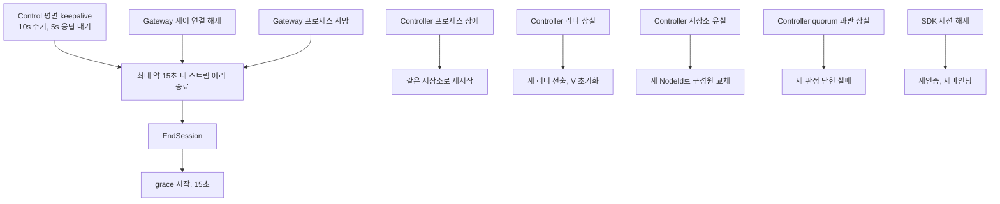
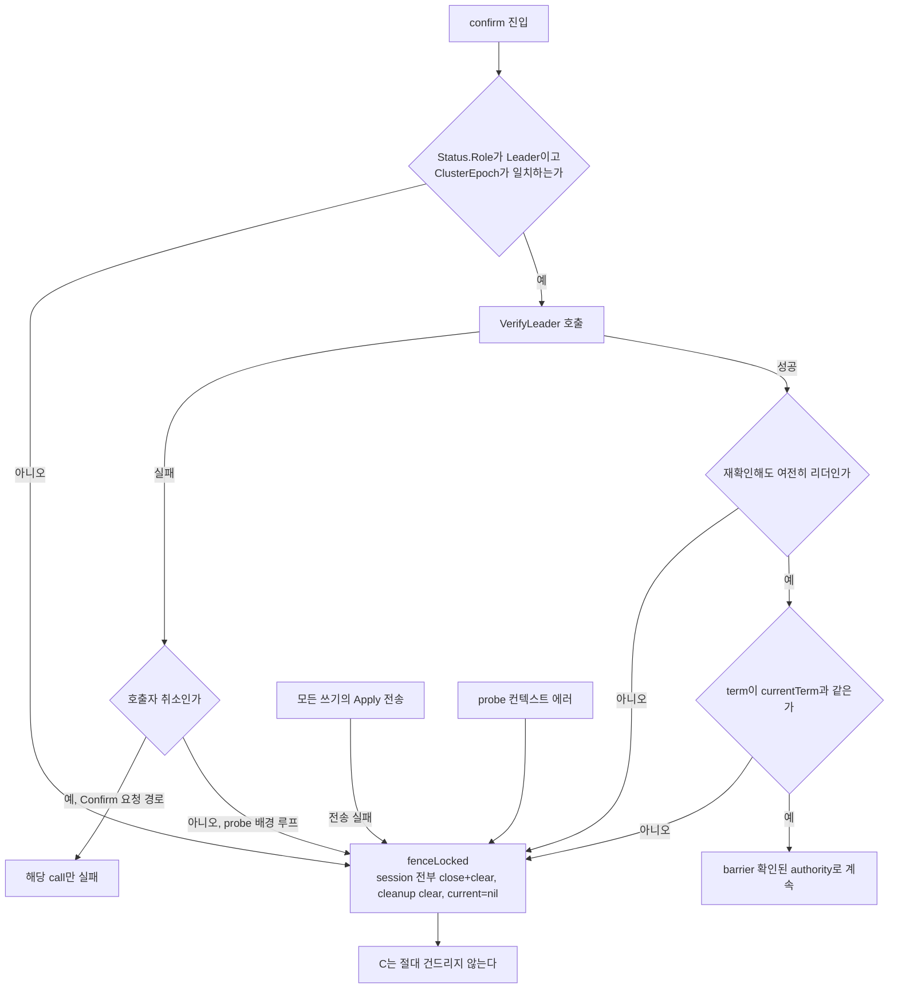
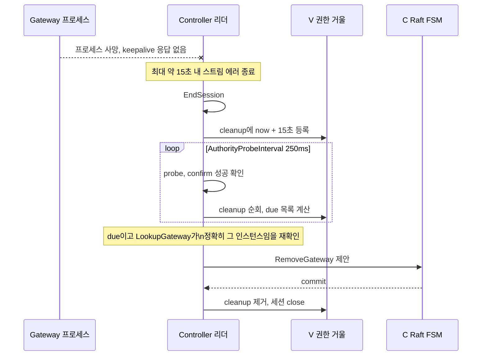
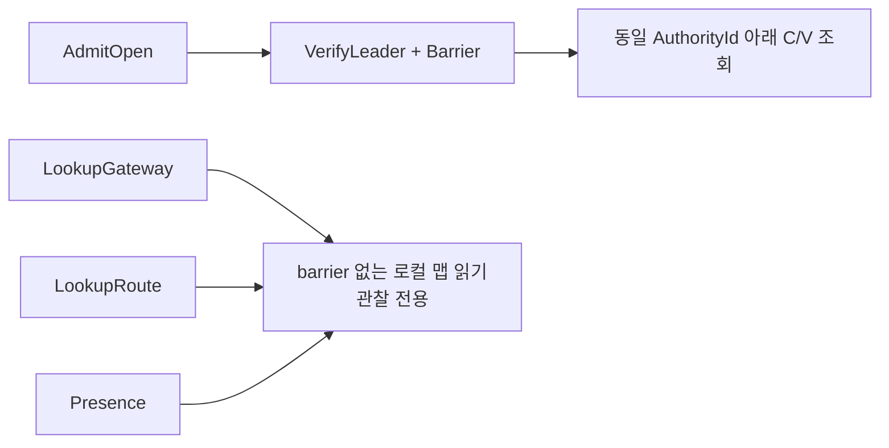
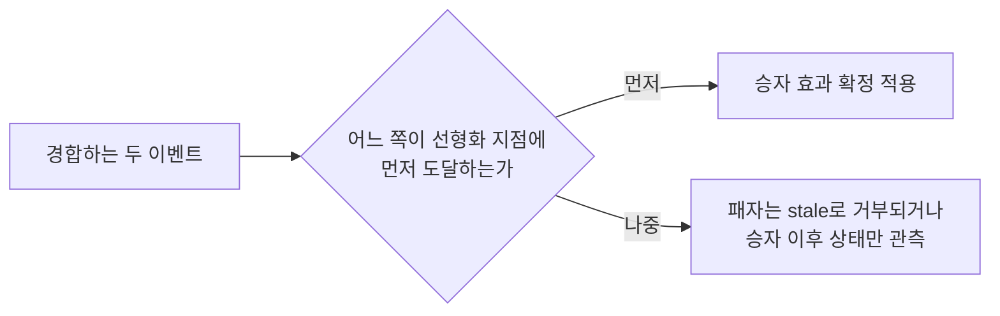
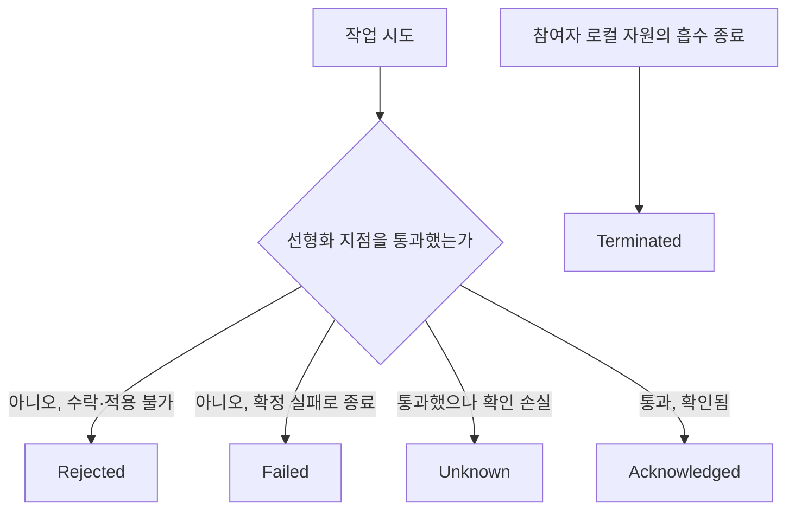
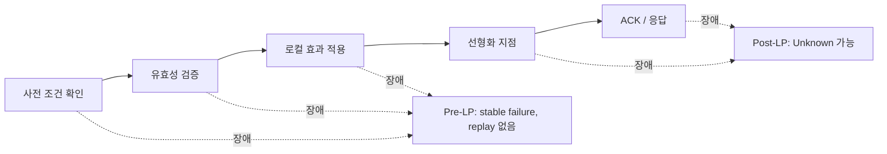
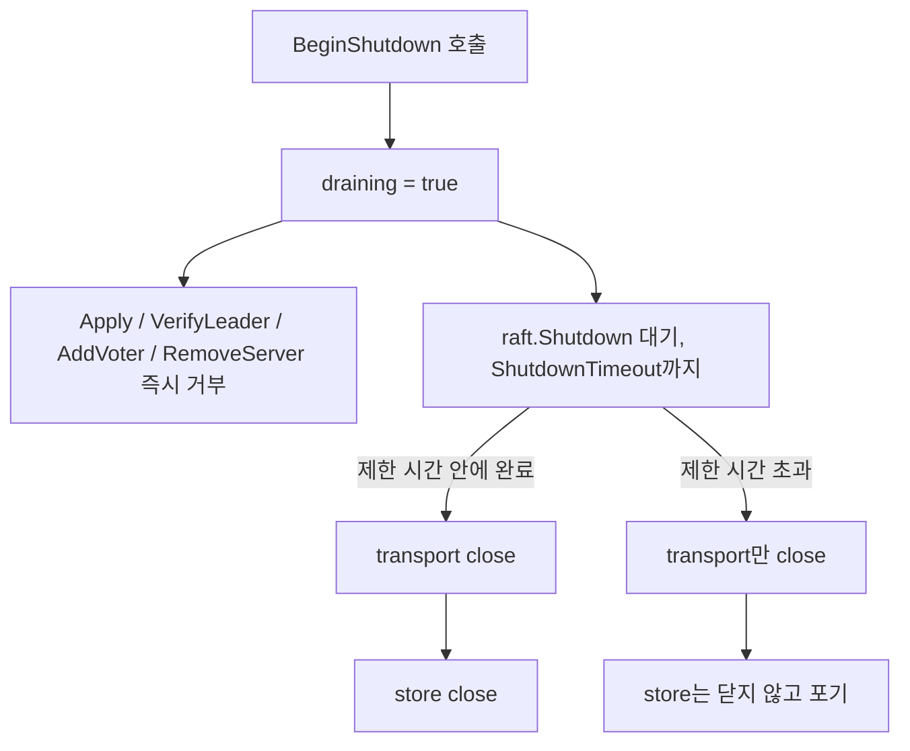
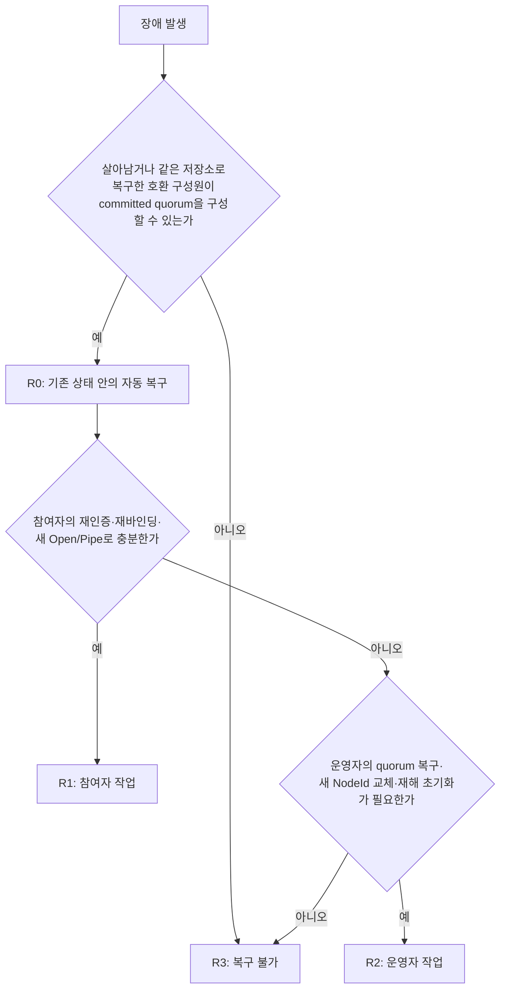
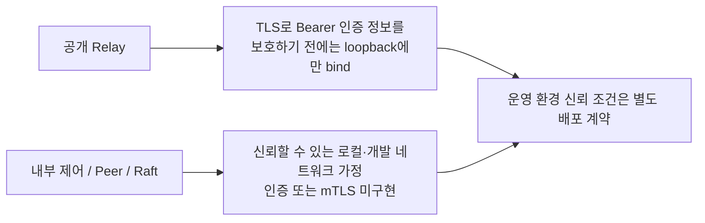

# SPEC 003: 장애와 복구 모델

## 장애 모델



control 평면 keepalive는 10초 주기 PING과 5초 응답 대기로 구성된다. TCP만으로는 half-open 연결을 감지하지 못하므로, Gateway 프로세스가 죽어도 FIN이 오지 않으면 keepalive가 감지 상한을 정한다. 이 경로에서 최대 약 15초 안에 스트림이 에러로 끝나고 `EndSession`이 grace를 시작시킨다.

| 영역 | 장애 | 안전한 결과 |
| --- | --- | --- |
| Controller 프로세스 | 기존 저장소를 가진 장애·재시작 | 같은 `NodeId`와 Raft/FSM 상태를 다시 연다 |
| Controller 리더 | quorum이 있는 같은 epoch의 리더 상실 | 새 리더와 `AuthorityId`, 휘발성 `V` 초기화, Gateway 재연결과 전체 snapshot |
| Controller 저장소 | 구성원 하나의 disk/PVC 유실 | 새 `NodeId` 교체 노드를 살아 있는 quorum으로 add/catch-up/remove |
| Controller quorum | 과반수 사용 불가 | 새 권한·제어·허용 판정을 닫힌 실패로 처리 |
| Gateway 제어 | Gateway 프로세스가 살아 있는 연결 해제·재연결 | 중단 동안 `V=false`; 로컬 `LiveBinding`을 유지하고 새 FullSnapshot으로 재검증 |
| Gateway 프로세스 | 장애·재시작 | 로컬 세션·바인딩·시도·Pipe·payload 소실; 새 Gateway instance와 SDK 재연결·재바인딩만 수행 |
| SDK 세션 | 연결 해제·재연결 | 이전 하위 handle 종료; 감독자는 새 인증과 현재 Listener 재바인딩만 수행 |
| 네트워크 | 지연·손실·중복·순서 변경·분할 | Exact current identity만 허용하고 오래된 상태 거부 |
| 설정 | 유효하지 않음·지연·프로세스 로컬 다시 불러오기 | 검증된 로컬 snapshot만 사용 |
| 시계 | 권한 주체와 owner의 시각 차이 | `ClockSkewBound < open_timeout` 운영 근거가 있을 때만 원격 만료 사용 가능 |
| 운영자 | 최초 bootstrap·재해 초기화 | Bootstrap은 일회성이며 초기화는 이전 경로 차단과 새 epoch·집합 요구 |

제한 시간 초과는 장애 의심이지 사망 증명이 아니다. 오탐은 가용성을 낮출 수 있지만 허용 조건을 참으로 만들 수 없다.

## 차단 규율



`fenceLocked`는 V의 session 전부를 close하고 clear하며, cleanup을 clear하고 current를 nil로 되돌린다. C는 이 과정에서 건드리지 않는다.

fence가 걸리는 지점 전체는 다음과 같다.

| 트리거 | 비고 |
| --- | --- |
| `Status.Role != Leader` | confirm 진입 시 |
| `ClusterEpoch` 불일치 | confirm 진입 시 |
| `VerifyLeader` 실패 | 호출자 취소면 조건부 |
| `VerifyLeader` 후 재확인 실패 | 확인과 재확인 사이 강등 방어 |
| `term != currentTerm` | 같은 노드가 재선출된 경우 |
| **Apply 전송 실패, 모든 쓰기** | 가장 중요한 fence 규칙 |
| probe 컨텍스트 에러 | `fenceOnContextError=true`일 때만 |

Apply 전송 실패는 가장 중요한 규칙이다. 호출자는 Apply 타임아웃이 선거와 경합했는지 알 수 없다. 따라서 낙관하지 않고 V를 버리고 Gateway가 새로 barrier 확인된 authority에 재연결하게 한다. Raft 안의 C는 이 과정에서 건드리지 않는다.

`confirm`은 호출 경로에 따라 두 모드로 동작한다.

| 호출자 | fenceOnContextError | 의미 |
| --- | --- | --- |
| `Confirm` 요청 경로 | false | 호출자 취소는 그 call만 실패시키고 다른 요청은 죽이지 않는다 |
| `probe` 배경 루프 | true | 배경 타임아웃은 진짜 문제이므로 fence한다 |

fence는 V만 지운다. C는 grace 동안 살아남는다. Gateway가 grace 안에 재연결해 재검증하면 C의 `GatewaySession`은 그대로 재사용된다.

## 만료와 수렴



`GatewayRevalidationTimeout` 기본값은 15초이며 grace 판정 시간이다. `AuthorityProbeInterval` 기본값은 250ms다.

deadline이 등록되는 지점은 셋이다.

1. 새 authority 확립 시 — committed C의 모든 Gateway에 `now + 15초`를 일괄 부여한다.
2. `OpenSession` 성공 시 — `SyncingSessionV` 상태에서도 deadline이 걸린다. Registration은 C만 확립하며, 전체 snapshot이 commit되기 전까지 이 stream은 V가 없어 부재 Gateway처럼 만료될 수 있어야 한다.
3. `EndSession` 시 — 세션이 끝나면 `now + 15초`.

deadline이 해제되는 지점은 셋이다.

- `Revalidate` 성공 시 cleanup에서 제거한다.
- sweep에서 해당 Gateway가 `RevalidatedSessionV`로 돌아와 있으면 제거한다.
- `fenceLocked`에서 전체 clear된다.

sweep은 probe 루프에서 confirm 성공 후에만 실행된다.

1. cleanup을 순회한다. `RevalidatedSessionV`로 복귀했으면 제거하고, deadline이 아직 안 됐으면 넘기고, 나머지는 due 목록에 넣는다.
2. due 각각에 대해 mutation lock을 잡는다.
   - 아직 due인지 재확인한다.
   - `LookupGateway`가 정확히 그 인스턴스인지 확인한다. 아니면 cleanup만 정리한다.
   - `RemoveGateway`를 인코딩해 apply한다. 성공하면 cleanup을 제거하고 세션을 close한다.
   - apply가 실패하면 deadline을 유지하고 다음 probe에서 재시도한다.

릴리즈는 확인된 리더만 제안한다. Raft가 비리더의 Apply를 거부하고, sweep은 confirm 성공 후에만 돌기 때문이다. deadline은 리더 시계로 계산되며 C에 기록되지 않는다. 복제되는 것은 시각이 아니라 `RemoveGateway` 명령이다. 각 노드가 자기 시계로 만료를 판정하면 상태가 갈라지므로, 결정성은 시각이 아니라 명령을 복제해 유지한다.

이 절차는 아래 필수 경합 결과 표의 "Session end vs declare" 두 행과 정합한다. declare가 먼저 commit되면 V는 즉시 clear되고 exact C는 grace 동안만 유지된다. end가 먼저면 late commit이 C에 반영될 수 있으나 V는 복구되지 않고, exact cleanup 또는 새 snapshot으로 수렴한다.

## 선형화 지점



`VerifyLeader`는 현재 leadership을 확립하고, `Barrier`는 호출자가 로컬 FSM을 읽기 전에 이 구성원이 committed log entry를 전부 적용할 때까지 추가로 기다린다. `AdmitOpen`만 이 barrier를 요구한다. `LookupGateway`와 `LookupRoute`는 barrier 없는 로컬 맵 읽기이며 관찰 전용이다. `Presence`도 barrier 없이 읽는다. 이는 의도적이며, 쓰기 경로 앞의 Confirm 호출은 스펙이 요구하는 최소 계약이 아니다.

| 동작 | 선형화 지점 | 손실 의미 |
| --- | --- | --- |
| Config reload | Valid snapshot atomic swap | 제거된 local runtime retire |
| Register Gateway | Raft `RegisterGateway` commit | `C`에 current session 존재, full snapshot 전 `V=false` |
| Full snapshot | Raft `ReplaceSnapshot` commit | 해당 Gateway exact route atomic replace |
| Declare | Raft `DeclareRoute` commit | Exact duplicate idempotent, conflict는 current route 보존 |
| Withdraw/remove | Raft `WithdrawRoute`/`RemoveGateway` commit | Tombstone 없는 true delete/cascade |
| Authority change | 새 term의 leader confirmation | 새 `AuthorityId`, 빈 `V` |
| Authority admission | Authority-owned confirmed read fence 하나가 exact `A·L·Q·C·V`를 context에 묶음 | Owner reservation/Pipe success가 아님 |
| Owner admission O | Local reservation + `AttemptId` fence | 성공한 O 이후 attempt는 local에서 계속 가능 |
| Open | Listener accept + `PipeId` creation | 이후 response loss는 `Unknown` 가능 |
| Pipe terminal | 첫 participant-local terminal | Local absorbing, peer propagation best effort |
| Payload delivery | Peer SDK bounded receive queue admission | Exact receipt가 없으면 sender는 `Unknown` 가능 |

## 필수 경합 결과



| 경합 | 승자 | 결과 |
| --- | --- | --- |
| Caller verification cancel vs authority | caller cancel/deadline | 해당 call만 unavailable, authority/session/route 유지 |
| 확정 강등·quorum 상실과 권한 주체 경합 | 상실 | `V` 제거, 새 허용 판정 닫힌 실패 |
| Authority/session change vs O | O first | 해당 attempt 계속 가능 |
| Authority/session change vs O | fence first | Stale context, offer/PipeId 없음 |
| Gateway replacement vs old route | new `GatewayInstanceId` | Old owned route 삭제, stale message 재생성 불가 |
| Old withdraw vs new owner | new owner current | Old exact identity가 new route 삭제 불가 |
| Session end vs declare | declare commit first | `V` 즉시 clear, exact `C`는 revalidation grace 동안만 유지 |
| Session end vs in-flight declare | end first | Late commit이 `C`에 반영될 수 있으나 `V` 복구 불가; exact cleanup/snapshot이 수렴 |
| Unbind vs O | O first | 해당 attempt 계속 가능, future attempt 차단 |
| Unbind vs O | retirement first | O=false, offer 없음 |
| Listener accept vs cancel | accept first | Open LP 도달, 이후 terminal/`Unknown` 가능 |
| Listener accept vs cancel | cancel first | Late accept NoOp |
| Expiry vs O | strict expiry 전 O | Attempt 계속, expiry가 opened Pipe를 닫지 않음 |
| Expiry vs O | `now >= ExpiresAt` | Reservation/offer/Pipe 없음 |
| Duplicate ForwardOpen vs original | first successful O | Reservation 최대 하나, outcome/PipeId replay 없음 |
| Public Open ACK vs payload | Open ACK write | ACK 뒤에만 Listener→caller payload release |
| Payload queue admission vs receipt | queue admission first | Exact receipt, sender `Received` 가능 |
| Payload queue admission vs receipt | receipt observation 불가 | `InFlight` 뒤 deadline/terminal에서 `Unknown` |
| Peer stream failure vs sibling stream | failed stream | 해당 Pipe만 terminal; shared ClientConn과 sibling Pipe 유지 |
| Peer connection failure vs streams | connection failure | 해당 connection의 Pipe stream 모두 terminal, 다음 Open은 connection recovery 여부에 따라 새 stream 시도 |
| Backpressure vs close/crash | first terminal | Bounded stop, silent drop 없음 |

## 오류 경계



| 결과 | 의미 | 재시도·세션 영향 |
| --- | --- | --- |
| `Rejected` | 현재 요청·frame을 수락하거나 적용할 수 없음 | 인증·세션·프로토콜 무결성 문제 외에는 해당 요청·자원 범위 |
| `Failed` | 이름 있는 작업이 확정 결과로 종료; Open `Failed`는 Listener 수락 선형화 지점 이전 | 새 논리 작업 가능, 이전 시도 재생 금지 |
| `Unknown` | 작업 선형화 지점을 지났을 수 있으나 exact 결과·확인 손실 | 확정 실패로 보고하지 않고 자동 재시도·재개·재생 금지 |
| `Acknowledged` | Exact 연관 작업이 적용·관찰됨 | Exact duplicate ACK는 bounded NoOp, 충돌 ACK는 프로토콜 종료 |
| `Terminated` | Exact 참여자 로컬 자원의 흡수 종료 상태 | 부활·재개·payload 재생 금지 |

Bind/Unbind 검증, 용량, 충돌, 제어 사용 불가는 해당 작업 범위다. 인증 실패, 세션 종료, 잘못된 프로토콜, stream 전송 실패는 세션을 종료한다. Payload 확인·거부는 exact `PipeId + PayloadId`로 연결한다. `PipePayloadRejected`는 SDK의 exact Pipe 보기를 종료하며 서버는 exact owned Pipe만 바꾼다.

## 장애 발생 지점



| 흐름 | 장애 지점 | 판정 기준 |
| --- | --- | --- |
| Controller restart | snapshot/log compaction 전후 | 같은 durable store에서 current FSM 복구 |
| Lost Controller store | replacement empty start | Fresh `NodeId`, add/catch-up/remove 필수 |
| Membership response | commit 뒤 CLI response loss | Exact retry가 current membership으로 수렴, same identity/different address 거부 |
| Snapshot | validate 전/commit 뒤 ACK 전/stream end | Partial install 0, committed current state exact |
| Declare/withdraw | local effect/ACK와 session end 전후 | Response replay 없이 current cardinality 수렴 |
| Gateway control | FullSnapshot ACK 전후 disconnect | Local `LiveB` 유지, fresh exact revalidation 전 `V=false`; unacked `RegisteringB` 실패/무 replay |
| Failover | O 전후/`V` clear/partial redeclare | O 전 stale, O 뒤 계속 가능, revalidation 뒤 fresh exact route만 eligible |
| Open | O/offer/accept+PipeId/response/public ACK | Pre-LP stable failure, post-LP `Unknown` 가능, replay 없음 |
| Shared peer connection | sibling stream close/owner identity-address 교체/last old stream close | Sibling 유지, new Open은 new connection, old connection은 ref drain 뒤 close |
| Idle peer cache | owner churn으로 idle 상한 초과 | Active stream은 유지하고 least-recently-used idle connection만 close |
| Payload | prepare/handoff/queue admission/receipt/pressure/hop loss | `NotSent`/`Rejected`/`Received`/`Unknown`, FIFO, silent drop/replay 없음 |
| Disaster reset | external fence 전후 | Fence 없이는 reset 금지, new epoch는 별도 machine |

## 정상 종료



셧다운 순서는 다음과 같다.

1. `BeginShutdown`이 `draining`을 켠다.
2. `draining`이 켜지면 `Apply`, `VerifyLeader`, `AddVoter`, `RemoveServer`가 즉시 거부된다.
3. `raft.Shutdown`을 `ShutdownTimeout`까지 기다린다.
4. 제한 시간 안에 성공하면 transport를 close하고 이어서 store를 close한다.
5. 제한 시간을 넘기면 transport만 close하고 store는 닫지 않은 채 포기한다.

타임아웃 시 store를 닫지 않는 이유는, 확인되지 않은 shutdown 뒤에도 Raft goroutine이 그 durable store에 여전히 접근할 수 있기 때문이다. Raft goroutine 아래에서 store를 닫는 것은 안전하지 않다.

`Status.Ready`는 다음 세 조건의 결합이다.

```text
Status.Ready = !draining AND LeaderAddress != empty AND ClusterEpoch != empty
```

## 복구 등급



| 등급 | 의미 | 예시 |
| --- | --- | --- |
| `R0` | 기존 상태 안의 자동 복구 | 같은 저장소 재시작, 생존 quorum 선거, Gateway 재연결·재검증 |
| `R1` | 참여자 작업 | 재인증, 재바인딩, 새 Open/Pipe |
| `R2` | 운영자 작업 | Quorum 복구, 새 `NodeId` 교체, 명시적 재해 초기화 |
| `R3` | 복구 불가 | 이전 Pipe, payload 위치, 불확실한 Open 결과, 지워진 구성원 식별자 |

```text
CurrentCohortServiceRecoverable = surviving and/or same-store-restored
                                  compatible current members can form
                                  the committed Raft quorum

MemberReplacementAllowed = current quorum exists
                        AND a fresh NodeId catches up before old member removal

RouteEligible = CurrentCohortServiceRecoverable
             AND current route exists in C
             AND owner reconnects/revalidates V
```

투표자 3개 집합에서 영속 구성원 저장소 하나만 복구해서는 서비스를 복구할 수 없다. 구성원 교체도 현재 quorum이 있을 때만 가능하다. 이전 경로를 모두 차단한 뒤의 재해 초기화는 새 집합과 빈 현재 FSM을 만들 뿐 이전 결과, Pipe, payload 위치, route 이력을 복구하지 않는다.

## 운영 환경 차단 조건



공개 Relay는 Bearer 인증 정보가 TLS로 보호되기 전에는 loopback에만 bind할 수 있다. 내부 제어, Peer, Raft는 현재 신뢰할 수 있는 로컬·개발 네트워크를 가정한다.

| 계약 | 로컬 코드만으로 닫히지 않는 이유 |
| --- | --- |
| 재해 초기화 안전성 | 이전 Controller·제어·Gateway 경로가 차단되었다는 운영자 근거 필요 |
| Controller 저장소 고가용성 | 로컬 add/remove는 있으나 운영 PVC·storage class·교체 절차서 근거는 외부에 있음 |
| 원격 만료 준비 상태 | 실제 노드의 시계 오차 상한 근거 필요 |
| 내부 전송 신뢰 | 제어·Peer·Raft 인증 또는 mTLS 미구현 |
