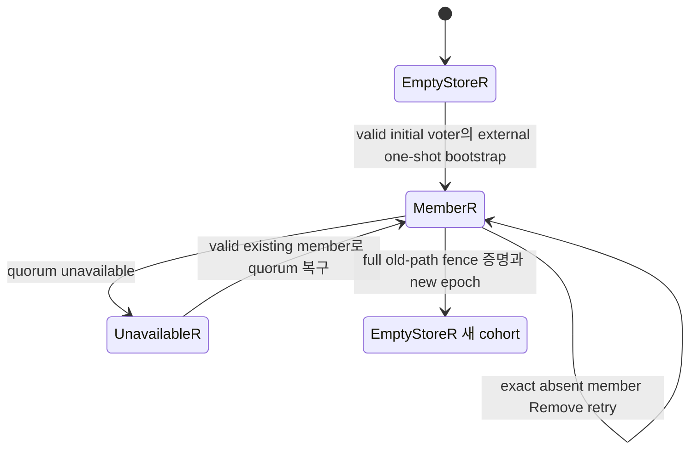
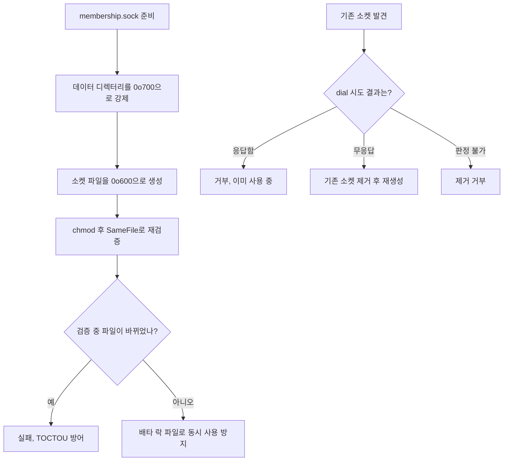
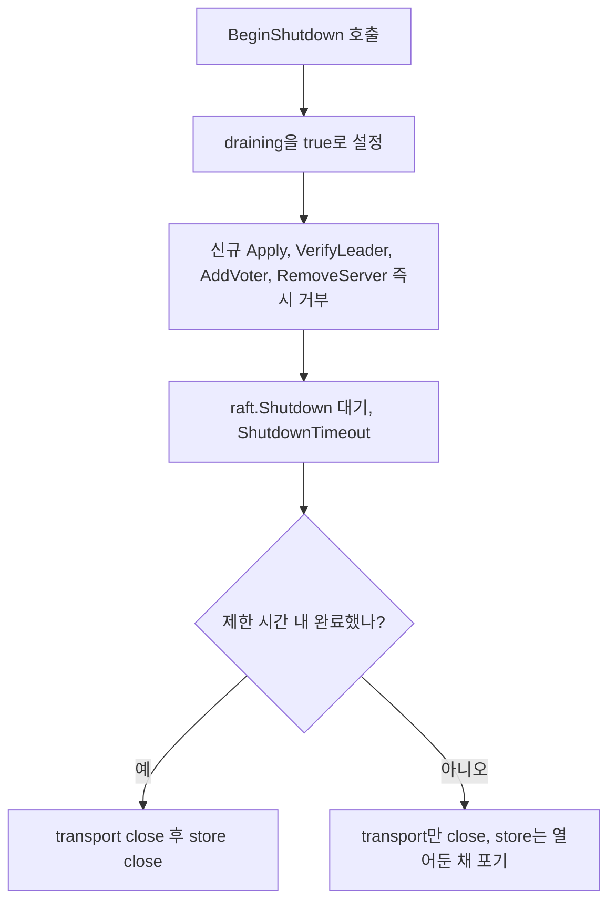
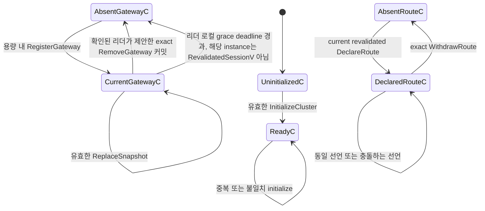
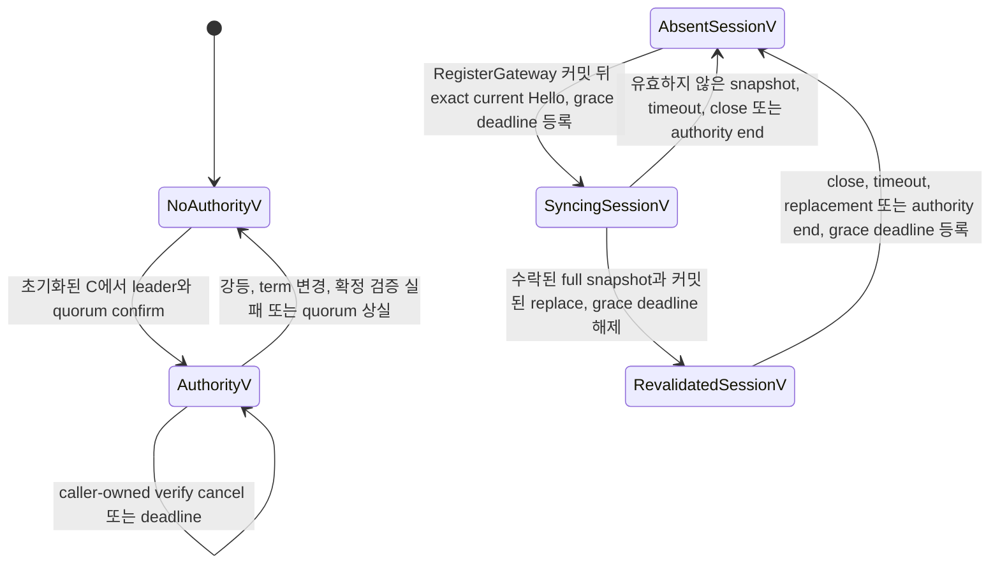
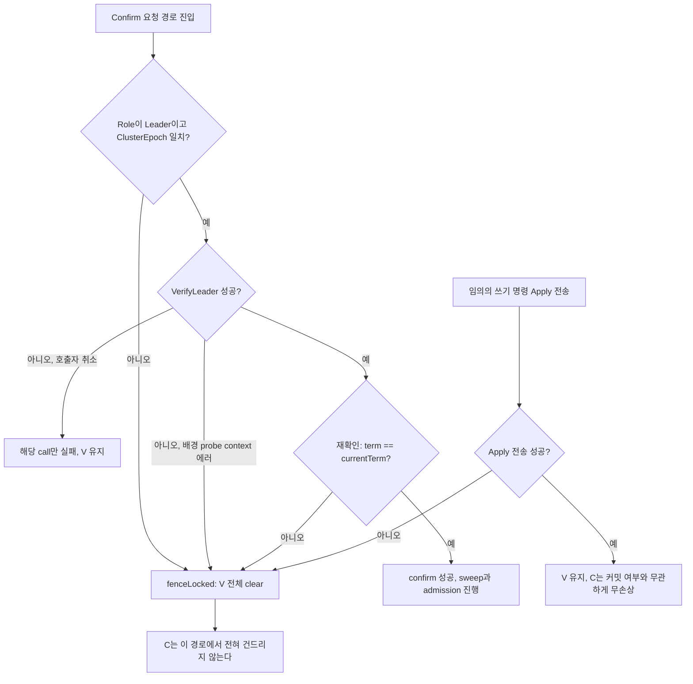
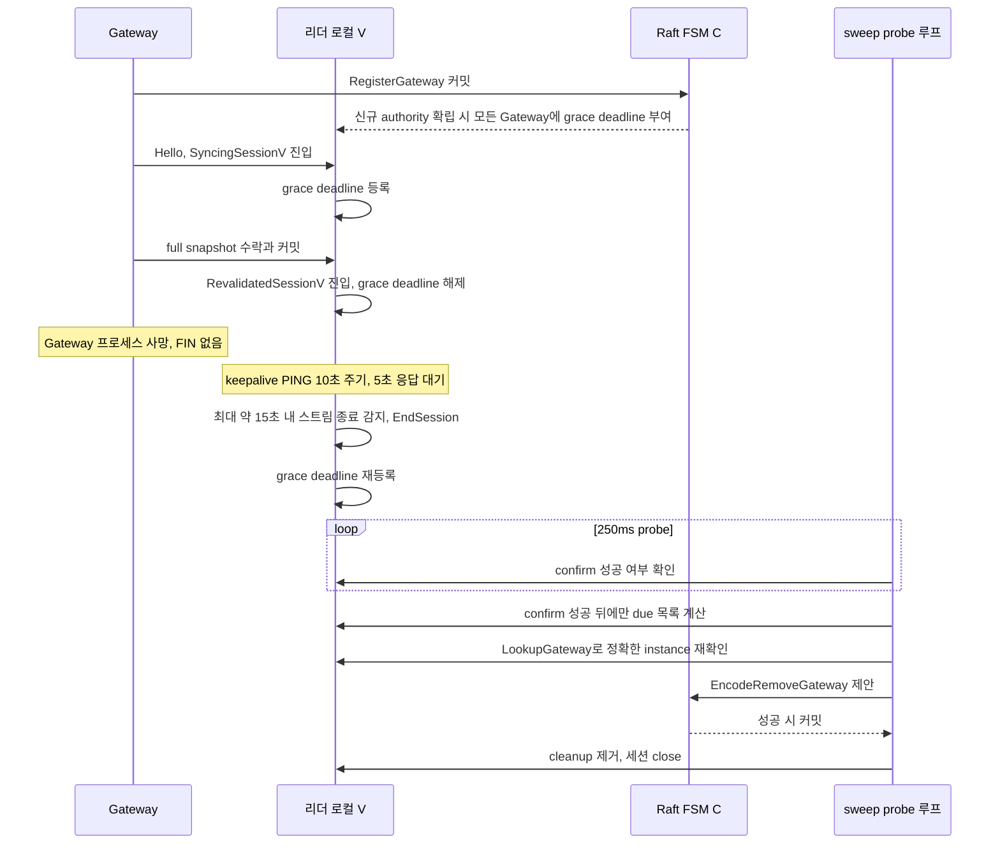
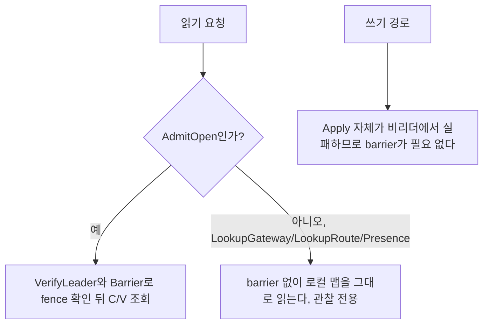

# SPEC 004: 정규 상태 전이

## 닫힌 해석 규칙

모든 state/event input은 정확히 하나의 결과를 가진다.

1. Old epoch 또는 stale exact authority/session/instance/binding/participant identity는 `Rejected`다.
2. `From + Event + Guard`가 table row와 일치하면 `Applied`다.
3. Exact duplicate cleanup/terminal 또는 absorbing terminal 재진입은 `NoOp`다.
4. 그 밖의 current identity 조합은 `Rejected`다.

이는 semantic closure이며 하나의 test가 Cartesian product 전체를 열거한다는 뜻은 아니다. `Rejected`는 stable request/frame refusal, `Failed`는 stable operation failure(Open에서는 pre-LP), `Unknown`은 LP 이후 exact result loss 가능성, `Acknowledged`는 exact correlated apply barrier, `Terminated`는 absorbing resource end다. Operation-local public failure는 response message를 사용하고 auth/session/protocol/transport failure는 gRPC stream을 종료한다. Unrecognized/malformed/foreign/conflicting public response는 operation-local `Rejected`가 아니라 protocol failure다.

## 소유권

| 상태 기계 | 소유자 | 영속성 | 정리·종료 소유자 |
| --- | --- | --- | --- |
| Raft 구성원 | Controller Raft | 영속 저장소·log·snapshot | Raft 구성원 변경·재해 초기화 |
| 현재 FSM `C` | Controller Raft FSM | 영속 log·snapshot | exact withdraw·remove·replace |
| 권한·세션 거울 `V` | 현재 Controller 리더 | 리더 로컬 메모리 | 강등·quorum 상실·세션 종료 |
| 인증·ClientSession | Gateway 접근 실행 상태 | 외부 설정 + 프로세스 메모리 | 인증 정보·세션·Gateway 종료 |
| LocalBinding | 소유 Gateway | 프로세스 메모리 | 등록 실패·unbind·인증 정보·클라이언트 세션·Gateway 종료; 제어 종료는 `V` 게시만 제거 |
| Attempt·OwnerPipe | 소유 Gateway | 프로세스 메모리 | 취소·제한 시간·참여자·구간·Gateway 종료 |
| Ingress·Caller·ListenerPipe | Exact 참여자 Gateway·SDK | 프로세스 메모리 | 첫 로컬 종료 |
| PeerConnection | 진입 Gateway | 프로세스 메모리 | Client 닫기 또는 폐기 중인 소유자 식별자의 마지막 stream 종료 |
| RemoteHop | 진입 + 소유자 구간 | 프로세스 메모리 | stream·구간·참여자 종료 |
| FlowControl | 각 stream·구간 | 프로세스 메모리 | 상한·쓰기·종료 |
| SenderDelivery | 발신 SDK, `PipeId + PayloadId`당 하나 | 상한이 있는 프로세스 메모리 | 확인·거부·제한 시간·Pipe·세션 종료 |
| ReceiverReceipt | 수신 SDK, Pipe별 상한 | 상한이 있는 프로세스 메모리 | Pipe·세션 종료·이력 제거 |
| SDK 감독자 | Go/Rust `ManagedClient` | 프로세스 메모리 | 닫기·영구 연결 실패 |

`C`는 `ClusterEpoch`, capacity limit, current `GatewaySession`, exact current route만 가진다. `V`는 current leader observation인 control session, revalidation, owner relay address, current binding mirror, grace cleanup deadline만 가진다.

### Raft 디스크 저장 레이아웃

`raft.data_dir` 아래 저장 구조는 다음과 같다.

```
raft.db                    bbolt 단일 파일
  bucket "logs"            index -> msgpack raft.Log{Index,Term,Type,Data,AppendedAt}
                            Data는 우리 JSON 명령 그대로
  bucket "conf"             CurrentTerm / LastVoteTerm / LastVoteCand는 라이브러리 소유
                            relaygate/node-id/v1은 우리 소유
snapshots/{term}-{index}-{ts}/
  meta.json                 ID, Index, Term, Configuration, Size, CRC
  state.bin                 우리 FSM JSON, version 2와 state
```

`C`에는 시각이 없다. `AppendedAt`은 log entry에 대한 라이브러리 메타데이터일 뿐 FSM 상태가 아니며, `C`의 어떤 transition도 시각을 읽거나 쓰지 않는다. Snapshot이 로그를 compact해도 `raft.db` 파일 자체는 즉시 줄지 않는다. 해제된 페이지는 free list에 들어가 재사용되므로 파일 크기는 high-water mark로 남고, 볼륨 사용량과 현재 FSM 카디널리티는 별도로 관측해야 한다.

## Raft 구성원과 Controller 저장소



| 이전 상태 | 이벤트와 조건 | 다음 상태 | 효과 |
| --- | --- | --- | --- |
| `EmptyStoreR` | valid initial voter의 external one-shot bootstrap | `MemberR` | `NodeId`, Raft state/membership/log/snapshot persist |
| `MemberR` | same store/`NodeId` process restart | `MemberR` | Durable state reopen, bootstrap 없음 |
| `MemberR` | same-epoch leader loss, quorum 생존 | `MemberR` | New leader election 가능 |
| `MemberR` | quorum unavailable | `UnavailableR` | Confirmed authority/admission 없음 |
| `UnavailableR` | valid existing member로 quorum 복구 | `MemberR` | Same Raft machine 계속 |
| `MemberR` | fresh `NodeId` replacement에 leader `AddVoter` 성공 | `MemberR` | Raft catch-up |
| `MemberR` | exact existing voter Add retry | `MemberR` | NoOp, current membership 반환 |
| `MemberR` | leader `RemoveServer(lost NodeId)` 성공 | `MemberR` | Committed membership에서 제거 |
| `MemberR` | exact absent member Remove retry | `MemberR` | NoOp, current membership 반환 |
| `MemberR` | voter 8개째 `AddVoter` 시도 | `MemberR` | `ResourceExhausted` 거부, voter 상한 7 |
| `MemberR` | 마지막 voter `RemoveServer` 시도 | `MemberR` | `FailedPrecondition` 거부, membership 불변 |
| `MemberR` | 기존 `NodeId`를 다른 주소로 `AddVoter` | `MemberR` | `AlreadyExists` 거부, 지워진 식별자 재사용 방지 |
| `MemberR` | 다른 `NodeId`를 기존 주소로 `AddVoter` | `MemberR` | `AlreadyExists` 거부 |
| any old cohort | full old-path fence 증명 + new epoch | `EmptyStoreR'` | 별도 disaster-reset machine, old state 복구 없음 |

Erased store의 old `NodeId`에는 recovery transition이 없다. `bootstrap=true`는 initial empty cluster만 유효하다. Membership command는 verified leader의 controller-local Unix socket에서만 받는다. `List`를 포함한 모든 membership 작업이 `VerifyLeader`를 요구한다.

### Controller-local Unix Socket 보호



소켓 이름은 `membership.sock`이며 기본 위치는 Raft 데이터 디렉터리 옆이다. 경로가 100바이트를 넘으면 Unix socket 경로 길이 제한 때문에 대체 경로를 사용한다.

## 종료와 감지 상한



`draining`이 켜지면 `Apply`, `VerifyLeader`, `AddVoter`, `RemoveServer`가 즉시 거부된다. `raft.Shutdown()`이 `ShutdownTimeout` 안에 끝나면 transport와 store를 순서대로 닫는다. 타임아웃이 나면 transport만 닫고 store는 닫지 않은 채 포기한다. Raft가 미확인 shutdown 이후에도 durable store에 접근할 수 있으므로, 그 goroutine 아래에서 store를 닫지 않기 위함이다.

`Status.Ready`는 `!draining`, `LeaderAddress`가 비어있지 않음, `ClusterEpoch`가 비어있지 않음 세 조건의 결합이다.

control 평면 keepalive는 다음 상수를 쓴다.

| 상수 | 값 | 의미 |
| --- | --- | --- |
| `KeepaliveTime` | 10s | HTTP/2 PING 주기 |
| `KeepaliveTimeout` | 5s | 응답 없으면 연결 사망 판정 |
| `KeepaliveMinPingTime` | 5s | 서버측 남용 방지 하한 |

이 값은 control server와 client 양쪽에 적용된다. TCP만으로는 half-open 연결을 감지하지 못하므로, Gateway 프로세스가 FIN 없이 죽어도 keepalive가 최대 약 15초 안에 스트림을 에러로 종료시키고 `EndSession`을 유발한다. "연결이 끊겼다"를 보장하는 것은 grace 타이머가 아니라 keepalive다.

## 현재 상태 기계 `C`



| 이전 상태 | 이벤트와 조건 | 다음 상태 | 효과 |
| --- | --- | --- | --- |
| `UninitializedC` | valid epoch/capacity `InitializeCluster` | `ReadyC` | Immutable epoch/capacity 설정 |
| `ReadyC` | exact duplicate initialize | `ReadyC` | NoOp/AlreadyApplied |
| `ReadyC` | different epoch/capacity initialize | `ReadyC` | Reject |
| `AbsentGatewayC` | in-capacity `RegisterGateway` | `CurrentGatewayC` | Current GatewaySession insert |
| `CurrentGatewayC(old)` | same Gateway ID/new instance register | `CurrentGatewayC(new)` | Old owned route delete 후 session replace |
| `CurrentGatewayC` | duplicate register | same | NoOp/AlreadyApplied |
| `CurrentGatewayC` | valid/non-conflicting/in-capacity `ReplaceSnapshot` | same | Old owned route atomic replace |
| `CurrentGatewayC` | 유효하지 않거나 충돌하거나 용량을 넘는 snapshot | 동일 | 거부, 부분 설치 0 |
| `AbsentRouteC` | current revalidated `DeclareRoute` | `DeclaredRouteC` | Exact route insert |
| `DeclaredRouteC` | same declaration | same | NoOp/AlreadyApplied |
| `DeclaredRouteC` | same key/different owner-ref | same | Conflict, current route 보존 |
| `DeclaredRouteC` | exact `WithdrawRoute` | `AbsentRouteC` | True delete |
| `CurrentGatewayC` | exact `RemoveGateway` 커밋, 확인된 리더만 제안 가능 | `AbsentGatewayC` | Session과 owned route cascade delete |
| `CurrentGatewayC` | 리더 로컬 grace deadline 경과 + 해당 instance가 `RevalidatedSessionV` 아님 | `AbsentGatewayC` | 확인된 리더만 조건부 `RemoveGateway` 제안, 세션·소유 route cascade delete |
| any `C` | Raft snapshot compact/restore | same logical `C` | Current row만 persist/restore |

`C`에는 route tombstone/history/payload/Pipe/control session/relay address/credential/시각을 만드는 transition이 없다.

## 권한 주체와 세션 거울 `V`



| 이전 상태 | 이벤트와 조건 | 다음 상태 | 효과 |
| --- | --- | --- | --- |
| `NoAuthorityV` | initialized `C`에서 leader+quorum confirm | `AuthorityV` | New `AuthorityId`, empty `V` |
| `AuthorityV` | caller-owned verify cancel/deadline, leadership current | same | 해당 call만 실패 |
| `AuthorityV` | 강등·term 변경·확정 검증 실패·quorum 상실 | `NoAuthorityV` | 이전 권한 주체 차단, 세션·주소·재검증 제거 |
| `AbsentSessionV` | `RegisterGateway` commit 뒤 exact current Hello | `SyncingSessionV` | New `ControlSessionId`, owner address 기록, grace deadline 등록 |
| `SyncingSessionV` | accepted full snapshot + committed replace | `RevalidatedSessionV` | Leader-local binding mirror install, grace deadline 해제 |
| `SyncingSessionV` | invalid snapshot/timeout/close/authority end | `AbsentSessionV` | Session/address clear |
| `RevalidatedSessionV` | close/timeout/replacement/authority end | `AbsentSessionV` | Session/address/mirror clear, grace deadline 등록 |

`AuthorityV`가 없으면 Presence=`NoAuthority`다. `Current`는 `C` committed count, `V` revalidated count, exact `C/V` eligible count를 분리하며 completeness를 증명하거나 admission을 바꾸지 않는다.

## 리더 권한과 차단



`fenceLocked`는 모든 session을 close하고 clear하며 cleanup map을 비우고 current를 nil로 만든다. `C`는 이 경로에서 전혀 변경되지 않는다.

fence가 걸리는 지점은 다음과 같다.

| 트리거 | 위치 | 비고 |
| --- | --- | --- |
| `Status.Role != Leader` | `leadership.go:19-22` | confirm 진입 시 |
| `ClusterEpoch` 불일치 | `leadership.go:19-22` | 동일 |
| `VerifyLeader` 실패 | `leadership.go:24-33` | 호출자 취소면 조건부 |
| `VerifyLeader` 후 재확인 실패 | `leadership.go:34-39` | 검증과 재확인 사이 강등 방어 |
| `term != currentTerm` | `leadership.go:44-50` | 같은 노드가 재선출된 경우 |
| 쓰기 명령 Apply 전송 실패 | `session.go:181-186` | 모든 쓰기 공통, 가장 중요한 규칙 |
| probe 배경 루프의 context 에러 | `leadership.go:107` | `fenceOnContextError=true` |

쓰기 명령의 Apply 전송이 실패하면 커밋 여부를 알 수 없다. 호출자는 timeout이 election과 경합했는지 구분할 수 없으므로 낙관하지 않고 `V` 전체를 fence한다. Gateway는 재연결해 새로 barrier로 확인된 authority에 다시 참여한다. `C`는 Raft 안에서 무손상으로 남는다.

`confirm`은 두 모드로 호출된다.

| 호출자 | fenceOnContextError | 의미 |
| --- | --- | --- |
| `Confirm()` 요청 경로 | false | 호출자 취소는 그 call만 실패시키고 다른 요청의 `V`는 유지한다 |
| `probe()` 배경 루프 | true | 배경 타임아웃은 leadership 문제로 간주해 fence한다 |

## 만료와 정리



`GatewayRevalidationTimeout` 기본값은 15초, `AuthorityProbeInterval` 기본값은 250ms다.

deadline이 등록되는 지점과 해제되는 지점은 다음과 같다.

| 구분 | 시점 | 위치 |
| --- | --- | --- |
| 등록 | 새 authority 확립 시 committed `C`의 모든 Gateway에 일괄 부여 | `leadership.go:57-63` |
| 등록 | `OpenSession` 성공 시, `SyncingSessionV` 상태에서도 부여 | `session.go:71-73` |
| 등록 | `EndSession` 시 | `session.go:120-126` |
| 해제 | `Revalidate` 성공 시 | `session.go:95` |
| 해제 | sweep에서 해당 Gateway가 `RevalidatedSessionV`로 복귀해 있으면 제거 | `leadership.go:112-152` |
| 해제 | `fenceLocked`에서 전체 clear | `leadership.go:170-181` |

sweep은 250ms probe 루프에서 `confirm()` 성공 후에만 실행된다. cleanup을 순회해 `RevalidatedSessionV`로 복귀했으면 제거하고, deadline이 아직 도래하지 않았으면 건너뛰고, 나머지를 due 목록에 넣는다. due 각각은 `mutationMu`를 잡고 여전히 due인지 재확인한 뒤, `LookupGateway`로 정확히 그 instance인지 확인하고, `EncodeRemoveGateway`를 제안한다. Apply가 실패하면 deadline을 유지하고 다음 probe에서 재시도한다.

**릴리즈(삭제 제안)는 확인된 리더만 한다.** Raft가 비리더의 Apply를 거부하고, sweep은 `confirm()` 성공 후에만 돈다. **deadline은 리더 시계로 계산되며 `C`에 기록되지 않는다.** 복제되는 것은 시각이 아니라 `RemoveGateway` 명령이다. 각 노드가 자기 시계로 만료를 판정하면 복제 상태 기계가 갈라지므로, 이 규칙이 결정성을 지킨다.

## 인증, 세션, 바인딩

| 이전 상태 | 이벤트와 조건 | 다음 상태 | 효과 |
| --- | --- | --- | --- |
| `StartupBlocked` | whole config valid | `ActiveAuth` | Immutable snapshot 활성화 |
| `ActiveAuth` | reload start | `Validating` | Old snapshot 유지 |
| `Validating` | valid candidate | `ActiveAuth` | Atomic swap + removed state retirement |
| `Validating` | invalid candidate | `ActiveAuth` | Old snapshot/runtime 유지 |
| `AuthenticatingS` | exact 인증 정보 + 마지막 현재성 확인 | `ActiveS` | 새 세션, 암시적 `ClientId` |
| `AuthenticatingS` | failure/deadline | `TerminalS` | Session 없음 |
| `ActiveS` | close/revocation | `RetiringS` | New work 차단, child retire |
| `RetiringS` | retirement complete | `TerminalS` | Identity revival 불가 |
| `AbsentB` | Bind start + capacity | `RegisteringB` | Exact `ListenerBindingId` 할당 |
| `RegisteringB` | exact declare/full-snapshot ACK | `LiveB` | Local O-capable, end-to-end는 current `C/V` 필요 |
| `RegisteringB` | failure/cancel/unbind/revocation/session/Gateway/control end 전 ACK | `RetiredB` | O=false, next session replay 없음, late success conditional withdraw |
| `LiveB` | control end, Gateway/client session 생존 | `LiveB` | Next FullSnapshot용 local declaration 유지, `V=false`라 O 차단 |
| `LiveB` | unbind/revocation/session/Gateway end | `RetiringB` | 즉시 O=false, conditional withdraw |
| `RetiringB` | cleanup complete | `RetiredB` | Capacity 반환, late ACK revival 불가 |

## 읽기 일관성



`AdmitOpen`만 `VerifyLeader + Barrier` fence를 요구한다. barrier 없는 `LookupGateway`/`LookupRoute`/`Presence`는 관찰 전용이며 completeness나 revocation을 증명하지 않는다. 쓰기 경로는 barrier를 요구하지 않는다. Apply 자체가 비리더에서 실패하므로 별도 fence가 필요 없다.

## 허용 판정, Open, 재생 차단

`AdmitOpen`은 verified leader/quorum과 Raft read barrier를 한 번 확인하고 동일 exact `AuthorityId` 아래에서 `C/V`를 조회한다. 조회 전 authority change는 request를 거부한다. Steady path에 second verification, state mutation, full-FSM copy는 없다.

| 이전 상태 | 이벤트와 조건 | 다음 상태 | 효과 |
| --- | --- | --- | --- |
| `OpeningO` | 모든 `A·L·Q·C·V·O` | `AdmittedO` | 원자적 예약 + `AttemptId` 차단, Listener 제안 |
| `OpeningO` | any guard/deadline/cancel failure | `TerminalO` | Offer/PipeId 없음, failed guard는 context 미소비 |
| `AdmittedO` | Listener 수락이 먼저 도달 | `AcceptedO` | Open 선형화 지점, `PipeId` 발급 |
| `AdmittedO` | reject/deadline/cancel/end wins | `TerminalO` | Late accept NoOp, fence expiry까지 유지 |
| `AcceptedO` | late attempt deadline | same | NoOp |
| `AcceptedO` | participant/hop/terminal end | `TerminalO` | Best-effort peer terminal |
| `AbsentAttemptF` | successful O | `ReservedAttemptF` | Expiry까지 `AttemptId` insert |
| `ReservedAttemptF` | duplicate | same | Reject, outcome/PipeId replay 없음 |
| `ReservedAttemptF` | expired | `AbsentAttemptF` | GC 가능, old context expired |

| 참여자 | Open 전이 | 종료 전이 |
| --- | --- | --- |
| Ingress | exact owner accepted installs segment | reject/cancel/deadline/session/hop end, LP 불확실 시 `Unknown` |
| Listener | offer → provisional → confirm → exact ACK 뒤 handle 노출 | reject/cancel/session/hop end |
| Caller | exact `PipeOpened` ACK 뒤 handle 노출 | failure/cancel/transport/terminal |
| RemoteHop | 공유 연결 획득 → Pipe stream 전달 → 수락 → 활성화 | 제한 시간·불일치·EOF·구간·참여자 종료 |

## Peer 연결과 원격 구간

| 이전 상태 | 이벤트와 조건 | 다음 상태 | 효과 |
| --- | --- | --- | --- |
| `AbsentPC` | exact owner identity/address의 first remote Open | `IdlePC/ActivePC` | Shared gRPC ClientConn 생성, stream ref 획득 |
| `IdlePC/ActivePC` | same exact owner Open | `ActivePC` | Connection 재사용, 독립 stream/ref 추가 |
| `ActivePC` | one Pipe stream terminal | `ActivePC/IdlePC` | 해당 ref만 release, sibling stream 유지 |
| `IdlePC` | bounded idle cache 초과 | `AbsentPC` | LRU idle connection close, active stream 영향 없음 |
| `IdlePC/ActivePC(old identity)` | same GatewayId의 changed instance/address | `RetiringPC + ActivePC(new)` | New Open은 new connection, old는 신규 stream 금지 |
| `RetiringPC` | last old stream terminal | `AbsentPC` | Old connection close |
| any PC | client/Gateway end | `AbsentPC` | 모든 stream cancel/join 후 connection close |

Connection은 exact owner Gateway identity/address마다 최대 하나가 current다. Idle cache는 `min(max_pipes, 64)`로 제한하고 LRU eviction한다. Stream/Pipe identity와 capacity는 계속 독립적이다.

## 흐름 제어와 종료

| 이전 상태 | 이벤트 | 다음 상태·효과 |
| --- | --- | --- |
| `Flowing` | 유효한 payload | 상한이 있는 대기열·쓰기, 방향별 FIFO |
| `Flowing` | queue high | `Backpressured`, payload acceptance 중지 |
| `Backpressured` | timeout 전 drain | `Flowing` |
| `Flowing/Backpressured` | bound/timeout/write failure | Pipe terminal 요청, silent drop 없음 |
| `Flowing/Backpressured` | payload rejection | SDK exact Pipe terminal, server는 exact owned Pipe만 변경 |
| any non-terminal | participant close/session/hop/Gateway end | first local terminal |
| terminal | duplicate/late success/payload | terminal NoOp 또는 ownership rejection |

Public Relay는 별도 bounded lane으로 control/terminal이 queued payload를 우회한다. Pipe별 peer stream은 send를 직렬화하며 blocked send timeout/cancel은 그 Pipe stream만 종료한다. Shared connection은 sibling stream이 있으면 유지한다. Shutdown은 owned worker를 cancel/join하며 새 Pipe에 queued/inflight payload를 replay하지 않는다.

## Payload 전달 확인

Delivery LP는 exact payload의 peer SDK bounded receive queue admission이다. Application read/processing/durable commit이 아니다. 각 방향은 Pipe당 SDK `Send` 하나만 in-flight로 허용하고 transport actor는 unrelated Pipe를 병렬 처리할 수 있다.

### 발신 전달 상태 `SenderDelivery`

| 이전 상태 | 이벤트와 조건 | 다음 상태 | 효과 |
| --- | --- | --- | --- |
| `PreparedD` | invalid/terminal/deadline/local handoff 전 failure | `NotSentD` | Stable no-delivery, 새 logical send 안전 |
| `PreparedD` | local authenticated-stream handoff | `InFlightD` | Exact receipt/rejection 대기, 자동 retry 없음 |
| `InFlightD` | exact receipt | `ReceivedD` | `Send` 성공 |
| `InFlightD` | exact 거부 | `RejectedD` | 확정 거부, exact Pipe 종료 |
| `InFlightD` | receipt 전 deadline/Pipe/session/transport end | `UnknownD` | Peer queue LP 통과 가능 |
| `UnknownD` | late exact result | same | Bounded NoOp, caller-visible 결과 불변 |
| any terminal D | exact duplicate terminal | same | Bounded NoOp |
| any state | malformed/foreign/wrong-phase/conflict | session terminal | Protocol failure |

`ReceivedD`, `NotSentD`, `RejectedD`, `UnknownD`는 absorbing이다. Timeout은 cause이며 handoff 전=`NotSentD`, 이후=`UnknownD`다.

### 수신 확인 상태 `ReceiverReceipt`

| 이전 상태 | 이벤트와 조건 | 다음 상태 | 효과 |
| --- | --- | --- | --- |
| `AbsentR` | valid exact payload + queue capacity | `QueuedR` | 한 번 enqueue, bounded fingerprint 기록, exact receipt |
| `AbsentR` | invalid/no capacity | `RejectedR` | Enqueue 없음, exact rejection, Pipe terminal |
| `QueuedR` | exact duplicate identity+fingerprint | same | 재enqueue 없이 receipt 재전송 |
| `QueuedR/RejectedR` | same identity/conflicting bytes/failure | session terminal | Protocol failure |
| any R | Pipe/session end | terminal/evicted | 다른 Pipe/session으로 receipt state replay 금지 |

## SDK 세션 감독자

| 이전 상태 | 이벤트와 조건 | 다음 상태 | 효과 |
| --- | --- | --- | --- |
| `ConnectingM` | fresh auth | `RebindingM` | New raw Client, old handle terminal 유지 |
| `ConnectingM` | transient transport failure | `BackoffM` | Bounded exponential backoff+jitter |
| any non-terminal | permanent config/auth/protocol failure | `FailedM` | Retry storm 없는 terminal |
| `RebindingM` | current logical Listener 모두 fresh Bind | `ReadyM` | New Listener generation publish |
| `RebindingM/ReadyM` | transient session/transport loss | `BackoffM` | Raw handle clear, declaration만 유지, replay 없음 |
| `ReadyM` | Open | same | Current raw Client에 exactly once submit |
| not-ready | Open | same | `NotReady`, queue 없음 |
| 종료 전 모든 상태 | Close | `ClosedM` | 연결·backoff 취소, 감독자 합류 |

논리 Listener drop·unbind는 현재 세션 정리 전에 선언을 제거해 이후 재연결이 다시 선언하지 못하게 한다.

## 공개 오류 범위

| 요청·결과 계열 | 작업 범위 오류 | 세션 종료 오류 |
| --- | --- | --- |
| Bind/Unbind | invalid/capacity/conflict/control unavailable | session end/revocation/context-stream end/protocol failure |
| Open/cancel | stable failure/unknown/duplicate-in-flight rejection/exact cancel ACK | malformed/unknown code/stream state/transport failure |
| Listener decision | rejection/exact confirmation ACK | malformed/conflicting correlation |
| Payload·닫기 | exact 확인·거부·닫기 ACK·종료, 명시적 NotOwned | 잘못된 형식·다른 요청·잘못된 단계·충돌 연관·전송 실패 |

Go/Rust managed supervisor는 transient transport/availability만 retry한다. Invalid config/auth/permission/failed precondition/protocol은 `FailedM`이다. Supervisor retry는 Open/Pipe/payload를 replay하지 않는다. Enum response는 `UNSPECIFIED`와 unknown numeric을 protocol-fatal로 거부한다.
