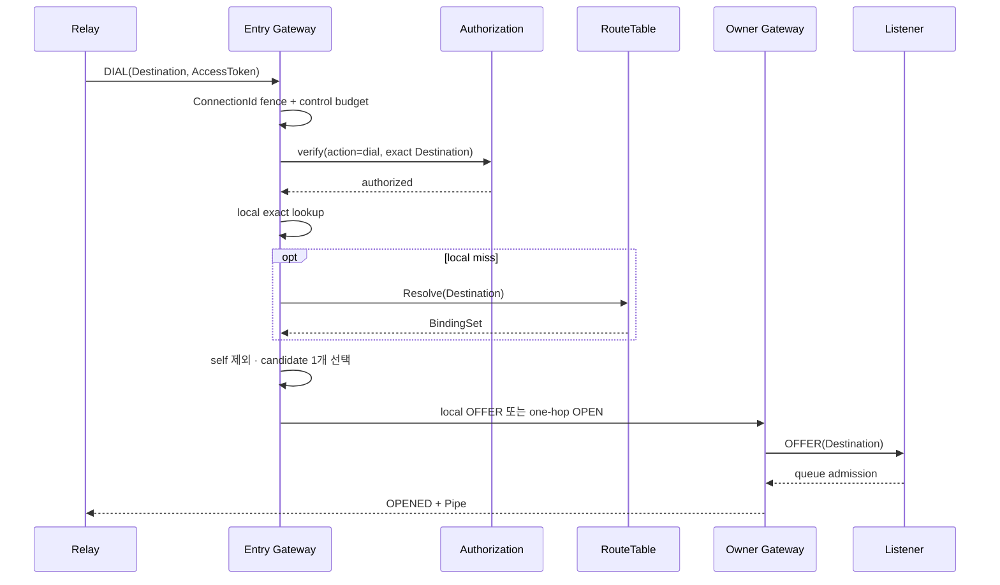

# SPEC 005: dial과 연결 수립 계약

AccessToken은 Entry Gateway에서 제거됩니다. RT Resolve와 peer OPEN에는 Destination·Binding identity만 전달합니다.

## SDK–Gateway frame

`relaygate-protocol` `Frame`의 전체 목록입니다. 상관 ID는 응답과 요청을 연결하는 field입니다.

| Frame | 방향 | 상관 ID | 의미 |
| --- | --- | --- | --- |
| `Hello` | SDK → GW | – | credential 없는 session 시작 |
| `Welcome` | GW → SDK | – | session 수립과 새 `session_id` 부여 |
| `SessionRejected` | GW → SDK | – | session 거절(`code`) |
| `Publish` | SDK → GW | `request_id` | Destination 등록과 access token |
| `Published` / `PublishFailed` | GW → SDK | `request_id` | 등록 결과(`binding_id` 또는 `code`) |
| `Unpublish` / `Unpublished` | SDK → GW / GW → SDK | `request_id` | Binding 해제와 확인 |
| `Dial` | SDK → GW | `connection_id` | Destination 연결 요청과 access token |
| `Offer` | GW → SDK | `pipe_id` | 선택된 Binding의 Listener에 incoming Pipe 제안 |
| `OfferAccepted` / `OfferRejected` | SDK → GW | `pipe_id` | Listener queue admission 결과 |
| `Opened` | GW → SDK | `pipe_id` | dial 쪽 Pipe 수립. `pipe_id`는 origin `session_id`와 DIAL `connection_id`를 포함 |
| `DialFailed` | GW → SDK | `connection_id` | dial terminal 실패(`code`, `observation`) |
| `Cancel` | SDK → GW | `pipe_id` | dial future 취소 시 current PipeId 해제(`DIAL-009`) |
| `Data` / `Fin` / `Close` / `Reset` | 양방향 | `pipe_id` | payload, 한 방향 종료, 정상 종료, 오류 종료 |
| `Ping` / `Pong` | 양방향 | `nonce` | session liveness |

| ID | 계약 |
| --- | --- |
| `DIAL-001` | ConnectionId는 RelaySession 안에서 단조 증가하고 overflow는 terminal resource 오류다. |
| `DIAL-002` | `(SessionId, ConnectionId)` 중복·역행 DIAL은 `PROTOCOL_ERROR`다. |
| `DIAL-003` | authorization 뒤 local exact lookup이 RT resolve보다 먼저 실행된다. |
| `DIAL-004` | remote lookup은 dial attempt마다 authority shard에 한 번 수행한다. |
| `DIAL-005` | candidate set은 caller session Binding을 제외하고 한 Binding을 선택한다. |
| `DIAL-006` | empty candidate는 `NOT_FOUND`, self-only candidate는 `FAILED_PRECONDITION`이다. |
| `DIAL-007` | selected Binding 결과가 해당 attempt의 terminal 결과다. 새 후보는 새 dial이 선택한다. |
| `DIAL-008` | OFFER deadline은 selected RelaySession을 종료해 uncertain queue state를 정리한다. |
| `DIAL-009` | cancelled dial future는 current PipeId에 `CANCEL`을 보내고 sibling state를 유지한다. |
| `DIAL-010` | `OPENED`는 Listener queue admission을 확인한다. |
| `DIAL-011` | remote DIAL admission 초과는 해당 요청을 `RESOURCE_EXHAUSTED/NOT_OBSERVED`로 끝내고 점유를 반환하며 existing session, Binding과 Pipe는 유지된다. |
| `DIAL-012` | OFFER pre-commit writer saturation은 해당 DIAL만 `RESOURCE_EXHAUSTED/NOT_OBSERVED`로 끝내고 selected session, Binding과 existing Pipe를 유지한다. 다른 writer failure는 uncertain session failure다. |

현재 구현에서 local 후보는 Destination별 round-robin으로 선택하고 remote 후보는 첫 후보를 선택합니다. 후보 간 분산은 계약으로 보장하지 않습니다.

## observation

새 DIAL은 ConnectionId fence를 갱신한 뒤 [제어 요청 예산](010-transport-and-admission-contract.md#sdk-제어-요청-보호)과
operation authorization을 검사합니다. rate·authorization 거절은 local lookup·RT Resolve·OFFER 전의 실패이며,
새 시도는 새 ConnectionId를 사용합니다.

| 값 | 증명 범위 | application 행동 |
| --- | --- | --- |
| `NOT_OBSERVED` | selected Listener queue admission 전 실패 | 새 operation 판단 가능 |
| `MAYBE_OBSERVED` | commit 이후 response 관측 불확실 | application idempotency로 판단 |
| `OBSERVED` | caller SDK가 `OPENED` 확인 | Pipe I/O 시작 |

Payload delivery와 업무 처리는 application protocol의 acknowledgement가 증명합니다.
