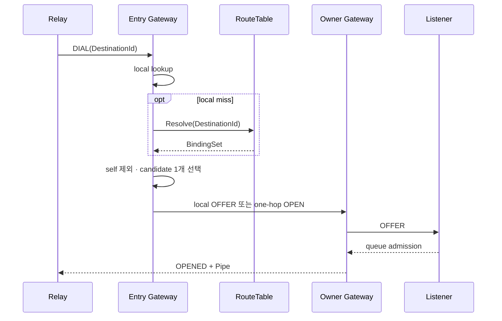

# SPEC 005: dial과 연결 수립 계약

| ID | 계약 |
| --- | --- |
| `DIAL-001` | ConnectionId는 RelaySession 안에서 단조 증가하고 overflow는 terminal resource 오류다. |
| `DIAL-002` | `(SessionId, ConnectionId)` 중복·역행 DIAL은 `PROTOCOL_ERROR`다. |
| `DIAL-003` | local lookup이 RT resolve보다 먼저 실행된다. |
| `DIAL-004` | remote lookup은 dial attempt마다 authority shard에 한 번 수행한다. |
| `DIAL-005` | candidate set은 caller session Binding을 제외하고 한 Binding을 선택한다. |
| `DIAL-006` | empty candidate는 `NOT_FOUND`, self-only candidate는 `FAILED_PRECONDITION`이다. |
| `DIAL-007` | selected Binding 결과가 해당 attempt의 terminal 결과다. 새 후보는 새 dial이 선택한다. |
| `DIAL-008` | OFFER deadline은 selected RelaySession을 종료해 uncertain queue state를 정리한다. |
| `DIAL-009` | cancelled dial future는 current PipeId에 `CANCEL`을 보내고 sibling state를 유지한다. |
| `DIAL-010` | `OPENED`는 Listener queue admission을 확인한다. |
| `DIAL-011` | remote DIAL admission 초과는 해당 요청을 `RESOURCE_EXHAUSTED/NOT_OBSERVED`로 끝내고 점유를 반환하며 existing session, Binding과 Pipe는 유지된다. |
| `DIAL-012` | OFFER pre-commit writer saturation은 해당 DIAL만 `RESOURCE_EXHAUSTED/NOT_OBSERVED`로 끝내고 selected session, Binding과 existing Pipe를 유지한다. 다른 writer failure는 uncertain session failure다. |

## observation

| 값 | 증명 범위 | application 행동 |
| --- | --- | --- |
| `NOT_OBSERVED` | selected Listener queue admission 전 실패 | 새 operation 판단 가능 |
| `MAYBE_OBSERVED` | commit 이후 response 관측 불확실 | application idempotency로 판단 |
| `OBSERVED` | caller SDK가 `OPENED` 확인 | Pipe I/O 시작 |

Payload delivery와 업무 처리는 application protocol의 acknowledgement가 증명합니다.
