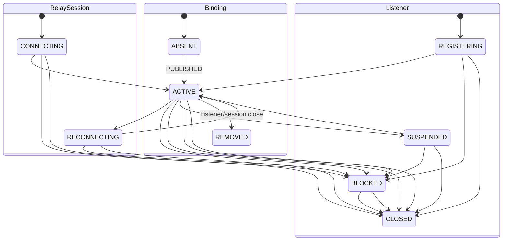
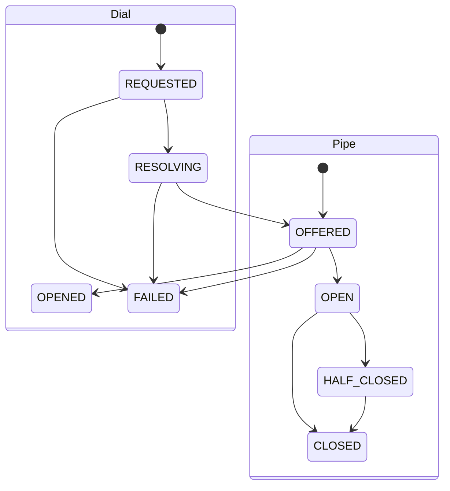
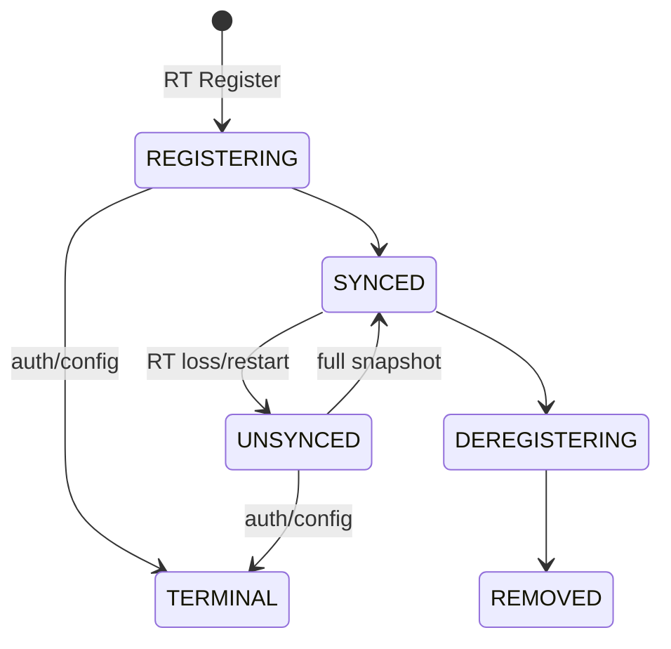

# SPEC 007: 오류와 canonical 상태 모델

State와 event 의미의 기준 문서입니다.

## 오류

process startup에서 unknown transport mode·legacy test flag 혼용·mTLS material 누락은 listener를
열기 전에 실패한다. 연결 후 TLS/mTLS 실패는 terminal connection failure이며 plaintext로 전환하지 않는다.

| code | 대표 조건 | 새 operation 조건 |
| --- | --- | --- |
| `INVALID_ARGUMENT` | UUID/config/frame 오류 | 입력 변경 |
| `UNAUTHENTICATED` | TLS 인증서/ClusterToken 검증 실패 | credential/config 변경 |
| `PERMISSION_DENIED` | authenticated component owner/operation 불일치 | identity/config 변경 |
| `NOT_FOUND` | current Binding 없음 | 상태 변경 |
| `FAILED_PRECONDITION` | self Binding만 존재, closed object | 전제 변경 |
| `UNAVAILABLE` | drain, dependency/transport loss | backoff |
| `DEADLINE_EXCEEDED` | bounded deadline 만료 | observation 확인 |
| `RESOURCE_EXHAUSTED` | session/binding/Pipe/dial/queue/frame 상한, PUBLISH/DIAL rate 예산 | 부하 감소·token 보충 후 새 operation |
| `CANCELLED` | owner operation/session 종료 | caller 결정 |
| `PROTOCOL_ERROR` | version, frame order·ownership 위반 | 구현/config 수정 |
| `INTERNAL` | internal invariant/lock failure | terminal |
| `ALREADY_EXISTS` | 같은 Relay·Destination Listener 중복 | 기존 Listener 종료 |

## 상태 전이

Session reconnect는 Listener identity를 유지하고 새 SessionId와 BindingId를 만듭니다. 늦은 old-session
`PUBLISHED/OFFER`는 current state를 유지하며 `REMOVED` Binding은 terminal입니다.

## 장애 전파

SDK session 생성 전 rate token 부족 또는 transport·handshake capacity 초과는 새 socket을 닫는다.
이 시점에는 wire 오류 응답을 보장하지 않는다. rate token은 시간 경과로 보충되고 새 접속은 새 token을 소비한다.
TLS는 5초, HELLO 수신·응답은 합쳐 5초 이내 종료한다. WELCOME 쓰기 실패·만료는 이미 예약된 session을 정리하고
handshake/transport slot을 반환한다. 다른 admitted session은 유지한다.

| 장애 | 종료 범위 | 유지 범위 | 복구 |
| --- | --- | --- | --- |
| SDK–GW loss | session 소유 Pipe/dial/Binding | 다른 session·Binding | reconnect + Listener republish |
| OFFER uncertain | selected RelaySession | sibling session·Binding | reconnect; caller 새 dial |
| OFFER pre-commit full | 해당 dial | selected session·Binding·Pipe | 부하 감소 뒤 새 dial |
| PUBLISH/DIAL rate 초과 | 해당 요청, DIAL은 `NOT_OBSERVED` | session·기존 Binding·Pipe, 정리 메시지 | token 보충 후 새 operation; DIAL은 새 ConnectionId |
| GW–GW loss | 해당 transport의 stream/Pipe | local Binding·다른 transport | 다음 dial이 transport 생성 |
| GW–RT loss | remote resolve·sync | local Binding·established Pipe | worker reconnect + snapshot |
| RT restart | 해당 shard lease/mapping | Gateway local Binding·Pipe | Gateway 재등록 |
| GW drain | 신규 admission 후 deadline의 owned state | 다른 GW·RT state | SDK/peer reconnect |

## 불변 조건

| ID | 계약 |
| --- | --- |
| `STATE-001` | terminal incarnation은 terminal 상태를 유지한다. |
| `STATE-002` | session terminal cleanup은 그 session 소유 Binding, attempt와 Pipe에 한정된다. |
| `STATE-003` | uncertain publish/dial은 current session 종료로 orphan 가능성을 제거한다. |
| `STATE-004` | late·duplicate·foreign event는 current sibling state와 격리된다. |
| `STATE-005` | RT loss/restart 동안 local Binding과 established Pipe를 유지한다. |
| `STATE-006` | cleanup 반복 적용은 같은 empty/current-state 결과로 수렴한다. |
| `STATE-007` | remote DIAL rejection은 request scope이며 모든 terminal path가 admission을 반환한다. |
| `STATE-008` | OFFER pre-commit failure는 request scope다. 직접 반환하는 단일 admission 거절은 요청 session의 읽기 루프에서 bounded writer 대기를 적용한다. 전달 deadline·closed 및 그 밖의 writer uncertainty는 session scope다. |

PUBLISH의 `RESOURCE_EXHAUSTED`, DIAL의 `RESOURCE_EXHAUSTED/NOT_OBSERVED`가
요청자에게 보내는 단일 action이면 기존 writer queue의 공간을 기다린다.
대기 상한은 현재 heartbeat의 다음 deadline이며 cancellation은 즉시 대기를 종료한다.
대기 중 해당 session의 추가 frame 읽기를 멈추고, socket writer와 다른 session은 계속 실행한다.
state lock·공유 effects loop·별도 대기 task를 점유하지 않는다. 큐 수용은 SDK 수신 확인이 아니다.
대기 실패는 session cleanup으로 수렴하고 SDK의 observation 판정은 기존 계약을 유지한다.
