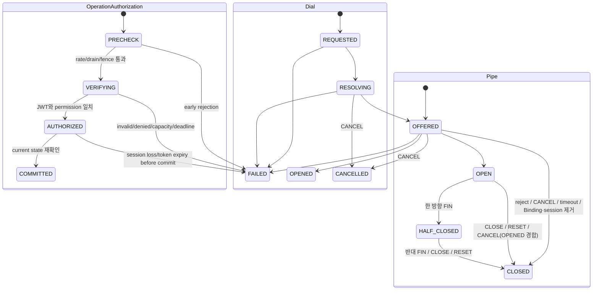
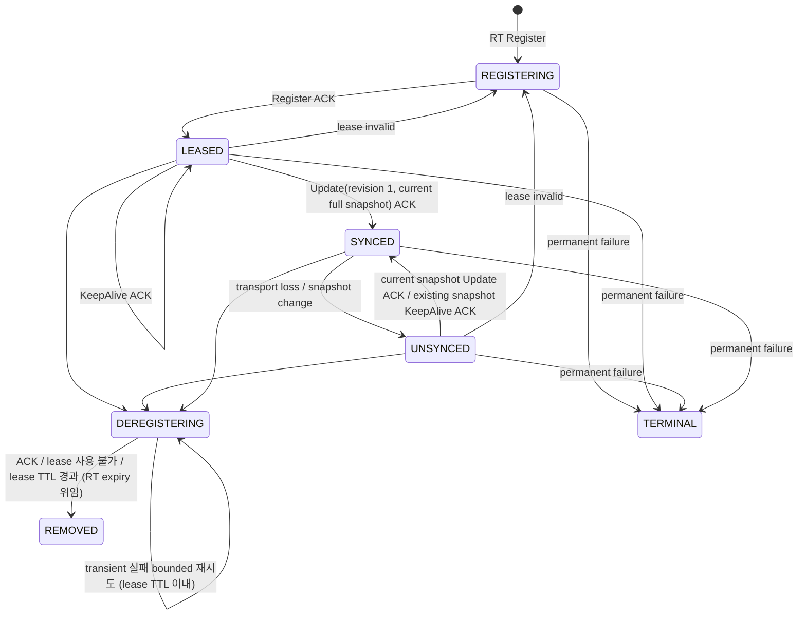

# SPEC 007: 오류와 canonical 상태 모델

State와 event 의미의 기준 문서입니다.

## 오류

Process startup에서 unknown transport mode, 제거된 legacy test flag, mTLS material 누락, authorization config
오류는 listener를 열기 전에 실패합니다. 연결 후 TLS/mTLS 실패는 plaintext fallback 없는 terminal connection
failure입니다.

| code | 대표 조건 | 새 operation 조건 |
| --- | --- | --- |
| `INVALID_ARGUMENT` | Destination/config/frame 오류 | 입력 변경 |
| `UNAUTHENTICATED` | access token 형식·서명·alg·kid·issuer·audience·time claim 검증 실패 | 새 유효 token/config |
| `PERMISSION_DENIED` | 유효한 token에 요청 action·exact Destination 권한 없음 | 권한이 맞는 새 token |
| `NOT_FOUND` | current Binding 없음 | 상태 변경 |
| `FAILED_PRECONDITION` | self Binding만 존재, closed object | 전제 변경 |
| `UNAVAILABLE` | drain, dependency/transport/token source loss | backoff |
| `DEADLINE_EXCEEDED` | operation·authorization bounded deadline 만료 | observation 확인 |
| `RESOURCE_EXHAUSTED` | session/binding/Pipe/dial/queue/frame/authorization 상한, PUBLISH/DIAL rate 예산 | 부하 감소·budget refill 뒤 새 operation |
| `CANCELLED` | owner operation/session 종료 | caller 결정 |
| `PROTOCOL_ERROR` | version, frame order·ownership 위반 | 구현/config 수정 |
| `INTERNAL` | internal invariant/lock/task failure | terminal |
| `ALREADY_EXISTS` | 같은 Relay·Destination Listener 중복 | 기존 Listener 종료 |

`UNAUTHENTICATED`와 `PERMISSION_DENIED`는 해당 PUBLISH/DIAL만 거절하고 RelaySession을 인증 주체로
승격하지 않습니다. 이 두 인증 실패의 DIAL observation은 `NOT_OBSERVED`입니다.

## SDK와 Binding 상태

```mermaid
stateDiagram-v2
    state Relay {
        [*] --> CONNECTING
        CONNECTING --> ACTIVE: TLS + HELLO/WELCOME
        CONNECTING --> [*]: Relay::connect Err
        ACTIVE --> RECONNECTING: session/protocol/transport loss
        RECONNECTING --> ACTIVE: reconnect HELLO/WELCOME
        RECONNECTING --> RECONNECTING: bounded backoff retry
        ACTIVE --> CLOSED: Relay.close
        RECONNECTING --> CLOSED: Relay.close
    }
    state Listener {
        [*] --> REGISTERING
        REGISTERING --> ACTIVE: Binding confirmed
        REGISTERING --> CLOSED: Relay::listen Err / close
        REGISTERING --> SUSPENDED: returned Listener transient failure/session loss
        REGISTERING --> BLOCKED: returned Listener permanent PUBLISH failure
        ACTIVE --> SUSPENDED: session loss
        SUSPENDED --> REGISTERING: bounded republish retry
        ACTIVE --> CLOSED: close
        SUSPENDED --> CLOSED: close
        BLOCKED --> CLOSED: close
    }
    state Binding {
        [*] --> ABSENT
        ABSENT --> ACTIVE: PUBLISHED
        ACTIVE --> REMOVED: Listener/session close
    }
```

Session reconnect는 Listener identity와 AccessTokenSource를 유지하고 새 SessionId와 BindingId를 만듭니다.
초기 config·transport·handshake 실패는 `Relay::connect`의 `Err`입니다. 실행 중 session·protocol·transport
failure는 current session을 끝내고 bounded backoff 재연결을 계속합니다. 늦은 old-session
`PUBLISHED/OFFER`는 current state를 유지하며 `REMOVED` Binding은 terminal입니다. Gateway의 initial
PUBLISH 실패 응답은 `Relay::listen`의 `Err`이고, 이미 반환된 Listener의 영구적인 PUBLISH 실패는 Listener만
`BLOCKED`로 만듭니다.
Public status subscription은 SDK 소유 wrapper로 latest-state/coalescing 의미를 가집니다. `current()`는
현재 값을 반환하고 subscription cursor를 소비하며, `changed()`는 그 이후 변경에서 latest state를 반환합니다.
Relay `CONNECTING`은 `Relay::connect` 반환 전의 논리 상태이며 public `RelayStatus`는 `ACTIVE/RECONNECTING/CLOSED`만
노출합니다. Relay `ACTIVE`는 current `HELLO/WELCOME` transport session 설치를 뜻하며 Listener `ACTIVE/BLOCKED/SUSPENDED`와
독립입니다. Relay `CLOSED`와 Listener `CLOSED`는 terminal이며 `ACTIVE`로 역행하지 않습니다.

## Authorization과 Pipe 상태



Dial 상태는 Gateway 관점의 논리 상태입니다. `REQUESTED`는 precheck·authorization, `RESOLVING`은 local lookup·RT
Resolve, `OFFERED`는 local OFFER 또는 peer OPEN 대기(`StartingPeer`/`AwaitingPeer`)이며 구현 phase와 1:1이 아닙니다.
`CANCEL`(`DIAL-009`)은 remote attempt 또는 Pipe를 제거합니다. acceptor 또는 peer stream이 이미 있으면 `CANCELLED`로
RESET하고, peer OPEN 시작 중이면 OPEN을 취소하며, RT Resolve 중이면 attempt만 제거합니다.

Authorization은 operation admission으로 끝납니다. COMMITTED 뒤 token·claim·expiry state를 Binding 또는 Pipe에
보관하지 않습니다. `HALF_CLOSED`는 별도 wire/state enum이 아니라 `OPEN` Pipe의 방향별 finished flag 중
하나만 설정된 논리 상태입니다.

## RouteTable registration 상태



`TERMINAL`은 shard 범위의 permanent failure가 그 shard의 모든 registration에 적용될 때 `DEREGISTERING`에서도
진입하며, snapshot이 없는 terminal registration은 lease를 버리고 RT expiry에 맡긴 뒤 `REMOVED`로 정리됩니다.

이 다이어그램은 Gateway가 session-shard registration별로 관측하는 상태입니다. RT 쪽 lease와 snapshot 설치 구분은
[ADR 019](../adr/019-registration-snapshot-lifecycle.md)가 설명하며 두 관점은 같은 lifecycle을 다르게 나눈 것입니다.
첫 sync는 revision 1의 current full snapshot `Update` ACK로 성립합니다. RT restart로 기존 lease가 사라지면
Gateway는 `Register`로 새 lease를 얻고 첫 `Update`를 반복합니다.

## 장애 전파

SDK session 생성 전 connection-rate budget 부족 또는 transport·handshake capacity 초과는 새 socket을 닫습니다.
이 socket 단계에는 wire 오류 응답을 보장하지 않습니다. HELLO 뒤의 admission 거절(drain은 `UNAVAILABLE`,
session 상한은 `RESOURCE_EXHAUSTED`)은 handshake 예산 안에서 `SESSION_REJECTED`를 best-effort로 보낸 뒤 socket을
닫습니다. drain은 진행 중인 handshake가 끝날 때까지(TLS·HELLO 예산 이내) session 정리를 미룹니다. TLS는 5초, credential-free HELLO 수신·응답은 합쳐 5초 이내 종료합니다. WELCOME 쓰기 실패·만료는 이미
예약된 session을 정리하고 slot을 반환합니다.

| 장애 | 종료 범위 | 유지 범위 | 복구 |
| --- | --- | --- | --- |
| SDK–GW loss | session 소유 Pipe/dial/Binding | 다른 session·Binding | reconnect + Listener republish |
| drain 중 HELLO | 해당 socket(`SESSION_REJECTED/UNAVAILABLE`) | 기존 session·Binding·Pipe | SDK backoff 재연결 |
| token source 실패 | 해당 PUBLISH/DIAL | session·기존 Binding·Pipe | application source 회복; returned Listener는 재공급 시도 |
| token 인증·권한 실패 | 해당 PUBLISH/DIAL; returned Listener는 `BLOCKED` | session·기존 sibling Binding·Pipe | application이 새 token/source로 새 operation 구성 |
| authorization capacity/deadline | 해당 PUBLISH/DIAL | session·기존 Binding·Pipe | 부하 감소 뒤 새 operation |
| OFFER uncertain | selected RelaySession | sibling session·Binding | reconnect; caller 새 dial |
| OFFER pre-commit full | 해당 dial | selected session·Binding·Pipe | 부하 감소 뒤 새 dial |
| PUBLISH/DIAL rate 초과 | 해당 요청, DIAL은 `NOT_OBSERVED` | session·기존 Binding·Pipe, 정리 메시지 | budget refill 뒤 새 operation; DIAL은 새 ConnectionId |
| SDK Listener/Relay Pipe 상한 | 해당 OFFER/DIAL | RelaySession·Listener·기존/sibling Pipe | 기존 Pipe 종료 뒤 새 dial |
| SDK Pipe/Relay inbound buffer 상한 | 해당 Pipe | RelaySession·Listener·sibling Pipe | application 소비 속도·상한 조정 뒤 새 Pipe |
| GW–GW loss | 해당 transport의 stream/Pipe | local Binding·다른 transport | 다음 dial이 transport 생성 |
| GW–RT loss | remote resolve·sync | local Binding·established Pipe | worker reconnect + snapshot |
| RT restart | 해당 shard lease·BindingProjection | Gateway local Binding·Pipe | Gateway 재등록 |
| GW drain | 신규 admission 후 deadline의 owned state | 다른 GW·RT state | SDK/peer reconnect |

## 불변 조건

| ID | 계약 |
| --- | --- |
| `STATE-001` | terminal incarnation은 terminal 상태를 유지한다. |
| `STATE-002` | session terminal cleanup은 그 session 소유 Binding, attempt와 Pipe에 한정된다. |
| `STATE-003` | uncertain publish/dial은 current session 종료로 orphan 가능성을 제거한다. |
| `STATE-004` | late·duplicate·foreign event는 current sibling state와 격리된다. |
| `STATE-005` | RT loss/restart 동안 local Binding과 established Pipe를 유지한다. |
| `STATE-006` | cleanup 반복 적용은 같은 empty/current-state 결과로 수렴한다. |
| `STATE-007` | remote DIAL rejection은 request scope이며 모든 terminal path가 admission을 반환한다. |
| `STATE-008` | OFFER pre-commit failure는 request scope다. 직접 반환하는 단일 admission 거절은 요청 session의 읽기 루프에서 bounded writer 대기를 적용한다. 전달 deadline·closed 및 그 밖의 writer uncertainty는 session scope다. |
| `STATE-009` | SDK resource admission 실패는 operation/Pipe scope다. Listener queue 포화는 해당 OFFER를 즉시 거절하고, Pipe buffer 초과는 해당 Pipe만 RESET한다. 점유는 cancel·drop·terminal cleanup 뒤 기준값으로 수렴한다. |
| `STATE-010` | Relay와 Listener public status는 latest-state snapshot/subscription으로 관측되며 terminal `CLOSED` 이후 non-terminal 상태를 publish하지 않는다. |

PUBLISH의 `RESOURCE_EXHAUSTED`, DIAL의 `RESOURCE_EXHAUSTED/NOT_OBSERVED`가 요청자에게 보내는 단일
action이면 기존 writer queue의 공간을 기다립니다. 대기 상한은 현재 heartbeat의 다음 deadline이며 cancellation은
즉시 대기를 종료합니다. 대기 중 해당 session의 추가 frame 읽기를 멈추고 socket writer와 다른 session은 계속
실행합니다. State lock·공유 effects loop·별도 대기 task를 점유하지 않습니다. 큐 수용은 SDK 수신 확인이 아닙니다.
대기 실패는 session cleanup으로 수렴하고 SDK의 observation 판정은 유지됩니다.

하나의 `PeerTransport` loss가 만든 `RESET`과 `DIAL_FAILED`는 대상 SDK session별 단일 writer item으로
묶습니다. writer는 내부 frame 순서를 유지해 전송하고, 묶음 크기는 잃은 transport의 stream 상한을 넘지
않습니다. 묶음 자체를 bounded queue에 넣지 못하면 일부 frame만 보내지 않고 session cleanup으로 수렴합니다.
