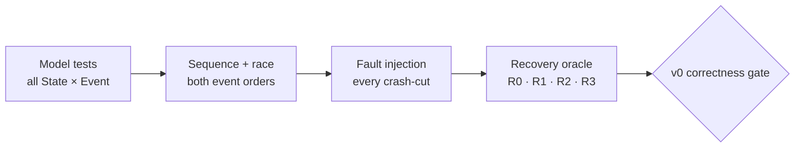

# TEST 001: Core Correctness Test Plan

> **Status:** Draft — 전체 v0 release gate는 아직 `Planned`
>
> RelayGate의 닫힌 상태 모델, failure semantics와 복구 경계를 증명하기 위해 반드시 통과해야 할 테스트다.

이 문서의 모든 항목은 v0 correctness gate에 필수다. 상태와 event의 source는
[SPEC 004](../spec/004-state-transition-model.md), failure·race·복구 oracle은
[SPEC 003](../spec/003-failure-and-recovery-model.md)이다. 이 목록은 새 동작 의미를 만들지 않는다.

## 합격 증거

각 테스트는 응답 code 하나가 아니라 다음 증거를 함께 수집해야 한다.

| Evidence | 반드시 확인할 것 | Evidence owner |
| --- | --- | --- |
| Input | Initial identity/state, exact event order, injected crash/loss/partition 지점 | Fault harness |
| Durable | Raft term/vote/log/snapshot, current `BindingSlot` generation/value/tombstone | Runtime test instrumentation |
| Authority | `ClusterEpoch`, `AuthorityId`, quorum confirmation, control/presence completeness | Runtime observation + harness |
| Runtime | Gateway별 session, binding, attempt, Pipe segment와 terminal state | Runtime test instrumentation |
| SDK | Go/Rust caller·listener가 관찰한 `Opened/Failed/Cancelled/Unknown`과 handle lifetime | SDK test client |
| Recovery | Target별 R0–R3 판정과 새 identity/rebind 여부 | Harness + operator evidence |

Timeout은 test harness의 무한 대기 방지에만 쓴다. Timeout 경과 자체를 death proof나 correctness oracle로
사용하지 않는다. 가능한 test는 sleep 대신 barrier, event hook와 exact crash-cut을 사용한다.
Historical candidate, clean termination과 external fence처럼 RelayGate가 저장하지 않는 증거는 harness/operator
artifact로 검증한다. Mandatory test라는 이유로 production RelayGate에 revocation ledger를 추가하지 않는다.



## M — Model and invariant tests

| ID | Test | Injection / input | Pass oracle |
| --- | --- | --- | --- |
| `M01` | State×event totality | 모든 SPEC 004 machine의 모든 state와 event Cartesian product | 정확히 하나의 explicit transition, idempotent no-op 또는 stable rejection만 나온다. |
| `M02` | Absorbing terminal/fence | 모든 terminal/fenced/retired state에 duplicate close·cancel·failure·late-success event 재생 | State가 부활하지 않는다. 결과는 no-op 또는 명시된 idempotent cleanup뿐이며 state-advancing success가 아니다. |
| `M03` | Identity fence | Old epoch와 stale AuthorityId/ControlSessionId/GatewayInstanceId/generation/ref의 state-advancing message 재생 | Current state를 전진시키지 않는다. Cleanup/terminal replay만 idempotent no-op다. Valid same-epoch issued context는 `C03`으로 분리한다. |
| `M04` | Epoch fence | Same attempt를 current epoch와 old epoch context로 각각 제출 | Current exact context만 평가하고 old context는 terminal/rejected다. |
| `M05` | Six-gate truth table | `(A,L,Q,C,V,O)` 64개 Boolean vector | `111111`만 owner reservation/Listener offer. 다른 63개는 Pipe가 없다. |
| `M06` | Strict ClientId namespace | 같은 Endpoint/Target을 두 ClientId에 만들고 cross-client lookup·fallback 시도 | 인증된 ClientId 안에서만 resolve; cross-client 결과 0건/거부다. |
| `M07` | Deterministic duplicate | 각 success command와 ACK를 duplicate/reorder | 한 번만 effect가 발생하고 응답 재전송이 state를 중복 생성하지 않는다. |
| `M08` | Capacity fail closed | Session/listener/attempt/Pipe/buffer cap 직전·도달·초과 | 새 항목만 안정적으로 실패하며 기존 live state를 evict하거나 payload를 silent drop하지 않는다. |
| `M09` | Lifecycle completion | 종료 event가 정의된 모든 non-terminal runtime state에 해당 identity/session/hop/epoch 종료 주입 | 명시된 terminal/unavailable 상태로 가거나 이미 끝난 경우 no-op이다. Default rejection 때문에 live state가 고립되지 않는다. |

## B — Binding and Raft control record tests

| ID | Test | Injection / input | Pass oracle |
| --- | --- | --- | --- |
| `B01` | Install ACK loss | Binding CAS apply 전/후 crash 또는 ACK loss 후 동일 command replay | 정확히 하나의 target generation/live ref만 남는다. |
| `B02` | Remove ACK loss | Tombstone CAS apply 전/후 crash 또는 ACK loss 후 replay | 최신 tombstone 하나이며 repeat remove는 idempotent다. |
| `B03` | ABA protection | `live(g1) → tombstone(g2) → live(g3)` 뒤 old install/remove 재생 | Old generation은 g3 ref를 덮거나 지우지 않는다. |
| `B04` | Unbind before reservation | Local `LiveB→RetiringB` 후 delayed OpenContext 전달 | `O=false`; Listener offer가 없다. |
| `B05` | Reservation before unbind | Owner reservation 뒤 explicit unbind | 그 admitted attempt만 accept/reject까지 진행하고 후속 attempt는 막힌다. |
| `B06` | Crash leaves stale record | Owner Gateway crash/control timeout 뒤 committed live record 유지 | `V` 또는 `O`가 false라 route가 되지 않는다. |
| `B07` | Conditional cleanup vs rebind | Old cleanup과 new generation rebind를 두 순서로 적용 | New ref가 이기면 cleanup no-op, cleanup이 먼저면 rebind가 next generation으로 재시도한다. |
| `B08` | Distinct-key cap | 한 epoch에서 cap까지 서로 다른 BindingKey 생성 후 existing/new key 작업 | Existing rebind/remove는 가능, 처음 보는 key install만 fail closed다. |
| `B09` | Registering cancel vs late install | Install submit 뒤 unbind/session end와 Raft apply를 양 순서로 실행 | Local binding은 즉시 retired라 `O=false`다. Apply가 늦게 성공하면 exact ref conditional tombstone을 제출하고 새 ref를 건드리지 않는다. |
| `B10` | Gateway registration replay | 동일 Gateway register command를 ACK loss 뒤 재생 | 같은 generation/ref 하나만 남고 replay는 `AlreadyApplied`다. |
| `B11` | Gateway instance replacement | 같은 GatewayId에 새 GatewayInstanceId를 exact CAS로 등록 | Generation이 한 번 증가하고 old control session/snapshot은 즉시 fenced/ineligible이다. |
| `B12` | Gateway registration ABA | `live(g1) → tombstone(g2) → live(g3)` 뒤 old register/remove 재생 | Old generation은 current instance를 덮거나 제거하지 않는다. |
| `B13` | Distinct GatewayId cap | Epoch cap까지 등록한 뒤 existing/new GatewayId 작업 | Existing reconnect/replace/remove는 가능하고 처음 보는 GatewayId만 fail closed다. |
| `B14` | Gateway snapshot round trip | GatewaySlot과 BindingSlot을 snapshot/restore | 정렬된 동일 state와 generation/ref/tombstone을 복구한다. Live route는 control 재검증 전 열리지 않는다. |
| `B15` | Reconnect envelope bound | 최대 길이 identity/pattern으로 current instance listener 512개 생성 후 513번째 install과 snapshot 복원 | 512개 `SessionOpened`/`FullSnapshot`은 1 MiB 미만, 513번째 새 key는 capacity rejection이다. Same-key replace와 다른 instance는 독립적으로 진행한다. |

## O — Open, accept and observation tests

| ID | Test | Injection / input | Pass oracle |
| --- | --- | --- | --- |
| `O01` | Exact successful Open | Authority context→owner reserve→Listener accept→owner apply→Listener confirm→Ingress apply→caller ACK | Owner apply가 유일한 Open LP이고 각 participant state가 SPEC 004 순서를 따른다. |
| `O02` | Listener reject/deadline | Offer reject와 deadline을 각각 주입 | Owner/Ingress/Caller는 terminal이며 `PipeId`/handle이 노출되지 않는다. |
| `O03` | Accept vs cancel | Owner가 두 event order를 각각 관찰 | Accept-first는 Accepted 뒤 local terminal, cancel-first는 late accept no-op다. |
| `O04` | Session close vs Open | Authority admission 전과 owner reservation/Listener accept 뒤 session 종료 | 전자는 `A=false`, 후자는 accepted Pipe가 local terminal로 전이한다. |
| `O05` | Credential removal vs delayed context | Context 발급 후 owner config swap·retirement 전/후 전달 | Retirement 전에는 race ordering, 완료 후에는 `O=false`와 no offer다. |
| `O06` | Listener confirmation loss | Owner accept 뒤 confirmation send/apply 전후 loss/crash | Apply 전 SDK handle 없음. Apply 뒤 handle이 생겨도 hop failure를 local terminal로 처리한다. |
| `O07` | Ingress accepted loss/crash | Owner accepted send 전/후, Ingress apply 전/후 crash | Caller는 `Unknown`; live owner에서만 `AcceptedUnconfirmed`, same-Pipe resume 없음. |
| `O08` | Caller ACK loss | Ingress apply 뒤 ACK send/observation 전후 loss | Caller 관찰 전이면 `Unknown`; Owner crash 뒤 exact outcome은 R3다. |
| `O09` | Owner crash cuts | Reservation, Listener accept, owner Accepted apply의 각 직전/직후 crash | Apply 전 accepted Pipe 없음. Apply 뒤 live state 소실로 exact outcome 복구 불가다. |
| `O10` | OpenAll partial outcome | Target별 success/reject/deadline/response loss 혼합 | Target outcome은 독립적이고 rollback하지 않으며 `Opened/Failed/Unknown`이 정확하다. |
| `O11` | OpenAll aggregate cancel | Pending, admitted, unobserved accepted, observed Opened child가 섞인 상태에서 cancel | 미관찰 child는 caller-local `Cancelled` + best-effort cancel, 반환된 handle은 caller 소유다. |
| `O12` | Go/Rust interoperability | Caller/Listener 조합 Go→Go, Go→Rust, Rust→Go, Rust→Rust | 동일 wire semantics, outcome과 terminal 순서를 관찰한다. |
| `O13` | Late attempt deadline | Owner/Ingress/Listener/Caller가 Open을 local 적용한 직후 이전 attempt timer 실행 | 열린 Pipe를 닫거나 outcome을 되돌리지 않고 timer event만 no-op 처리한다. |

## C — Control plane and process failure tests

| ID | Test | Injection / input | Pass oracle |
| --- | --- | --- | --- |
| `C01` | Same-epoch leader failover | Current authority step-down 후 surviving quorum election | Old publication 폐기, new AuthorityId와 빈 `Rebuilding`, 재검증 뒤만 route 가능하다. |
| `C02` | Quorum loss before context | Authority decision 직전 quorum 차단 | 새 context/bind/resolve가 없다. 기존 Pipe relay/local teardown은 계속한다. |
| `C03` | Quorum loss after context | Quorum-confirmed exact context 발급 직후 quorum 차단 | Same-epoch single-use attempt만 local ordering으로 한 번 진행한다. |
| `C04` | Stale authority/control replay | Failover 뒤 old AuthorityId/ControlSessionId의 state-advancing snapshot과 command 재생 | Current state, presence와 binding eligibility가 변하지 않는다. Valid same-epoch issued context는 이 case가 아니다. |
| `C05` | Control partition false positive | Live Gateway의 control path만 timeout시키고 data path 유지 | New route는 ineligible할 수 있으나 timeout이 어떤 gate도 true로 만들지 않는다. |
| `C06` | Control reconnect | 같은 live Gateway가 새 ControlSessionId와 authoritative current-instance binding view를 받은 뒤 full snapshot 전송 | `Syncing` 중 `V=false`; prior-instance/foreign/tombstone을 reconcile view로 쓰지 않고 exact full snapshot install 뒤만 `Revalidated`다. 최대 합법 snapshot도 1 MiB control envelope 안에 든다. |
| `C07` | Gateway crash/restart | Gateway process crash 후 새 instance로 재시작 | 새 GatewayInstanceId, re-auth/register/rebind가 필요하고 old Pipe는 복구되지 않는다. |
| `C08` | Durable voter restart | Intact voter store로 restart | Raft safety는 유지되지만 recovered BindingRecord만으로 route가 열리지 않는다. |
| `C09` | Voter store loss | 한 voter local store 삭제/손상 후 재참여 | Old voter identity를 재사용하지 않고 live quorum에 새 identity로 합류한다. |
| `C10` | Same-epoch quorum unavailable | Quorum-compatible safety state를 복구할 수 없는 조합 | Same epoch를 강제 bootstrap하지 않고 fail closed한다. |
| `C11` | Unsafe fresh epoch request | 하나의 old authority path를 fence하지 못한 상태에서 reset | Fresh epoch가 열리지 않고 service R3/fail closed다. |
| `C12` | Safe fresh epoch | 모든 old path external fence 증명 후 offline bootstrap | New epoch만 current이며 old context/message는 거부된다. Service R2, old continuity R3다. |
| `C13` | Control protocol order | Hello 전, snapshot 전 mutation, 두 번째 Hello/Snapshot, missing mutation을 각각 전송 | 허용된 `Hello → Snapshot → Mutation*` 외 입력은 stable gRPC rejection이고 durable state는 전진하지 않는다. |
| `C14` | Mutation response loss | Binding mutation commit 직전/직후 stream을 끊고 새 session의 owned-binding view로 snapshot/replay | Commit 전이면 replay가 한 번 apply되고, commit 뒤 exact replay는 `AlreadyApplied`; 결과를 timeout/문자열 오류로 추측하거나 같은 stream을 resume하지 않는다. |
| `C15` | Follower endpoint | 같은 Hello를 follower와 quorum-confirmed leader에 전송 | Follower는 `UNAVAILABLE`이고 registration이 없으며 leader만 session을 연다. Redirect state는 없다. |
| `C16` | Caller verification cancellation | Healthy leader/quorum에서 `/status` 또는 control RPC verification 중 caller context cancel/deadline | 해당 호출만 `UNAVAILABLE`; current AuthorityId와 다른 control session은 유지된다. Manager-owned probe failure는 계속 global fence한다. |

## K — Config, revocation and presence tests

| ID | Test | Injection / input | Pass oracle |
| --- | --- | --- | --- |
| `K01` | Invalid startup | Parse/validation 실패 config | `StartupBlocked`; service와 partial auth snapshot이 없다. |
| `K02` | Invalid reload | Active 중 invalid candidate SIGHUP | 기존 revision/session/binding/Pipe가 그대로 유지된다. |
| `K03` | Valid addition/rotation | New immutable ApiKeyId 추가 후 old ID 제거; final auth revalidation과 swap의 두 순서를 barrier로 재현 | Addition은 기존 session에 영향 없다. Revalidation이 먼저면 성공한 session을 같은 reload가 retire하고, swap이 먼저면 session을 만들지 않는다. |
| `K04` | Verifier mutation rejected | 같은 ApiKeyId의 verifier만 변경 | Reload 전체가 거부되고 기존 snapshot을 유지한다. |
| `K05` | Local removal completeness | Key/Client 제거 후 unconsumed attempt, 겹친 auth session, binding, Pipe segment 존재 | 모두 local retired/terminal 전에는 `LocalRetirementDone=false`이며 완료 뒤 제거 credential의 session은 없다. |
| `K06` | Revision skew | Gateway 일부만 removal revision으로 reload | `config_converged=false`; stale Gateway는 cluster-wide revocation proof를 막는다. |
| `K07` | Convergence | 모든 current committed Gateway가 같은 revision·retirement 완료 보고 | Quorum-confirmed observation에서만 `config_converged=true`다. |
| `K08` | Candidate timeout/removal | Removal interval candidate를 timeout 또는 control set에서 제거 | Candidate에서 빠지지 않으며 retirement, clean termination 또는 external fence가 필요하다. |
| `K09` | Revocation proof complete | Converged revision + 모든 candidate의 세 증거 중 하나 | 그 observation에서만 `RevocationSafe=true`다. |
| `K10` | Proof invalidation | New Gateway/config/control generation 또는 external config rollback | 이전 proof 즉시 무효, 새 candidate set으로 재평가한다. |
| `K11` | Candidate set incomplete | Historical candidate 완전성을 증명하지 못함 | `RevocationSafe=false`다. |
| `K12` | Stale REST publication | Authority/quorum 상실 뒤 old `complete=true/config_converged=true` 요청 | Unavailable/incomplete이며 old true를 current로 재사용하지 않는다. |
| `K13` | Authentication boundary | Valid, missing, invalid와 다른 ClientId의 `(ClientId, ApiKeyId, presented key)` 조합 | Current exact credential만 새 session을 만들며 실패한 인증은 session/namespace를 만들거나 다른 client로 fallback하지 않는다. |
| `K14` | REST authorization and redaction | Missing/invalid, client와 administrator credential로 own/other/cluster presence 요청 | Client는 자기 ClientId만, admin은 read-only cluster view만 본다. Verifier/secret/payload/buffer와 mutation/relay surface는 노출되지 않는다. |
| `K15` | Authentication resource bounds | First message를 보내지 않고 deadline을 넘기며, 서로 다른 connection에서 session 상한을 초과 | Deadline 뒤 session 없이 종료되고 global active-session 상한은 기존 session을 보존한 채 `ResourceExhausted`로 거부한다. |

## P — Pipe terminal and flow-control tests

| ID | Test | Injection / input | Pass oracle |
| --- | --- | --- | --- |
| `P01` | Each participant closes | Caller, Ingress, Owner, Listener에서 각각 최초 close/cancel | 해당 local terminal은 absorbing이고 peer 전파는 idempotent best-effort다. |
| `P02` | Permanent partition | Terminal signal 전파 중 hop 영구 partition | 각 participant local truth만 보장하며 global cause/order/convergence를 주장하지 않는다. |
| `P03` | Duplicate terminal | 서로 다른 terminal cause와 duplicate signal을 reorder | 각 participant에서 first local terminal만 effect가 있고 이후 event는 no-op다. |
| `P04` | Half-close/EOF | 각 방향 EOF | v0에서는 전체 local logical Pipe terminal이며 half-open state가 남지 않는다. |
| `P05` | Bounded backpressure | Downstream 정지로 queue high→bound exceeded | Upstream flow를 막고 silent payload drop 대신 terminal을 요청한다. |
| `P06` | Terminal bypass | Payload queue가 가득 찬 상태에서 close/cancel/failure | Terminal/control signal이 payload queue를 우회한다. |
| `P07` | Payload non-replay | Hop/process failure 뒤 새 Pipe 생성 | Old volatile payload와 delivery position을 재전송/복구하지 않는다. |

## X — Required cross-failure coverage

[SPEC 003](../spec/003-failure-and-recovery-model.md)의 `F1`–`F7` 모든 equivalence-class pair는 다음 중 하나의
evidence를 가져야 한다.

```text
∀i < j, ∀x ∈ Fi, ∀y ∈ Fj:
  observed(Fi=x ∧ Fj=y) ∨ proved_unreachable(Fi=x ∧ Fj=y)
```

도달 불가능한 조합은 skip만 하지 않고 state invariant proof를 test artifact로 남긴다. Race가 linearization
point와 경쟁하면 두 event order가 각각 독립 test다.

다음 3-way scenario는 pairwise 결과와 별도로 필수다.

| ID | Scenario | Pass oracle |
| --- | --- | --- |
| `X01` | Authority change × quorum loss × stale control reconnect | 새 admission 없음; stale snapshot은 current state를 바꾸지 않는다. |
| `X02` | Credential removal × Gateway timeout × presence classification | Presence complete가 revocation convergence를 대신하지 않는다. |
| `X03` | Listener accept × ACK loss × owner crash | Caller `Unknown`; exact Pipe/outcome R3, route는 새 rebind로 R1 가능하다. |
| `X04` | Old-epoch partition × same-epoch state loss × reset request | 모든 old path fence proof 없이는 fresh epoch를 열지 않는다. |
| `X05` | Backpressure exhaustion × cancel × participant crash | Local absorbing terminal, no silent drop, no global terminal order다. |
| `X06` | OpenAll partial accept × authority failover × response loss | Target별 monotonic outcome, no rollback, no same-Pipe resume다. |

## R — Recovery and irrecoverability tests

| ID | Target / incident | Pass classification |
| --- | --- | --- |
| `R01` | Surviving quorum election과 presence rebuild | Service `R0` |
| `R02` | Gateway/SDK reconnect·re-auth·rebind | 해당 route `R1`; old Pipe는 `R3` |
| `R03` | Voter/network/config operator repair 후 reconnect | 전체 recovery plan `R2` |
| `R04` | Safe offline fresh epoch | Service `R2`; same-epoch continuity `R3` |
| `R05` | Unfenceable old authority path + same-epoch unrecoverable | Service `R3`; fail closed만 가능 |
| `R06` | ACK loss로 caller outcome `Unknown` | Exact outcome/Pipe `R3`; retry는 새 operation |
| `R07` | Inflight/buffer/delivery position loss | Payload position `R3`; RelayGate replay 없음 |
| `R08` | External config와 backup loss | Old ClientId namespace `R3`; 새 identity enrollment는 별도 `R2` |

## Traceability and release gate

| Contract | Mandatory tests |
| --- | --- |
| State totality, lifecycle completion, terminal absorbing | `M01–M04`, `M09`, `P01–P03` |
| Client isolation, authentication, REST boundary and admission | `M05–M06`, `O01–O05`, `K13–K15` |
| Binding/Gateway ABA and bounded durable state | `B01–B15` |
| Open observation and SDK compatibility | `O06–O13` |
| Authority, quorum, control order and epoch safety | `C01–C16`, `X01`, `X04` |
| Config revocation and presence | `K01–K12`, `X02` |
| Bounded flow and volatile payload | `M08`, `P04–P07`, `X05` |
| Partial/unknown outcomes | `O07–O11`, `X03`, `X06`, `R06–R07` |
| Recovery boundary | `R01–R08` |

| Oracle class | Tests | 소유자와 합격 증거 |
| --- | --- | --- |
| Service-owned | 위 테스트의 current durable/runtime/SDK observation | RelayGate test instrumentation과 SDK가 직접 증명한다. |
| Harness/operator-owned | `C11–C12`, `K08–K11`, `X02`, `X04`, `R03–R05`, `R08` | Historical candidate, external fence, store/config loss와 operator action을 fault manifest로 제공한다. 증거가 없으면 safe/recovered로 판정하지 않는다. |

v0 correctness 완료를 주장하려면 다음을 모두 만족해야 한다.

- 위 `M/B/O/C/K/P/X/R` test와 필요한 harness/operator artifact 검증이 자동화되어 통과한다.
- 모든 SPEC 003 crash-cut의 직전/직후가 coverage에 포함된다.
- `F1–F7` pairwise manifest의 모든 cell이 observed 또는 proved-unreachable이다.
- Go/Rust SDK 네 조합이 같은 protobuf semantics를 통과한다.
- 실패한 test를 timeout 증가나 retry 추가만으로 숨기지 않는다.
- 실행하지 않은 test는 `passed`로 기록하지 않는다.

현재 자동화 범위는 다음과 같다.

| Slice | 현재 증거 | 아직 증명하지 않는 것 |
| --- | --- | --- |
| Raft FSM | Binding/Gateway CAS replay, rejection, ABA, distinct-key/per-instance cap과 deterministic snapshot unit test | Process crash-cut 전체와 route eligibility |
| Control stream | Hello/snapshot 순서, current-instance reconcile view, 최대 legal snapshot의 1 MiB envelope, 직렬 mutation, exact GatewaySlot fence, cross-owner mutation 거부, instance replacement와 quorum-loss fence gRPC test | Auth, payload relay와 arbitrary packet loss |
| Gateway control client | Process별 새 GatewayInstanceId, follower endpoint 순회, 같은 instance reconnect의 exact binding snapshot/ACK-loss reconcile, prior same-Gateway 1회 CAS retry, foreign conflict, silent transport blackhole 뒤 bounded readiness 철회 | Auth revision, gateway-only deployment와 arbitrary packet loss |
| Client auth/session | Strict verifier parse, deterministic revision, exact ClientId/ApiKeyId 인증, rotation/removal, immutable key rejection, first-message deadline, global session cap과 removal terminal race/unit gRPC test | TLS network deployment와 SDK interoperability |
| Local listener binding | Authenticated ClientId namespace, Registering/Live/retirement, exact late cleanup, reload insertion barrier, session ownership, 512 count/1 MiB wire bound와 cleanup-pending capacity unit test | Open reservation, pattern matching과 payload relay |
| Public Relay stream | Authenticate 뒤 ordered Bind/Unbind, session-derived namespace, non-disclosing Unbind와 redacted stable gRPC status test | Public Go/Rust SDK와 end-to-end Open/Pipe |
| Read-only observation | `/status`의 quorum-confirmed AuthorityId와 local auth revision publication, quorum-loss 직후 `503 + NoAuthority` K12와 caller cancellation non-fencing C16 unit test | Config convergence와 REST administrator/client authorization |
| 3 voter | 정적 bootstrap/복제/leader replacement/rejoin, old control stream fence와 new authority full-snapshot 후 mutation integration test | Dynamic membership, full pairwise failure matrix |
| Container wiring | CI에서 새 3-node Compose cluster의 세 Gateway 자동 등록, leader stop 뒤 surviving Gateway 재검증과 실제 control smoke | 장기 soak, resource pressure와 arbitrary container partition |

이는 `M03`, `M08`, `B01–B03`, `B07–B08`, `B10–B15`, `C01`, `C04–C06`, `C08`, `C13–C16`,
`K01–K05`, `K13`, `K15`의 일부 전제에 대한
구현 증거일 뿐, 각 항목의 모든 crash-cut과 route oracle을 충족하지 않는다. 따라서 test ID 전체를 아직
`passed`로 판정하지 않는다. 부분 unit/integration test는 전체 runtime correctness 증명이 아니다.

## 관련 문서

- [SPEC 001: RelayGate System Model](../spec/001-system-model.md)
- [SPEC 002: Client Configuration and Presence](../spec/002-client-configuration-and-presence.md)
- [SPEC 003: Failure and Recovery Model](../spec/003-failure-and-recovery-model.md)
- [SPEC 004: State Transition Model](../spec/004-state-transition-model.md)
