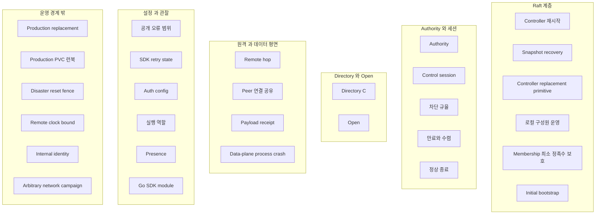

# TEST 002: 현재 장애 근거

이 문서는 현재 자동화가 실제 실행한 것과 외부·운영자 근거가 남은 것을 구분한다. 없는 운영 근거를 통과로 표시하지 않는다.

## 상태값 의미

| 상태값 | 의미 |
| --- | --- |
| `executed` | 테스트·검증 도구가 장애 순서와 판정 기준을 직접 관찰 |
| `representative` | 결정적 자동화가 로컬 경계를 관찰하지만 모든 운영체제·네트워크·배포 구현을 포괄하지는 않음 |
| `invariant` | 소유권·API 경계가 상호작용을 불가능하거나 독립적으로 만들고 경계 테스트가 존재 |
| `missing-evidence` | 필수지만 현재 자동화로 증명되지 않음 |
| `external-blocked` | 저장소 밖 배포·운영자 근거 필요 |

## 장애 축 지도

## 장애 축

| 장애 축 | 경우 | 상태값 | 근거 |
| --- | --- | --- | --- |
| Controller 재시작 | 같은 저장소·`NodeId`, bootstrap 없음 | `executed` | 같은 저장소 재시작 테스트 |
| Snapshot recovery | Compacted log에서 current FSM restore | `executed` | Node/FSM snapshot test |
| Controller replacement primitive | Fresh `NodeId` add/catch-up/remove, old identity reuse 거부 | `executed` | Add/remove와 identity test |
| 로컬 구성원 운영 | Unix socket 목록·추가·제거, 리더 조건, 멱등 재시도 | `executed` | 구성원·Compose 운영 테스트 |
| Membership 최소 정족수 보호 | 마지막 voter 제거 요청 거부, `RemoveServer` 미호출 | `executed` | `TestServiceRefusesToRemoveLastVoter` |
| Production replacement | Deployed runbook의 safe start/add/readiness/remove | `external-blocked` | Production operator evidence 필요 |
| Initial bootstrap | One-shot voter manifest, steady Compose에서 bootstrap 제거 | `executed` | Config/Compose bootstrap stage |
| Production PVC/runbook | Real storage class/backup/replacement | `external-blocked` | Operator evidence 필요 |
| Disaster reset fence | New epoch 전 old path fence | `external-blocked` | Compose stop으로 증명 불가 |
| Authority | Current/cancel/term/ref/follower/quorum loss/point lookup | `executed` | Authority manager test |
| Control session | Syncing/revalidated/timeout/replacement/stale message | `executed` | Client/server blackhole integration |
| 차단 규율 | Apply 전송 실패 시 V 전체 fence, C는 무손상. Authority 교체 시 이전 term의 진행 중 mutation이 V를 되살리지 못함 | `executed` | `TestEndSessionDropsVWhileMutationApplyIsInFlight`, `TestAuthorityChangeDuringMutationCannotRestoreStaleV`, `TestAuthorityFailoverRetainsCommittedDirectoryButDropsV`, `TestStaleConfirmationCannotReplaceNewerAuthorityTerm` |
| 만료와 수렴 | 새 authority 확립 시 committed C 전체에 grace 부여, 재검증한 Gateway는 만료되지 않음, grace 만료 시 정확히 그 인스턴스만 cascade delete, 교체 인스턴스는 stale cleanup에서 보호 | `executed` | `TestNewLeaderCleansPersistedGatewayThatNeverRevalidates`, `TestGraceCleanupDeletesOnlyUnrevalidatedCurrentGateway`, `TestSyncingSessionExpiresWithoutFullSnapshot`, `TestStaleGraceCleanupCannotDeleteReplacementInstance`, `TestEndSessionRetainsCAndReconnectCancelsGraceCleanup` |
| 정상 종료 | draining 진입 후 Apply/VerifyLeader/AddVoter/RemoveServer 거부, shutdown timeout 시 transport만 닫고 store는 열어 둠 | `missing-evidence` | `lifecycle.go`의 `BeginShutdown`/`Close` 경로를 직접 검증하는 테스트 없음 |
| Directory `C` | Exact/absent/conflict/churn/max/cascade | `executed` | FSM/authority directory test |
| Open | Six gates/reject/cancel/deadline/ACK loss/Unknown | `executed` | 64-vector/opening race test |
| Remote hop | Provenance/replay/expiry/stream loss | `representative` | Decoder/peer/forwarded test, arbitrary network campaign 없음 |
| Peer 연결 공유 | 같은 소유자 재사용, 다른 Pipe 격리, 소유자 교체 후 소진, 상한 유휴 제거 | `executed` | `TestGatewayRelaySharesOneConnectionAcrossOwnerPipes`, `TestGatewayRelayReplacesChangedOwnerIdentityAfterOldPipesDrain`, `TestGatewayRelayIdleConnectionCacheIsBounded` |
| Payload receipt | 양방향/queue LP/outcome/duplicate/pressure/terminal | `representative` | Opening/public/peer/Go/Rust, OS process-kill cut 없음 |
| 공개 오류 범위 | 작업 범위 확정 실패, 엄격한 연관·enum | `executed` | 공개 + Go/Rust 엄격 오류 테스트 |
| SDK retry state | Protocol은 Failed, transient transport만 Backoff | `executed` | Go/Rust managed classification |
| Auth config | Current/invalid/removal/process skew | `executed` | Auth/runtime/admin test |
| 실행 역할 | Controller Raft·제어, Gateway Relay·저장소 없음 | `representative` | 구성·설정·관리·Compose port 테스트 |
| Presence | Committed `C`, leader-local `V`, completeness claim 없음 | `representative` | Authority/admin exact value test |
| Data-plane process crash | Active Pipe/payload write 중 OS/container kill | `missing-evidence` | In-process cancellation은 process crash가 아님 |
| Arbitrary network campaign | 모든 cut의 loss/duplicate/reorder/delay/partition | `missing-evidence` | Representative loss/timeout만 존재 |
| Remote clock bound | Real node clock skew | `external-blocked` | 운영 근거 필요 |
| Internal identity | Untrusted/shared network | `external-blocked` | Authentication/mTLS 필요 |
| Go SDK module | Server/workspace 없는 build/test | `executed` | `sdk/go` GOWORK=off test/vet |

## 복합 근거

| 상호작용 | 직접 근거 | 결과 |
| --- | --- | --- |
| Authority change × stale session × partial redeclare | Authority failover/stale cleanup test | 먼저 빈 `V`, fresh exact route만 |
| Apply 전송 실패 × authority 교체 × 늦은 커밋 | `TestAuthorityChangeDuringMutationCannotRestoreStaleV` | 새 term에서 `V` 즉시 빈 상태, 늦게 도착한 커밋은 `C`에만 반영되고 `V`는 복원되지 않음 |
| Session end × 진행 중 Apply × Open 시도 | `TestEndSessionDropsVWhileMutationApplyIsInFlight` | Apply가 막힌 동안에도 `EndSession`이 즉시 `V`를 fence, 이후 커밋은 `ErrStaleSession` |
| 새 authority 확립 × 미재검증 gateway × grace 만료 | `TestNewLeaderCleansPersistedGatewayThatNeverRevalidates` | 정확히 그 인스턴스만 cascade delete |
| Same-store restart × persisted FSM | Raft restart/snapshot test | Durable `C` 생존 |
| Lost store × replacement | Add/remove test | Fresh `NodeId`, old reuse 거부 |
| Session end × ACK loss × reconnect | End/reconnect/blackhole test | `V` 즉시 clear, snapshot/cleanup으로 `C` 수렴 |
| Credential removal × skew | X03 | Process-local retirement만 |
| Listener 수락 × ACK 손실 × 종료 | X04 | 호출자 `Unknown`, 활성 0 |
| Replay × expiry × response loss | Forwarded owner test | O 하나, result replay 없음 |
| Peer sharing × stream close × owner replacement | Connection pool test | Sibling 유지, identity change connection 교체/drain |
| 역압 × 취소 × 장애 | X07 | 상한 종료·slot 회수 |
| Payload 전달 × 확인 손실 × 종료 | Go/Rust 확인 대기 테스트 | 이전=`NotSent`, 이후=`Unknown`, 늦은 결과 NoOp |
| 중복 payload × 압력 | 공개·Peer·SDK 지문 테스트 | Exact bytes 한 번·재ACK, 충돌 닫힌 실패, 가득 찬 대기열 거부 |

## 실행 환경 근거

`./scripts/compose-smoke.sh`는 command-scoped bootstrap retirement, Controller named volume, storeless Gateway, leader-only membership socket, same/cross-Gateway Relay, SDK 조합, leader failover, insufficient quorum fail-closed를 검증한다.

로컬 Compose는 운영 PVC 내구성, 백업·복원, mTLS, 시계 오차, 재해 초기화 차단, draining 중 정상 종료 경계의 근거가 아니다.
