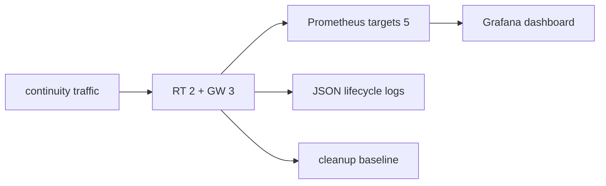

# TEST 006: 관측 검증

Compose observability profile은 `observability-probe`를 완료형 probe로 사용합니다.

| 범주 | 증거 |
| --- | --- |
| RED | DIAL, publish, RT request/actor result와 duration |
| liveness | SDK/peer heartbeat RTT와 timeout |
| admission | non-draining + session capacity readiness |
| USE | session, Binding, OFFER, Pipe, peer stream, RT mapping gauge |
| recovery | reconnect, dependency transition, lease expiry, drain |
| cleanup | topology 종료 뒤 current gauge baseline |
| cardinality | bounded label set |
| redaction | payload와 secret marker 0건 |
| logging | component/event/outcome/code lifecycle event |

## Pipe latency probe

| 조건 | 기록 |
| --- | --- |
| established Pipe | connection setup 제외 |
| fixed payload/concurrency | workload 재현성 |
| warm-up + measurement | allocator·startup 영향 분리 |
| 결과 | p50/p95/p99/max RTT |

Topology/fault acceptance가 correctness를 검증하고 metric·log가 같은 terminal/current state를 보고하는지
관측 probe가 대조합니다.
