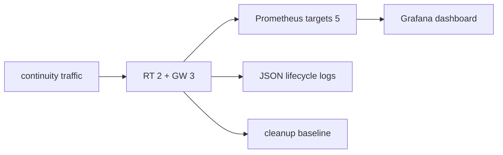

# TEST 006: 관측 검증



Compose observability profile은 `observability-probe`를 완료형 probe로 사용합니다.

## 화면 검증

| 화면 | 기본 표시 | 검증 |
| --- | --- | --- |
| `relaygate-overview` | 숫자 4 + 추이 4, 필터 3개 | 집계값·분류·자원별 최대 점유율 |
| `relaygate-runtime` | 수집 카드 2 + 접힌 영역 3 | 펼친 영역의 중첩 패널까지 PromQL 검사 |
| `relaygate-sdk` | 수집 전제 + 추이 4 | 미수집을 정상 0과 구분 |

CI의 `grafana_ui.cjs`는 실제 Grafana에서 세 화면 provisioning, 시간·필터 유지 링크와 row 펼침을 검증한다.
`relaygate-grafana` artifact는 밝은/어두운 개요, 좁은 화면, 펼치기 전후 진단, SDK 미수집 화면을 보관한다.
스크린샷은 시각 리뷰 증거이며 픽셀 차이 자동 합격 판정은 아니다. 런타임 계측의 동작 계약은 Rust/PromQL 검증이 담당한다.

| 범주 | 증거 |
| --- | --- |
| RED | GW DIAL 결과 class, SDK 접속·dial, publish, RT request/actor result와 duration |
| liveness | SDK/peer heartbeat RTT와 timeout |
| admission | non-draining + session capacity readiness |
| USE | session slot·Binding·pending open·GW Pipe의 used/limit, 고유 Pipe, peer stream, RT mapping gauge |
| recovery | 진행 중 SDK reconnect, recovered/closed/aborted 종료 시간, dependency transition, lease expiry, drain |
| cleanup | topology 종료 뒤 current gauge baseline |
| cardinality | bounded label set |
| redaction | payload와 secret marker 0건 |
| logging | component/event/outcome/code lifecycle event |

SDK reconnect 테스트는 process-global tracing callsite 등록을 공유하므로 같은 helper를 호출하는
두 테스트를 test-only lock으로 격리합니다. CI는 SDK lib 전체를 8개 test thread로 20회 반복하고
각 실행에서 recovered/closed 로그와 중첩 reconnect gauge assertion을 유지합니다.

## Pipe latency probe

| 조건 | 기록 |
| --- | --- |
| established Pipe | connection setup 제외 |
| fixed payload/concurrency | workload 재현성 |
| warm-up + measurement | allocator·startup 영향 분리 |
| 결과 | p50/p95/p99/max DATA RTT, session 준비·dial 시간, 완료·실패 수, 왕복 payload bytes·echo goodput |

```sh
# Compose topology가 실행 중인 상태: 3 local + 6 directed one-hop
docker compose run --rm --no-deps topology-probe relaygate-echo-probe latency

# 특정 주소: 해당 환경의 ClusterToken과 TLS CA/server name을 함께 설정한다.
RELAYGATE_ADDR=relaygate.example:443 \
RELAYGATE_DESTINATION_ID=11111111-1111-4111-8111-111111111111 \
cargo run -p relaygate-echo-probe -- latency
```

| 설정 | 기본값 | 범위 |
| --- | --- | --- |
| `RELAYGATE_LATENCY_WARMUP` | 100 | 0..10000 |
| `RELAYGATE_LATENCY_SAMPLES` | 1000 | 1..100000 |
| `RELAYGATE_LATENCY_PAYLOAD_BYTES` | 64 | 1..65536 bytes |
| concurrency | 1 | 경로별 순차 측정 |

등록 수렴 preflight는 측정에서 분리합니다. warm-up 뒤 같은 Pipe에서 write/read와 payload 일치를 검증합니다.
DATA 실패는 해당 경로 측정을 종료하고 완료 수·오류 수를 남기며 process는 실패로 끝납니다. 초기 접속·warm-up 실패도
process 실패입니다. 한 방향 지연은 RTT/2로 추정하지 않습니다.

echo goodput은 성공한 왕복 payload bytes / 측정 구간이며 streaming 대역폭의 최대치와 다릅니다. CI는
정확성·분포·집계 일치를 검증하고 환경 의존적인 절대 latency SLO는 부여하지 않습니다.

## 실행 증거

| 계약 | 검증 위치 | 기대값 |
| --- | --- | --- |
| `OBS-010`, `OBS-013` | `.github/scripts/test_observability.py` + pinned `promtool` | 다른 cluster·namespace의 sentinel 제외, 세 화면의 중첩 패널 PromQL 파싱, 미수집은 No data |
| `OBS-011` | Gateway local/three-Gateway tests + PromQL fixture | local Pipe 1회, remote Pipe 호출 GW 1회·양단 상태 2개, 종료 후 0, used/limit 비율 |
| `OBS-012` | SDK observability contract tests | 중첩 reconnect 2→1→0, close/drop cleanup, polled dial 취소 1회 기록 |
| `OBS-008` | Compose `latency` + JSON validator | 9개 경로, 요청 sample 전부 완료, byte 수와 RTT 분위수 일치 |
| `OBS-002` | Compose traffic 종료 후 metric 검사 | GW session·binding·pending·Pipe·stream과 RT mapping이 0으로 복귀 |

CI는 `relaygate-data-rtt` artifact에 고정 workload의 측정 결과를 보관합니다. 장기 RSS 누수·heap 소유권·최대 동시
사용자 수는 이 짧은 probe의 합격 범위 밖이며 반복 부하·profile로 검증합니다.

Topology/fault acceptance가 correctness를 검증하고 metric·log가 같은 terminal/current state를 보고하는지
관측 probe가 대조합니다.
